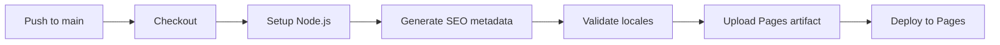

# LetBooks Deployment Guide

## Overview

The LetBooks public site deploys to GitHub Pages at `https://letbooks.org/`.

The deployment consists of three publishing surfaces:

| Surface | URL | Source |
|---|---|---|
| Public landing page | `https://letbooks.org/` | `index.html` |
| Documentation site | `https://letbooks.org/docs/` | `docs/` |
| Static demo | `https://letbooks.org/static-demo/` | `static-demo/` |

All three are served from the same GitHub Pages site.

---

## GitHub Pages Configuration

### Custom domain

`CNAME` at the repository root contains `letbooks.org`. GitHub Pages automatically serves the site at this domain when the CNAME record is configured.

The existing DNS configuration for `letbooks.org` is outside the scope of this document.

### Source setting

The deployment workflow (`docs.yml`) uses the **GitHub Actions** Pages source.

To enable this:
1. Go to repository **Settings → Pages**
2. Under **Source**, select **GitHub Actions**
3. No branch-based deployment is needed

Once configured, every push to `main` triggers `docs.yml` which builds, validates, and deploys the site.

---

## Deployment workflow

File: `.github/workflows/docs.yml`

The workflow:

1. Checks out the repository
2. Sets up Node.js 22
3. Runs `tools/generate-static-seo.mjs` to regenerate `<head>` metadata for every HTML page
4. Runs `tests/static-demo/localization-smoke.js` to validate locale key completeness
5. Uploads the entire repository root as a Pages artifact
6. Deploys to GitHub Pages using the official `actions/deploy-pages` action

---

## CI workflow

File: `.github/workflows/ci.yml`

Triggers on every push and pull request targeting `main`.

Checks performed:

| Check | Required | Description |
|---|---|---|
| Localization smoke test | Yes | Every locale has all required keys matching English |
| JSON syntax | Yes | All locale files parse cleanly |
| SEO metadata | Yes | SEO generator runs without error |
| CNAME file | Yes | Custom domain file exists and is valid |
| Required HTML pages | Yes | Every locale folder has all 4 page files |
| Favicon manifest | Yes | `site.webmanifest` is valid JSON |
| Non-locale JSON files | Yes | `playwright-cli.json`, `manifest.webmanifest` are valid |
| YAML linting | No | `yamllint` runs if available (continue on error) |
| Hunspell | No | Spellcheck runs if `hunspell` is available (continue on error) |
| Link checking | No | Internal link check runs if a checker is available (continue on error) |

Optional checks (continue-on-error) do not block the workflow but report warnings.

---

## GitHub Pages official actions

The deployment workflow uses the official GitHub Pages action set:

- `actions/upload-pages-artifact@v3` — builds and uploads the deployable artifact
- `actions/deploy-pages@v4` — deploys the artifact to Pages

These actions require `pages: write` and `id-token: write` permissions on the workflow.

---

## One-time setup

After this workflow is merged to `main`:

1. Go to **Settings → Pages** in the repository
2. Change **Source** from "Deploy from a branch" to **GitHub Actions**
3. The next push to `main` triggers the deployment workflow

Until the source is changed, pushes to `main` continue using the old branch-based deployment (if configured) or produce no deployment.

---

## What is automated now

- SEO metadata regeneration on every deploy
- Locale key completeness checking
- JSON syntax validation for all structured files
- Required file presence checking
- CNAME and favicon manifest validation
- Deployment to GitHub Pages with zero manual steps

## What remains manual

- Content creation (writing articles, editing docs)
- Translation and localization of new text
- Adding new pages to the documentation site
- Adding new locale support
- Running Playwright screenshot and UI regression tests
- Reviewing generated blog, wiki, and learning HTML output
- Advancing translation maturity from draft to reviewed status

## Future deployment expansion

The deployment workflow is designed to be extended for:

- Expand the current Markdown-to-HTML generation pipeline with stricter maturity and review metadata
- Add locale-aware translation reporting and review dashboards
- Localization QA: add translation coverage reporting
- Screenshot generation: run Playwright to capture screenshots as part of the build
- Automated tutorial generation: render tutorial pages from structured data
- Blazor application CI/CD: add a separate workflow for the future backend

Each addition follows the same pattern: build step produces static output, `upload-pages-artifact` bundles it, `deploy-pages` deploys.
