# AI tehnički dug nije u AI-generiranom kodu

Čest argument o kodu koji generira AI ide otprilike ovako: prava opasnost je to što budući održavaoci nasljeđuju kod koji nisu napisali i ne razumiju. Ta briga je razumna, ali pokazuje na pogrešan objekat. U mnogim sistemima veći problem je stariji i poznatiji. Implementacije ostaju, a razumijevanje nestaje.

Taj način kvara postojao je mnogo prije pomoćnika za kod. Timovi su oduvijek isporučivali sisteme čija je izvorna namjera živjela na sastanku, na tabli, u komentaru na ticketu ili u glavi jednog inženjera. Kod je ostao. Objašnjenje nije. Godinu dana kasnije implementacija možda i dalje radi, testovi možda i dalje prolaze, a ipak najskuplji dio sistema više nije kod. To je izgubljeno razumijevanje oko njega.

Zato se "AI tehnički dug" ne svodi prvenstveno na to da li je model napisao nekoliko linija koda. Radi se o tome da li obrazloženje koje je proizvelo te linije ostaje sačuvano, pregledano i dostupno. Ako to obrazloženje ostane nevidljivo, održavaoci nasljeđuju sintaksu plus arheologiju. Ako postane vidljivo, nasljeđuju nešto nesavršeno, ali pregledljivo.

## Pogrešno poređenje

Mnoge kritike porede AI-generirano obrazloženje s idealnim standardom savršeno napisanog ljudskog obrazloženja: uredni ADR-ovi, pažljivi komentari, ažurna dokumentacija, promišljene bilješke o kompromisima i jasne commit poruke. Tako većina repozitorija stvarno ne izgleda nakon nekoliko godina pritiska isporuke.

Stvarno poređenje je obično s nečim mnogo neurednijim:

- dokumentacija koja nedostaje
- stari ticket sistemi čijoj historiji se više ne može pristupiti
- nejasne commit poruke
- zaposlenici koji su otišli
- plemensko znanje
- nedokumentovane pretpostavke
- reverzno izvođenje ponašanja iz koda

U odnosu na takvu početnu tačku i nesavršeno sačuvano obrazloženje može biti vrijedno. Budući održavaoci možda će radije imati manjkavo objašnjenje koje mogu osporiti nego potpunu tišinu o kojoj mogu samo nagađati.

## Od implementacijskog duga do duga razumijevanja

Tehnički dug se obično predstavlja kao implementacijski dug: ubrzano napisan kod, dupliranje, loše apstrakcije, testovi koji nedostaju, krhke zavisnosti, prečice koje kasnije postanu skupe. Taj okvir je i dalje važan. Loše implementacije i dalje su loše.

Ali mnoge organizacije nailaze na drugačiji centar troška. Skupa stvar nije sintaksa. Skupo je razumijevanje.

Kad sistem postane težak za promjenu, stvarni blokatori su često pitanja poput ovih:

- Zašto je ova odluka donesena?
- Koja su ograničenja bila stvarna, a koja slučajna?
- Koji su rubni slučajevi uzeti u obzir?
- Koji su ignorisani?
- Od kojih vanjskih pretpostavki ova logika zavisi?
- Čega bi budući održavaoci trebali paziti da ne pokvare?

Kompajleri ne odgovaraju na ta pitanja. Testovi odgovaraju samo na neka od njih. Statička analiza na još manje. Zato timovi na njih odgovaraju na skupi način: rekonstruisanjem namjere iz koda, logova, napola zaboravljenih rasprava po starim ticketima i nivoa samopouzdanja osobe koja je tu najduže.

Zato je "dug razumijevanja" koristan izraz. Historijski smo govorili o implementacijskom dugu jer je pokvaren kod bio vidljiv. Sve više timova moglo bi otkriti da je postojaniji trošak sačuvan način rada sistema bez sačuvanog obrazloženja.

## Realističan primjer: suspenzija pristupa nije isto što i potpuna blokada

Razmotrite ticket u SaaS sistemu naplate:

> Suspenduj pristup radnom prostoru kada je račun dospio više od 30 dana. Kontakt osobe za finansije i dalje moraju moći preuzeti račune i ažurirati podatke za plaćanje. Enterprise radni prostori označeni za ručni pregled obnove ne smiju se automatski suspendovati.

To nije neobičan ticket. Sadrži poslovna pravila, izuzetke i riječi koje djeluju očito dok ih neko ne mora prevesti u kod.

Workflow uz pomoć AI-ja mogao bi prije implementacije izvesti sljedeći nacrt namjere:

- cilj: zaustaviti uobičajeni pristup proizvodu za račune s nepodmirenim dugovanjem
- izuzetak: dio pristupa naplati mora ostati dostupan
- okidač: račun je dospio više od 30 dana
- nije cilj: enterprise radni prostori čija je obnova u ručnom pregledu

Mogao bi i eksplicitno navesti svoje implicitne pretpostavke:

- dospijeće se računa od datuma dospijeća računa
- suspenzija se odnosi na sve korisnike osim vlasnika radnog prostora
- pristup proizvodu samo za čitanje nije potreban
- API tokeni trebaju nastaviti raditi jer ticket spominje korisnički pristup, a ne integracije
- ručni enterprise pregled je zastavica na nivou radnog prostora koja se provjerava prije suspenzije

Ta lista nije autoritativna. Korisna je zato što se u pregledu može odmah osporiti.

U stvarnom pregledu staff inženjer ili produkt menadžer mogao bi odgovoriti ovako:

- kontakt za finansije nije nužno samo vlasnik radnog prostora; takvih korisnika može biti više
- API tokeni ne smiju nastaviti raditi jer je izvoz podataka i dalje korištenje proizvoda
- ekrani historije audita moraju ostati vidljivi korisnicima koji rade s finansijama kako bi mogli uskladiti osporene troškove
- rok od 30 dana računa se od posljednjeg neplaćenog računa nakon primjene odobrenja, a ne od izvornog datuma računa
- ručni enterprise pregled nije jednostavan boolean; servis naplate izlaže enum stanja obnove

Sada uporedite dva svijeta.

U prvom svijetu te pretpostavke nikada nisu zapisane. Kod se pregledava direktno, osoba koja pregledava promjenu fokusira se na tok kontrole i testove, a svi se nadaju da je poslovno pravilo ispravno shvaćeno.

U drugom svijetu pretpostavke su postale vidljive prije nego što je kod spojen. Reviewer ne mora nagađati šta je implementator mislio. Nesporazum je već izložen.

To ne garantuje ispravnost. Ali stvara priliku za pregled koju nevidljivo obrazloženje nikada ne stvara.

Rezultirajuće razumijevanje implementacije postaje mnogo preciznije:

- suspenduj uobičajeni pristup proizvodu nakon što je posljednji neplaćeni račun u kašnjenju duže od 30 dana
- zadrži pristup naplati i auditu za korisnike s ulogom administratora za finansije
- blokiraj API tokene tokom suspenzije
- preskoči automatsku suspenziju kada je stanje obnove u servisu naplate `ManualReview`
- dodaj testove za više administratora za finansije, prilagodbe zbog odobrenja i način rada suspendovanih tokena

Primijetite šta se promijenilo. Sama implementacija možda će i dalje završiti kao nekoliko uslova i testova. Veliko poboljšanje nije sintaktičko. Poboljšanje je u tome što je obrazloženje postalo dovoljno vidljivo da se može ispraviti prije produkcije.

## Ekonomija se promijenila

To je dio koji mnoge rasprave o AI-ju propuštaju.

Historijski se implementacija mogla proizvesti dok je očuvanje namjere ostajalo skupo. Inženjeri su mogli napisati kod i testove i nastaviti dalje. Ali pisanje pratećih gradnika često je tražilo još sat ili tri koncentrisanog rada: ažurirati ADR, zabilježiti ograničenja, navesti odbačene alternative, popisati rubne slučajeve, zabilježiti uticaj na dokumentaciju i objasniti šta budući održavaoci ne bi smjeli olahko pojednostaviti.

Timovi su znali da su te stvari korisne. Svejedno su ih preskakali, često racionalno. Kad su rokovi bili stvarni, funkcionalan kod uz minimalne komentare bio je bolji izbor od funkcionalnog koda uz trajno razumijevanje. Taj kompromis je gomilao dug razumijevanja.

AI mijenja ekonomiju jer, kada kontekst implementacije već postoji, generisanje prvog nacrta sačuvanog razumijevanja postaje jeftino. Ako model ima ticket, specifikaciju, izmijenjene datoteke, testove i relevantne arhitekturne bilješke, onda nacrt sljedećeg može tražiti tek skroman dodatni trošak:

- obrazloženje
- pretpostavke
- kompromisi
- rubni slučajevi
- promjene u dokumentaciji
- uticaji na slučajeve upotrebe
- bilješke o nivou sigurnosti
- otvorena pitanja

To ne uklanja ljudski rad. Mijenja mjesto na koje taj rad odlazi. Izazov se pomjera sa pisanja na pregled i validaciju.

Taj pomak je važan jer problem često nije bio filozofski, nego ekonomski. Timovi nisu uvijek gubili namjeru zato što su mrzili dokumentaciju. Gubili su je zato što je njeno očuvanje bilo skupo, prekidalo tok rada i bilo ga je lako odgoditi. Danas je generisanje prvog nacrta tog razumijevanja dovoljno jeftino da stari izgovori zvuče manje uvjerljivo.

## Mnogi produkcijski kvarovi počinju kao nevidljive pretpostavke

Produkcijski se kvarovi često opisuju kao neuspjesi kodiranja, ali mnogi počinju ranije. Počinju kao pretpostavke koje nikada nisu postale dovoljno vidljive da ih se pregleda.

Servis pretpostavlja da vremenske oznake dolaze u UTC-u dok regionalna integracija ne počne slati lokalno vrijeme. Workflow pretpostavlja da korisnik ima jedan aktivan ugovor dok enterprise računi ne uvedu preklapajuće obnove. Job za usklađivanje pretpostavlja da su uzvodni identifikatori jedinstveni dok dva tenanta slučajno ne počnu koristiti isti vanjski ključ.

Kasnije to izgleda kao bug u implementaciji, ali dublji problem je to što pretpostavke nikada nisu bile dovoljno jasno zapisane da ih se ospori.

Isto važi i za rubne slučajeve. Rubni slučajevi koji nisu zabilježeni vjerovatno neće biti ispravno implementirani, jer ih niko nije eksplicitno pregledao. Čak se ni odlični inženjeri ne mogu braniti od scenarija koji se nikada nisu pojavili tokom dizajna ili reviewa koda.

Tu generisana analiza može pomoći na praktičan način. Pretpostavimo da pregled promjene uključuje nacrt liste vjerovatnih pretpostavki, graničnih uslova, scenarija kvara, vanjskih zavisnosti i neobrađenih rubnih slučajeva. Lista će sadržavati greške. Dobro. Greške se mogu pregledati.

Reviewer tada može reći:

- pretpostavka 2 je pogrešna; korisnici mogu imati više aktivnih ugovora
- propustili ste pravilo zakonskog čuvanja podataka
- vanjski API ne garantuje redoslijed
- ova putanja mora raditi tokom djelimičnog ispada
- opasan slučaj nisu `null` ulazi nego zastarjeli replicirani podaci

Implementacija se može, a i ne mora odmah promijeniti. Ali nesporazum postaje vidljiv prije produkcije. Skriven nesporazum je skup. Kad postane vidljiv, može se pregledati.

## Potrebna su dva kruga provjere, a ne jedan

Tradicionalni pregled često skače pravo sa specifikacije na implementaciju. Tada se obično pita radi li kod, jesu li testovi dovoljni i djeluje li promjena sigurnom.

To je i dalje potrebno, ali ostavlja veliku slijepu tačku: često nije vidljivo međuobrazloženje koje je zahtjev pretvorilo u strategiju implementacije.

U jačem modelu pregleda postoje dva kruga.

Prvi je ljudski krug pregleda koji procjenjuje izvedenu namjeru prije nego što se razgovor sruši u kod. Umjesto direktnog skoka sa specifikacije na implementaciju, može se pregledati:

Specifikacija -> izvedena namjera

To mijenja pitanja:

- Jesmo li izveli pravu stvar?
- Je li to ono što je tražilac zapravo htio?
- Jesu li pretpostavke tačne?
- Nedostaju li važni rubni slučajevi?
- Jesmo li pogrešno razumjeli poslovno pravilo?

Drugi je krug poređenja slojeva. Model ovdje može pomoći, ali važna je sama usporedba, a ne alat. Review provjerava dosljednost kroz slojeve do kojih je ljudima već stalo:

- specifikacija -> namjera
- namjera -> implementacija
- specifikacija -> implementacija

Ta usporedba može otkriti nekoliko korisnih klasa defekata:

- zahtjeve koji su propušteni
- izmišljene zahtjeve koji nikada nisu postojali
- oslabljena ograničenja
- pretpostavke o kojima se raspravljalo u tekstu, ali se nisu odrazile u kodu
- rubne slučajeve koji su imenovani, ali nikada implementirani
- testove koji nedostaju za važne pretpostavke

Plavi čvorovi dolje predstavljaju zahtjeve koji služe kao izvor istine, narandžasti sačuvano razumijevanje, zeleni implementacijske gradnike, ljubičasti krugove pregleda, a crveni rizik održavanja.

Vrijednost ovdje nije autoritet alata. Vrijednost je u tome što obrazloženje postaje dovoljno vidljivo da se može pregledati.

## Pull request možda treba dva paketa

To postaje konkretno u pull requestovima.

Danas mnogi PR-ovi u praksi nose jedan paket: implementaciju.

Implementacijski paket

- kod
- testovi

To je izvodivo, ali ne govori dovoljno. Čuva način rada sistema bez nužnog očuvanja razloga zašto je takav.

Jači model PR-a nosio bi drugi paket uz prvi.

Paket razumijevanja

- izvedena namjera
- pretpostavke
- kompromisi
- rubni slučajevi
- uticaj na dokumentaciju
- bilješke o nivou sigurnosti

Neki od tih gradnika mogu biti generisani. Sve ih treba ljudski pregledati kada su važni.

To nije papirologija radi papirologije. To je pokušaj da se repozitoriji ne sruše nazad u kod plus folklor. Ako se kod promijeni, a paket razumijevanja izostane, održavaoci i dalje na kraju pokušavaju rekonstruisati namjeru iz tišine.

Kontrast je jednostavan.

U gornjem dijelu dijagrama repozitorij zadržava kod i testove zajedno s barem nacrtom namjere, pretpostavki i obrazloženja koji se može pregledati. U donjem dijelu kod i testovi ostaju, ali velik dio razumijevanja oko njih ne ostaje.

## Pregled ispravnosti i pregled potpunosti nisu isti posao

To vodi do važne razlike.

Review ispravnosti pita:

- Kompajlira li se?
- Prolaze li testovi?
- Je li sigurno?
- Prati li standarde?
- Je li opaženi način rada ispravan?

Review potpunosti pita:

- Je li namjera sačuvana?
- Jesu li pretpostavke zabilježene?
- Jesu li ograničenja zabilježena?
- Jesu li važni rubni slučajevi obuhvaćeni?
- Jesu li pregledani pogođeni dokumenti?
- Jesu li pregledani pogođeni slučajevi upotrebe?
- Jesu li kompromisi zabilježeni?

Historijski je review potpunosti bilo skupo provoditi dosljedno jer je proizvodnja temeljnih gradnika bila skupa. Generisani prvi nacrti mogli bi ga učiniti praktičnim u obimu koji je ranije bilo teško opravdati.

## Ovo je bliže postojećoj inženjerskoj praksi nego što zvuči

Ništa od ovoga ne traži novi sistem vjerovanja. Većina relevantnih gradnika već je poznata:

- slučajevi upotrebe
- ADR-ovi
- arhitekturne bilješke
- komentari koji objašnjavaju zašto
- operativni priručnici
- pravila validacije
- ugovori automatizacije
- projektno obrazloženje
- ažuriranja dokumentacije

Pomak nije konceptualan. On je ekonomski. Timovi su oduvijek znali da su ti gradnici važni. Često ih nisu održavali jer je trud bio velik, a neposredna vrijednost za isporuku mala.

Zato ovaj argument treba ostati skroman. AI-generirano obrazloženje nije automatski tačno. AI-generirana dokumentacija nije autoritativna. Dokumentacija ne zamjenjuje inženjersku prosudbu. AI ne uklanja tehnički dug.

Ono što bi ti radni tokovi mogli uraditi jeste da očuvanje nacrta razumijevanja koje su timovi nekad ostavljali iza sebe postane dovoljno jeftino.

## Praktičan zaključak za repozitorije

Najpraktičniji sljedeći korak nije tražiti savršen dizajnerski tekst za svaku promjenu. To je dodati mali kontrolni spisak razumijevanja na mjesta na kojima timovi već pregledaju rad.

Naprimjer, PR predložak mogao bi zahtijevati kratak pregledani odjeljak koji pokriva:

- izvedenu namjeru
- ključne pretpostavke
- važne rubne slučajeve
- kompromise ili odbačene alternative
- uticaj na dokumentaciju ili slučajeve upotrebe
- nivo sigurnosti i otvorena pitanja

Ti odjeljci ne moraju biti dugi. Moraju biti dovoljno prisutni da ih drugi inženjer može osporiti. Mogu biti generisani prvi nacrti, ali ih treba pregledati s istom ozbiljnošću kao i kod.

Malen primjer iz same pripreme ovog članka to pokazuje vrlo konkretno. Tokom pregleda lokalizacije jedna prevedena Markdown datoteka zadržala je ispravno značenje, ali je slučajno uvukla jednu stavku liste pod drugu. Neposredni popravak bio je jednostavan: listu je trebalo poravnati. Mnogo važnije bilo je sačuvati objašnjenje zašto je to uopće važno. U validatoru je, naprimjer, ostalo zapisano sljedeće:

> Struktura liste dio je sadržajne ispravnosti, a ne samo oblikovanja.
>
> Ako izvorni članak koristi ravnu listu, a lokalizirana verzija slučajno ugnijezdi jednu stavku, čitaoci više ne vide istu strukturu.
>
> Ova lagana provjera štiti od čestih grešaka u uvlačenju koje smo već vidjeli u lokaliziranim člancima.

To objašnjenje nije ostalo zarobljeno u komentaru pri pregledu. Postalo je dio dokumentacije, dio validatora i dio budućih pregleda.

Greška je bila jednokratna. Razumijevanje zašto je bila važna postalo je trajnije.

## Zaključak

Naslov ovog članka namjerno je uži od njegovog zaključka. Stvarni rizik nije AI-generirana sintaksa. Stvarni rizik je dug razumijevanja: implementacije koje ostaju nakon što obrazloženje iza njih nestane.

Zanimljivije je pitanje hoće li repozitoriji početi tretirati obrazloženje, pretpostavke, rubne slučajeve i namjeru kao prvoklasne gradnike uz implementaciju.

Historijski su mnogi timovi gubili namjeru zato što je njeno očuvanje bilo skupo. Danas je generisanje prvog nacrta jeftino. To ne rješava problem. Mijenja ono što je ekonomski praktično.

Budući održavaoci možda će se i dalje žaliti na generisano obrazloženje. Možda će u njemu naći greške. Možda se neće složiti s pretpostavkama koje navodi. Možda će pola toga izbrisati tokom pregleda.

I možda će im i dalje biti draže pregledati nesavršeno obrazloženje nego reverzno izvoditi tišinu.

## Povezano štivo

- `../../wiki/ai-assisted-knowledge-work.md`
- `../../wiki/spec-driven-development.md`
- `../../wiki/documentation-traceability.md`
- `../../wiki/validation-layers.md`
- `documentation-is-part-of-the-product.md`
- `ai-as-an-oracle.md`
