# KI-technische Schulden haben nichts mit KI-generiertem Code zu tun

Ein häufiges Argument gegen KI-generierten Code lautet so: Die eigentliche Gefahr ist, dass künftige Maintainer Code übernehmen, den sie weder geschrieben haben noch verstehen. Diese Sorge ist vernünftig, zielt aber auf das falsche Objekt. In vielen Systemen ist das größere Problem älter und vertrauter. Implementierungen bleiben bestehen, während das Verständnis verschwindet.

Dieser Fehlermodus existierte lange vor Code-Assistenten. Teams haben schon immer Systeme ausgeliefert, deren ursprüngliche Absicht in einem Meeting, auf einem Whiteboard, in einem Ticket-Kommentar oder im Kopf einer einzelnen Ingenieurin lebte. Der Code blieb. Die Erklärung nicht. Ein Jahr später funktioniert die Implementierung vielleicht noch, die Tests laufen vielleicht noch grün, und trotzdem ist der teuerste Teil des Systems nicht mehr der Code. Es ist das fehlende Verständnis darum herum.

Darum geht es bei "KI-technischen Schulden" nicht in erster Linie darum, ob ein Modell ein paar Codezeilen geschrieben hat. Es geht darum, ob die Begründung, die zu diesen Zeilen geführt hat, erhalten, geprüft und zugänglich gemacht wird. Bleibt diese Begründung unsichtbar, erben Maintainer Syntax plus Archäologie. Wird sie sichtbar, erben sie etwas Unvollkommenes, aber Prüfbarkeit.

## Der falsche Vergleich

Viele Kritiken vergleichen KI-generierte Begründungen mit einem Idealbild perfekt geschriebener menschlicher Begründungen: saubere ADRs, sorgfältige Kommentare, aktuelle Dokumentation, durchdachte Trade-off-Notizen und präzise Commit-Messages. So sehen die meisten Repositories nach einigen Jahren unter Lieferdruck aber nicht aus.

Der reale Vergleich ist meist mit etwas deutlich Unordentlicherem:

- fehlende Dokumentation
- unzugängliche Ticketsysteme
- vage Commit-Messages
- ausgeschiedene Mitarbeitende
- implizites Teamwissen
- undokumentierte Annahmen
- Reverse Engineering des Verhaltens aus dem Code

Vor diesem Hintergrund kann unvollkommen erhaltene Begründung wertvoll sein. Künftige Maintainer bevorzugen möglicherweise eine fehlerhafte Erklärung, die sie hinterfragen können, gegenüber völliger Stille, bei der nur Raten bleibt.

## Von Implementierungsschulden zu Verständnisschulden

Technische Schulden wurden meist als Implementierungsschulden beschrieben: hastig geschriebener Code, Duplikation, schlechte Abstraktionen, fehlende Tests, fragile Abhängigkeiten, Abkürzungen, die später teuer werden. Diese Sicht bleibt wichtig. Schlechte Implementierungen bleiben schlecht.

Aber viele Organisationen stoßen auf einen anderen Kostentreiber. Das Teure ist nicht Syntax. Es ist Verständnis.

Wenn ein System schwer zu ändern wird, sind die eigentlichen Blocker oft Fragen wie diese:

- Warum wurde diese Entscheidung getroffen?
- Welche Randbedingungen waren real und welche zufällig?
- Welche Edge Cases wurden berücksichtigt?
- Welche wurden ignoriert?
- Von welchen externen Annahmen hängt diese Logik ab?
- Wovor sollten zukünftige Maintainer Angst haben, es kaputtzumachen?

Compiler beantworten diese Fragen nicht. Tests beantworten nur einen Teil davon. Statische Analyse noch weniger. Also beantworten Teams sie auf die teure Weise: indem sie Absicht aus Code, Logs, halb erinnerten Ticket-Verläufen und dem Sicherheitsgefühl der Person rekonstruieren, die am längsten dabei ist.

Deshalb ist der Begriff Verständnisschulden nützlich. Historisch sprachen wir über Implementierungsschulden, weil kaputter Code sichtbar war. Zunehmend dürften viele Teams feststellen, dass die beständigeren Kosten aus erhaltenem Verhalten ohne erhaltene Begründung entstehen.

## Ein realistisches Beispiel: Zugangssperre ist nicht dasselbe wie vollständige Aussperrung

Betrachten wir ein Ticket in einem SaaS-Abrechnungssystem:

> Suspend workspace access when an invoice is more than 30 days overdue. Finance contacts must still be able to download invoices and update payment details. Enterprise workspaces marked for manual renewal review must not be auto-suspended.

Dieses Ticket ist nicht ungewöhnlich. Es enthält Geschäftsregeln, Ausnahmen und Wörter, die offensichtlich wirken, bis jemand sie in Code übersetzen muss.

Ein KI-gestützter Workflow könnte vor der Implementierung etwa folgende Absichtsskizze ableiten:

- Ziel: normale Produktnutzung für säumige Konten stoppen
- Ausnahme: bestimmter Zugriff auf Abrechnung bleibt verfügbar
- Auslöser: Rechnung ist mehr als 30 Tage überfällig
- Nicht-Ziel: Enterprise-Verlängerungen mit manueller Prüfung

Er könnte auch implizite Annahmen explizit machen:

- "überfällig" wird ab dem Fälligkeitsdatum der Rechnung berechnet
- die Sperre gilt für alle Nutzer außer dem Workspace-Owner
- read-only-Zugriff auf das Produkt ist nicht erforderlich
- API-Tokens sollen weiter funktionieren, weil das Ticket von Benutzerzugriff spricht, nicht von Integrationen
- Enterprise-Manual-Review ist ein Workspace-Flag, das vor der Sperre geprüft wird

Diese Liste ist nicht autoritativ. Sie ist nützlich, weil ein Reviewer sie angreifen kann.

In einem echten Review könnte eine Staff Engineer oder ein Product Manager zum Beispiel so reagieren:

- Finance Contacts sind nicht nur der Workspace-Owner; es kann mehrere Finance-Admins geben
- API-Tokens dürfen nicht weiter funktionieren, weil Datenexport weiterhin Produktnutzung ist
- Audit-History-Screens müssen für Finance-Admins sichtbar bleiben, damit sie strittige Gebühren abgleichen können
- die 30-Tage-Frist beginnt bei der neuesten unbezahlten Rechnung, nachdem Gutschriften berücksichtigt wurden, nicht beim ursprünglichen Rechnungsdatum
- Enterprise Manual Review ist kein einfaches Boolean; der Billing-Service liefert ein Renewal-State-Enum

Vergleichen wir jetzt zwei Welten.

In der ersten Welt wurden diese Annahmen nie aufgeschrieben. Der Code wird direkt geprüft, der Reviewer konzentriert sich auf Kontrollfluss und Tests, und alle hoffen, dass die Geschäftsregel richtig verstanden wurde.

In der zweiten Welt wurden die Annahmen sichtbar, bevor der Code gemergt wurde. Der Reviewer muss nicht raten, was die implementierende Person gedacht hat. Das Missverständnis liegt bereits offen.

Das garantiert keine Korrektheit. Aber es schafft eine Review-Gelegenheit, die unsichtbare Begründung nie schafft.

Das resultierende Implementierungsverständnis wird deutlich präziser:

- normalen Produktzugriff sperren, sobald die neueste unbezahlte Rechnung länger als 30 Tage überfällig ist
- Billing- und Audit-Zugriff für Nutzer mit Finance-Admin-Rechten erhalten
- API-Tokens während der Sperre blockieren
- automatische Sperre überspringen, wenn der Billing-Renewal-State `ManualReview` ist
- Tests für mehrere Finance-Admins, Gutschrift-Anpassungen und gesperrte Tokens hinzufügen

Auffällig ist, was sich geändert hat. Die Implementierung kann am Ende immer noch nur aus wenigen Bedingungen und Tests bestehen. Die große Verbesserung ist nicht syntaktisch. Sie besteht darin, dass die Begründung früh genug sichtbar wurde, um vor Produktion korrigiert zu werden.

## Die Ökonomie hat sich verändert

Das ist der Teil, den viele KI-Debatten übersehen.

Historisch konnte Implementierung produziert werden, während das Bewahren von Absicht teuer blieb. Ingenieurinnen konnten Code und Tests schreiben und weitermachen. Aber die umgebenden Gradniker zu erstellen kostete oft noch eine oder mehrere Stunden konzentrierter Arbeit: ein ADR aktualisieren, Randbedingungen festhalten, verworfene Alternativen notieren, Edge Cases auflisten, Dokumentationsfolgen erfassen und erklären, was spätere Maintainer nicht leichtfertig vereinfachen sollten.

Teams wussten, dass diese Dinge nützlich sind. Sie ließen sie trotzdem weg, oft rational. Wenn Deadlines real waren, gewann funktionierender Code plus minimale Kommentare gegen funktionierenden Code plus belastbares Verständnis. Dieser Trade-off häufte Verständnisschulden an.

KI verändert die Ökonomie, weil ein erster Entwurf für erhaltenes Verständnis billig wird, sobald der Implementierungskontext bereits vorhanden ist. Wenn ein Modell das Ticket, die Spezifikation, die geänderten Dateien, die Tests und relevante Architekturnotizen hat, dann kostet ein Entwurf für Folgendes oft nur wenig zusätzlich:

- Begründung
- Annahmen
- Trade-offs
- Edge Cases
- Dokumentationsänderungen
- Auswirkungen auf Use Cases
- Confidence-Hinweise
- offene Fragen

Das beseitigt menschlichen Aufwand nicht. Es verändert, wohin der Aufwand geht. Die Herausforderung verschiebt sich vom Schreiben hin zu Review und Validierung.

Diese Verschiebung ist wichtig, weil der alte Fehlermodus oft ökonomisch und nicht philosophisch war. Teams verloren Absicht nicht immer, weil sie Dokumentation hassten. Sie verloren Absicht, weil ihre Bewahrung teuer war, den Fluss unterbrach und sich leicht verschieben ließ. Heute ist ein erster Entwurf dieses Verständnisses billig genug, dass die alte Ausrede schwächer wird.

## Viele Produktionsfehler beginnen als fehlende Annahmen

Produktionsfehler werden oft als Programmierfehler beschrieben, beginnen aber häufig früher. Sie beginnen als Annahmen, die nie sichtbar genug wurden, um sie zu prüfen.

Ein Service nimmt an, dass Zeitstempel in UTC ankommen, bis eine regionale Integration lokale Zeit sendet. Ein Workflow nimmt an, dass ein Nutzer genau einen aktiven Vertrag hat, bis Enterprise-Konten überlappende Verlängerungen einführen. Ein Reconciliation-Job nimmt an, dass Upstream-IDs eindeutig sind, bis zwei Tenants zufällig denselben externen Schlüssel wiederverwenden.

Später sehen diese Dinge wie Implementierungsbugs aus, aber das tiefere Problem ist, dass die Annahmen nie klar genug aufgezeichnet wurden, um hinterfragt zu werden.

Dasselbe gilt für Edge Cases. Edge Cases, die nicht festgehalten werden, werden mit geringer Wahrscheinlichkeit korrekt implementiert, weil sie niemand ausdrücklich geprüft hat. Selbst exzellente Ingenieurinnen können sich nicht gegen Szenarien absichern, die in Design oder Code Review nie aufgetaucht sind.

Genau hier kann generierte Analyse praktisch helfen. Angenommen, ein Change Review enthält einen Entwurf einer Liste wahrscheinlicher Annahmen, Randbedingungen, Fehlerszenarien, externer Abhängigkeiten und unbehandelter Edge Cases. Diese Liste wird Fehler enthalten. Gut. Fehler kann man prüfen.

Ein Reviewer kann dann sagen:

- Annahme 2 ist falsch; Nutzer können mehrere aktive Verträge haben
- die gesetzliche Aufbewahrungsregel fehlt
- die externe API garantiert keine Reihenfolge
- dieser Pfad muss auch bei Teilausfall funktionieren
- der gefährliche Fall ist veraltete replizierte Daten, nicht `null`-Input

Die Implementierung ändert sich vielleicht sofort, vielleicht auch nicht. Aber das Missverständnis wird vor Produktion sichtbar. Ein stilles Missverständnis ist teuer. Ein sichtbares Missverständnis ist reviewbar.

## Reviews brauchen zwei Schleifen, nicht eine

Traditionelles Review springt oft direkt von der Spezifikation zur Implementierung. Der Reviewer fragt, ob der Code funktioniert, ob die Tests ausreichen und ob die Änderung sicher wirkt.

Das bleibt notwendig, lässt aber einen großen blinden Fleck: Der Reviewer sieht oft nicht die Zwischenschritte, mit denen aus einer Anforderung eine Implementierungsstrategie wurde.

In einem stärkeren Review-Modell gibt es zwei Schleifen.

Die erste ist eine menschliche Review-Schleife, die die abgeleitete Absicht bewertet, bevor die Diskussion in Code kollabiert. Statt direkt von Spezifikation zu Implementierung zu springen, kann der Reviewer Folgendes prüfen:

Spezifikation -> Abgeleitete Absicht

Das verändert die Fragen:

- Haben wir das Richtige abgeleitet?
- Ist das tatsächlich das, was der Anfordernde wollte?
- Sind die Annahmen korrekt?
- Fehlen wichtige Edge Cases?
- Haben wir die Geschäftsregel missverstanden?

Die zweite ist eine Schichtvergleichs-Schleife. Ein Modell kann hier unterstützen, aber die zentrale Idee ist der Vergleich selbst, nicht das Werkzeug. Das Review prüft Konsistenz über Schichten hinweg, um die sich Menschen ohnehin kümmern:

- Spezifikation -> Absicht
- Absicht -> Implementierung
- Spezifikation -> Implementierung

Dieser Vergleich kann mehrere nützliche Fehlerklassen sichtbar machen:

- übersehene Anforderungen
- erfundene Anforderungen, die nie existierten
- abgeschwächte Randbedingungen
- in Prosa diskutierte Annahmen, die sich im Code nicht wiederfinden
- benannte Edge Cases, die nie implementiert wurden
- fehlende Tests für wichtige Annahmen

Die blauen Knoten unten stehen für Source-of-Truth-Anforderungen, die orangefarbenen für erhaltenes Verständnis, die grünen für Implementierungsgradnike, die violetten für Review-Schleifen und die roten für Wartbarkeitsrisiko.

Der Wert liegt hier nicht in Werkzeugautorität. Der Wert besteht darin, dass die Begründung sichtbar genug wird, um sie zu prüfen.

## Ein Pull Request braucht möglicherweise zwei Nutzlasten

Das wird in Pull Requests konkret.

Heute tragen viele PRs faktisch nur eine Nutzlast: Implementierung.

Implementierungsnutzlast

- Code
- Tests

Das ist brauchbar, aber dünn. Es bewahrt Verhalten, ohne notwendigerweise zu bewahren, warum dieses Verhalten existiert.

Ein stärkeres PR-Modell würde neben der ersten eine zweite Nutzlast tragen.

Verständnisnutzlast

- abgeleitete Absicht
- Annahmen
- Trade-offs
- Edge Cases
- Auswirkungen auf die Dokumentation
- Confidence-Hinweise

Einige dieser Gradnike können generiert sein. Alle sollten, wenn sie relevant sind, menschlich geprüft werden.

Das ist keine Bürokratie um ihrer selbst willen. Es ist der Versuch zu verhindern, dass Repositories wieder auf Code plus Folklore zurückfallen. Wenn sich der Code ändert, die Verständnisnutzlast aber fehlt, landen Maintainer weiterhin beim Reverse Engineering von Stille.

Der Kontrast ist einfach.

Im linken Pfad sammelt das Repository Verhalten an und verliert Kontext. Im rechten Pfad sammelt das Repository Verhalten plus zumindest einen prüfbaren Entwurf von Absicht, Annahmen und Begründung an.

## Korrektheitsreview und Vollständigkeitsreview sind unterschiedliche Aufgaben

Daraus ergibt sich eine wichtige Unterscheidung.

Korrektheitsreview fragt:

- Kompiliert es?
- Laufen die Tests?
- Ist es sicher?
- Folgt es den Standards?
- Ist das beobachtete Verhalten korrekt?

Vollständigkeitsreview fragt:

- Ist die Absicht erhalten?
- Sind Annahmen festgehalten?
- Sind Randbedingungen festgehalten?
- Wurden wichtige Edge Cases erfasst?
- Wurden betroffene Dokumente überprüft?
- Wurden betroffene Use Cases überprüft?
- Wurden Trade-offs festgehalten?

Historisch waren Vollständigkeitsreviews schwer konsistent durchzuführen, weil die zugrunde liegenden Gradnike teuer zu erzeugen waren. Generierte Erstentwürfe könnten sie in einem Umfang praktikabel machen, der früher schwer zu rechtfertigen war.

## Das ist näher an bestehender Engineering-Praxis, als es klingt

Nichts davon erfordert ein neues Glaubenssystem. Die meisten relevanten Gradnike sind bereits vertraut:

- Use Cases
- ADRs
- Architekturnotizen
- Kommentare, die das Warum erklären
- operative Runbooks
- Validierungsregeln
- Automatisierungsverträge
- Designbegründung
- Dokumentationsaktualisierungen

Die Veränderung ist nicht konzeptionell. Sie ist ökonomisch. Teams wussten schon immer, dass diese Gradnike wichtig sind. Sie haben sie oft nicht gepflegt, weil der Aufwand hoch und der unmittelbare Lieferwert gering war.

Darum sollte dieses Argument bescheiden bleiben. KI-generierte Begründung ist nicht automatisch korrekt. KI-generierte Dokumentation ist nicht autoritativ. Dokumentation ersetzt kein Engineering-Urteil. KI beseitigt keine technischen Schulden.

Was diese Workflows tun können: Es billig genug machen, einen Entwurf des Verständnisses zu bewahren, den Teams früher zurückgelassen haben.

## Eine praktische Konsequenz für Repositories

Der praktischste nächste Schritt ist nicht, für jede Änderung perfekte Designprosa zu verlangen. Er besteht darin, eine kleine Verständnis-Checkliste an den Stellen einzuführen, an denen Teams Arbeit ohnehin reviewen.

Ein PR-Template könnte zum Beispiel einen kurzen geprüften Abschnitt zu Folgendem verlangen:

- abgeleitete Absicht
- zentrale Annahmen
- wichtige Edge Cases
- Trade-offs oder verworfene Alternativen
- Dokumentations- oder Use-Case-Auswirkungen
- Confidence-Level und offene Fragen

Diese Abschnitte müssen nicht lang sein. Sie müssen präsent genug sein, dass eine andere Ingenieurin sie angreifen kann. Es können generierte Erstentwürfe sein, aber sie sollten mit derselben Ernsthaftigkeit geprüft werden wie Code.

## Fazit

Der Titel dieses Artikels ist bewusst enger gefasst als sein Fazit. Das eigentliche Risiko ist nicht KI-generierte Syntax. Das eigentliche Risiko sind Verständnisschulden: Implementierungen, die weiterbestehen, nachdem die Begründung dahinter verschwunden ist.

Die interessantere Frage ist, ob Repositories beginnen werden, Begründung, Annahmen, Edge Cases und Absicht als Gradnike erster Klasse neben der Implementierung zu behandeln.

Historisch verloren viele Teams Absicht, weil ihre Bewahrung teuer war. Heute ist ein erster Entwurf davon billig. Das löst das Problem nicht. Es verändert, was ökonomisch praktikabel ist.

Zukünftige Maintainer werden sich vielleicht trotzdem über generierte Begründungen beklagen. Sie werden Fehler darin finden. Sie werden mit den aufgeführten Annahmen nicht einverstanden sein. Sie werden in der Review vielleicht die Hälfte davon löschen.

Und sie werden möglicherweise trotzdem lieber unvollkommene Begründung prüfen, als Stille rückzuentwickeln.

## Weiterführende Texte

- `../../wiki/ai-assisted-knowledge-work.md`
- `../../wiki/spec-driven-development.md`
- `../../wiki/documentation-traceability.md`
- `../../wiki/validation-layers.md`
- `documentation-is-part-of-the-product.md`
- `ai-as-an-oracle.md`
