# Use Cases aus einem funktionierenden Demo ableiten

Es gibt ein vertrautes Argument in der Softwarearbeit: Erst sollten die Use Cases kommen, danach die Prototypen. In der Theorie klingt das ordentlich. In der Praxis beginnen Teams haeufig mit roherem Material. Sie haben vielleicht eine allgemeine Spezifikation, eine Produktidee, einige Randbedingungen und einen Prototyp, der bereits reales Verhalten sichtbar macht, bevor die letzte Use-Case-Schicht sauber formuliert ist.

Das bedeutet nicht automatisch, dass der Prozess falsch ist. Manchmal ist gerade der Prototyp das, was die echten Use Cases erst freilegt.

Der wichtige Schritt ist, was danach geschieht.

Wenn nuetzliches Produktwissen in Bildschirmen, Routen und temporaeren Flows eingeschlossen bleibt, bleibt es fragil. Wenn das Team aus dem Prototyp und der allgemeinen Spezifikation dauerhafte Use Cases ableitet, laesst sich dieses Wissen deutlich leichter bewahren, reviewen, automatisieren und spaeter neu implementieren.

## Der Prozess wurde entdeckt, nicht entworfen

Dieser Artikel beschreibt keine Methodik, die von Anfang an in vollstaendiger Form vorlag.

Die Reihenfolge entstand schrittweise, waehrend praktische Probleme rund um ein statisches Demo und eine breitere Produktspezifikation geloest wurden.

Das Demo enthielt bereits nuetzliches Produktwissen. Es zeigte Flows, auf die Menschen reagieren konnten. Es machte sichtbar, welche Aktionen zentral wirkten, welche eher nachrangig waren und an welchen Stellen es dem Produkt eigentlich um Lagerlogistik, Katalogisierung oder Review ging und nicht um einen bestimmten Bildschirm.

Dieses Verstaendnis begann sich jedoch gleichzeitig ueber zu viele Orte zu verteilen:

- Bildschirme im Demo
- Routennamen und lokale Flows
- Produktnotizen und Spezifikationstext
- Review-Diskussionen
- fruehe Tests und Validierungsideen

Diese Verteilung war das eigentliche Problem.

Das Ziel wurde deshalb, Verstaendnis zu bewahren, ohne so zu tun, als waere die aktuelle UI bereits final.

## Das Problem: Demos zeigen Verhalten, aber sie bewahren keine Absicht

Ein funktionierendes Demo ist ueberzeugend, weil es eine Idee in etwas Sichtbares verwandelt. Menschen koennen darauf zeigen, es ausprobieren, kritisieren und auf seine Abfolge von Schritten reagieren.

Das ist wertvoll. Es ist auch unvollstaendig.

Das Demo zeigt eine aktuelle Auspraegung von Verhalten. Es sagt kuenftigen Maintainerinnen und Maintainern aber nicht automatisch, welcher Teil dieses Verhaltens wesentlich war, welcher Teil nur eine Einstiegssurface war, welcher Teil eine temporaere Bequemlichkeit und welcher Teil lediglich eine lokale Implementierungsabkuerzung.

Diese Unterscheidung ist in KI-gestuetzter Arbeit noch wichtiger, weil sichtbarer Code und sichtbare UI schneller anwachsen koennen als dauerhaftes Produktgedaechtnis.

## Die Fragen, die den Prozess vorangetrieben haben

Die Artefaktkette ist nicht auf einmal entstanden. Jede Schicht beantwortete eine praktische Frage und legte dann die naechste fehlende Schicht frei.

Eine nuetzliche Beschreibung der Sequenz ist:

Problem -> Artefakt -> Neues Problem -> Neues Artefakt

Der grobe Ablauf sah so aus:

1. Bildschirme veraenderten sich schnell.
   Dadurch war Bildschirm-fuer-Bildschirm-Dokumentation eine schlechte Bewahrungsschicht.
   Das erste dauerhafte Artefakt wurden daher Use Cases.

2. Die Use Cases waren fuer Menschen nuetzlich, aber noch nicht konkret genug fuer leichte Browser-Automatisierung.
   Das naechste Artefakt wurden daher Automatisierungsvertraege.

3. Die Automatisierungsvertraege waren klarer als rohe Use Cases, brauchten aber immer noch ausfuehrbare Beispiele.
   Das naechste Artefakt wurden daher Entwurfs-Szenariotests.

4. Sobald mehrere zusammenhaengende Artefakte existierten, wurden ihre Beziehungen in Prosa allein schwerer zu erklaeren.
   Das naechste Artefakt wurden daher Diagramme.

5. Als die Idee einer spaeteren Blazor-Implementierung hinzukam, tauchte eine weitere Frage auf:
   Wie koennte die kuenftige Implementierung mit dem Demo verglichen werden, ohne DOM-Baeume oder visuelles Layout zu vergleichen?
   Diese Frage fuehrte zum Paritaetsdenken.

Nichts davon verlangte ein grosses Framework. Es war eine Reaktion auf konkrete Engineering-Fragen:

- Wie bewahren wir Verstaendnis, waehrend sich ein Demo noch weiterentwickelt?
- Wie beschreiben wir Workflows, ohne jeden Bildschirm zu dokumentieren?
- Wie koennten diese Workflows spaeter zu ausfuehrbaren Tutorials werden?
- Wie vermeiden wir, Tests an die heutige UI zu koppeln?
- Wie koennte eine kuenftige Implementierung mit dem Demo verglichen werden, ohne DOM-Strukturen zu vergleichen?

## Die Falle: Bildschirmdokumentation verrottet schnell

Eine naheliegende Reaktion ist, die Bildschirme detailliert zu dokumentieren. Das wirkt oft verantwortungsvoll, weil es praezise aussieht.

Meist ist es die falsche Schicht.

Wenn die Dokumentation sagt, dass das Dashboard bestimmte Karten enthaelt, oder dass sich die Scanner-Route ueber genau einen Button oeffnet, oder dass ein bestimmter Bildschirm eine konkrete Anordnung von Steuerelementen hat, kann die Dokumentation in dem Moment veralten, in dem die UI verbessert wird.

Das Ergebnis ist eine falsche Art von Praezision: sehr spezifisch, aber nicht sehr dauerhaft.

Die hilfreiche Unterscheidung war einfach: Ein Bildschirm ist kein Use Case. Eine Route ist kein Use Case. Ein Scanner ist kein Use Case. Ein Excel-Export ist kein Use Case.

Das sind Implementierungsoberflaechen.

Die Use Cases sind die Dinge, die auch nach einem Redesign noch existieren sollten.

## Der Schritt: Faehigkeiten aus Demo und Spezifikation herausloesen

Der praktische Schritt in Let Books bestand nicht darin, so zu tun, als enthalte das Demo kein Produktwissen. Das tat es offensichtlich. Der Schritt bestand darin, eine schwierigere Frage zu stellen:

Wenn die UI naechstes Jahr neu gestaltet wuerde, welche Nutzerziele und Business-Faehigkeiten muessten dann immer noch existieren?

Diese Frage veraenderte die Form des Modells.

Das Dashboard wurde nicht mehr als Use Case behandelt, sondern als das, was es wirklich war: eine Einstiegssurface in breitere Workflows.

ISBN-Scanning wurde nicht mehr als Top-Level-Use-Case behandelt, sondern als Teilfaehigkeit der Katalogisierung.

Excel-Export und -Import wurden nicht mehr als Dateibuttons behandelt, sondern als Teil einer groesseren Faehigkeit: eine Sammlung fuer externes Review freigeben und Entscheidungen wieder ins System zurueckfuehren.

Die dauerhaften Use Cases wurden:

- Buecher in die Sammlung aufnehmen
- Physische Buecher katalogisieren
- Physische Lagerung organisieren und pruefen
- Sammlungszustand ueberpruefen
- Eine Sammlung fuer externes Review teilen und Entscheidungen erfassen

Diese Liste ist viel weniger an einen einzelnen Prototypen gebunden. Sie ist auch deutlich hilfreicher fuer kuenftige Maintainerinnen, Maintainer und Reviewer.

## Beispiel: Einen Use Case aus dem Demo ableiten

Eines der klarsten Beispiele in diesem Projekt war `UC-003 Physische Lagerung organisieren und pruefen`.

Wenn jemand nur auf das aktuelle Demo geschaut haette, waeren die offensichtlichsten sichtbaren Elemente Dinge gewesen wie:

- eine Boxen-Ansicht
- Detailansichten fuer Boxen
- Filter fuer verschiedene Zustaende
- QR-bezogene Aktionen
- Links aus dem Box-Kontext in Erfassung und Bearbeitung

Ein sehr natuerliches erstes Fazit waere gewesen:

`Wir brauchen einen Boxen-Bildschirm.`

Das war nachvollziehbar, aber zu nah an der aktuellen UI.

Use-Case-Denken rahmte die Frage anders.

Die eigentliche Anforderung war nicht, dass ein bestimmter Bildschirm existieren musste. Die eigentliche Anforderung war, dass Nutzerinnen und Nutzer aus dem physischen Lagerkontext heraus arbeiten koennen mussten.

Anders gesagt: Das Produkt musste die Beziehung zwischen der digitalen Sammlung und den realen Boxen, Regalen und Behaeltern erhalten, in denen die Buecher tatsaechlich lagen.

Dadurch entstand ein deutlich robusterer Use Case.

Hier ist ein verkuerzter Auszug aus dem echten Use-Case-Dokument:

> **Zweck**
>
> Eine nuetzliche Beziehung zwischen der digitalen Sammlung und den realen physischen Behaeltern, Regalen und Boxen erhalten, in denen Buecher gelagert werden.
>
> **Nutzerziel**
>
> Buecher finden, verstehen, was sich in einem Behaelter befindet, und aus dem realen Lagerkontext heraus arbeiten statt nur mit abstrakten Datensaetzen.
>
> **Hauptszenario fuer Erfolg**
>
> Die Nutzerin oder der Nutzer arbeitet aus einem physischen Lagerkontext wie etwa einer Box.
>
> Sie oder er prueft den Inhalt dieses Behaelters und versteht, welche Buecher vorhanden sind, in welchem Zustand sie sich befinden und welche naechsten Schritte noetig sein koennten.
>
> Aus diesem Lagerkontext heraus geht die Arbeit in Erfassung, Bearbeitung oder spaetere Entnahme ueber, ohne dass die Beziehung zwischen digitalem Datensatz und physischem Ort verloren geht.

Bemerkenswert ist auch, was fehlt.

Der Use Case beschreibt nicht:

- Routen
- Bildschirme
- Karten
- Filter
- Button-Platzierung
- Komponenten-Hierarchie
- CSS-Layout

Diese Dinge koennen im Demo auftauchen, aber sie sind nicht die Faehigkeit, die bewahrt werden soll.

Das Demo enthielt Boxen, Box-Bildschirme, QR-Aktionen, Filter und lagerbezogene Navigation.

Der abgeleitete Use Case bewahrte stattdessen die zugrunde liegende Faehigkeit: aus physischem Lagerkontext heraus zu arbeiten.

Das ist staerker als eine Bildschirmbeschreibung, weil es ein Redesign ueberlebt.

Routen koennen sich aendern. Layouts koennen sich aendern. Karten koennen verschwinden. Filter koennen sich aendern. Der Technologie-Stack kann sich aendern.

Der Use Case kann dennoch gueltig bleiben, weil die zugrunde liegende Workflow-Absicht gleich bleibt: Nutzerinnen und Nutzer muessen aus realem Lagerkontext heraus arbeiten koennen, statt ihn aus abstrakten Datensaetzen rekonstruieren zu muessen.

Das ist die praktische Bedeutung davon, Absicht statt Implementierung zu bewahren.

## Warum einige sichtbare Dinge als Use Cases verworfen wurden

Hier war der Prototyp wirklich hilfreich, weil er die falschen Abstraktionen sichtbar machte.

Mehrere Kandidaten fuer Use Cases erwiesen sich als zu nah an der aktuellen Implementierungsoberflaeche.

- Dashboard wurde zu einer Einstiegssurface statt zu einem Use Case, weil ein Dashboard nur ein Weg ist, in breitere Workflows einzusteigen. Die dauerhafte Faehigkeit war die Ueberpruefung des Sammlungszustands.
- ISBN-Scanning wurde zu einer Teilfaehigkeit der Katalogisierung, weil die eigentliche Aufgabe nicht das Scannen ist. Die eigentliche Aufgabe ist, aus einem physischen Buch einen nutzbaren Datensatz zu machen.
- Export und Import wurden zu externem Review und Entscheidungserfassung, weil Dateiaustausch nur ein Transportmechanismus innerhalb eines groesseren Review-Workflows war.
- Routen und Bildschirme blieben Implementierungsdetails, weil sie sich erwartungsgemaess aendern, waehrend die zugrunde liegende Faehigkeit erkennbar bleiben sollte.

Diese Unterscheidungen sind wichtig, weil sie Review-Wert ueber Redesigns hinweg erhalten.

Wenn ein Team das Dashboard als Use Case dokumentiert, sieht jedes Dashboard-Redesign wie Produktdrift aus, auch wenn der eigentliche Workflow intakt ist.

Wenn ein Team ISBN-Scanning als Use Case dokumentiert, dann wirkt jeder kuenftige OCR-Pfad, manuelle Fallback oder verbesserte Enrichment-Pfad wie ein anderes Produkt, obwohl es in Wirklichkeit nur ein anderer Weg ist, Katalogisierung zu unterstuetzen.

Wenn ein Team Export-Buttons als Use Case dokumentiert, wirkt ein kuenftiges Reviewer-Portal so, als ersetze es den Workflow, obwohl es moeglicherweise dieselbe Business-Faehigkeit in anderer Form bewahrt.

So funktioniert Use-Case-Extraktion in der Praxis oft. Der erste Entwurf klingt nah an der UI. Der bessere Entwurf klingt naeher am Produkt.

Der Prototyp ersetzte das Denken nicht. Er gab dem Denken etwas Konkretes, das verfeinert werden konnte.

## Die Diagramme: Faehigkeitskarten, keine Bildschirmkarten

Sobald die abgeleiteten Use Cases klarer waren, bestand der naechste Schritt nicht darin, ein Routendiagramm zu zeichnen. Der naechste Schritt war, dauerhafte Konzeptdiagramme zu zeichnen.

Das sind Faehigkeitsdiagramme, keine Bildschirmkarten.

Sie beschreiben keine Buttons, Seiten, Routen oder Komponenten-Hierarchie. Sie beschreiben dauerhafte Faehigkeiten und Governance-Beziehungen, die ueberleben sollten, selbst wenn die UI neu gestaltet wird.

Das erste Diagramm ist ein Use-Case-Ueberblick.

Es zeigt die primaeren dauerhaften Faehigkeiten in einer kleinen konzeptionellen Karte.

Warum es existiert:
- um Maintainerinnen, Maintainern und Reviewern einen schnellen Ueberblick ueber das produktseitige Faehigkeitsset zu geben

Welches Problem es loest:
- es ersetzt verstreute verbale Verweise durch ein gemeinsames Bild der primaeren Use-Case-Schicht

Was es bewusst nicht beschreibt:
- Seiten, Routen, Button-Positionen, Sequenzdetails oder das aktuelle visuelle Layout

Das zweite Diagramm zeigt Faehigkeitsbeziehungen.

Es erklaert, dass Erfassung, Katalogisierung, physische Lagerung, Sammlungsaufsicht und externes Review zusammenhaengen, aber nicht dasselbe sind.

Warum es existiert:
- um zu zeigen, dass das Produkt nicht ein einziger langer undifferenzierter Flow ist

Welches Problem es loest:
- es macht leichter erklaerbar, warum manche sichtbaren Features unter groessere Faehigkeiten gehoeren, statt fuer sich allein zu stehen

Was es bewusst nicht beschreibt:
- konkrete Bildschirme, Timing, Navigation oder die aktuelle Zusammensetzung des Demos

Das dritte Diagramm zeigt die Governance-Kette: Use Case, Automatisierungsvertrag, Entwurfs-Szenariotest, kuenftiger Blazor-Workflow und kuenftiges Paritaetsreview.

Warum es existiert:
- um zu zeigen, wie ein Prototyp in wartbare Engineering-Artefakte fuehren kann, statt ein isoliertes Demo zu bleiben

Welches Problem es loest:
- es erklaert, wie sich das Projekt von konzeptioneller Dokumentation zu ausfuehrbaren Beispielen und spaeter zu Implementierungsvergleich bewegen kann, ohne DOM-Struktur als Wahrheit zu behandeln

Was es bewusst nicht beschreibt:
- exakte Selektoren, exakten Testcode oder eine finale CI-Policy

Diese Kette ist wichtig, weil sie aus einem Prototypen eine Bruecke statt einer Sackgasse macht.

Die Quelldateien dieser Diagramme bleiben bearbeitbare Mermaid-Dateien. Die eingecheckten SVGs sind publizierte Artefakte. Diese Trennung ist nuetzlich, weil sie das Konzept leicht aktualisierbar haelt, ohne das gerenderte Bild als eigentliche Wahrheitsquelle zu behandeln.

## Die Entwicklung des Repositorys

Ein hilfreicher Blick auf das Ergebnis ist die Kette bewahrten Verstaendnisses:

Idee / grobe Spezifikation -> statisches Demo -> abgeleitete Use Cases -> Diagramme -> Automatisierungsvertraege -> Entwurfs-Szenariotests -> kuenftige Blazor-Implementierung -> kuenftiges Paritaetsreview

Jede Schicht bewahrt Verstaendnis auf einer anderen Ebene.

- Die grobe Spezifikation bewahrt Produktzweck, Umfang und Grenzen.
- Das statische Demo bewahrt sichtbares Workflow-Verhalten und praktische Reibung.
- Die Use Cases bewahren dauerhafte Absicht.
- Die Diagramme bewahren gemeinsame mentale Modelle.
- Die Automatisierungsvertraege bewahren Entwurfs-Laufzeitanker, ohne das Layout einzufrieren.
- Die Entwurfs-Szenariotests bewahren ausfuehrbare Tutorial-Beispiele.
- Die kuenftige Blazor-Implementierung wird Produktverhalten in einem anderen Stack bewahren.
- Kuenftiges Paritaetsreview kann Ergebnis-Ausrichtung bewahren, ohne identische DOM-Struktur zu verlangen.

Deshalb ist diese Sequenz wichtig. Kein einzelnes Artefakt loest das ganze Problem. Zusammen verringern sie Wiederentdeckung.

## Das praktische Ergebnis: von Use Cases zu ausfuehrbaren Beispielen

Nachdem die Use Cases existierten, liessen sich auch andere Schichten leichter strukturieren.

Jeder Use Case konnte einen leichten Automatisierungsvertrag tragen:

- beste aktuelle Start-Route im statischen Demo
- stabile nutzersichtbare Anker
- zentrale Nutzeraktionen
- erwartete Beobachtungen
- bekannte Fragilitaet

Das ist noch kein Paritaets-Gate. Es ist eine Brueckenschicht.

Von dort aus konnten Playwright-Entwurfsszenarien als tutorialartige Smoke-Kandidaten geschrieben werden. Das ist eine wichtige Unterscheidung. Diese Szenario-Skripte sind noch keine finalen CI-Gates. Sie sind ausfuehrbare Erklaerungen der dokumentierten Use Cases im aktuellen Demo.

Spaeter, wenn die Blazor-Implementierung existiert, kann dieselbe Use-Case-Schicht eine ernstere Paritaetsfrage tragen:

Kann die Nutzerin oder der Nutzer immer noch dasselbe Ergebnis erreichen, auch wenn sich UI, Routenstruktur und Komponenten-Hierarchie geaendert haben?

Das ist ein viel gesuenderes Paritaetsziel als der Vergleich von DOM-Struktur oder Pixel-Layout.

## Der bescheidene Anspruch

Das ist nicht die einzige Art zu arbeiten. Manche Teams werden weiterhin saubere Use Cases schreiben, bevor ein Prototyp ueberhaupt existiert. Manchmal ist das richtig.

Wenn ein Projekt aber bereits eine grobe Spezifikation und ein funktionierendes statisches Demo hat, kann das nachtraegliche Ableiten dauerhafter Use Cases ein sehr praktischer Schritt sein.

Es respektiert, was der Prototyp sichtbar gemacht hat, ohne zuzulassen, dass der Prototyp stillschweigend zur gesamten Produktdefinition wird.

Es ist kein Ersatz fuer Requirements Engineering, User Research oder formale Spezifikationsarbeit.

Es ist einfach eine Moeglichkeit, dauerhaftes Verstaendnis aus einem Prototypen zu gewinnen, der bereits etwas Reales ueber das Produkt lehrt.

Wenn der Ansatz hilft, Absicht zu bewahren, Kommunikation zu verbessern und die Wiederentdeckung wichtiger Entscheidungen zu verringern, war er wahrscheinlich sinnvoll.

Fuer Kolleginnen, Kollegen, Studierende und kuenftige KI-Agenten ist das der eigentliche Nutzen. Produktwissen lebt dann nicht mehr nur im Demo. Es wird sichtbar in den Use Cases, sichtbar in den Diagrammen, sichtbar in den Automatisierungsvertraegen, sichtbar in den Szenario-Tutorials und spaeter sichtbar im Paritaetsreview zwischen Prototyp und Implementierung.

Das macht das Projekt nicht starr. Es erlaubt der UI, sich zu aendern, ohne den Grund zu verlieren, warum das Projekt ueberhaupt existiert.

## Weiterfuehrende Lektuere

- `when-the-demo-is-evidence-and-when-it-is-not.md`
- `spec-driven-development-for-ai-projects.md`
- `spec-driven-development-in-let-books.md`
- `documentation-is-part-of-the-product.md`

## Andere Sprachen

- [English](../en/extracting-use-cases-from-a-working-demo.md)
- [Slovenščina](../sl/extracting-use-cases-from-a-working-demo.md)
- [Shqip](../sq/extracting-use-cases-from-a-working-demo.md)
- [Italiano](../it/extracting-use-cases-from-a-working-demo.md)
- [Français](../fr/extracting-use-cases-from-a-working-demo.md)
- [Español](../es/extracting-use-cases-from-a-working-demo.md)
