# ISBN ist keine Datenbank

Wenn Sie ein gedrucktes Buch in der Hand halten, ist der Barcode auf der Rückseite der sichtbarste Identifikator, den es trägt. Dieser Identifikator ist die ISBN — Internationale Standardbuchnummer. In Bibliothekskatalogen, Online-Shops und Metadatensystemen funktioniert sie oft wie ein Datenbankschlüssel. Aber eine ISBN ist keine Datenbank, und sie als solche zu behandeln, führt zu echten Problemen bei Buchspenden.

## Was eine ISBN tatsächlich ist

Eine ISBN ist ein eindeutiger Identifikator, der einer bestimmten Ausgabe eines veröffentlichten Buches zugewiesen wird. Der aktuelle Standard, ISBN-13, verwendet 13 Ziffern mit einer Prüfziffer zur Fehlererkennung. Das ältere ISBN-10-Format ist noch auf Büchern zu finden, die vor 2007 veröffentlicht wurden.

Die ISBN identifiziert die Ausgabe, nicht das Werk. Die zweite und dritte Auflage desselben Lehrbuchs haben beispielsweise unterschiedliche ISBNs. Ein gebundenes und ein Taschenbuch desselben Werkes haben unterschiedliche ISBNs. Eine englische Übersetzung und die originale französische Ausgabe haben unterschiedliche ISBNs.

Das ist eine nützliche Präzision — aber sie bringt wichtige Einschränkungen mit sich.

Eine ISBN identifiziert die Metadaten der Ausgabe auf der linken Seite. Das physische Exemplar auf der rechten Seite — Zustand, Herkunft, Lagerort, Spendenstatus, Fotos — wird im Domänenmodell von Let Books separat erfasst. Beides ist miteinander verbunden, aber nicht dasselbe.

## Was eine ISBN nicht kann

### Nicht jedes Buch hat eine

Bücher, die vor 1970 veröffentlicht wurden, Selbstpublikationen, akademische Materialien mit begrenzter Auflage und Bücher kleinerer Verlage haben oft gar keine ISBN. In akademischen Erbesammlungen — auf die sich dieses Projekt konzentriert — sind Lehrbücher von vor 1970, Vorlesungsmitschriften und lokal gedruckte Materialien häufig und wertvoll.

### ISBN beschreibt nicht den Zustand

Eine Bibliothek möchte wissen, ob ein Exemplar wassergeschädigt, mit Anmerkungen versehen oder unvollständig ist. Die ISBN gibt keine dieser Informationen. Der Identifikator ist derselbe für ein makelloses Exemplar und für eines, das zwanzig Jahre in einem feuchten Keller gelagert wurde.

### ISBN beschreibt nicht die Herkunft

Wessen Exemplar war dies? Wurde es von einem Professor empfohlen? Trägt es die Unterschrift eines Vorbesitzers oder einen Bibliotheksstempel? Welche Institution hat es besessen? Die ISBN schweigt zu alledem.

### ISBN beschreibt nicht den Standort

Für ein Buchspendenprojekt ist die zweitwichtigste Frage nach "Was ist es?" die Frage "Wo ist es?". Die ISBN hat keine Antwort. Der Standort ist eine physische logistische Angelegenheit, die separat in der Lagerhierarchie erfasst wird.

### ISBN kann falsch oder wiederverwendet sein

Es gibt falsch gedruckte ISBNs. Dieselbe ISBN kann versehentlich von verschiedenen Verlagen verwendet werden. OCR kann Ziffern falsch lesen. Die Prüfziffer erfasst Einzelfehler, aber nicht alle.

## Wie Let Books mit ISBN umgeht

Die Metadaten-Suchkette in der statischen Demo von Let Books folgt einer praktischen Fallback-Strategie, implementiert in `static-demo/app.js:2269`:

1. Normalisieren und validieren Sie die ISBN. Entfernen Sie Leerzeichen und Bindestriche, wandeln Sie X in Großbuchstaben um, validieren Sie die Prüfziffer.
2. Fragen Sie zuerst Open Library über deren öffentliche API ab.
3. Wenn Open Library keine brauchbaren Daten zurückgibt, fragen Sie die Let Books Metadaten-API ab.
4. Wenn keiner der Anbieter Daten hat, greifen Sie auf die manuelle Eingabe zurück.

Die manuelle Eingabe wird niemals blockiert. Wenn alle Anbieter ausfallen — sei es aufgrund eines Netzwerkfehlers, einer Ratenbegrenzung oder des tatsächlichen Fehlens von Daten — kann der Benutzer Titel, Autor, Verlag und Jahr von Hand eingeben und mit der Katalogisierung fortfahren.

Die Fallback-Kette ist bewusst einfach. Es gibt keine einzelne Ausfallstelle, da kein Anbieter zwingend erforderlich ist. Jeder Anbieter ist optional und unabhängig ersetzbar.

Nachweise für diese Kette im Repository finden sich in `static-demo/app.js` (die Funktion `lookupMetadataByIsbn` in Zeile 2316 und die beiden folgenden Provider-Fetch-Funktionen) sowie in `docs/book-metadata.md` (die Architekturdokumentation).

## Warum dies für Buchspenden wichtig ist

Wenn ein Spender eine Sammlung akademischer Bücher katalogisiert, haben einige eine ISBN und andere nicht. Die Bücher ohne ISBN sind oft die interessantesten — ältere Ausgaben, lokal veröffentlichte Materialien, kursspezifische Zusammenstellungen oder Bücher von Verlagen aus dem ehemaligen Jugoslawien, deren Identifikatoren es nie in globale Datenbanken geschafft haben.

Der Katalogisierungsprozess darf den Spender nicht für fehlende ISBNs bestrafen. Jede Funktion, die mit ISBN-Suche funktioniert, muss auch ohne sie funktionieren: Standortverfolgung, Foto-Upload, Excel-Export, Batch-Review. Die ISBN ist eine Erleichterung, keine Anforderung.

> **Projektspezifikation, AGENTS.md:** "Das Modell sollte unvollständige Daten zulassen. ISBN ist nicht erforderlich."

## Wie die Zukunft aussieht

Die aktuelle Fallback-Kette wird mit neuen Anbietern wachsen. Crossref, Wikidata, OpenAlex und COBISS sind Kandidaten. Jeder wird in dieselbe Kette eintreten: der Reihe nach versuchen, aggressiv cachen, elegant zurückfallen.

Aber die Kette selbst ist nicht das Ziel. Das Ziel ist es, von einem physischen Buch zu genügend Metadaten zu gelangen, damit eine Bibliothek entscheiden kann, ob sie das Buch haben möchte. ISBN hilft, aber das System muss funktionieren, wenn ISBN nicht verfügbar ist.

**ISBN ist ein nützlicher Identifikator. Sie ist keine Datenbank.**
