# AI Technical Debt Is Not About AI-Generated Code

A common argument about AI-generated code goes like this: the real danger is that future maintainers inherit code they did not write and do not understand. That concern is reasonable, but it points at the wrong object. In many systems, the larger problem is older and more familiar. Implementations survive while understanding disappears.

That failure mode existed long before code assistants. Teams have always shipped systems whose original intent lived in a meeting, a whiteboard, a ticket comment, or one engineer's head. The code remained. The explanation did not. A year later, the implementation might still work, tests might still pass, and yet the most expensive part of the system is no longer the code. It is the missing understanding around it.

That is why "AI technical debt" is not mainly about whether a model wrote some lines of code. It is about whether the reasoning that produced those lines gets preserved, reviewed, and kept accessible. If that reasoning remains invisible, maintainers inherit syntax plus archaeology. If it becomes visible, they inherit something imperfect but reviewable.

## The wrong comparison

Many critiques compare AI-generated rationale against an ideal standard of perfectly written human rationale: clean ADRs, careful comments, up-to-date docs, thoughtful tradeoff notes, and crisp commit messages. That is not how most repositories actually look after a few years of delivery pressure.

The real comparison is usually against something much messier:

- missing documentation
- inaccessible ticket systems
- vague commit messages
- departed employees
- tribal knowledge
- undocumented assumptions
- reverse-engineering behavior from code

Against that baseline, imperfect preserved reasoning can be valuable. Future maintainers may prefer a flawed explanation they can challenge over complete silence they can only guess at.

## From implementation debt to understanding debt

Technical debt has usually been framed as implementation debt: rushed code, duplication, poor abstractions, missing tests, brittle dependencies, shortcuts that later become expensive. That framing still matters. Bad implementations are still bad.

But many organizations are running into a different cost center. The expensive thing is not syntax. It is understanding.

When a system becomes hard to change, the real blockers are often questions like these:

- Why was this decision made?
- Which constraints were real and which were accidental?
- Which edge cases were considered?
- Which ones were ignored?
- What external assumptions does this logic depend on?
- What should future maintainers be afraid to break?

Compilers do not answer those questions. Tests answer only some of them. Static analysis answers even fewer. So teams answer them the expensive way: by reconstructing intent from code, logs, half-remembered ticket threads, and the confidence level of whoever has been around the longest.

That is why understanding debt is a useful term. Historically we talked about implementation debt because broken code was visible. Increasingly, many teams may discover that the more persistent cost is preserved behavior without preserved reasoning.

## A realistic example: access suspension is not the same as total lockout

Consider a ticket in a SaaS billing system:

> Suspend workspace access when an invoice is more than 30 days overdue. Finance contacts must still be able to download invoices and update payment details. Enterprise workspaces marked for manual renewal review must not be auto-suspended.

That ticket is not unusual. It has business rules, exceptions, and words that look obvious until someone has to translate them into code.

An AI-assisted workflow might infer the following intent draft before implementation:

- goal: stop normal product usage for delinquent accounts
- exception: keep some billing access available
- trigger: invoice overdue by more than 30 days
- non-goal: manually reviewed enterprise renewals

It might also make its implicit assumptions explicit:

- overdue is calculated from the invoice due date
- suspension applies to all users except the workspace owner
- read-only product access is not required
- API tokens should continue to work because the ticket mentions user access, not integrations
- enterprise manual review is a workspace-level flag checked before suspension

That list is not authoritative. It is useful because a reviewer can attack it.

In a real review, a staff engineer or product manager might respond like this:

- finance contacts are not just the workspace owner; multiple finance admins can exist
- API tokens must not continue to work, because data export is still product usage
- audit-history screens must remain visible to finance admins so they can reconcile disputed charges
- the 30-day clock starts from the latest unpaid invoice after credit memos are applied, not from the original invoice date
- enterprise manual review is not a simple boolean; the billing service exposes a renewal state enum

Now compare two worlds.

In the first world, those assumptions were never written down. The code gets reviewed directly, the reviewer focuses on control flow and tests, and everyone hopes the business rule was understood correctly.

In the second world, the assumptions became visible before the code was merged. The reviewer does not need to guess what the implementer thought. The misunderstanding is already exposed.

That does not guarantee correctness. But it creates a review opportunity that invisible reasoning never creates.

The resulting implementation understanding becomes far more precise:

- suspend normal product access after the latest unpaid invoice remains overdue beyond 30 days
- preserve billing and audit access for users with finance-admin privileges
- block API tokens during suspension
- skip auto-suspension when the billing renewal state is `ManualReview`
- add tests for multiple finance admins, credit memo adjustments, and suspended-token behavior

Notice what changed. The implementation might still end up being only a few conditionals and tests. The large improvement is not syntactic. It is that reasoning became visible enough to correct before production.

## The economics have changed

This is the part many AI discussions miss.

Historically, implementation could be produced while preserving intent remained expensive. Engineers could write code and tests and move on. But writing the surrounding artifacts often required another hour or three of concentrated work: update an ADR, capture constraints, note rejected alternatives, list edge cases, record documentation impact, and explain what future maintainers should not casually simplify.

Teams knew those things were useful. They skipped them anyway, often rationally. When deadlines were real, working code plus minimal commentary beat working code plus durable understanding. That tradeoff accumulated understanding debt.

AI changes the economics because once implementation context already exists, generating a first draft of preserved understanding becomes cheap. If a model has the ticket, the specification, the changed files, the tests, and relevant architecture notes, then a draft of the following may require only modest additional cost:

- rationale
- assumptions
- tradeoffs
- edge cases
- documentation changes
- use-case impacts
- confidence notes
- open questions

That does not eliminate human effort. It changes where the effort goes. The challenge shifts from authoring to reviewing and validating.

That shift matters because the old failure mode was often economic, not philosophical. Teams did not always lose intent because they hated documentation. They lost intent because preserving it was costly, interruptive, and easy to postpone. Today, generating a first draft of that understanding is cheap enough that the old excuse gets weaker.

## Many production defects start as missing assumptions

Production defects are often described as coding failures, but many begin earlier. They begin as assumptions that never became visible enough to review.

A service assumes timestamps arrive in UTC until a regional integration starts sending local time. A workflow assumes a user has one active contract until enterprise accounts introduce overlapping renewals. A reconciliation job assumes upstream IDs are unique until two tenants happen to reuse the same external key.

These later look like implementation bugs, but the deeper issue is that the assumptions were never recorded clearly enough to be challenged.

The same is true for edge cases. Edge cases that are not recorded are unlikely to be implemented correctly, because nobody explicitly reviewed them. Even excellent engineers cannot defend against scenarios that never surfaced during design or code review.

This is where generated analysis can help in a practical way. Suppose a change review includes a draft list of likely assumptions, boundary conditions, failure scenarios, external dependencies, and unhandled edge cases. The list will contain mistakes. Good. Mistakes can be reviewed.

A reviewer can then say:

- assumption 2 is wrong; users can hold multiple active contracts
- you missed the legal retention rule
- the external API does not guarantee ordering
- this path must work during partial outage
- the dangerous case is stale replicated data, not null input

The implementation may or may not change immediately. But the misunderstanding becomes visible before production. A silent misunderstanding is expensive. A visible misunderstanding is reviewable.

## Reviews need two loops, not one

Traditional review often jumps straight from specification to implementation. The reviewer asks whether the code works, whether the tests are sufficient, and whether the change seems safe.

That is still necessary, but it leaves a large blind spot: the reviewer often does not see the intermediate reasoning that turned a request into an implementation strategy.

In a stronger review model, there are two loops.

The first is a human review loop that evaluates the inferred intent before the conversation collapses into code. Instead of jumping directly from specification to implementation, the reviewer can inspect:

Specification -> Inferred Intent

That changes the questions:

- Did we infer the right thing?
- Is this what the requester actually wanted?
- Are the assumptions correct?
- Are important edge cases missing?
- Did we misunderstand the business rule?

The second is a layer-comparison loop. A model can assist here, but the important idea is the comparison itself, not the tool. The review checks consistency across layers that humans already care about:

- specification -> intent
- intent -> implementation
- specification -> implementation

That comparison can surface several useful defect classes:

- requirements that were missed
- invented requirements that never existed
- weakened constraints
- assumptions discussed in prose but not reflected in code
- edge cases that were named but never implemented
- tests missing for important assumptions

Blue nodes below represent source-of-truth requests, orange nodes preserved understanding, green nodes implementation artifacts, purple review loops, and red maintainability risk.

The value here is not tool authority. The value is that the reasoning becomes visible enough to review.

## A pull request may need two payloads

This becomes concrete in pull requests.

Today, many PRs effectively carry one payload: implementation.

Implementation Payload

- code
- tests

That is workable, but it is thin. It preserves behavior without necessarily preserving why that behavior exists.

A stronger PR model would carry a second payload alongside the first.

Understanding Payload

- inferred intent
- assumptions
- tradeoffs
- edge cases
- documentation impact
- confidence notes

Some of those artifacts may be generated. All of them should be human-reviewed when they matter.

This is not paperwork for its own sake. It is an attempt to keep repositories from collapsing back into code plus folklore. If the code changes but the understanding payload is absent, maintainers still end up reverse-engineering silence.

The contrast is simple.

In the upper path, the repository preserves code and tests together with at least a reviewable draft of intent, assumptions, and rationale. In the lower path, code and tests survive, but much of the surrounding understanding does not.

## Correctness review and completeness review are different jobs

This leads to an important distinction.

Correctness review asks:

- Does it compile?
- Do tests pass?
- Is it secure?
- Does it follow standards?
- Is the observed behavior correct?

Completeness review asks:

- Is intent preserved?
- Are assumptions recorded?
- Are constraints recorded?
- Were important edge cases captured?
- Were affected documents reviewed?
- Were affected use cases reviewed?
- Were tradeoffs captured?

Historically, completeness reviews were expensive to do consistently because producing the underlying artifacts was expensive. Generated first drafts may make them practical at a scale that was previously hard to justify.

## This is closer to existing engineering practice than it sounds

None of this requires a new belief system. Most of the relevant artifacts are already familiar:

- use cases
- ADRs
- architecture notes
- comments that explain why
- operational runbooks
- validation rules
- automation contracts
- design rationale
- documentation updates

The shift is not conceptual. It is economic. Teams have always known these artifacts matter. They often failed to maintain them because the effort was high and the immediate delivery value was low.

That is why this argument should stay modest. AI-generated reasoning is not automatically correct. AI-generated documentation is not authoritative. Documentation does not replace engineering judgment. AI does not eliminate technical debt.

What these workflows may do is make it cheap enough to preserve a draft of the understanding that teams used to leave behind.

## A practical repository takeaway

The most practical next step is not to demand perfect design prose on every change. It is to add a small understanding checklist to the places where teams already review work.

For example, a PR template could require a short reviewed section covering:

- inferred intent
- key assumptions
- important edge cases
- tradeoffs or rejected alternatives
- documentation or use-case impact
- confidence level and open questions

Those sections do not need to be long. They need to be present enough that another engineer can challenge them. They may be generated first drafts, but they should be reviewed with the same seriousness as code.

A small example from this article's own publication process makes the point concrete. During localization review, one translated Markdown file kept the right wording but accidentally nested one list item under another. The immediate fix was to flatten the list. The more valuable fix was preserving why it mattered. The validator now carries that explanation explicitly:

> List structure is part of content correctness, not mere formatting.
>
> If the source article uses a flat list and a localized article accidentally nests an item, readers no longer see the same structure.
>
> This lightweight check protects against the common indentation mistakes we have already observed in localized articles.

That explanation did not stay trapped in a review thread. It became part of the documentation, part of the validator, and part of future reviews. The bug was one-off. The durable artifact was the preserved understanding of why it mattered.

## Conclusion

The title of this article is deliberately narrower than its conclusion. The real risk is not AI-generated syntax. The real risk is understanding debt: implementations that survive after the reasoning behind them has disappeared.

The more interesting question is whether repositories will begin treating reasoning, assumptions, edge cases, and intent as first-class artifacts alongside implementation.

Historically, many teams lost intent because preserving it was expensive. Today, generating a first draft of it is cheap. That does not solve the problem. It changes what is economically practical.

Future maintainers may still complain about generated rationale. They may find mistakes in it. They may disagree with the assumptions it lists. They may delete half of it during review.

And they might still prefer reviewing imperfect reasoning to reverse-engineering silence.

## Related Reading

- `../../wiki/ai-assisted-knowledge-work.md`
- `../../wiki/spec-driven-development.md`
- `../../wiki/documentation-traceability.md`
- `../../wiki/validation-layers.md`
- `documentation-is-part-of-the-product.md`
- `ai-as-an-oracle.md`
