# Extracting Use Cases From a Working Demo

There is a familiar argument in software work: use cases should come first, and prototypes should follow. In principle that sounds tidy. In practice, teams often begin with rougher material than that. They may have a general specification, a product idea, a few constraints, and a prototype that starts revealing real behavior before the final use-case layer has been written clearly.

That does not automatically mean the process is wrong. Sometimes the prototype is exactly what helps expose the real use cases.

The important step is what happens next.

If the useful product knowledge stays trapped inside screens, routes, and temporary flows, it remains fragile. If the team extracts durable use cases from the prototype and the general specification, that knowledge becomes much easier to preserve, review, automate, and later reimplement.

## The process was discovered, not designed

This article is not describing a methodology that existed in complete form from the beginning.

The sequence emerged gradually while solving practical problems around a static demo and a broader product specification.

The demo already contained useful product knowledge. It showed flows that people could react to. It revealed which actions felt central, which actions felt secondary, and where the product was really about storage logistics, cataloging, or review rather than about one particular screen.

But that understanding was becoming distributed across too many places at once:

- screens in the demo
- route names and local flows
- product notes and specification text
- review discussions
- early tests and validation ideas

That distribution was the real problem.

The goal became preserving understanding without pretending the current UI was final.

## The problem: demos show behavior, but they do not preserve intent

A working demo is persuasive because it turns an idea into something visible. People can point at it, try it, critique it, and react to its sequence of steps.

That is valuable. It is also incomplete.

The demo shows one current expression of behavior. It does not automatically tell future maintainers which part of that behavior was essential, which part was an entry surface, which part was a temporary convenience, and which part was simply a local implementation shortcut.

That distinction matters even more in AI-assisted work, where visible code and visible UI can accumulate faster than durable product memory.

## The questions that drove the process

The artifact chain did not appear all at once. Each layer answered a practical question and then exposed the next missing layer.

One useful way to describe the sequence is:

Problem -> Artifact -> New Problem -> New Artifact

The rough flow looked like this:

1. Screens were changing quickly.
   That made screen-by-screen documentation a bad preservation layer.
   So the first durable artifact became use cases.

2. The use cases were useful for humans, but they were not yet concrete enough for lightweight browser automation.
   So the next artifact became automation contracts.

3. The automation contracts were clearer than raw use cases, but they still needed executable examples.
   So the next artifact became draft scenario tests.

4. Once several related artifacts existed, their relationships became harder to explain in prose alone.
   So the next artifact became diagrams.

5. Once the idea of a future Blazor implementation entered the picture, another question appeared:
   how could the future implementation be compared to the demo without comparing DOM trees or visual layout?
   That question introduced parity thinking.

None of that required a grand framework. It was a response to concrete engineering questions:

- How do we preserve understanding while a demo is still evolving?
- How do we describe workflows without documenting every screen?
- How could those workflows later become executable tutorials?
- How do we avoid coupling tests to today's UI?
- How could a future implementation be compared to the demo without comparing DOM structures?

## The trap: screen documentation rots quickly

One tempting response is to document the screens in detail. That often feels responsible because it looks precise.

It is usually the wrong layer.

If the documentation says the dashboard contains certain cards, or the scanner route opens from one exact button, or a particular screen has a specific arrangement of controls, the documentation can become stale the moment the UI is improved.

The result is a false kind of precision: very specific, but not very durable.

The useful distinction was simple: a screen is not a use case. A route is not a use case. A scanner is not a use case. Excel export is not a use case.

Those are implementation surfaces.

The use cases are the things that should still exist after a redesign.

## The move: extract capabilities from the demo and the specification

The practical move in Let Books was not to pretend the demo had no product knowledge. It clearly did. The move was to ask a harder question:

If the UI were redesigned next year, which user goals and business capabilities would still need to exist?

That question changed the shape of the model.

The dashboard stopped being treated as a use case and became what it really was: an entry surface into broader workflows.

ISBN scanning stopped being treated as a top-level use case and became a sub-capability of cataloging.

Excel export and import stopped being treated as file buttons and became part of a broader capability: sharing a collection for external review and capturing decisions back into the system.

The durable use cases became:

- Receive Books Into The Collection
- Catalog Physical Books
- Organize And Inspect Physical Storage
- Review Collection State
- Share A Collection For External Review And Capture Decisions

That list is much less tied to one prototype. It is also much more useful for future maintainers and reviewers.

## Example: Extracting a Use Case From the Demo

One of the clearest examples in this project was `UC-003 Organize And Inspect Physical Storage`.

If a reader looked only at the current demo, the most obvious visible elements were things like:

- a Boxes view
- box detail screens
- filters for different states
- QR-related actions
- links from box context into intake and editing work

A very natural first conclusion would be:

`We need a Boxes screen.`

That was understandable, but it was too close to the current UI.

Use-case thinking reframed the question.

The real requirement was not that one particular screen had to exist. The real requirement was that users had to be able to work from physical storage context.

In other words, the product needed to preserve the relationship between the digital collection and the real boxes, shelves, and containers where books actually lived.

That produced a much more durable use case.

Here is a shortened excerpt from the real use-case document:

> **Purpose**
>
> Maintain a useful relationship between the digital collection and the real physical containers, shelves, and boxes where books are stored.
>
> **User Goal**
>
> Find books, understand what is inside a container, and work from real storage context instead of abstract records alone.
>
> **Main Success Scenario**
>
> The user works from a physical storage context such as a box.
>
> The user inspects the contents of that container and understands what books are present, what state they are in, and what actions may be needed next.
>
> The user continues from that storage context to intake, editing, or later retrieval work without losing the relationship between the digital record and the physical location.

Notice what is missing.

The use case does not describe:

- routes
- screens
- cards
- filters
- button placement
- component hierarchy
- CSS layout

Those things may appear in the demo, but they are not the capability being preserved.

The demo contained boxes, box screens, QR actions, filters, and storage-related navigation.

The extracted use case preserved the underlying capability instead: working from physical storage context.

That is stronger than a screen description because it survives redesign.

Routes may change. Layouts may change. Cards may disappear. Filters may change. The technology stack may change.

But the use case can still remain valid, because the underlying workflow intent is the same: users need to work from real storage context instead of reconstructing it from abstract records.

This is the practical meaning of preserving intent rather than implementation.

## Why some visible things were rejected as use cases

This is where the prototype was genuinely helpful, because it made the wrong abstractions visible.

Several candidate use cases turned out to be too close to the current implementation surface.

- Dashboard became an entry surface rather than a use case, because a dashboard is only one way to enter broader workflows. The durable capability was reviewing collection state.
- ISBN scanning became a sub-capability of cataloging, because the real job is not scanning. The real job is turning a physical book into a usable record.
- Export and import became external review and decision capture, because file exchange was only one transport mechanism inside a larger review workflow.
- Routes and screens remained implementation details, because they are expected to change while the underlying capability should remain recognizable.

Those distinctions matter because they preserve review value across redesigns.

If a team documents the dashboard as the use case, every dashboard redesign looks like product drift even when the real workflow is intact.

If a team documents ISBN scanning as the use case, then any future OCR path, manual fallback, or improved enrichment path looks like a different product when it is really just a different way of supporting cataloging.

If a team documents export buttons as the use case, then a future reviewer portal appears to replace the workflow when it may actually be preserving the same business capability in a different form.

That is often how use-case extraction works in practice. The first pass sounds close to the UI. The better pass sounds closer to the product.

The prototype did not replace thinking. It gave the thinking something concrete to refine.

## The diagrams: capability maps, not screen maps

Once the extracted use cases were clearer, the next step was not to draw a route diagram. It was to draw durable concept diagrams.

These are capability diagrams, not screen maps.

They do not describe buttons, pages, routes, or component hierarchy. They describe the durable capabilities and governance relationships that should survive even if the UI is redesigned.

The first diagram is a use-case overview.

It shows the primary durable capabilities in one small conceptual map.

Why it exists:
- to give maintainers and reviewers a quick overview of the product-facing capability set

What problem it solves:
- it replaces scattered verbal references with one shared picture of the primary use-case layer

What it intentionally does not describe:
- pages, routes, button locations, sequence details, or current visual layout

The second diagram shows capability relationships.

It explains that intake, cataloging, physical storage, collection oversight, and external review are related but not identical concerns.

Why it exists:
- to show that the product is not one long undifferentiated flow

What problem it solves:
- it makes it easier to explain why some visible features belong under larger capabilities rather than standing alone

What it intentionally does not describe:
- concrete screens, timing, navigation, or the current demo composition

The third diagram shows the governance chain: use case, automation contract, draft scenario test, future Blazor workflow, and future parity review.

Why it exists:
- to show how a prototype can lead into maintainable engineering artifacts instead of remaining an isolated demo

What problem it solves:
- it explains how the project can move from conceptual documentation to executable examples and later to implementation comparison without treating DOM structure as the truth

What it intentionally does not describe:
- exact selectors, exact test code, or a final CI policy

That chain matters because it turns a prototype into a bridge instead of a dead end.

The source files for these diagrams remain editable Mermaid files. The committed SVGs are published artifacts. That split is useful because it keeps the concept easy to update without treating the rendered image as the real source of truth.

## The evolution of the repository

One helpful way to see the result is as a chain of preserved understanding:

Idea / Rough Specification -> Static Demo -> Extracted Use Cases -> Diagrams -> Automation Contracts -> Draft Scenario Tests -> Future Blazor Implementation -> Future Parity Review

Each layer preserves understanding at a different level.

- The rough specification preserves product purpose, scope, and boundaries.
- The static demo preserves visible workflow behavior and practical friction.
- The use cases preserve durable intent.
- The diagrams preserve shared mental models.
- The automation contracts preserve draft runtime anchors without freezing layout.
- The draft scenario tests preserve executable tutorial examples.
- The future Blazor implementation will preserve product behavior in a different stack.
- Future parity review can preserve alignment of outcomes without demanding identical DOM structure.

This is why the sequence matters. No single artifact solves the whole problem. Together they reduce rediscovery.

## The practical result: from use cases to executable examples

After the use cases existed, other layers became easier to structure.

Each use case could carry a lightweight automation contract:

- current best start route in the static demo
- stable user-facing anchors
- main user actions
- expected observations
- known fragility

That is not yet a parity gate. It is a bridge layer.

From there, draft Playwright scenarios could be written as tutorial-style smoke candidates. That is an important distinction. These scenario scripts are not final CI gates. They are executable explanations of the documented use cases in the current demo.

Later, when the Blazor implementation exists, the same use-case layer can support a more serious parity question:

Can the user still accomplish the same outcome, even if the UI, route structure, and component hierarchy have changed?

That is a much healthier parity target than comparing DOM structure or pixel layout.

## The modest claim

This is not the only way to work. Some teams will still write clean use cases before a prototype exists. Sometimes that is the right thing to do.

But when a project already has a rough specification and a working static demo, extracting durable use cases afterward can be a very practical move.

It respects what the prototype revealed without letting the prototype quietly become the whole product definition.

It is not a replacement for requirements engineering, user research, or formal specification work.

It is simply one way of extracting durable understanding from a prototype that is already teaching something real about the product.

If the approach helps preserve intent, improve communication, and reduce rediscovery of important decisions, it has probably been worthwhile.

For colleagues, students, and future AI agents, that is the real benefit. The product knowledge stops living only in the demo. It becomes visible in the use cases, visible in the diagrams, visible in the automation contracts, visible in the scenario tutorials, and eventually visible in parity review between prototype and implementation.

That does not make the project rigid. It allows the UI to change without losing the reason the project exists.

## Related Reading

- `when-the-demo-is-evidence-and-when-it-is-not.md`
- `spec-driven-development-for-ai-projects.md`
- `spec-driven-development-in-let-books.md`
- `documentation-is-part-of-the-product.md`

## Other Languages

- [Slovenščina](../sl/extracting-use-cases-from-a-working-demo.md)
