# La deuda técnica de la IA no trata sobre el código generado por IA

Un argumento común sobre el código generado por IA dice algo así: el verdadero peligro es que los futuros mantenedores hereden código que no escribieron y que no entienden. Esa preocupación es razonable, pero apunta al objeto equivocado. En muchos sistemas, el problema mayor es más antiguo y más conocido. Las implementaciones sobreviven mientras la comprensión desaparece.

Ese modo de fallo existía mucho antes de los asistentes de código. Los equipos siempre han entregado sistemas cuya intención original vivía en una reunión, en una pizarra, en un comentario de ticket o en la cabeza de un ingeniero. El código permanecía. La explicación no. Un año después, la implementación puede seguir funcionando, las pruebas pueden seguir pasando y, aun así, la parte más cara del sistema ya no es el código. Es la comprensión que falta a su alrededor.

Por eso la "deuda técnica de la IA" no trata principalmente de si un modelo escribió algunas líneas de código. Trata de si el razonamiento que produjo esas líneas se preserva, se revisa y se mantiene accesible. Si ese razonamiento sigue siendo invisible, los mantenedores heredan sintaxis más arqueología. Si se vuelve visible, heredan algo imperfecto pero revisable.

## La comparación equivocada

Muchas críticas comparan la justificación generada por IA con un estándar ideal de justificación humana perfectamente escrita: ADR limpios, comentarios cuidados, documentación actualizada, notas reflexivas sobre concesiones y mensajes de commit precisos. Así no se ven la mayoría de los repositorios después de unos años de presión por entregar.

La comparación real suele ser contra algo mucho más desordenado:

- documentación ausente
- sistemas de tickets inaccesibles
- mensajes de commit vagos
- empleados que ya se fueron
- conocimiento tribal
- supuestos no documentados
- ingeniería inversa del comportamiento a partir del código

Frente a esa línea base, el razonamiento preservado aunque imperfecto puede ser valioso. Los futuros mantenedores pueden preferir una explicación defectuosa que puedan cuestionar antes que un silencio total sobre el que solo pueden adivinar.

## De la deuda de implementación a la deuda de comprensión

La deuda técnica normalmente se ha planteado como deuda de implementación: código apresurado, duplicación, malas abstracciones, pruebas ausentes, dependencias frágiles, atajos que luego salen caros. Ese marco sigue importando. Las malas implementaciones siguen siendo malas.

Pero muchas organizaciones se están encontrando con otro centro de coste. Lo caro no es la sintaxis. Es la comprensión.

Cuando un sistema se vuelve difícil de cambiar, los verdaderos bloqueos suelen parecerse a estas preguntas:

- ¿Por qué se tomó esta decisión?
- ¿Qué restricciones eran reales y cuáles accidentales?
- ¿Qué casos límite se consideraron?
- ¿Cuáles se ignoraron?
- ¿De qué supuestos externos depende esta lógica?
- ¿Qué deberían temer romper los futuros mantenedores?

Los compiladores no responden a esas preguntas. Las pruebas responden solo a algunas. El análisis estático responde a menos todavía. Así que los equipos las responden de la manera cara: reconstruyendo la intención a partir del código, logs, hilos de tickets medio recordados y el nivel de confianza de quien lleva más tiempo allí.

Por eso deuda de comprensión es un término útil. Históricamente hablábamos de deuda de implementación porque el código roto era visible. Cada vez más, muchos equipos pueden descubrir que el coste más persistente es comportamiento preservado sin razonamiento preservado.

## Un ejemplo realista: suspender acceso no es lo mismo que bloqueo total

Considera un ticket en un sistema de facturación SaaS:

> Suspender el acceso al workspace cuando una factura tenga más de 30 días de retraso. Los contactos de finanzas deben poder seguir descargando facturas y actualizando los datos de pago. Los workspaces Enterprise marcados para revisión manual de renovación no deben suspenderse automáticamente.

Ese ticket no es raro. Tiene reglas de negocio, excepciones y palabras que parecen obvias hasta que alguien tiene que traducirlas a código.

Un flujo asistido por IA podría inferir el siguiente borrador de intención antes de implementar:

- objetivo: detener el uso normal del producto para cuentas morosas
- excepción: mantener disponible cierto acceso de facturación
- disparador: factura vencida por más de 30 días
- no objetivo: renovaciones Enterprise revisadas manualmente

También podría hacer explícitos sus supuestos implícitos:

- el retraso se calcula desde la fecha de vencimiento de la factura
- la suspensión se aplica a todos los usuarios excepto al propietario del workspace
- no hace falta acceso de solo lectura al producto
- los tokens de API deben seguir funcionando porque el ticket menciona acceso de usuario, no integraciones
- la revisión manual de Enterprise es una bandera a nivel de workspace que se comprueba antes de suspender

Esa lista no es autoritativa. Es útil porque un revisor puede atacarla.

En una revisión real, un staff engineer o un product manager podría responder así:

- los contactos de finanzas no son solo el propietario del workspace; puede haber varios administradores de finanzas
- los tokens de API no deben seguir funcionando, porque exportar datos sigue siendo uso del producto
- las pantallas del historial de auditoría deben seguir visibles para los administradores de finanzas para que puedan conciliar cargos disputados
- el reloj de 30 días empieza en la factura impagada más reciente después de aplicar notas de crédito, no en la fecha original de la factura
- la revisión manual Enterprise no es un simple booleano; el servicio de facturación expone un enum de estado de renovación

Ahora compara dos mundos.

En el primer mundo, esos supuestos nunca se escribieron. El código se revisa directamente, el revisor se centra en el flujo de control y en las pruebas, y todos esperan que la regla de negocio se haya entendido correctamente.

En el segundo mundo, los supuestos se vuelven visibles antes de fusionar el código. El revisor no necesita adivinar qué pensaba quien implementó. El malentendido ya está expuesto.

Eso no garantiza corrección. Pero sí crea una oportunidad de revisión que el razonamiento invisible nunca crea.

La comprensión resultante de la implementación se vuelve mucho más precisa:

- suspender el acceso normal al producto después de que la factura impagada más reciente siga vencida durante más de 30 días
- preservar el acceso de facturación y auditoría para usuarios con privilegios de finance-admin
- bloquear los tokens de API durante la suspensión
- omitir la suspensión automática cuando el estado de renovación de facturación sea `ManualReview`
- añadir pruebas para varios administradores de finanzas, ajustes por notas de crédito y comportamiento de tokens suspendidos

Fíjate en lo que cambió. La implementación final puede seguir siendo solo unas pocas condiciones y pruebas. La gran mejora no es sintáctica. Es que el razonamiento se volvió lo bastante visible como para corregirse antes de producción.

## La economía ha cambiado

Esta es la parte que muchas discusiones sobre IA pasan por alto.

Históricamente, la implementación podía producirse mientras que preservar la intención seguía siendo caro. Los ingenieros podían escribir código y pruebas y pasar a otra cosa. Pero escribir los gradniki alrededor solía exigir otra hora o tres de trabajo concentrado: actualizar un ADR, capturar restricciones, anotar alternativas descartadas, listar casos límite, registrar impacto documental y explicar qué no deberían simplificar a la ligera los futuros mantenedores.

Los equipos sabían que esas cosas eran útiles. Aun así las omitían, muchas veces de forma racional. Cuando los plazos eran reales, código funcionando con comentarios mínimos ganaba frente a código funcionando con comprensión duradera. Ese tradeoff acumulaba deuda de comprensión.

La IA cambia esa economía porque, una vez que el contexto de implementación ya existe, generar un primer borrador de la comprensión preservada se vuelve barato. Si un modelo tiene el ticket, la especificación, los archivos modificados, las pruebas y las notas de arquitectura relevantes, entonces un borrador de lo siguiente puede requerir solo un coste adicional modesto:

- justificación
- supuestos
- concesiones
- casos límite
- cambios de documentación
- impactos en casos de uso
- notas de confianza
- preguntas abiertas

Eso no elimina el esfuerzo humano. Cambia dónde se aplica ese esfuerzo. El reto se desplaza de redactar a revisar y validar.

Ese cambio importa porque el modo de fallo anterior a menudo era económico, no filosófico. Los equipos no siempre perdían la intención porque odiaran la documentación. La perdían porque preservarla era costoso, interrumpía y era fácil aplazarla. Hoy, generar un primer borrador de esa comprensión es lo bastante barato como para que la vieja excusa pierda fuerza.

## Muchos fallos en producción empiezan como supuestos no visibles

Los fallos en producción suelen describirse como errores de programación, pero muchos empiezan antes. Empiezan como supuestos que nunca llegaron a ser lo bastante visibles como para revisarse.

Un servicio asume que los timestamps llegan en UTC hasta que una integración regional empieza a enviar hora local. Un workflow asume que un usuario tiene un único contrato activo hasta que las cuentas Enterprise introducen renovaciones solapadas. Un job de conciliación asume que los IDs de upstream son únicos hasta que dos tenants reutilizan la misma clave externa por casualidad.

Después, todo eso parece un bug de implementación, pero el problema más profundo es que los supuestos nunca se registraron con suficiente claridad como para poder cuestionarlos.

Lo mismo ocurre con los casos límite. Los casos límite que no se registran difícilmente se implementarán bien, porque nadie los revisó explícitamente. Ni siquiera excelentes ingenieros pueden defenderse frente a escenarios que nunca aparecieron durante el diseño o la revisión de código.

Aquí es donde el análisis generado puede ayudar de forma práctica. Supongamos que una revisión de cambio incluye una lista borrador de supuestos probables, condiciones de frontera, escenarios de fallo, dependencias externas y casos límite no manejados. La lista contendrá errores. Bien. Los errores se pueden revisar.

Un revisor puede entonces decir:

- el supuesto 2 es incorrecto; los usuarios pueden tener varios contratos activos
- faltó la regla de retención legal
- la API externa no garantiza el orden
- esta ruta debe funcionar durante una caída parcial
- el caso peligroso son los datos replicados obsoletos, no una entrada nula

La implementación puede cambiar inmediatamente o no. Pero el malentendido se vuelve visible antes de producción. Un malentendido silencioso es caro. Un malentendido visible es revisable.

## Las revisiones necesitan dos bucles, no uno

La revisión tradicional suele saltar directamente de la especificación a la implementación. El revisor pregunta si el código funciona, si las pruebas son suficientes y si el cambio parece seguro.

Eso sigue siendo necesario, pero deja un punto ciego importante: el revisor a menudo no ve el razonamiento intermedio que convirtió una solicitud en una estrategia de implementación.

En un modelo de revisión más fuerte, hay dos bucles.

El primero es un bucle de revisión humana que evalúa la intención inferida antes de que la conversación colapse en código. En lugar de pasar directamente de la especificación a la implementación, el revisor puede inspeccionar:

Especificación -> Intención inferida

Eso cambia las preguntas:

- ¿Inferimos lo correcto?
- ¿Es realmente lo que quería quien hizo la solicitud?
- ¿Son correctos los supuestos?
- ¿Faltan casos límite importantes?
- ¿Entendimos mal la regla de negocio?

El segundo es un bucle de comparación entre capas. Un modelo puede ayudar aquí, pero la idea importante es la comparación en sí, no la herramienta. La revisión comprueba consistencia entre capas que ya importan a los humanos:

- especificación -> intención
- intención -> implementación
- especificación -> implementación

Esa comparación puede sacar a la luz varias clases útiles de defectos:

- requisitos omitidos
- requisitos inventados que nunca existieron
- restricciones debilitadas
- supuestos discutidos en prosa pero no reflejados en código
- casos límite mencionados pero nunca implementados
- pruebas faltantes para supuestos importantes

Los nodos azules de abajo representan solicitudes fuente de verdad, los nodos naranjas gradniki de comprensión preservada, los nodos verdes gradniki de implementación, los nodos morados bucles de revisión y el nodo rojo riesgo de mantenibilidad.

El valor aquí no está en la autoridad de la herramienta. El valor está en que el razonamiento se vuelve lo bastante visible como para revisarse.

## Una pull request puede necesitar dos cargas

Esto se vuelve concreto en las pull requests.

Hoy, muchas PR llevan en la práctica una sola carga: implementación.

Carga de implementación

- código
- pruebas

Eso es viable, pero insuficiente. Preserva comportamiento sin preservar necesariamente por qué existe ese comportamiento.

Un modelo de PR más fuerte llevaría una segunda carga junto a la primera.

Carga de comprensión

- intención inferida
- supuestos
- concesiones
- casos límite
- impacto documental
- notas de confianza

Algunos de esos gradniki pueden generarse. Todos deberían revisarse por humanos cuando importan.

Esto no es papeleo por el papeleo. Es un intento de evitar que los repositorios vuelvan a colapsar en código más folclore. Si el código cambia pero falta la carga de comprensión, los mantenedores siguen terminando en ingeniería inversa del silencio.

El contraste es simple.

En el camino de la izquierda, el repositorio conserva código y pruebas, pero pierde la explicación que los rodea. En el camino de la derecha, conserva código y pruebas junto con, al menos, un borrador revisable de intención, supuestos y justificación.

## La revisión de corrección y la revisión de completitud son trabajos distintos

Esto lleva a una distinción importante.

La revisión de corrección pregunta:

- ¿Compila?
- ¿Pasan las pruebas?
- ¿Es seguro?
- ¿Sigue los estándares?
- ¿Es correcto el comportamiento observado?

La revisión de completitud pregunta:

- ¿Se preserva la intención?
- ¿Se registran los supuestos?
- ¿Se registran las restricciones?
- ¿Se capturaron los casos límite importantes?
- ¿Se revisaron los documentos afectados?
- ¿Se revisaron los casos de uso afectados?
- ¿Se recogieron las concesiones?

Históricamente, las revisiones de completitud eran caras de hacer de forma consistente porque producir los gradniki subyacentes era caro. Los primeros borradores generados pueden hacerlas prácticas a una escala que antes era difícil de justificar.

## Esto está más cerca de la práctica de ingeniería existente de lo que parece

Nada de esto requiere un nuevo sistema de creencias. La mayoría de los gradniki relevantes ya son familiares:

- casos de uso
- ADR
- notas de arquitectura
- comentarios que explican el porqué
- runbooks operativos
- reglas de validación
- contratos de automatización
- justificación de diseño
- actualizaciones de documentación

El cambio no es conceptual. Es económico. Los equipos siempre han sabido que estos gradniki importan. Muchas veces no lograban mantenerlos porque el esfuerzo era alto y el valor inmediato para la entrega era bajo.

Por eso este argumento debe mantenerse modesto. El razonamiento generado por IA no es automáticamente correcto. La documentación generada por IA no es autoritativa. La documentación no sustituye el criterio de ingeniería. La IA no elimina la deuda técnica.

Lo que estos workflows sí pueden hacer es volver lo bastante barato preservar un borrador de la comprensión que los equipos antes dejaban atrás.

## Una conclusión práctica para el repositorio

El siguiente paso más práctico no es exigir prosa de diseño perfecta en cada cambio. Es añadir una pequeña checklist de comprensión en los lugares donde los equipos ya revisan trabajo.

Por ejemplo, una plantilla de PR podría exigir una sección breve y revisada que cubra:

- intención inferida
- supuestos clave
- casos límite importantes
- concesiones o alternativas descartadas
- impacto documental o en casos de uso
- nivel de confianza y preguntas abiertas

Esas secciones no tienen que ser largas. Tienen que estar lo bastante presentes como para que otro ingeniero pueda cuestionarlas. Pueden ser primeros borradores generados, pero deben revisarse con la misma seriedad que el código.

## Conclusión

El título de este artículo es deliberadamente más estrecho que su conclusión. El riesgo real no es la sintaxis generada por IA. El riesgo real es la deuda de comprensión: implementaciones que sobreviven después de que el razonamiento detrás de ellas haya desaparecido.

La pregunta más interesante es si los repositorios empezarán a tratar el razonamiento, los supuestos, los casos límite y la intención como gradniki de primera clase junto con la implementación.

Históricamente, muchos equipos perdían la intención porque preservarla era caro. Hoy, generar un primer borrador cuesta poco. Eso no resuelve el problema. Cambia lo que es económicamente práctico.

Los futuros mantenedores pueden seguir quejándose de la justificación generada. Pueden encontrar errores en ella. Pueden discrepar de los supuestos que enumera. Pueden borrar la mitad durante la revisión.

Y aun así podrían preferir revisar razonamiento imperfecto antes que hacer ingeniería inversa del silencio.

## Lecturas relacionadas

- `../../wiki/ai-assisted-knowledge-work.md`
- `../../wiki/spec-driven-development.md`
- `../../wiki/documentation-traceability.md`
- `../../wiki/validation-layers.md`
- `documentation-is-part-of-the-product.md`
- `ai-as-an-oracle.md`
