# Extraer casos de uso de una demo funcional

Hay un argumento conocido en el trabajo de software: primero deberían venir los casos de uso y después los prototipos. En principio suena ordenado. En la práctica, los equipos suelen empezar con materiales más ásperos que eso. Pueden tener una especificación general, una idea de producto, algunas restricciones y un prototipo que empieza a revelar comportamiento real antes de que la capa final de casos de uso esté escrita con claridad.

Eso no significa automáticamente que el proceso esté mal. A veces es precisamente el prototipo lo que ayuda a dejar al descubierto los casos de uso reales.

El paso importante es lo que ocurre después.

Si el conocimiento útil del producto queda atrapado dentro de pantallas, rutas y flujos temporales, sigue siendo frágil. Si el equipo extrae casos de uso duraderos del prototipo y de la especificación general, ese conocimiento se vuelve mucho más fácil de preservar, revisar, automatizar y reimplementar más adelante.

## El proceso no se diseñó, se descubrió

Este artículo no describe una metodología que existiera en forma completa desde el principio.

La secuencia fue emergiendo poco a poco mientras se resolvían problemas prácticos alrededor de una demo estática y una especificación de producto más amplia.

La demo ya contenía conocimiento útil del producto. Mostraba flujos a los que la gente podía reaccionar. Revelaba qué acciones parecían centrales, cuáles parecían secundarias y en qué puntos el producto trataba realmente de logística de almacenamiento, catalogación o revisión más que de una pantalla concreta.

Pero esa comprensión se estaba distribuyendo por demasiados lugares a la vez:

- pantallas dentro de la demo
- nombres de rutas y flujos locales
- notas de producto y texto de especificación
- discusiones de revisión
- pruebas tempranas e ideas de validación

Esa distribución era el verdadero problema.

El objetivo pasó a ser preservar la comprensión sin fingir que la UI actual ya era definitiva.

## El problema: las demos muestran comportamiento, pero no preservan intención

Una demo funcional resulta convincente porque convierte una idea en algo visible. La gente puede señalarla, probarla, criticarla y reaccionar a su secuencia de pasos.

Eso es valioso. También es incompleto.

La demo muestra una expresión actual del comportamiento. No les dice automáticamente a los futuros mantenedores qué parte de ese comportamiento era esencial, qué parte era una superficie de entrada, qué parte era una comodidad temporal y qué parte era simplemente un atajo local de implementación.

Esa distinción importa todavía más en el trabajo asistido por IA, donde el código visible y la UI visible pueden acumularse más rápido que la memoria duradera del producto.

## Las preguntas que impulsaron el proceso

La cadena de artefactos no apareció de golpe. Cada capa respondió a una pregunta práctica y luego dejó ver la siguiente capa que faltaba.

Una forma útil de describir la secuencia es:

Problema -> Artefacto -> Nuevo problema -> Nuevo artefacto

El flujo general fue más o menos este:

1. Las pantallas estaban cambiando rápidamente.
   Eso hacía que la documentación pantalla por pantalla fuera una mala capa de preservación.
   Por eso el primer artefacto duradero pasó a ser los casos de uso.

2. Los casos de uso eran útiles para las personas, pero todavía no eran lo bastante concretos para una automatización ligera en el navegador.
   Por eso el siguiente artefacto pasó a ser los contratos de automatización.

3. Los contratos de automatización eran más claros que los casos de uso en bruto, pero seguían necesitando ejemplos ejecutables.
   Por eso el siguiente artefacto pasó a ser los borradores de pruebas de escenario.

4. Una vez que existían varios artefactos relacionados, sus relaciones resultaban más difíciles de explicar solo con prosa.
   Por eso el siguiente artefacto pasó a ser los diagramas.

5. Cuando apareció en el horizonte la idea de una futura implementación en Blazor, surgió otra pregunta:
   ¿cómo comparar la implementación futura con la demo sin comparar árboles DOM ni el diseño visual?
   Esa pregunta introdujo la idea de paridad.

Nada de eso requería un gran marco metodológico. Era una respuesta a preguntas de ingeniería concretas:

- ¿Cómo preservamos la comprensión mientras la demo sigue evolucionando?
- ¿Cómo describimos flujos de trabajo sin documentar cada pantalla?
- ¿Cómo podrían esos flujos convertirse más adelante en tutoriales ejecutables?
- ¿Cómo evitamos acoplar las pruebas a la UI de hoy?
- ¿Cómo podría compararse una implementación futura con la demo sin comparar estructuras DOM?

## La trampa: la documentación de pantallas se degrada rápido

Una respuesta tentadora es documentar las pantallas con mucho detalle. Eso suele parecer responsable porque parece preciso.

Normalmente es la capa equivocada.

Si la documentación dice que el panel contiene determinadas tarjetas, o que la ruta del escáner se abre desde un botón exacto, o que cierta pantalla tiene una disposición concreta de controles, la documentación puede quedarse obsoleta en cuanto la UI mejora.

El resultado es un tipo falso de precisión: muy específica, pero poco duradera.

La distinción útil era simple: una pantalla no es un caso de uso. Una ruta no es un caso de uso. Un escáner no es un caso de uso. La exportación a Excel no es un caso de uso.

Esas son superficies de implementación.

Los casos de uso son las cosas que deberían seguir existiendo después de un rediseño.

## El movimiento: extraer capacidades de la demo y de la especificación

El movimiento práctico en Let Books no fue fingir que la demo no contenía conocimiento de producto. Claramente lo contenía. El movimiento fue plantear una pregunta más difícil:

Si la UI se rediseñara el año que viene, ¿qué objetivos de usuario y qué capacidades de negocio tendrían que seguir existiendo?

Esa pregunta cambió la forma del modelo.

El panel dejó de tratarse como un caso de uso y pasó a tratarse como lo que realmente era: una superficie de entrada a flujos más amplios.

El escaneo de ISBN dejó de tratarse como un caso de uso de nivel superior y pasó a ser una subcapacidad de la catalogación.

La exportación e importación de Excel dejaron de tratarse como botones de archivo y pasaron a formar parte de una capacidad más amplia: compartir una colección para revisión externa y capturar de vuelta las decisiones dentro del sistema.

Los casos de uso duraderos pasaron a ser:

- Recibir libros en la colección
- Catalogar libros físicos
- Organizar e inspeccionar el almacenamiento físico
- Revisar el estado de la colección
- Compartir una colección para revisión externa y capturar decisiones

Esa lista está mucho menos atada a un único prototipo. También es mucho más útil para futuros mantenedores y revisores.

## Ejemplo: extraer un caso de uso de la demo

Uno de los ejemplos más claros de este proyecto fue `UC-003 Organizar e inspeccionar el almacenamiento físico`.

Si una persona mirara solo la demo actual, los elementos visibles más evidentes serían cosas como:

- una vista de cajas
- pantallas de detalle de caja
- filtros para distintos estados
- acciones relacionadas con QR
- enlaces desde el contexto de la caja hacia el alta y la edición

Una primera conclusión muy natural sería:

`Necesitamos una pantalla de cajas.`

Eso era comprensible, pero estaba demasiado cerca de la UI actual.

El pensamiento en términos de casos de uso reformuló la pregunta.

El requisito real no era que tuviera que existir una pantalla concreta. El requisito real era que los usuarios pudieran trabajar desde el contexto del almacenamiento físico.

Dicho de otro modo: el producto tenía que preservar la relación entre la colección digital y las cajas, estanterías y contenedores reales donde los libros vivían de verdad.

Eso produjo un caso de uso mucho más duradero.

Aquí hay un extracto abreviado del documento real del caso de uso:

> **Propósito**
>
> Mantener una relación útil entre la colección digital y los contenedores, estanterías y cajas físicas reales donde se almacenan los libros.
>
> **Objetivo del usuario**
>
> Encontrar libros, entender qué hay dentro de un contenedor y trabajar desde el contexto real de almacenamiento en lugar de hacerlo solo desde registros abstractos.
>
> **Escenario principal de éxito**
>
> El usuario trabaja desde un contexto de almacenamiento físico, como una caja.
>
> El usuario inspecciona el contenido de ese contenedor y entiende qué libros están presentes, en qué estado se encuentran y qué acciones podrían hacer falta después.
>
> El usuario continúa desde ese contexto de almacenamiento hacia el alta, la edición o el trabajo posterior de recogida sin perder la relación entre el registro digital y la ubicación física.

Conviene fijarse también en lo que falta.

El caso de uso no describe:

- rutas
- pantallas
- tarjetas
- filtros
- colocación de botones
- jerarquía de componentes
- diseño CSS

Esas cosas pueden aparecer en la demo, pero no son la capacidad que se está preservando.

La demo contenía cajas, pantallas de cajas, acciones QR, filtros y navegación relacionada con el almacenamiento.

El caso de uso extraído preservaba en cambio la capacidad subyacente: trabajar desde el contexto del almacenamiento físico.

Eso es más fuerte que una descripción de pantalla porque sobrevive a un rediseño.

Las rutas pueden cambiar. Los diseños pueden cambiar. Las tarjetas pueden desaparecer. Los filtros pueden cambiar. La pila tecnológica puede cambiar.

Pero el caso de uso puede seguir siendo válido porque la intención subyacente del flujo de trabajo es la misma: los usuarios necesitan trabajar desde el contexto real de almacenamiento en vez de reconstruirlo a partir de registros abstractos.

Ese es el significado práctico de preservar la intención en lugar de la implementación.

## Por qué algunas cosas visibles se rechazaron como casos de uso

Aquí el prototipo fue realmente útil, porque volvió visibles las abstracciones equivocadas.

Varios posibles casos de uso resultaron estar demasiado cerca de la superficie actual de implementación.

- El dashboard pasó a ser una superficie de entrada en lugar de un caso de uso, porque un dashboard es solo una forma de entrar en flujos más amplios. La capacidad duradera era revisar el estado de la colección.
- El escaneo de ISBN pasó a ser una subcapacidad de la catalogación, porque el trabajo real no es escanear. El trabajo real es convertir un libro físico en un registro útil.
- La exportación y la importación pasaron a ser revisión externa y captura de decisiones, porque el intercambio de archivos era solo un mecanismo de transporte dentro de un flujo de revisión más amplio.
- Las rutas y las pantallas siguieron siendo detalles de implementación, porque cabe esperar que cambien mientras que la capacidad subyacente debería seguir siendo reconocible.

Esas distinciones importan porque preservan el valor de la revisión a través de los rediseños.

Si un equipo documenta el dashboard como caso de uso, cada rediseño del dashboard parece una deriva del producto aunque el flujo real siga intacto.

Si un equipo documenta el escaneo de ISBN como caso de uso, cualquier futura vía OCR, fallback manual o vía de enriquecimiento mejorada parece un producto distinto cuando en realidad solo es otra forma de apoyar la catalogación.

Si un equipo documenta los botones de exportación como caso de uso, un futuro portal para revisores parece reemplazar el flujo de trabajo cuando quizá en realidad esté preservando la misma capacidad de negocio bajo otra forma.

Así es como suele funcionar en la práctica la extracción de casos de uso. La primera pasada suena demasiado cerca de la UI. La mejor pasada suena más cerca del producto.

El prototipo no sustituyó el pensamiento. Le dio al pensamiento algo concreto que refinar.

## Los diagramas: mapas de capacidades, no mapas de pantallas

Una vez que los casos de uso extraídos quedaron más claros, el siguiente paso no fue dibujar un diagrama de rutas. Fue dibujar diagramas conceptuales duraderos.

Son diagramas de capacidades, no mapas de pantallas.

No describen botones, páginas, rutas ni jerarquía de componentes. Describen capacidades duraderas y relaciones de gobernanza que deberían sobrevivir incluso si la UI se rediseña.

El primer diagrama es una vista general de casos de uso.

Muestra las principales capacidades duraderas en un pequeño mapa conceptual.

Por qué existe:
- para dar a mantenedores y revisores una visión rápida del conjunto principal de capacidades del producto

Qué problema resuelve:
- sustituye referencias verbales dispersas por una imagen compartida de la capa principal de casos de uso

Qué no describe de forma intencionada:
- páginas, rutas, ubicación de botones, detalles de secuencia ni el diseño visual actual

El segundo diagrama muestra relaciones entre capacidades.

Explica que intake, catalogación, almacenamiento físico, supervisión de la colección y revisión externa están relacionados, pero no son la misma preocupación.

Por qué existe:
- para mostrar que el producto no es un único flujo largo e indiferenciado

Qué problema resuelve:
- facilita explicar por qué algunas funciones visibles pertenecen a capacidades más amplias en lugar de sostenerse por sí solas

Qué no describe de forma intencionada:
- pantallas concretas, temporización, navegación o la composición actual de la demo

El tercer diagrama muestra la cadena de gobernanza: caso de uso, contrato de automatización, borrador de prueba de escenario, futuro flujo en Blazor y futura revisión de paridad.

Por qué existe:
- para mostrar cómo un prototipo puede conducir a artefactos de ingeniería mantenibles en lugar de quedarse como una demo aislada

Qué problema resuelve:
- explica cómo el proyecto puede pasar de la documentación conceptual a ejemplos ejecutables y más tarde a la comparación entre implementaciones sin tratar la estructura DOM como si fuera la verdad

Qué no describe de forma intencionada:
- selectores exactos, código exacto de pruebas ni una política CI final

Esa cadena importa porque convierte un prototipo en un puente en lugar de en un callejón sin salida.

Los archivos fuente de estos diagramas siguen siendo archivos Mermaid editables. Los SVG confirmados son artefactos publicados. Esa separación es útil porque mantiene el concepto fácil de actualizar sin tratar la imagen renderizada como la verdadera fuente de autoridad.

## La evolución del repositorio

Una forma útil de ver el resultado es como una cadena de comprensión preservada:

Idea / especificación aproximada -> demo estática -> casos de uso extraídos -> diagramas -> contratos de automatización -> borradores de pruebas de escenario -> futura implementación en Blazor -> futura revisión de paridad

Cada capa preserva comprensión en un nivel distinto.

- La especificación aproximada preserva el propósito, el alcance y los límites del producto.
- La demo estática preserva el comportamiento visible del flujo de trabajo y la fricción práctica.
- Los casos de uso preservan la intención duradera.
- Los diagramas preservan modelos mentales compartidos.
- Los contratos de automatización preservan anclas provisionales de ejecución sin congelar el diseño.
- Los borradores de pruebas de escenario preservan ejemplos tutoriales ejecutables.
- La futura implementación en Blazor preservará el comportamiento del producto en otra pila.
- La futura revisión de paridad puede preservar la alineación de resultados sin exigir una estructura DOM idéntica.

Por eso importa la secuencia. Ningún artefacto por sí solo resuelve todo el problema. Juntos reducen el redescubrimiento.

## El resultado práctico: de los casos de uso a los ejemplos ejecutables

Después de que existieran los casos de uso, otras capas resultaron más fáciles de estructurar.

Cada caso de uso podía llevar un contrato ligero de automatización:

- la mejor ruta actual de inicio en la demo estática
- anclas estables visibles para el usuario
- acciones principales del usuario
- observaciones esperadas
- fragilidad conocida

Eso todavía no es una puerta de paridad. Es una capa puente.

A partir de ahí podían escribirse escenarios de Playwright en borrador como candidatos de humo con estilo tutorial. Esa distinción es importante. Estos scripts de escenario no son puertas finales de CI. Son explicaciones ejecutables de los casos de uso documentados en la demo actual.

Más adelante, cuando exista la implementación en Blazor, esa misma capa de casos de uso podrá sostener una pregunta de paridad mucho más seria:

¿Puede el usuario seguir logrando el mismo resultado aunque hayan cambiado la UI, la estructura de rutas y la jerarquía de componentes?

Ese es un objetivo de paridad mucho más sano que comparar la estructura DOM o el diseño al píxel.

## La afirmación modesta

Esta no es la única manera de trabajar. Algunos equipos seguirán escribiendo casos de uso limpios antes de que exista un prototipo. A veces eso es lo correcto.

Pero cuando un proyecto ya tiene una especificación aproximada y una demo estática funcional, extraer después casos de uso duraderos puede ser un movimiento muy práctico.

Respeta lo que reveló el prototipo sin dejar que el prototipo se convierta silenciosamente en toda la definición del producto.

No sustituye a la ingeniería de requisitos, la investigación con usuarios ni el trabajo formal de especificación.

Es simplemente una forma de extraer comprensión duradera de un prototipo que ya está enseñando algo real sobre el producto.

Si este enfoque ayuda a preservar la intención, mejorar la comunicación y reducir el redescubrimiento de decisiones importantes, probablemente habrá merecido la pena.

Para colegas, estudiantes y futuros agentes de IA, ese es el beneficio real. El conocimiento del producto deja de vivir solo en la demo. Se vuelve visible en los casos de uso, visible en los diagramas, visible en los contratos de automatización, visible en los tutoriales de escenario y, más adelante, visible en la revisión de paridad entre prototipo e implementación.

Eso no vuelve rígido al proyecto. Permite que la UI cambie sin perder la razón por la que el proyecto existe.

## Lecturas relacionadas

- `when-the-demo-is-evidence-and-when-it-is-not.md`
- `spec-driven-development-for-ai-projects.md`
- `spec-driven-development-in-let-books.md`
- `documentation-is-part-of-the-product.md`

## Otros idiomas

- [English](../en/extracting-use-cases-from-a-working-demo.md)
- [Slovenščina](../sl/extracting-use-cases-from-a-working-demo.md)
- [Shqip](../sq/extracting-use-cases-from-a-working-demo.md)
- [Deutsch](../de/extracting-use-cases-from-a-working-demo.md)
- [Italiano](../it/extracting-use-cases-from-a-working-demo.md)
- [Français](../fr/extracting-use-cases-from-a-working-demo.md)
