# El ISBN no es una base de datos

Cuando sostienes un libro impreso, el código de barras en la contraportada es el identificador más visible que lleva. Ese identificador es el ISBN — Número Estándar Internacional de Libros. En los catálogos de bibliotecas, tiendas en línea y sistemas de metadatos, a menudo funciona como una clave de base de datos. Pero un ISBN no es una base de datos, y tratarlo como tal genera problemas reales en los procesos de donación de libros.

## Qué es realmente un ISBN

Un ISBN es un identificador único asignado a una edición específica de un libro publicado. El estándar actual, ISBN-13, utiliza 13 dígitos con un dígito de control para la detección de errores. El formato más antiguo ISBN-10 todavía se encuentra en libros publicados antes de 2007.

El ISBN identifica la edición, no la obra. Por ejemplo, la segunda y tercera edición del mismo libro de texto tienen ISBN diferentes. Una tapa dura y un libro de bolsillo de la misma obra tienen ISBN diferentes. Una traducción al inglés y la edición original francesa tienen ISBN diferentes.

Esta es una precisión útil — pero conlleva limitaciones importantes.

Un ISBN identifica los metadatos de la edición a la izquierda. El ejemplar físico a la derecha — estado, procedencia, ubicación de almacenamiento, estado de donación, fotos — se rastrea por separado en el modelo de dominio de Let Books. Ambos están relacionados pero no son lo mismo.

## Lo que el ISBN no puede hacer

### No todos los libros tienen uno

Los libros publicados antes de 1970, las autoediciones, los materiales académicos de tirada limitada y los libros de editoriales pequeñas a menudo carecen por completo de ISBN. En las colecciones de patrimonio académico — el tipo en el que este proyecto se enfoca — los libros de texto anteriores a 1970, los apuntes de clase y los materiales impresos localmente son comunes y valiosos.

### El ISBN no describe el estado

Una biblioteca quiere saber si un ejemplar está dañado por agua, anotado o si le faltan páginas. El ISBN no proporciona ninguna de estas informaciones. El identificador es el mismo para un ejemplar impecable y para uno que ha estado almacenado en un sótano húmedo durante veinte años.

### El ISBN no describe la procedencia

¿De quién era este ejemplar? ¿Fue recomendado por un profesor? ¿Tiene la firma de un propietario anterior o un sello de biblioteca? ¿Qué institución lo poseyó? El ISBN guarda silencio sobre todo esto.

### El ISBN no describe la ubicación

Para un proyecto de donación de libros, la segunda pregunta más importante después de "¿qué es?" es "¿dónde está?". El ISBN no tiene respuesta. La ubicación es un asunto logístico físico, rastreado por separado en la jerarquía de almacenamiento.

### El ISBN puede ser incorrecto o reutilizado

Existen ISBN mal impresos. Un mismo ISBN puede ser reutilizado accidentalmente por diferentes editores. El OCR puede leer mal los dígitos. El dígito de control detecta errores de un solo dígito, pero no todos.

## Cómo maneja Let Books el ISBN

`docs/book-metadata.md` define una estrategia práctica de respaldo para la búsqueda por ISBN. El documento también indica que este flujo funciona en la demo alfa actual y al mismo tiempo sirve como patrón para la futura aplicación completa:

1. Normaliza y valida el ISBN. Elimina espacios y guiones, convierte la X a mayúscula, valida el dígito de control.
2. Consulta primero Open Library a través de su API pública.
3. Si Open Library no devuelve datos útiles, consulta la API de metadatos de Let Books.
4. Si ningún proveedor tiene datos, recurre a la entrada manual.

La entrada manual nunca se bloquea. Si todos los proveedores fallan — ya sea por un error de red, limitación de velocidad o ausencia real de datos — el usuario puede ingresar manualmente el título, autor, editorial y año y continuar con la catalogación.

La cadena de respaldo es deliberadamente simple. No hay un único punto de fallo porque ningún proveedor es obligatorio. Cada proveedor es opcional e independientemente reemplazable.

Las referencias canónicas del repositorio para esta cadena son `docs/book-metadata.md` y `AGENTS.md`. Si una demo o compilación concreta de la aplicación ya implementa parte de este flujo, menciónelo solo como estado de implementación, no como evidencia principal.

## Por qué esto importa para las donaciones de libros

Cuando un donante cataloga una colección de libros académicos, algunos tendrán ISBN y otros no. Los libros sin ISBN suelen ser los más interesantes — ediciones más antiguas, materiales publicados localmente, compilaciones para cursos específicos o libros de editoriales de la ex Yugoslavia cuyos identificadores nunca llegaron a las bases de datos globales.

El proceso de catalogación no debe castigar al donante por la falta de ISBN. Cada función que funciona con la búsqueda de ISBN debe funcionar también sin él: seguimiento de ubicación, carga de fotos, exportación a Excel, revisión por lotes. El ISBN es una conveniencia, no un requisito.

> **Especificación del proyecto, AGENTS.md:** "El modelo debe permitir datos incompletos. No se requiere ISBN."

## Cómo se ve el futuro

La cadena de respaldo actual crecerá a medida que se agreguen nuevos proveedores. Crossref, Wikidata, OpenAlex y COBISS son candidatos. Cada uno entrará en la misma cadena: intentar en orden, almacenar en caché agresivamente, retroceder elegantemente.

Pero la cadena en sí misma no es el objetivo. El objetivo es pasar de un libro físico a suficientes metadatos para que una biblioteca pueda decidir si quiere el libro. El ISBN ayuda, pero el sistema debe funcionar cuando el ISBN no está disponible.

**El ISBN es un identificador útil. No es una base de datos.**
