# La dette technique liée à l'IA ne concerne pas le code généré par l'IA

Un argument fréquent à propos du code généré par l'IA dit ceci : le vrai danger est que les mainteneurs futurs héritent d'un code qu'ils n'ont pas écrit et qu'ils ne comprennent pas. Cette inquiétude est raisonnable, mais elle vise le mauvais objet. Dans beaucoup de systèmes, le problème le plus important est plus ancien et plus familier. Les implémentations survivent alors que la compréhension disparaît.

Ce mode d'échec existait bien avant les assistants de code. Les équipes ont toujours livré des systèmes dont l'intention d'origine vivait dans une réunion, sur un tableau blanc, dans un commentaire de ticket ou dans la tête d'un ingénieur. Le code restait. L'explication, elle, disparaissait. Un an plus tard, l'implémentation fonctionne peut-être encore, les tests passent peut-être encore, et pourtant la partie la plus coûteuse du système n'est plus le code. C'est la compréhension manquante autour de ce code.

C'est pourquoi la "dette technique IA" ne concerne pas principalement le fait qu'un modèle ait écrit quelques lignes de code. Elle concerne la question de savoir si le raisonnement qui a produit ces lignes est conservé, relu et reste accessible. Si ce raisonnement reste invisible, les mainteneurs héritent de syntaxe plus d'archéologie. S'il devient visible, ils héritent d'un résultat imparfait mais révisable.

## La mauvaise comparaison

Beaucoup de critiques comparent la justification générée par l'IA à un standard idéal de justification humaine parfaitement rédigée : ADR propres, commentaires soignés, documentation à jour, notes de compromis réfléchies et messages de commit précis. Ce n'est pas à cela que ressemblent la plupart des dépôts après quelques années de pression de livraison.

En pratique, la comparaison se fait plutôt avec quelque chose de bien plus désordonné:

- documentation absente
- systèmes de tickets inaccessibles
- messages de commit vagues
- employés partis
- connaissance tribale
- hypothèses non documentées
- comportement rétroconçu à partir du code

Par rapport à cette base, un raisonnement conservé mais imparfait peut avoir de la valeur. Les mainteneurs futurs peuvent préférer une explication imparfaite qu'ils peuvent contester à un silence total sur lequel ils ne peuvent que spéculer.

## De la dette d'implémentation à la dette de compréhension

La dette technique a généralement été présentée comme une dette d'implémentation : code écrit dans l'urgence, duplications, mauvaises abstractions, tests manquants, dépendances fragiles, raccourcis qui deviennent coûteux plus tard. Cette grille reste pertinente. Les mauvaises implémentations restent mauvaises.

Mais beaucoup d'organisations rencontrent un autre centre de coût. Ce qui coûte cher, ce n'est pas la syntaxe. C'est la compréhension.

Quand un système devient difficile à faire évoluer, les vrais blocages ressemblent souvent à ceci :

- Pourquoi cette décision a-t-elle été prise ?
- Quelles contraintes étaient réelles et lesquelles étaient accidentelles ?
- Quels cas limites ont été pris en compte ?
- Lesquels ont été ignorés ?
- De quelles hypothèses externes dépend cette logique ?
- Qu'est-ce que les mainteneurs futurs ne doivent surtout pas casser ?

Les compilateurs ne répondent pas à ces questions. Les tests n'en couvrent qu'une partie. L'analyse statique en couvre encore moins. Les équipes y répondent donc de la manière la plus coûteuse : en reconstruisant l'intention à partir du code, des journaux, de fils de tickets à moitié oubliés et du niveau de confiance de la personne présente depuis le plus longtemps.

C'est pour cela que l'expression dette de compréhension est utile. Historiquement, nous parlions de dette d'implémentation parce que le code cassé était visible. De plus en plus, beaucoup d'équipes découvrent peut-être que le coût le plus durable est un comportement conservé sans raisonnement conservé.

## Un exemple réaliste : suspendre l'accès n'est pas verrouiller totalement

Prenons un ticket dans un système de facturation SaaS:

> Suspendre l'accès à l'espace de travail lorsqu'une facture a plus de 30 jours de retard. Les contacts finance doivent néanmoins pouvoir télécharger les factures et mettre à jour les informations de paiement. Les espaces de travail Enterprise marqués pour une revue manuelle du renouvellement ne doivent pas être suspendus automatiquement.

Ce ticket n'a rien d'inhabituel. Il contient des règles métier, des exceptions et des formulations qui paraissent évidentes jusqu'au moment où quelqu'un doit les traduire en code.

Un flux de travail assisté par l'IA pourrait inférer l'ébauche d'intention suivante avant l'implémentation :

- objectif : arrêter l'usage normal du produit pour les comptes en défaut de paiement
- exception : laisser certains accès liés à la facturation
- déclencheur : facture en retard de plus de 30 jours
- non-objectif : renouvellements Enterprise examinés manuellement

Il pourrait aussi expliciter ses hypothèses implicites :

- le retard est calculé à partir de la date d'échéance de la facture
- la suspension s'applique à tous les utilisateurs sauf au propriétaire de l'espace de travail
- un accès produit en lecture seule n'est pas nécessaire
- les jetons API doivent continuer à fonctionner puisque le ticket parle d'accès utilisateur, pas d'intégrations
- la revue manuelle Enterprise est un indicateur au niveau de l'espace de travail vérifié avant la suspension

Cette liste n'est pas normative. Elle est utile parce qu'un relecteur peut l'attaquer.

Dans une vraie revue, un staff engineer ou un product manager pourrait répondre ainsi :

- les contacts finance ne se limitent pas au propriétaire de l'espace de travail ; plusieurs administrateurs finance peuvent exister
- les jetons API ne doivent pas continuer à fonctionner, car l'export de données reste un usage du produit
- les écrans d'historique d'audit doivent rester visibles pour les administrateurs finance afin qu'ils puissent rapprocher les litiges de facturation
- le délai de 30 jours part de la facture impayée la plus récente après application des avoirs, pas de la date de facture d'origine
- la revue manuelle Enterprise n'est pas un simple booléen ; le service de facturation expose un enum d'état de renouvellement

Comparons maintenant deux mondes.

Dans le premier monde, ces hypothèses n'ont jamais été écrites. Le code est relu directement, le relecteur se concentre sur le flux de contrôle et les tests, et tout le monde espère que la règle métier a été correctement comprise.

Dans le second monde, les hypothèses deviennent visibles avant la fusion du code. Le relecteur n'a pas besoin de deviner ce que l'implémenteur pensait. L'incompréhension est déjà exposée.

Cela ne garantit pas la justesse. Mais cela crée une opportunité de revue qu'un raisonnement invisible ne crée jamais.

La compréhension finale de l'implémentation devient alors beaucoup plus précise:

- suspendre l'accès normal au produit après que la facture impayée la plus récente reste en retard au-delà de 30 jours
- préserver l'accès à la facturation et à l'audit pour les utilisateurs disposant des privilèges finance-admin
- bloquer les jetons API pendant la suspension
- ignorer l'auto-suspension lorsque l'état de renouvellement de facturation est `ManualReview`
- ajouter des tests pour plusieurs administrateurs finance, les ajustements liés aux avoirs et le comportement des jetons suspendus

Remarquez ce qui a changé. L'implémentation finale peut toujours se résumer à quelques conditions et tests. La grande amélioration n'est pas syntaxique. C'est que le raisonnement est devenu suffisamment visible pour être corrigé avant la production.

## L'économie a changé

C'est la partie que beaucoup de discussions sur l'IA manquent.

Historiquement, il était possible de produire l'implémentation alors que conserver l'intention restait coûteux. Les ingénieurs pouvaient écrire le code et les tests puis passer à autre chose. Mais produire les gradniki autour demandait souvent encore une à trois heures de travail concentré : mettre à jour un ADR, capturer les contraintes, noter les alternatives rejetées, lister les cas limites, consigner l'impact documentaire et expliquer ce que les mainteneurs futurs ne devraient pas simplifier à la légère.

Les équipes savaient que ces éléments étaient utiles. Elles les sautaient quand même, souvent de manière rationnelle. Quand les échéances étaient réelles, du code fonctionnel avec un minimum de commentaires battait du code fonctionnel avec une compréhension durable. Ce compromis accumulait de la dette de compréhension.

L'IA change cette économie parce qu'une fois que le contexte d'implémentation existe déjà, générer une première version de la compréhension préservée devient peu coûteux. Si un modèle a le ticket, la spécification, les fichiers modifiés, les tests et les notes d'architecture pertinentes, une première version des éléments suivants peut être produite pour un coût additionnel modeste :

- justification
- hypothèses
- compromis
- cas limites
- changements de documentation
- impacts sur les cas d'usage
- notes de confiance
- questions ouvertes

Cela ne supprime pas l'effort humain. Cela change l'endroit où cet effort s'applique. Le défi se déplace de la rédaction vers la revue et la validation.

Ce déplacement compte parce que l'ancien mode d'échec était souvent économique, pas philosophique. Les équipes ne perdaient pas toujours l'intention parce qu'elles détestaient la documentation. Elles la perdaient parce que la préserver coûtait cher, interrompait le flux de travail et était facile à remettre à plus tard. Aujourd'hui, générer une première version de cette compréhension est assez peu coûteux pour affaiblir cette vieille excuse.

## Beaucoup d'incidents de production commencent comme des hypothèses manquantes

Les défauts de production sont souvent décrits comme des échecs de codage, mais beaucoup commencent plus tôt. Ils commencent comme des hypothèses qui ne sont jamais devenues assez visibles pour être relues.

Un service suppose que les horodatages arrivent en UTC jusqu'au jour où une intégration régionale commence à envoyer l'heure locale. Un workflow suppose qu'un utilisateur n'a qu'un seul contrat actif jusqu'au moment où des comptes Enterprise introduisent des renouvellements qui se chevauchent. Un job de rapprochement suppose que les identifiants amont sont uniques jusqu'à ce que deux tenants réutilisent par hasard la même clé externe.

Plus tard, tout cela ressemble à des bugs d'implémentation, mais le problème plus profond est que les hypothèses n'ont jamais été enregistrées assez clairement pour être contestées.

Il en va de même pour les cas limites. Les cas limites qui ne sont pas consignés ont peu de chances d'être correctement implémentés, parce que personne ne les a explicitement relus. Même d'excellents ingénieurs ne peuvent pas se défendre contre des scénarios qui n'ont jamais émergé lors de la conception ou de la revue de code.

C'est là qu'une analyse générée peut aider de manière pratique. Imaginons qu'une revue de changement inclue une liste provisoire d'hypothèses probables, de conditions limites, de scénarios de panne, de dépendances externes et de cas limites non traités. La liste contiendra des erreurs. Tant mieux. Les erreurs peuvent être relues.

Un relecteur peut alors dire :

- l'hypothèse 2 est fausse ; les utilisateurs peuvent avoir plusieurs contrats actifs
- vous avez oublié la règle de conservation légale
- l'API externe ne garantit pas l'ordre
- ce chemin doit fonctionner pendant une panne partielle
- le cas dangereux, ce sont des données répliquées périmées, pas une entrée nulle

L'implémentation changera peut-être immédiatement, ou peut-être pas. Mais l'incompréhension devient visible avant la production. Une incompréhension silencieuse coûte cher. Une incompréhension visible se relit.

## Les revues ont besoin de deux boucles, pas d'une seule

La revue traditionnelle saute souvent directement de la spécification à l'implémentation. Le relecteur demande si le code fonctionne, si les tests sont suffisants et si le changement semble sûr.

C'est toujours nécessaire, mais cela laisse un angle mort important : le relecteur ne voit souvent pas le raisonnement intermédiaire qui a transformé une demande en stratégie d'implémentation.

Dans un modèle de revue plus solide, il y a deux boucles.

La première est une boucle de revue humaine qui évalue l'intention inférée avant que la conversation ne s'effondre en code. Au lieu de passer directement de la spécification à l'implémentation, le relecteur peut inspecter :

Spécification -> Intention inférée

Cela change les questions :

- Avons-nous inféré la bonne chose ?
- Est-ce vraiment ce que le demandeur voulait ?
- Les hypothèses sont-elles correctes ?
- Manque-t-il des cas limites importants ?
- Avons-nous mal compris la règle métier ?

La seconde est une boucle de comparaison entre couches. Un modèle peut aider ici, mais l'idée importante est la comparaison elle-même, pas l'outil. La revue vérifie la cohérence entre des couches qui comptent déjà pour les humains :

- spécification -> intention
- intention -> implémentation
- spécification -> implémentation

Cette comparaison peut faire ressortir plusieurs classes de défauts utiles :

- exigences oubliées
- exigences inventées qui n'ont jamais existé
- contraintes affaiblies
- hypothèses discutées en prose mais non reflétées dans le code
- cas limites nommés mais jamais implémentés
- tests manquants pour des hypothèses importantes

Les nœuds bleus ci-dessous représentent des demandes source de vérité, les nœuds orange la compréhension préservée, les nœuds verts les gradniki d'implémentation, les nœuds violets les boucles de revue, et le nœud rouge le risque de maintenabilité.

La valeur ici ne vient pas d'une autorité de l'outil. La valeur vient du fait que le raisonnement devient suffisamment visible pour être relu.

## Une pull request peut avoir besoin de deux charges utiles

Cela devient concret dans les pull requests.

Aujourd'hui, beaucoup de PR ne transportent effectivement qu'une seule charge utile : l'implémentation.

Charge utile d'implémentation

- implémentation
- jeux de vérification

C'est viable, mais léger. On préserve le comportement sans forcément préserver pourquoi ce comportement existe.

Un modèle de PR plus solide transporterait une seconde charge utile à côté de la première.

Charge utile de compréhension

- intention inférée
- hypothèses
- compromis
- cas limites
- impact sur la documentation
- notes de confiance

Certains de ces gradniki peuvent être générés. Tous devraient être relus par des humains quand ils comptent.

Ce n'est pas du formalisme pour le formalisme. C'est une tentative pour empêcher les dépôts de retomber dans code plus folklore. Si le code change mais que la charge utile de compréhension est absente, les mainteneurs finissent encore par rétroconcevoir du silence.

Le contraste est simple.

Dans le chemin de gauche, le dépôt conserve le code et les tests, mais perd l'explication qui les entoure. Dans le chemin de droite, il conserve le code et les tests avec au moins une ébauche révisable de l'intention, des hypothèses et de la justification.

## La revue de justesse et la revue de complétude sont deux tâches différentes

Cela mène à une distinction importante.

La revue de justesse demande :

- Est-ce que cela compile ?
- Est-ce que les tests passent ?
- Est-ce que c'est sécurisé ?
- Est-ce que cela respecte les standards ?
- Le comportement observé est-il correct ?

La revue de complétude demande :

- L'intention est-elle préservée ?
- Les hypothèses sont-elles consignées ?
- Les contraintes sont-elles consignées ?
- Les cas limites importants ont-ils été capturés ?
- Les documents concernés ont-ils été relus ?
- Les cas d'usage concernés ont-ils été relus ?
- Les compromis ont-ils été capturés ?

Historiquement, les revues de complétude étaient coûteuses à faire de manière cohérente parce que produire les gradniki sous-jacents était coûteux. Des premières versions générées peuvent les rendre praticables à une échelle auparavant difficile à justifier.

## C'est plus proche des pratiques d'ingénierie existantes qu'il n'y paraît

Rien de tout cela n'exige un nouveau système de croyances. La plupart des gradniki concernés sont déjà familiers :

- cas d'usage
- ADR
- notes d'architecture
- commentaires qui expliquent pourquoi
- runbooks opérationnels
- règles de validation
- contrats d'automatisation
- justification de conception
- mises à jour de documentation

Le changement n'est pas conceptuel. Il est économique. Les équipes ont toujours su que ces gradniki comptaient. Elles n'ont souvent pas réussi à les maintenir parce que l'effort était élevé et la valeur immédiate pour la livraison faible.

C'est pourquoi cet argument doit rester modeste. Le raisonnement généré par l'IA n'est pas automatiquement correct. La documentation générée par l'IA n'est pas normative. La documentation ne remplace pas le jugement d'ingénierie. L'IA n'élimine pas la dette technique.

Ce que ces workflows peuvent faire, c'est rendre assez peu coûteuse la conservation d'une première version de la compréhension que les équipes abandonnaient auparavant.

## Un enseignement pratique pour le dépôt

L'étape suivante la plus pratique n'est pas d'exiger une prose de conception parfaite sur chaque changement. C'est d'ajouter une petite checklist de compréhension là où les équipes relisent déjà le travail.

Par exemple, un modèle de PR pourrait exiger une courte section relue couvrant :

- intention inférée
- hypothèses clés
- cas limites importants
- compromis ou alternatives rejetées
- impact sur la documentation ou les cas d'usage
- niveau de confiance et questions ouvertes

Ces sections n'ont pas besoin d'être longues. Elles doivent être suffisamment présentes pour qu'un autre ingénieur puisse les contester. Elles peuvent être des premières versions générées, mais elles doivent être relues avec le même sérieux que le code.

## Pour conclure

Le titre de cet article est volontairement plus étroit que sa conclusion. Le vrai risque n'est pas la syntaxe générée par l'IA. Le vrai risque est la dette de compréhension : des implémentations qui survivent alors que le raisonnement qui les sous-tend a disparu.

La question la plus intéressante est de savoir si les dépôts vont commencer à traiter le raisonnement, les hypothèses, les cas limites et l'intention comme des gradniki de première classe à côté de l'implémentation.

Historiquement, beaucoup d'équipes perdaient l'intention parce que la préserver était coûteuse. Aujourd'hui, en générer une première version coûte peu. Cela ne résout pas le problème. Cela change ce qui est économiquement praticable.

Les mainteneurs futurs se plaindront peut-être encore de la justification générée. Ils y trouveront peut-être des erreurs. Ils seront peut-être en désaccord avec les hypothèses listées. Ils en supprimeront peut-être la moitié pendant la revue.

Et ils préféreront peut-être quand même relire un raisonnement imparfait plutôt que rétroconcevoir du silence.

## Lectures associées

- `../../wiki/ai-assisted-knowledge-work.md`
- `../../wiki/spec-driven-development.md`
- `../../wiki/documentation-traceability.md`
- `../../wiki/validation-layers.md`
- `documentation-is-part-of-the-product.md`
- `ai-as-an-oracle.md`
