# Extraire des cas d'usage a partir d'une demo fonctionnelle

Il existe un argument familier dans le travail logiciel : les cas d'usage devraient venir d'abord, puis les prototypes. En theorie, cela semble propre. En pratique, les equipes commencent souvent avec des materiaux plus bruts. Elles peuvent avoir une specification generale, une idee de produit, quelques contraintes et un prototype qui commence a reveler un comportement reel avant que la couche finale des cas d'usage soit ecrite clairement.

Cela ne signifie pas automatiquement que le processus est mauvais. Parfois, c'est justement le prototype qui aide a faire apparaitre les vrais cas d'usage.

L'etape importante est ce qui se passe ensuite.

Si la connaissance utile du produit reste prisonniere des ecrans, des routes et des flux temporaires, elle reste fragile. Si l'equipe extrait des cas d'usage durables a partir du prototype et de la specification generale, cette connaissance devient beaucoup plus facile a preserver, relire, automatiser et reimplementer plus tard.

## Le processus a ete decouvert, pas concu

Cet article ne decrit pas une methodologie qui existait sous une forme complete des le depart.

La sequence a emerge progressivement en resolvant des problemes pratiques autour d'une demo statique et d'une specification produit plus large.

La demo contenait deja une connaissance utile du produit. Elle montrait des flux auxquels les gens pouvaient reagir. Elle revelait quelles actions semblaient centrales, lesquelles paraissaient secondaires et ou le produit concernait en realite la logistique de stockage, le catalogage ou la revue plus qu'un ecran particulier.

Mais cette comprehension commencait a se disperser dans trop d'endroits a la fois :

- les ecrans de la demo
- les noms de routes et les flux locaux
- les notes produit et le texte de specification
- les discussions de revue
- les premiers tests et idees de validation

Cette dispersion etait le vrai probleme.

L'objectif est donc devenu de preserver la comprehension sans pretendre que l'interface actuelle etait finale.

## Le probleme : les demos montrent un comportement, mais ne preservent pas l'intention

Une demo fonctionnelle est persuasive parce qu'elle transforme une idee en quelque chose de visible. Les gens peuvent la montrer du doigt, l'essayer, la critiquer et reagir a sa sequence d'etapes.

C'est utile. C'est aussi incomplet.

La demo montre une expression actuelle du comportement. Elle ne dit pas automatiquement aux futurs mainteneurs quelle partie de ce comportement etait essentielle, quelle partie etait une simple surface d'entree, quelle partie etait une commodite temporaire et quelle partie n'etait qu'un raccourci local d'implementation.

Cette distinction compte encore davantage dans le travail assiste par l'IA, ou le code visible et l'interface visible peuvent s'accumuler plus vite que la memoire durable du produit.

## Les questions qui ont fait avancer le processus

La chaine d'artefacts n'est pas apparue d'un seul coup. Chaque couche repondait a une question pratique puis revelait la couche suivante manquante.

Une facon utile de decrire la sequence est :

Probleme -> Artefact -> Nouveau probleme -> Nouvel artefact

Le flux general ressemblait a ceci :

1. Les ecrans changeaient rapidement.
   Cela faisait de la documentation ecran par ecran une mauvaise couche de preservation.
   Le premier artefact durable est donc devenu les cas d'usage.

2. Les cas d'usage etaient utiles aux humains, mais pas encore assez concrets pour une automatisation legere dans le navigateur.
   L'artefact suivant est donc devenu les contrats d'automatisation.

3. Les contrats d'automatisation etaient plus clairs que les cas d'usage bruts, mais ils avaient encore besoin d'exemples executables.
   L'artefact suivant est donc devenu les brouillons de tests de scenario.

4. Une fois plusieurs artefacts relies en place, leurs relations sont devenues plus difficiles a expliquer seulement en prose.
   L'artefact suivant est donc devenu les diagrammes.

5. Quand l'idee d'une future implementation Blazor est entree en scene, une autre question est apparue :
   comment comparer la future implementation a la demo sans comparer des arbres DOM ou la mise en page visuelle ?
   Cette question a introduit la logique de parite.

Tout cela ne demandait pas un grand cadre methodologique. C'etait une reponse a des questions d'ingenierie concretes :

- Comment preserver la comprehension pendant que la demo evolue encore ?
- Comment decrire des workflows sans documenter chaque ecran ?
- Comment ces workflows pourraient-ils plus tard devenir des tutoriels executables ?
- Comment eviter de coupler les tests a l'UI d'aujourd'hui ?
- Comment une future implementation pourrait-elle etre comparee a la demo sans comparer des structures DOM ?

## Le piege : la documentation des ecrans se perime vite

Une reponse tentante consiste a documenter les ecrans en detail. Cela semble souvent responsable parce que cela parait precis.

C'est en general la mauvaise couche.

Si la documentation dit que le tableau de bord contient certaines cartes, ou que la route du scanner s'ouvre a partir d'un bouton precis, ou qu'un ecran donne a une disposition particuliere des controles, la documentation peut devenir obsolete au moment meme ou l'interface est amelioree.

Le resultat est une fausse precision : tres specifique, mais peu durable.

La distinction utile etait simple : un ecran n'est pas un cas d'usage. Une route n'est pas un cas d'usage. Un scanner n'est pas un cas d'usage. Un export Excel n'est pas un cas d'usage.

Ce sont des surfaces d'implementation.

Les cas d'usage sont ce qui devrait exister encore apres une refonte.

## Le deplacement : extraire les capacites a partir de la demo et de la specification

Dans Let Books, le geste pratique n'a pas ete de faire semblant que la demo n'avait aucune connaissance produit. Elle en avait evidemment. Le geste a ete de poser une question plus difficile :

Si l'UI etait redesignée l'annee prochaine, quels objectifs utilisateur et quelles capacites metier devraient exister encore ?

Cette question a change la forme du modele.

Le tableau de bord a cesse d'etre traite comme un cas d'usage et est devenu ce qu'il etait vraiment : une surface d'entree vers des workflows plus larges.

Le scan ISBN a cesse d'etre traite comme un cas d'usage de premier niveau et est devenu une sous-capacite du catalogage.

L'export et l'import Excel ont cesse d'etre traites comme des boutons de fichier et sont devenus une partie d'une capacite plus large : partager une collection pour revue externe et reintegrer les decisions dans le systeme.

Les cas d'usage durables sont devenus :

- Recevoir des livres dans la collection
- Cataloguer des livres physiques
- Organiser et inspecter le stockage physique
- Examiner l'etat de la collection
- Partager une collection pour revue externe et capturer les decisions

Cette liste est beaucoup moins liee a un prototype particulier. Elle est aussi beaucoup plus utile pour les futurs mainteneurs et relecteurs.

## Exemple : extraire un cas d'usage a partir de la demo

L'un des exemples les plus clairs dans ce projet etait `UC-003 Organiser et inspecter le stockage physique`.

Si une personne regardait uniquement la demo actuelle, les elements visibles les plus evidents seraient des choses comme :

- une vue des boites
- des ecrans de detail de boite
- des filtres pour differents etats
- des actions liees aux QR
- des liens depuis le contexte de la boite vers l'entree et la modification

Une conclusion initiale tres naturelle serait :

`Il nous faut un ecran Boites.`

C'etait comprehensible, mais trop proche de l'UI actuelle.

La pensee en cas d'usage a reformule la question.

Le vrai besoin n'etait pas qu'un ecran particulier existe. Le vrai besoin etait que les utilisateurs puissent travailler a partir du contexte de stockage physique.

Autrement dit, le produit devait preserver la relation entre la collection numerique et les vraies boites, etageres et contenants ou les livres se trouvaient reellement.

Cela a produit un cas d'usage bien plus durable.

Voici un extrait abrege du veritable document de cas d'usage :

> **Objectif**
>
> Maintenir une relation utile entre la collection numerique et les contenants physiques reels, etageres et boites ou les livres sont stockes.
>
> **But de l'utilisateur**
>
> Trouver des livres, comprendre ce qu'un contenant renferme et travailler a partir du contexte reel de stockage plutot qu'a partir de seuls enregistrements abstraits.
>
> **Scenario principal de succes**
>
> L'utilisateur travaille a partir d'un contexte de stockage physique tel qu'une boite.
>
> L'utilisateur inspecte le contenu de ce contenant et comprend quels livres sont presents, dans quel etat ils se trouvent et quelles actions pourront etre necessaires ensuite.
>
> L'utilisateur poursuit depuis ce contexte de stockage vers l'entree, la modification ou le travail de recuperation ulterieur sans perdre la relation entre l'enregistrement numerique et l'emplacement physique.

Il est utile de remarquer ce qui manque.

Le cas d'usage ne decrit pas :

- des routes
- des ecrans
- des cartes
- des filtres
- le placement des boutons
- la hierarchie des composants
- la mise en page CSS

Ces choses peuvent apparaitre dans la demo, mais ce n'est pas la capacite preservee.

La demo contenait des boites, des ecrans de boite, des actions QR, des filtres et une navigation liee au stockage.

Le cas d'usage extrait preservait plutot la capacite sous-jacente : travailler a partir du contexte de stockage physique.

C'est plus fort qu'une description d'ecran parce que cela survit a une refonte.

Les routes peuvent changer. Les mises en page peuvent changer. Les cartes peuvent disparaitre. Les filtres peuvent changer. La pile technologique peut changer.

Mais le cas d'usage peut rester valable, parce que l'intention profonde du workflow reste la meme : les utilisateurs doivent pouvoir travailler a partir du contexte reel de stockage plutot que de le reconstruire a partir d'enregistrements abstraits.

Voila le sens pratique du fait de preserver l'intention plutot que l'implementation.

## Pourquoi certaines choses visibles ont ete rejetees comme cas d'usage

Le prototype a ete vraiment utile ici, parce qu'il a rendu visibles les mauvaises abstractions.

Plusieurs candidats se sont reveles trop proches de la surface d'implementation actuelle.

- Le tableau de bord est devenu une surface d'entree plutot qu'un cas d'usage, parce qu'un tableau de bord n'est qu'une facon d'entrer dans des workflows plus larges. La capacite durable etait l'examen de l'etat de la collection.
- Le scan ISBN est devenu une sous-capacite du catalogage, parce que le vrai travail n'est pas de scanner. Le vrai travail consiste a transformer un livre physique en enregistrement exploitable.
- L'export et l'import sont devenus la revue externe et la capture des decisions, parce que l'echange de fichiers n'etait qu'un mecanisme de transport au sein d'un workflow plus large.
- Les routes et les ecrans sont restes des details d'implementation, parce qu'ils sont censes changer alors que la capacite sous-jacente doit rester reconnaissable.

Ces distinctions comptent parce qu'elles preservent la valeur de la revue a travers les refontes.

Si une equipe documente le tableau de bord comme cas d'usage, chaque refonte du tableau de bord ressemble a une derive produit meme lorsque le workflow reel reste intact.

Si une equipe documente le scan ISBN comme cas d'usage, alors toute future voie OCR, tout fallback manuel ou toute voie d'enrichissement amelioree semble correspondre a un autre produit alors qu'il ne s'agit en realite que d'une autre facon de soutenir le catalogage.

Si une equipe documente les boutons d'export comme cas d'usage, alors un futur portail de relecture parait remplacer le workflow alors qu'il peut simplement preserver la meme capacite metier sous une autre forme.

Souvent, l'extraction de cas d'usage fonctionne ainsi en pratique. Le premier passage sonne proche de l'UI. Le meilleur passage sonne plus proche du produit.

Le prototype n'a pas remplace la reflexion. Il a donne a la reflexion quelque chose de concret a affiner.

## Les diagrammes : des cartes de capacites, pas des cartes d'ecrans

Une fois les cas d'usage extraits devenus plus clairs, l'etape suivante n'a pas ete de dessiner un diagramme de routes. Elle a ete de dessiner des diagrammes conceptuels durables.

Ce sont des diagrammes de capacites, pas des cartes d'ecrans.

Ils ne decrivent ni boutons, ni pages, ni routes, ni hierarchie de composants. Ils decrivent les capacites durables et les relations de gouvernance qui devraient survivre meme si l'UI est refondue.

Le premier diagramme est une vue d'ensemble des cas d'usage.

Il montre les principales capacites durables dans une petite carte conceptuelle.

Pourquoi il existe :
- donner aux mainteneurs et aux relecteurs une vue rapide de l'ensemble des capacites produit

Quel probleme il resout :
- remplacer des references verbales dispersees par une image partagee de la couche principale des cas d'usage

Ce qu'il ne decrit pas volontairement :
- les pages, les routes, l'emplacement des boutons, les details de sequence ou la mise en page visuelle actuelle

Le deuxieme diagramme montre les relations entre capacites.

Il explique que l'entree, le catalogage, le stockage physique, la supervision de la collection et la revue externe sont lies, mais non identiques.

Pourquoi il existe :
- montrer que le produit n'est pas un seul flux long et indifferencie

Quel probleme il resout :
- faciliter l'explication du fait que certaines fonctionnalites visibles relevent de capacites plus larges plutot que d'exister seules

Ce qu'il ne decrit pas volontairement :
- des ecrans concrets, le timing, la navigation ou la composition actuelle de la demo

Le troisieme diagramme montre la chaine de gouvernance : cas d'usage, contrat d'automatisation, brouillon de test de scenario, futur workflow Blazor et future revue de parite.

Pourquoi il existe :
- montrer comment un prototype peut mener a des artefacts d'ingenierie maintenables plutot que de rester une demo isolee

Quel probleme il resout :
- expliquer comment le projet peut passer de la documentation conceptuelle a des exemples executables puis a la comparaison d'implementations sans traiter la structure DOM comme la verite

Ce qu'il ne decrit pas volontairement :
- des selecteurs exacts, du code de test exact ou une politique CI finale

Cette chaine compte parce qu'elle transforme un prototype en pont plutot qu'en impasse.

Les fichiers source de ces diagrammes restent des fichiers Mermaid modifiables. Les SVG commits sont des artefacts publies. Cette separation est utile parce qu'elle laisse le concept facile a mettre a jour sans traiter l'image rendue comme la vraie source d'autorite.

## L'evolution du depot

Une facon utile de voir le resultat est comme une chaine de comprehension preservee :

Idee / specification grossiere -> demo statique -> cas d'usage extraits -> diagrammes -> contrats d'automatisation -> brouillons de tests de scenario -> future implementation Blazor -> future revue de parite

Chaque couche preserve la comprehension a un niveau different.

- La specification grossiere preserve l'objectif, le perimetre et les limites du produit.
- La demo statique preserve le comportement visible des workflows et les frottements pratiques.
- Les cas d'usage preservent l'intention durable.
- Les diagrammes preservent des modeles mentaux partages.
- Les contrats d'automatisation preservent des ancrages de runtime provisoires sans figer la mise en page.
- Les brouillons de tests de scenario preservent des exemples de tutoriels executables.
- La future implementation Blazor preserversa le comportement du produit dans une autre pile.
- La future revue de parite peut preserver l'alignement des resultats sans exiger une structure DOM identique.

C'est pour cela que cette sequence compte. Aucun artefact seul ne resout tout le probleme. Ensemble, ils reduisent la redecouverte.

## Le resultat pratique : des cas d'usage aux exemples executables

Une fois les cas d'usage en place, les autres couches sont devenues plus faciles a structurer.

Chaque cas d'usage pouvait porter un contrat d'automatisation leger :

- la meilleure route de depart actuelle dans la demo statique
- des ancrages stables visibles par l'utilisateur
- les principales actions utilisateur
- les observations attendues
- la fragilite connue

Ce n'est pas encore une porte de parite. C'est une couche-pont.

A partir de la, des scenarios Playwright provisoires pouvaient etre ecrits comme des candidats smoke au style tutoriel. Cette distinction est importante. Ces scripts de scenario ne sont pas des gates CI finaux. Ce sont des explications executables des cas d'usage documentes dans la demo actuelle.

Plus tard, lorsque l'implementation Blazor existera, cette meme couche de cas d'usage pourra porter une question de parite plus serieuse :

L'utilisateur peut-il encore obtenir le meme resultat, meme si l'UI, la structure des routes et la hierarchie des composants ont change ?

C'est une cible de parite bien plus saine que la comparaison de structure DOM ou de mise en page au pixel.

## La revendication modeste

Ce n'est pas la seule facon de travailler. Certaines equipes continueront a ecrire des cas d'usage propres avant meme qu'un prototype existe. Parfois, c'est la bonne chose a faire.

Mais lorsqu'un projet dispose deja d'une specification grossiere et d'une demo statique fonctionnelle, extraire ensuite des cas d'usage durables peut etre un geste tres pratique.

Cela respecte ce que le prototype a revele sans laisser le prototype devenir silencieusement toute la definition du produit.

Ce n'est pas un remplacement de l'ingenierie des exigences, de la recherche utilisateur ou du travail formel de specification.

C'est simplement une facon d'extraire une comprehension durable d'un prototype qui enseigne deja quelque chose de reel sur le produit.

Si l'approche aide a preserver l'intention, ameliorer la communication et reduire la redecouverte des decisions importantes, alors elle a probablement valu la peine.

Pour les collegues, les etudiants et les futurs agents IA, c'est le vrai benefice. La connaissance produit cesse de vivre uniquement dans la demo. Elle devient visible dans les cas d'usage, visible dans les diagrammes, visible dans les contrats d'automatisation, visible dans les tutoriels de scenario et, plus tard, visible dans la revue de parite entre prototype et implementation.

Cela ne rend pas le projet rigide. Cela permet a l'UI de changer sans perdre la raison pour laquelle le projet existe.

## Lectures associees

- `when-the-demo-is-evidence-and-when-it-is-not.md`
- `spec-driven-development-for-ai-projects.md`
- `spec-driven-development-in-let-books.md`
- `documentation-is-part-of-the-product.md`

## Autres langues

- [English](../en/extracting-use-cases-from-a-working-demo.md)
- [Slovenščina](../sl/extracting-use-cases-from-a-working-demo.md)
- [Shqip](../sq/extracting-use-cases-from-a-working-demo.md)
- [Deutsch](../de/extracting-use-cases-from-a-working-demo.md)
- [Italiano](../it/extracting-use-cases-from-a-working-demo.md)
- [Español](../es/extracting-use-cases-from-a-working-demo.md)
