# AI tehnički dug nije stvar AI-generiranog koda

Čest argument o kodu koji generira AI glasi ovako: prava je opasnost to što budući održavatelji nasljeđuju kod koji nisu napisali i ne razumiju. Ta je briga razumna, ali pokazuje na pogrešan objekt. U mnogim je sustavima veći problem stariji i poznatiji. Implementacije ostaju, a razumijevanje nestaje.

Taj je način kvara postojao puno prije pomoćnika za kod. Timovi su oduvijek isporučivali sustave čija je izvorna namjera živjela na sastanku, na ploči, u komentaru na ticketu ili u glavi jednog inženjera. Kod je ostao. Objašnjenje nije. Godinu dana poslije implementacija možda i dalje radi, testovi možda i dalje prolaze, a ipak najskuplji dio sustava više nije kod. To je izgubljeno razumijevanje oko njega.

Zato se "AI tehnički dug" ne svodi prvenstveno na to je li model napisao nekoliko redaka koda. Radi se o tome ostaje li obrazloženje koje je proizvelo te retke sačuvano, pregledano i dostupno. Ako to obrazloženje ostane nevidljivo, održavatelji nasljeđuju sintaksu plus arheologiju. Ako postane vidljivo, nasljeđuju nešto nesavršeno, ali pregledljivo.

## Pogrešna usporedba

Mnoge kritike uspoređuju AI-generirano obrazloženje s idealnim standardom savršeno napisanog ljudskog obrazloženja: uredni ADR-ovi, pažljivi komentari, ažurna dokumentacija, promišljene bilješke o kompromisima i jasne commit poruke. Tako većina repozitorija zapravo ne izgleda nakon nekoliko godina pritiska isporuke.

Stvarna usporedba obično je s nečim puno neurednijim:

- nedostajuća dokumentacija
- stari ticket sustavi, čija povijest više nije dostupna
- nejasne commit poruke
- zaposlenici koji su otišli
- plemensko znanje
- nedokumentirane pretpostavke
- rekonstruiranje načina rada sustava iz koda

U odnosu na takvo polazište i nesavršeno sačuvano obrazloženje može biti vrijedno. Budući održavatelji možda će radije imati manjkavo objašnjenje koje mogu osporiti nego potpunu tišinu o kojoj mogu samo nagađati.

## Od implementacijskog duga do duga razumijevanja

Tehnički se dug obično prikazuje kao implementacijski dug: zbrzan kod, dupliciranje, loše apstrakcije, nedostajući testovi, krhke ovisnosti, prečaci koji kasnije postanu skupi. Taj je okvir i dalje važan. Loše implementacije i dalje su loše.

Ali mnoge organizacije nailaze na drukčiji centar troška. Skupa stvar nije sintaksa. Skupo je razumijevanje.

Kad sustav postane težak za promjenu, pravi su blokatori često pitanja poput ovih:

- Zašto je ova odluka donesena?
- Koja su ograničenja bila stvarna, a koja slučajna?
- Koji su rubni slučajevi uzeti u obzir?
- Koji su ignorirani?
- O kojim vanjskim pretpostavkama ova logika ovisi?
- Čega bi se budući održavatelji trebali bojati pokvariti?

Kompajleri ne odgovaraju na ta pitanja. Testovi odgovaraju samo na neka od njih. Statička analiza odgovara na još manje. Zato timovi na njih odgovaraju na skupi način: rekonstruiranjem namjere iz koda, logova, napola zaboravljenih rasprava po starim ticketima i razine samopouzdanja osobe koja je tu najduže.

Zato je "dug razumijevanja" koristan izraz. Povijesno smo govorili o implementacijskom dugu jer se pokvaren kod vidio. Sve više timova moglo bi otkriti da je postojaniji trošak sačuvan način rada sustava bez sačuvanog obrazloženja.

## Realističan primjer: suspenzija pristupa nije isto što i potpuna blokada

Razmotrite ticket u SaaS sustavu naplate:

> Suspendiraj pristup radnom prostoru kada je račun dospio više od 30 dana. Kontakt osobe za financije i dalje moraju moći preuzeti račune i ažurirati podatke za plaćanje. Enterprise radni prostori označeni za ručni pregled obnove ne smiju se automatski suspendirati.

To nije neobičan ticket. Sadrži poslovna pravila, iznimke i riječi koje izgledaju očito dok ih netko ne mora prevesti u kod.

Workflow uz pomoć AI-ja mogao bi prije implementacije izvesti sljedeći nacrt namjere:

- cilj: zaustaviti uobičajeni pristup proizvodu za račune s nepodmirenim dugovanjem
- iznimka: dio pristupa naplati mora ostati dostupan
- okidač: račun je dospio više od 30 dana
- nije cilj: enterprise radni prostori čija je obnova u ručnom pregledu

Mogao bi i eksplicitno navesti svoje implicitne pretpostavke:

- dospijeće se računa od datuma dospijeća računa
- suspenzija se odnosi na sve korisnike osim vlasnika radnog prostora
- pristup proizvodu samo za čitanje nije potreban
- API tokeni trebaju nastaviti raditi jer ticket spominje korisnički pristup, a ne integracije
- ručni enterprise pregled je zastavica na razini radnog prostora koja se provjerava prije suspenzije

Taj popis nije autoritativan. Koristan je zato što ga se u pregledu može odmah osporiti.

U stvarnom pregledu staff inženjer ili produkt menadžer mogao bi odgovoriti ovako:

- kontakt za financije nije nužno samo vlasnik radnog prostora; takvih korisnika može biti više
- API tokeni ne smiju nastaviti raditi jer je izvoz podataka i dalje korištenje proizvoda
- ekrani povijesti audita moraju ostati vidljivi korisnicima koji rade s financijama kako bi mogli uskladiti osporene troškove
- 30-dnevni rok računa se od posljednjeg neplaćenog računa nakon primjene odobrenja, a ne od izvornog datuma računa
- ručni enterprise pregled nije jednostavan boolean; servis naplate izlaže enum stanja obnove

Sada usporedite dva svijeta.

U prvom svijetu te pretpostavke nikada nisu zapisane. Kod se pregledava izravno, osoba koja pregledava promjenu fokusira se na tok kontrole i testove, a svi se nadaju da je poslovno pravilo ispravno shvaćeno.

U drugom svijetu pretpostavke su postale vidljive prije nego što je kod spojen. Reviewer ne mora nagađati što je implementator mislio. Nesporazum je već izložen.

To ne jamči ispravnost. Ali stvara priliku za pregled koju nevidljivo obrazloženje nikada ne stvara.

Rezultirajuće razumijevanje implementacije postaje mnogo preciznije:

- suspendiraj uobičajeni pristup proizvodu nakon što je posljednji neplaćeni račun u kašnjenju dulje od 30 dana
- zadrži pristup naplati i auditu za korisnike s ulogom administratora za financije
- blokiraj API tokene tijekom suspenzije
- preskoči automatsku suspenziju kada je stanje obnove u servisu naplate `ManualReview`
- dodaj testove za više administratora za financije, prilagodbe zbog odobrenja i način rada suspendiranih tokena

Primijetite što se promijenilo. Sama implementacija možda će i dalje završiti kao nekoliko uvjeta i testova. Veliko poboljšanje nije sintaktičko. Poboljšanje je u tome što je obrazloženje postalo dovoljno vidljivo da ga se može ispraviti prije produkcije.

## Ekonomija se promijenila

To je dio koji mnoge rasprave o AI-ju propuštaju.

Povijesno se implementacija mogla proizvesti dok je očuvanje namjere ostajalo skupo. Inženjeri su mogli napisati kod i testove te nastaviti dalje. Ali pisanje okolnih gradnika često je tražilo još sat ili tri koncentriranog rada: ažurirati ADR, zabilježiti ograničenja, navesti odbačene alternative, popisati rubne slučajeve, zabilježiti utjecaj na dokumentaciju i objasniti što budući održavatelji ne bi smjeli olahko pojednostaviti.

Timovi su znali da su te stvari korisne. Svejedno su ih preskakali, često racionalno. Kad su rokovi bili stvarni, funkcionalan kod uz minimalne komentare bio je bolji izbor od funkcionalnog koda uz trajno razumijevanje. Taj je kompromis gomilao dug razumijevanja.

AI mijenja ekonomiju jer, jednom kad kontekst implementacije već postoji, generiranje prvog nacrta sačuvanog razumijevanja postaje jeftino. Ako model ima ticket, specifikaciju, promijenjene datoteke, testove i relevantne arhitekturne bilješke, tada nacrt sljedećeg može tražiti tek skroman dodatni trošak:

- obrazloženje
- pretpostavke
- kompromisi
- rubni slučajevi
- promjene u dokumentaciji
- utjecaji na slučajeve uporabe
- bilješke o razini sigurnosti
- otvorena pitanja

To ne uklanja ljudski rad. Mijenja mjesto na koje taj rad odlazi. Izazov se pomiče s pisanja na pregled i validaciju.

Taj je pomak važan jer problem često nije bio filozofski, nego ekonomski. Timovi nisu uvijek gubili namjeru zato što su mrzili dokumentaciju. Gubili su je zato što je njezino očuvanje bilo skupo, prekidalo tijek rada i bilo ga je lako odgoditi. Danas je generiranje prvog nacrta tog razumijevanja dovoljno jeftino da stari izgovori zvuče manje uvjerljivo.

## Mnogi produkcijski kvarovi počinju kao nevidljive pretpostavke

Produkcijski se kvarovi često opisuju kao neuspjesi kodiranja, ali mnogi počinju ranije. Počinju kao pretpostavke koje nikada nisu postale dovoljno vidljive da ih se pregleda.

Servis pretpostavlja da vremenske oznake dolaze u UTC-u dok regionalna integracija ne počne slati lokalno vrijeme. Workflow pretpostavlja da korisnik ima jedan aktivan ugovor dok enterprise računi ne uvedu preklapajuće obnove. Job za usklađivanje pretpostavlja da su uzvodni identifikatori jedinstveni dok dva tenanta slučajno ne počnu koristiti isti vanjski ključ.

Kasnije to izgleda kao bug u implementaciji, ali dublji je problem to što pretpostavke nikada nisu bile dovoljno jasno zapisane da ih se ospori.

Isto vrijedi i za rubne slučajeve. Rubni slučajevi koji nisu zabilježeni vjerojatno neće biti ispravno implementirani, jer ih nitko nije eksplicitno pregledao. Čak se ni izvrsni inženjeri ne mogu braniti od scenarija koji se nikada nisu pojavili tijekom dizajna ili reviewa koda.

Tu generirana analiza može pomoći na praktičan način. Pretpostavimo da pregled promjene uključuje nacrt popisa vjerojatnih pretpostavki, graničnih uvjeta, scenarija kvara, vanjskih ovisnosti i neobrađenih rubnih slučajeva. Popis će sadržavati pogreške. Dobro. Pogreške se mogu pregledati.

Reviewer tada može reći:

- pretpostavka 2 je pogrešna; korisnici mogu imati više aktivnih ugovora
- propustili ste pravilo zakonskog čuvanja podataka
- vanjski API ne jamči poredak
- ova putanja mora raditi tijekom djelomičnog ispada
- opasan slučaj nisu `null` ulazi nego zastarjeli replicirani podaci

Implementacija se može, a i ne mora odmah promijeniti. Ali nesporazum postaje vidljiv prije produkcije. Skriven nesporazum je skup. Kad postane vidljiv, može se pregledati.

## Potrebna su dva kruga provjere, a ne jedan

Tradicionalni pregled često skače ravno sa specifikacije na implementaciju. Tada se obično pita radi li kod, jesu li testovi dovoljni i čini li se promjena sigurnom.

To je i dalje potrebno, ali ostavlja veliku slijepu točku: često nije vidljivo međuobrazloženje koje je zahtjev pretvorilo u strategiju implementacije.

U jačem modelu pregleda postoje dva kruga.

Prvi je ljudski krug pregleda koji procjenjuje izvedenu namjeru prije nego što se razgovor sruši u kod. Umjesto izravnog skoka sa specifikacije na implementaciju, može se pregledati:

Specifikacija -> izvedena namjera

To mijenja pitanja:

- Jesmo li izveli pravu stvar?
- Je li to ono što je tražitelj zapravo htio?
- Jesu li pretpostavke točne?
- Nedostaju li važni rubni slučajevi?
- Jesmo li pogrešno razumjeli poslovno pravilo?

Drugi je krug usporedbe slojeva. Model ovdje može pomoći, ali važna je sama usporedba, a ne alat. Review provjerava dosljednost kroz slojeve do kojih je ljudima već stalo:

- specifikacija -> namjera
- namjera -> implementacija
- specifikacija -> implementacija

Ta usporedba može otkriti nekoliko korisnih klasa defekata:

- zahtjeve koji su propušteni
- izmišljene zahtjeve koji nikada nisu postojali
- oslabljena ograničenja
- pretpostavke o kojima se raspravljalo u tekstu, ali se nisu odrazile u kodu
- rubne slučajeve koji su imenovani, ali nikada implementirani
- testove koji nedostaju za važne pretpostavke

Plavi čvorovi dolje predstavljaju zahtjeve koji služe kao izvor istine, narančasti sačuvano razumijevanje, zeleni implementacijske gradnike, ljubičasti krugove pregleda, a crveni rizik održavanja.

Vrijednost ovdje nije autoritet alata. Vrijednost je u tome što obrazloženje postaje dovoljno vidljivo da ga se može pregledati.

## Pull request možda treba dva paketa

To postaje konkretno u pull requestovima.

Danas mnogi PR-ovi u praksi nose jedan paket: implementaciju.

Implementacijski paket

- kod
- testovi

To je izvedivo, ali ne govori dovoljno. Čuva način rada sustava bez nužnog očuvanja razloga zašto je takav.

Jači model PR-a nosio bi drugi paket uz prvi.

Paket razumijevanja

- izvedena namjera
- pretpostavke
- kompromisi
- rubni slučajevi
- utjecaj na dokumentaciju
- bilješke o razini sigurnosti

Neki od tih gradnika mogu biti generirani. Sve ih treba ljudski pregledati kada su važni.

To nije papirologija radi papirologije. To je pokušaj da se repozitoriji ne sruše natrag u kod plus folklor. Ako se kod promijeni, a paket razumijevanja izostane, održavatelji i dalje na kraju pokušavaju rekonstruirati namjeru iz tišine.

Kontrast je jednostavan.

U gornjem dijelu dijagrama repozitorij zadržava kod i testove zajedno s barem nacrtom namjere, pretpostavki i obrazloženja koji se može pregledati. U donjem dijelu kod i testovi ostaju, ali velik dio razumijevanja oko njih ne ostaje.

## Pregled ispravnosti i pregled potpunosti nisu isti posao

To vodi do važne razlike.

Review ispravnosti pita:

- Kompajlira li se?
- Prolaze li testovi?
- Je li sigurno?
- Slijedi li standarde?
- Je li opažen način rada ispravan?

Review potpunosti pita:

- Je li namjera sačuvana?
- Jesu li pretpostavke zabilježene?
- Jesu li ograničenja zabilježena?
- Jesu li važni rubni slučajevi obuhvaćeni?
- Jesu li pregledani pogođeni dokumenti?
- Jesu li pregledani pogođeni slučajevi uporabe?
- Jesu li kompromisi zabilježeni?

Povijesno je review potpunosti bilo skupo provoditi dosljedno jer je proizvodnja temeljnih gradnika bila skupa. Generirani prvi nacrti mogli bi ga učiniti praktičnim u opsegu koji je prije bilo teško opravdati.

## Ovo je bliže postojećoj inženjerskoj praksi nego što zvuči

Ništa od ovoga ne traži novi sustav vjerovanja. Većina relevantnih gradnika već je poznata:

- slučajevi uporabe
- ADR-ovi
- arhitekturne bilješke
- komentari koji objašnjavaju zašto
- operativni priručnici
- pravila validacije
- ugovori automatizacije
- projektno obrazloženje
- ažuriranja dokumentacije

Pomak nije konceptualan. On je ekonomski. Timovi su oduvijek znali da su ti gradnici važni. Često ih nisu održavali jer je trud bio velik, a neposredna vrijednost za isporuku mala.

Zato ovaj argument treba ostati skroman. AI-generirano obrazloženje nije automatski točno. AI-generirana dokumentacija nije autoritativna. Dokumentacija ne zamjenjuje inženjersku prosudbu. AI ne uklanja tehnički dug.

Ono što bi ti radni tokovi mogli učiniti jest da očuvanje nacrta razumijevanja koje su timovi nekad ostavljali iza sebe postane dovoljno jeftino.

## Praktičan zaključak za repozitorije

Najpraktičniji sljedeći korak nije zahtijevati savršen dizajnerski tekst za svaku promjenu. To je dodati mali kontrolni popis razumijevanja na mjesta na kojima timovi već pregledavaju rad.

Na primjer, PR predložak mogao bi zahtijevati kratak pregledani odjeljak koji pokriva:

- izvedenu namjeru
- ključne pretpostavke
- važne rubne slučajeve
- kompromise ili odbačene alternative
- utjecaj na dokumentaciju ili slučajeve uporabe
- razinu sigurnosti i otvorena pitanja

Ti odjeljci ne moraju biti dugi. Moraju biti dovoljno prisutni da ih drugi inženjer može osporiti. Mogu biti generirani prvi nacrti, ali ih treba pregledati s istom ozbiljnošću kao i kod.

Malen primjer iz same pripreme ovog članka to pokazuje vrlo konkretno. Tijekom pregleda lokalizacije jedna je prevedena Markdown datoteka zadržala ispravno značenje, ali je slučajno uvukla jednu stavku popisa pod drugu. Neposredni popravak bio je jednostavan: popis je trebalo izravnati. Mnogo važnije bilo je sačuvati objašnjenje zašto je to uopće važno. U validatoru je, primjerice, ostalo zapisano sljedeće:

> Struktura popisa dio je sadržajne ispravnosti, a ne samo oblikovanja.
>
> Ako izvorni članak koristi ravan popis, a lokalizirana verzija slučajno ugnijezdi jednu stavku, čitatelji više ne vide istu strukturu.
>
> Ova lagana provjera štiti od čestih grešaka u uvlaci koje smo već vidjeli u lokaliziranim člancima.

To objašnjenje nije ostalo zarobljeno u komentaru pri pregledu. Postalo je dio dokumentacije, dio validatora i dio budućih pregleda.

Greška je bila jednokratna. Razumijevanje zašto je bila važna postalo je trajnije.

## Zaključak

Naslov ovog članka namjerno je uži od njegova zaključka. Stvarni rizik nije AI-generirana sintaksa. Stvarni rizik je dug razumijevanja: implementacije koje ostaju nakon što obrazloženje iza njih nestane.

Zanimljivije je pitanje hoće li repozitoriji početi tretirati obrazloženje, pretpostavke, rubne slučajeve i namjeru kao prvoklasne gradnike uz implementaciju.

Povijesno su mnogi timovi gubili namjeru zato što je njezino očuvanje bilo skupo. Danas je generiranje prvog nacrta jeftino. To ne rješava problem. Mijenja ono što je ekonomski praktično.

Budući održavatelji možda će se i dalje žaliti na generirano obrazloženje. Možda će u njemu naći pogreške. Možda se neće složiti s pretpostavkama koje navodi. Možda će pola toga izbrisati tijekom pregleda.

I možda će im i dalje biti draže pregledavati nesavršeno obrazloženje nego reverzno izvoditi tišinu.

## Povezano štivo

- `../../wiki/ai-assisted-knowledge-work.md`
- `../../wiki/spec-driven-development.md`
- `../../wiki/documentation-traceability.md`
- `../../wiki/validation-layers.md`
- `documentation-is-part-of-the-product.md`
- `ai-as-an-oracle.md`
