# Izdvajanje slučajeva uporabe iz funkcionalnog demoa

U softverskom radu često se čuje tvrdnja da slučajevi uporabe trebaju doći prvi, a prototipi tek nakon toga. U načelu to zvuči uredno. U praksi timovi često počinju s grubljim materijalom. Mogu imati opću specifikaciju, ideju proizvoda, nekoliko ograničenja i prototip koji počinje otkrivati stvarno ponašanje prije nego što je završni sloj slučajeva uporabe jasno napisan.

To ne znači automatski da je proces pogrešan. Ponekad je upravo prototip ono što pomaže otkriti stvarne slučajeve uporabe.

Važan je sljedeći korak.

Ako korisno znanje o proizvodu ostane zarobljeno u ekranima, rutama i privremenim tokovima, ostaje krhko. Ako tim iz prototipa i opće specifikacije izdvoji trajne slučajeve uporabe, to znanje postaje mnogo lakše očuvati, pregledavati, automatizirati i kasnije ponovno implementirati.

## Proces nije bio dizajniran, nego otkriven

Ovaj članak ne opisuje metodologiju koja je od početka postojala u potpuno oblikovanom obliku.

Slijed se pojavio postupno dok su se rješavali praktični problemi oko statičnog demoa i šire produktne specifikacije.

Demo je već sadržavao korisno znanje o proizvodu. Pokazivao je tokove na koje su ljudi mogli reagirati. Otkrivao je koje se radnje doimaju središnjima, koje sporednima i gdje se proizvod zapravo više bavi logistikom pohrane, katalogizacijom ili pregledom nego jednim konkretnim ekranom.

Ali to se razumijevanje počelo raspoređivati na previše mjesta odjednom:

- ekrani u demou
- nazivi ruta i lokalni tokovi
- produktne bilješke i tekst specifikacije
- rasprave tijekom pregleda
- rani testovi i ideje za validaciju

Ta raspodijeljenost bila je pravi problem.

Cilj je postao očuvati razumijevanje bez pretvaranja da je trenutačni UI konačan.

## Problem: demo prikazuje ponašanje, ali ne čuva namjeru

Funkcionalni demo uvjerljiv je zato što ideju pretvara u nešto vidljivo. Ljudi mogu pokazati na njega, isprobati ga, kritizirati ga i reagirati na njegov slijed koraka.

To je vrijedno. Ali nije dovoljno.

Demo prikazuje jedan trenutačni izraz ponašanja. Ne govori automatski budućim održavateljima koji je dio tog ponašanja bio bitan, koji je dio bio ulazna površina, koji je dio bio privremena pogodnost, a koji je dio bio samo lokalni implementacijski prečac.

Ta je razlika još važnija u radu uz pomoć AI-ja, gdje se vidljiv kod i vidljiv UI mogu gomilati brže od trajnog produktnog pamćenja.

## Pitanja koja su vodila proces

Lanac artefakata nije nastao odjednom. Svaki je sloj odgovorio na praktično pitanje i zatim otvorio sljedeći sloj koji je nedostajao.

Jedan koristan način da se opiše taj slijed jest:

Problem -> Artefakt -> Novi problem -> Novi artefakt

Grubi tijek izgledao je ovako:

1. Ekrani su se brzo mijenjali.
   To je dokumentaciju ekran po ekran učinilo lošim slojem za očuvanje razumijevanja.
   Zato su prvi trajni artefakt postali slučajevi uporabe.

2. Slučajevi uporabe bili su korisni ljudima, ali još nisu bili dovoljno konkretni za laganu automatizaciju u pregledniku.
   Zato su sljedeći artefakt postali ugovori za automatizaciju.

3. Ugovori za automatizaciju bili su jasniji od sirovih slučajeva uporabe, ali i dalje su trebali izvršive primjere.
   Zato su sljedeći artefakt postali nacrti scenarijskih testova.

4. Kada je postojalo više povezanih artefakata, njihove je odnose bilo teže objasniti samo prozom.
   Zato su sljedeći artefakt postali dijagrami.

5. Kada se pojavila ideja buduće Blazor implementacije, pojavilo se i drugo pitanje:
   kako usporediti buduću implementaciju s demom bez usporedbe DOM stabala ili vizualnog rasporeda?
   To je pitanje uvelo razmišljanje o paritetu.

Za sve to nije bio potreban veliki okvir. Bio je to odgovor na konkretna inženjerska pitanja:

- Kako očuvati razumijevanje dok se demo još razvija?
- Kako opisati tokove rada bez dokumentiranja svakog ekrana?
- Kako bi ti tokovi kasnije mogli postati izvršivi tutorijali?
- Kako izbjeći vezivanje testova uz današnji UI?
- Kako usporediti buduću implementaciju s demom bez usporedbe DOM struktura?

## Zamka: dokumentacija ekrana brzo zastarijeva

Jedan primamljiv odgovor jest detaljno dokumentirati ekrane. To se često čini odgovornim jer izgleda precizno.

Obično je to pogrešan sloj.

Ako dokumentacija kaže da nadzorna ploča sadrži određene kartice, da se ruta skenera otvara iz jednog točno određenog gumba ili da određeni ekran ima specifičan raspored kontrola, dokumentacija može zastarjeti onog trenutka kada se UI poboljša.

Rezultat je lažna preciznost: vrlo specifična, ali ne i vrlo trajna.

Korisna je razlika bila jednostavna: ekran nije slučaj uporabe. Ruta nije slučaj uporabe. Skener nije slučaj uporabe. Excel izvoz nije slučaj uporabe.

To su implementacijske površine.

Slučajevi uporabe su stvari koje bi i nakon redizajna i dalje trebale postojati.

## Pomak: izdvojiti sposobnosti iz demoa i specifikacije

Praktični pomak u Let Books nije bio pretvaranje da demo nema produktno znanje. Očito ga ima. Pomak je bio postaviti teže pitanje:

Ako bi se UI sljedeće godine redizajnirao, koji bi korisnički ciljevi i poslovne sposobnosti i dalje morali postojati?

To je pitanje promijenilo oblik modela.

Nadzorna ploča prestala se tretirati kao slučaj uporabe i postala je ono što doista jest: ulazna površina u šire tokove rada.

ISBN skeniranje prestalo se tretirati kao vršni slučaj uporabe i postalo je pod-sposobnost katalogizacije.

Excel izvoz i uvoz prestali su se tretirati kao gumbi za datoteke i postali su dio šire sposobnosti: dijeljenje zbirke za vanjski pregled i vraćanje odluka u sustav.

Trajni slučajevi uporabe postali su:

- Zaprimiti knjige u zbirku
- Katalogizirati fizičke knjige
- Organizirati i pregledavati fizičnu pohranu
- Pregledati stanje zbirke
- Podijeliti zbirku za vanjski pregled i zabilježiti odluke

Taj je popis mnogo manje vezan uz jedan prototip. Ujedno je mnogo korisniji budućim održavateljima i reviewerima.

## Primjer: izdvajanje slučaja uporabe iz demoa

Jedan od najjasnijih primjera u ovom projektu bio je `UC-003 Organizirati i pregledavati fizičnu pohranu`.

Kada bi čitatelj gledao samo trenutačni demo, najuočljiviji bi elementi bili stvari poput:

- pogleda Kutije
- ekrana s detaljima kutije
- filtara za različita stanja
- QR povezanih radnji
- poveznica iz konteksta kutije prema unosu i uređivanju

Vrlo prirodan prvi zaključak bio bi:

`Treba nam ekran Kutije.`

To je bilo razumljivo, ali previše blizu trenutačnom UI-ju.

Razmišljanje kroz slučajeve uporabe preoblikovalo je pitanje.

Stvarni zahtjev nije bio da mora postojati jedan određeni ekran. Stvarni je zahtjev bio da korisnici moraju moći raditi iz konteksta fizične pohrane.

Drugim riječima, proizvod je morao očuvati odnos između digitalne zbirke i stvarnih kutija, polica i spremnika u kojima knjige doista stoje.

To je dovelo do mnogo trajnijeg slučaja uporabe.

Evo skraćenog izvatka iz stvarnog dokumenta sa slučajem uporabe:

> **Svrha**
>
> Održavati korisnu vezu između digitalne zbirke i stvarnih fizičkih spremnika, polica i kutija u kojima su knjige pohranjene.
>
> **Cilj korisnika**
>
> Pronaći knjige, razumjeti što se nalazi u spremniku i raditi iz stvarnog konteksta pohrane, a ne samo iz apstraktnih zapisa.
>
> **Glavni scenarij uspjeha**
>
> Korisnik radi iz fizičnog konteksta pohrane, primjerice iz kutije.
>
> Korisnik pregledava sadržaj tog spremnika i razumije koje su knjige prisutne, u kakvom su stanju i koje bi radnje mogle biti potrebne sljedeće.
>
> Korisnik iz tog konteksta nastavlja na unos, uređivanje ili kasniji pronalazak knjiga, a da se ne izgubi odnos između digitalnog zapisa i fizičke lokacije.

Primijetite što nedostaje.

Slučaj uporabe ne opisuje:

- rute
- ekrane
- kartice
- filtre
- položaj gumba
- hijerarhiju komponenti
- CSS raspored

Te se stvari mogu pojaviti u demou, ali nisu sposobnost koja se čuva.

Demo je sadržavao kutije, ekrane kutija, QR radnje, filtre i navigaciju povezanu s pohranom.

Izdvojeni slučaj uporabe sačuvao je temeljnu sposobnost: rad iz konteksta fizične pohrane.

To je jače od opisa ekrana jer preživljava redizajn.

Rute se mogu promijeniti. Rasporedi se mogu promijeniti. Kartice mogu nestati. Filtri se mogu promijeniti. Tehnološki se stog može promijeniti.

Ali slučaj uporabe i dalje može ostati valjan, jer je temeljna namjera toka rada ista: korisnici moraju raditi iz stvarnog konteksta pohrane umjesto da ga rekonstruiraju iz apstraktnih zapisa.

To je praktično značenje očuvanja namjere umjesto implementacije.

## Zašto su neke vidljive stvari odbačene kao slučajevi uporabe

Ovdje je prototip bio stvarno koristan jer je učinio vidljivima i pogrešne apstrakcije.

Nekoliko kandidata za slučajeve uporabe pokazalo se prebliskima trenutačnoj implementacijskoj površini.

- Dashboard je postao ulazna površina umjesto slučaja uporabe, jer je dashboard samo jedan način ulaska u šire tokove rada. Trajna sposobnost bio je pregled stanja zbirke.
- ISBN skeniranje postalo je pod-sposobnost katalogizacije, jer stvarni posao nije skeniranje. Stvarni je posao pretvoriti fizičku knjigu u upotrebljiv zapis.
- Izvoz i uvoz postali su vanjski pregled i bilježenje odluka, jer je razmjena datoteka bila samo jedan mehanizam unutar šireg procesa pregleda.
- Rute i ekrani ostali su implementacijski detalji, jer se očekuje da će se mijenjati, dok bi temeljna sposobnost trebala ostati prepoznatljiva.

Te su razlike važne jer čuvaju vrijednost pregleda kroz redizajne.

Ako tim dokumentira dashboard kao slučaj uporabe, svaki redizajn dashboarda izgleda kao odmak proizvoda čak i kada je stvarni tok rada ostao netaknut.

Ako tim dokumentira ISBN skeniranje kao slučaj uporabe, tada svaki budući OCR put, ručni fallback ili bolji put obogaćivanja izgleda kao drugi proizvod, iako je zapravo riječ samo o drugom načinu podrške katalogizaciji.

Ako tim dokumentira gumbe izvoza kao slučaj uporabe, tada budući portal za reviewere izgleda kao da zamjenjuje tok rada, iako možda samo čuva istu poslovnu sposobnost u drukčijem obliku.

Tako izdvajanje slučajeva uporabe često izgleda u praksi. Prvi pokušaj zvuči preblizu UI-ju. Bolji pokušaj zvuči bliže proizvodu.

Prototip nije zamijenio razmišljanje. Dao je razmišljanju nešto konkretno za izoštravanje.

## Dijagrami: mape sposobnosti, a ne mape ekrana

Kada su izdvojeni slučajevi uporabe postali jasniji, sljedeći korak nije bio crtanje dijagrama ruta. Bio je to crtež trajnih konceptualnih dijagrama.

To su dijagrami sposobnosti, a ne mape ekrana.

Oni ne opisuju gumbe, stranice, rute ni hijerarhiju komponenti. Opisuju trajne sposobnosti i odnose upravljanja koji bi trebali preživjeti čak i ako se UI redizajnira.

Prvi dijagram je pregled slučajeva uporabe.

Prikazuje primarne trajne sposobnosti u jednoj maloj konceptualnoj mapi.

Zašto postoji:
- kako bi održavateljima i reviewerima dao brz pregled skupa produktnih sposobnosti

Koji problem rješava:
- zamjenjuje raspršene verbalne reference jednom zajedničkom slikom primarnog sloja slučajeva uporabe

Što namjerno ne opisuje:
- stranice, rute, položaje gumba, pojedinosti slijeda ili trenutačni vizualni raspored

Drugi dijagram prikazuje odnose među sposobnostima.

Objašnjava da zaprimanje, katalogizacija, fizična pohrana, pregled zbirke i vanjski pregled jesu povezane, ali nisu iste stvari.

Zašto postoji:
- kako bi pokazao da proizvod nije jedan dugi, nediferencirani tok

Koji problem rješava:
- olakšava objašnjenje zašto neke vidljive značajke pripadaju većim sposobnostima, umjesto da stoje same

Što namjerno ne opisuje:
- konkretne ekrane, vrijeme, navigaciju ili trenutačnu kompoziciju demoa

Treći dijagram prikazuje lanac upravljanja: slučaj uporabe, ugovor za automatizaciju, nacrt scenarijskog testa, budući Blazor tok rada i budući pregled pariteta.

Zašto postoji:
- kako bi pokazao kako prototip može voditi prema održivim inženjerskim artefaktima umjesto da ostane izolirani demo

Koji problem rješava:
- objašnjava kako se projekt može kretati od konceptualne dokumentacije prema izvršivim primjerima, a zatim prema usporedbi implementacija bez tretiranja DOM strukture kao istine

Što namjerno ne opisuje:
- točne selektore, točan testni kod ili konačnu CI politiku

Taj je lanac važan zato što od prototipa pravi most, a ne slijepu ulicu.

Izvorne datoteke za te dijagrame ostaju uređive Mermaid datoteke. Commitani SVG-ovi objavljeni su artefakti. Ta je podjela korisna jer koncept ostaje lako ažurirati bez tretiranja renderirane slike kao pravog izvora istine.

## Evolucija repozitorija

Jedan koristan način da se vidi rezultat jest kao lanac očuvanog razumijevanja:

Ideja / gruba specifikacija -> statični demo -> izdvojeni slučajevi uporabe -> dijagrami -> ugovori za automatizaciju -> nacrti scenarijskih testova -> buduća Blazor implementacija -> budući pregled pariteta

Svaki sloj čuva razumijevanje na drugoj razini.

- Gruba specifikacija čuva svrhu proizvoda, opseg i granice.
- Statični demo čuva vidljivo ponašanje tokova rada i praktično trenje.
- Slučajevi uporabe čuvaju trajnu namjeru.
- Dijagrami čuvaju zajedničke mentalne modele.
- Ugovori za automatizaciju čuvaju nacrt stabilnih runtime uporišta bez zamrzavanja rasporeda.
- Nacrti scenarijskih testova čuvaju izvršive primjere tutorijala.
- Buduća Blazor implementacija čuvat će ponašanje proizvoda u drugom stogu.
- Budući pregled pariteta može čuvati usklađenost ishoda bez zahtjeva za identičnom DOM strukturom.

Zato je taj slijed važan. Nijedan artefakt sam ne rješava cijeli problem. Zajedno smanjuju potrebu za ponovnim otkrivanjem.

## Praktični rezultat: od slučajeva uporabe do izvršivih primjera

Nakon što su slučajevi uporabe postojali, druge je slojeve bilo lakše strukturirati.

Svaki je slučaj uporabe mogao nositi lagani ugovor za automatizaciju:

- trenutačno najbolju početnu rutu u statičnom demou
- stabilna korisnički vidljiva uporišta
- glavne korisničke radnje
- očekivana opažanja
- poznatu krhkost

To još nije paritetna brana. To je prijelazni sloj.

Od tamo su se nacrti Playwright scenarija mogli pisati kao kandidati za smoke testove u obliku tutorijala. To je važna razlika. Ti scenariji nisu konačne CI brane. Oni su izvršiva objašnjenja dokumentiranih slučajeva uporabe u trenutačnom demou.

Kasnije, kada bude postojala Blazor implementacija, isti sloj slučajeva uporabe moći će podržati ozbiljnije pitanje pariteta:

Može li korisnik i dalje postići isti ishod, čak i ako su se UI, struktura ruta i hijerarhija komponenti promijenili?

To je mnogo zdraviji cilj pariteta od usporedbe DOM strukture ili pikselnog rasporeda.

## Skromna tvrdnja

Ovo nije jedini način rada. Neki će timovi i dalje napisati jasne slučajeve uporabe prije nego što prototip uopće postoji. Ponekad je to ispravno.

Ali kada projekt već ima grubu specifikaciju i funkcionalni statični demo, naknadno izdvajanje trajnih slučajeva uporabe može biti vrlo praktičan potez.

Ono poštuje ono što je prototip otkrio, a da prototip pritom ne dopusti tiho pretvaranje u cijelu definiciju proizvoda.

To nije zamjena za requirements engineering, korisničko istraživanje ili formalni specifikacijski rad.

To je jednostavno jedan način izdvajanja trajnog razumijevanja iz prototipa koji već podučava nečemu stvarnom o proizvodu.

Ako pristup pomaže očuvati namjeru, poboljšati komunikaciju i smanjiti ponovno otkrivanje važnih odluka, vjerojatno je bio vrijedan truda.

Za kolege, studente i buduće AI agente, to je stvarna korist. Produktno znanje prestaje živjeti samo u demou. Postaje vidljivo u slučajevima uporabe, vidljivo u dijagramima, vidljivo u ugovorima za automatizaciju, vidljivo u scenarijskim tutorijalima i naposljetku vidljivo u pregledu pariteta između prototipa i implementacije.

To projekt ne čini krutim. Dopušta da se UI mijenja bez gubitka razloga zbog kojeg projekt postoji.

## Povezano čitanje

- `when-the-demo-is-evidence-and-when-it-is-not.md`
- `spec-driven-development-for-ai-projects.md`
- `spec-driven-development-in-let-books.md`
- `documentation-is-part-of-the-product.md`

## Drugi jezici

- [English](../en/extracting-use-cases-from-a-working-demo.md)
