# ISBN nije baza podataka

Kad uzmete u ruke tiskanu knjigu, crtični kod na poleđini najvidljiviji je identifikator koji nosi. Taj identifikator je ISBN — međunarodni standardni knjižni broj. U knjižničnim katalozima, internetskim trgovinama i metapodatkovnim sustavima često djeluje kao ključ baze podataka. Ali ISBN nije baza podataka, a tretiranje kao takve dovodi do stvarnih problema u doniranju knjiga.

## Što ISBN zapravo jest

ISBN je jedinstveni identifikator dodijeljen određenom izdanju objavljene knjige. Trenutni standard, ISBN-13, koristi 13 znamenki s kontrolnom znamenkom za otkrivanje pogrešaka. Stariji format ISBN-10 još se nalazi na knjigama objavljenim prije 2007.

ISBN identificira izdanje, a ne djelo. Na primjer, drugo i treće izdanje istog udžbenika imaju različite ISBNove. Tvrdi i meki uvez iste knjige imaju različite ISBNove. Engleski prijevod i izvorno francusko izdanje imaju različite ISBNove.

To je korisna preciznost — ali donosi važna ograničenja.

ISBN identificira metapodatke izdanja na lijevoj strani. Fizički primjerak na desnoj — stanje, provenijencija, lokacija pohrane, status donacije, fotografije — vodi se odvojeno u domennom modelu Let Books. To dvoje je povezano, ali nije isto.

## Što ISBN ne može

### Nema ga svaka knjiga

Knjige objavljene prije 1970, samostalne publikacije, akademski materijali iz ograničenih naklada i knjige manjih izdavača često uopće nemaju ISBN. U akademskim baštinskim zbirkama — na koje se ovaj projekt usredotočuje — udžbenici prije 1970, nastavni materijali i lokalno tiskani sadržaji uobičajeni su i vrijedni.

### ISBN ne opisuje stanje

Knjižnica želi znati je li primjerak oštećen vodom, ima li bilješke ili mu nedostaju stranice. ISBN ne daje nijednu od tih informacija. Identifikator je isti za besprijekoran primjerak i za onaj koji je dvadeset godina ležao u vlažnom podrumu.

### ISBN ne opisuje provenijenciju

Čiji je ovo primjerak? Je li ga preporučio profesor? Ima li potpis prethodnog vlasnika ili knjižnični pečat? Koja ga je institucija posjedovala? ISBN o svemu tome šuti.

### ISBN ne opisuje lokaciju

Za projekt doniranja knjiga drugo najvažnije pitanje nakon "što je to?" jest "gdje je?". ISBN nema odgovor na to. Lokacija je logistički podatak koji se vodi odvojeno u hijerarhiji skladišnih mjesta.

### ISBN može biti pogrešan ili ponovno korišten

Postoje pogrešno otisnuti ISBNovi. Isti ISBN mogu slučajno koristiti različiti izdavači. Optičko čitanje može pogrešno očitati znamenke. Kontrolna znamenka otkriva pogreške u jednoj znamenci, ali ne sve.

## Kako Let Books postupa s ISBNom

Lanac pretraživanja metapodataka u statičkom demo okruženju Let Books slijedi praktičnu strategiju padanja, implementiranu u `static-demo/app.js:2269`:

1. Normaliziraj i potvrdi ISBN. Ukloni razmake i crtice, X pretvori u veliko slovo, provjeri kontrolnu znamenku.
2. Prvo upitaj Open Library putem njihovog javnog sučelja.
3. Ako Open Library ne vrati korisne podatke, upitaj Let Books metapodatkovni API.
4. Ako nijedan pružatelj nema podatke, osloni se na ručni unos.

Ručni unos nikada nije blokiran. Ako svi pružatelji otkažu — bilo zbog mrežne pogreške, ograničenja brzine ili stvarne odsutnosti podataka — korisnik može ručno unijeti naslov, autora, izdavača i godinu te nastaviti s katalogizacijom.

Lanac padanja namjerno je jednostavan. Ne postoji jedinstvena točka otkaza jer nijedan pružatelj nije obavezan. Svaki pružatelj je izboran i neovisno zamjenjiv.

Dokazi za ovaj lanac u repozitoriju su u `static-demo/app.js` (funkcija `lookupMetadataByIsbn` u retku 2316 i dvije funkcije koje slijede) te u `docs/book-metadata.md` (arhitekturna dokumentacija).

## Zašto je to važno za doniranje knjiga

Kad darovatelj katalogizira zbirku akademskih knjiga, neke će imati ISBN, a neke neće. Knjige bez ISBNa često su najzanimljivije — starija izdanja, lokalno objavljeni materijali, kompilacije za pojedine predmete ili knjige izdavača iz bivše Jugoslavije čiji identifikatori nikad nisu dospjeli u globalne baze podataka.

Postupak katalogizacije ne smije kažnjavati darovatelja zbog nedostatka ISBNova. Svaka značajka koja radi s ISBNom mora raditi i bez njega: praćenje lokacije, učitavanje fotografija, izvoz u Excel, skupni pregled. ISBN je pomagalo, a ne zahtjev.

> **Projektna specifikacija, AGENTS.md:** "Model mora dopuštati nepotpune podatke. ISBN nije obavezan."

## Što donosi budućnost

Trenutni lanac padanja širit će se s novim pružateljima. Crossref, Wikidata, OpenAlex i COBISS su kandidati. Svaki će ući u isti lanac: pokušaj redom, agresivno predmemoriraj, elegantno otkaži.

Ali lanac sam po sebi nije cilj. Cilj je doći od fizičke knjige do dovoljno metapodataka da knjižnica može odlučiti želi li knjigu. ISBN pomaže, ali sustav mora raditi i kad ISBN nije dostupan.

**ISBN je koristan identifikator. Nije baza podataka.**
