# Il debito tecnico dell'IA non riguarda il codice generato dall'IA

Un argomento comune sul codice generato dall'IA suona così: il vero pericolo è che i futuri manutentori ereditino codice che non hanno scritto e che non capiscono. La preoccupazione è ragionevole, ma punta all'oggetto sbagliato. In molti sistemi il problema più grande è più vecchio e più familiare. Le implementazioni restano, mentre la comprensione scompare.

Questa modalità di guasto esisteva molto prima degli assistenti di codice. I team hanno sempre consegnato sistemi la cui intenzione originaria viveva in una riunione, su una lavagna, in un commento a un ticket o nella testa di un singolo ingegnere. Il codice restava. La spiegazione no. Un anno dopo l'implementazione può ancora funzionare, i test possono ancora passare, eppure la parte più costosa del sistema non è più il codice. È la comprensione che manca intorno a esso.

Per questo il "debito tecnico dell'IA" non riguarda soprattutto il fatto che alcune righe di codice siano state scritte da un modello. Riguarda il fatto che il ragionamento che ha prodotto quelle righe venga preservato, revisionato e mantenuto accessibile. Se quel ragionamento resta invisibile, i manutentori ereditano sintassi più archeologia. Se diventa visibile, ereditano qualcosa di imperfetto ma revisionabile.

## Il confronto sbagliato

Molte critiche confrontano la motivazione generata dall'IA con uno standard ideale di motivazione umana scritta perfettamente: ADR puliti, commenti accurati, documentazione aggiornata, note sui trade-off ben pensate e messaggi di commit nitidi. Non è così che appaiono davvero la maggior parte dei repository dopo alcuni anni di pressione sulle consegne.

Il confronto reale di solito è con qualcosa di molto più disordinato:

- documentazione mancante
- sistemi di ticket non accessibili
- messaggi di commit vaghi
- dipendenti che non ci sono più
- conoscenza informale
- assunzioni non documentate
- reverse engineering del comportamento a partire dal codice

Rispetto a questa base, un ragionamento preservato ma imperfetto può avere valore. I futuri manutentori possono preferire una spiegazione sbagliata che possono contestare al silenzio completo su cui possono solo fare supposizioni.

## Dal debito di implementazione al debito di comprensione

Il debito tecnico è stato di solito descritto come debito di implementazione: codice scritto in fretta, duplicazione, cattive astrazioni, test mancanti, dipendenze fragili, scorciatoie che in seguito diventano costose. Questo inquadramento conta ancora. Le cattive implementazioni restano cattive.

Ma molte organizzazioni stanno incontrando un diverso centro di costo. La cosa costosa non è la sintassi. È la comprensione.

Quando un sistema diventa difficile da cambiare, i veri blocchi spesso sono domande come queste:

- Perché è stata presa questa decisione?
- Quali vincoli erano reali e quali accidentali?
- Quali edge case sono stati considerati?
- Quali sono stati ignorati?
- Da quali assunzioni esterne dipende questa logica?
- Che cosa dovrebbero avere paura di rompere i futuri manutentori?

I compilatori non rispondono a queste domande. I test rispondono solo ad alcune. L'analisi statica ancora meno. Quindi i team le affrontano nel modo più costoso: ricostruendo l'intento dal codice, dai log, da thread di ticket ricordati a metà e dal livello di sicurezza di chi è in giro da più tempo.

Per questo il termine debito di comprensione è utile. Storicamente parlavamo di debito di implementazione perché il codice rotto era visibile. Sempre più team potrebbero scoprire che il costo più persistente è il comportamento preservato senza il ragionamento preservato.

## Un esempio realistico: sospendere l'accesso non è la stessa cosa che bloccare tutto

Consideriamo un ticket in un sistema SaaS di billing:

> Sospendere l'accesso al workspace quando una fattura è in ritardo di oltre 30 giorni. I contatti per la finanza devono comunque poter scaricare le fatture e aggiornare i dati di pagamento. I workspace Enterprise contrassegnati per una revisione manuale del rinnovo non devono essere sospesi automaticamente.

Non è un ticket insolito. Ha regole di business, eccezioni e parole che sembrano ovvie finché qualcuno non deve tradurle in codice.

Un flusso assistito dall'IA potrebbe inferire la seguente bozza di intento prima dell'implementazione:

- obiettivo: fermare il normale uso del prodotto per gli account morosi
- eccezione: mantenere disponibile parte dell'accesso al billing
- trigger: fattura scaduta da più di 30 giorni
- non-obiettivo: rinnovi enterprise in revisione manuale

Potrebbe anche rendere esplicite le sue assunzioni implicite:

- il ritardo si calcola dalla data di scadenza della fattura
- la sospensione si applica a tutti gli utenti tranne il proprietario del workspace
- l'accesso in sola lettura al prodotto non è necessario
- i token API devono continuare a funzionare perché il ticket parla di accesso utente, non di integrazioni
- la revisione manuale enterprise è un flag a livello di workspace controllato prima della sospensione

Questa lista non è autoritativa. È utile perché un revisore può attaccarla.

In una review reale, uno staff engineer o un product manager potrebbe rispondere così:

- i finance contact non sono solo il proprietario del workspace; possono esistere più finance admin
- i token API non devono continuare a funzionare, perché l'esportazione dei dati è ancora uso del prodotto
- le schermate di cronologia audit devono restare visibili ai finance admin, così possono riconciliare addebiti contestati
- il conteggio dei 30 giorni parte dall'ultima fattura non pagata dopo l'applicazione delle note di credito, non dalla data originale della fattura
- la revisione manuale enterprise non è un semplice booleano; il servizio di billing espone un enum di stato del rinnovo

Ora confrontiamo due mondi.

Nel primo mondo queste assunzioni non sono mai state scritte. Il codice viene revisionato direttamente, il revisore si concentra sul controllo di flusso e sui test, e tutti sperano che la regola di business sia stata capita correttamente.

Nel secondo mondo le assunzioni sono diventate visibili prima del merge del codice. Il revisore non deve indovinare che cosa pensava chi ha implementato. Il fraintendimento è già esposto.

Questo non garantisce correttezza. Ma crea un'opportunità di review che il ragionamento invisibile non crea mai.

La comprensione risultante dell'implementazione diventa molto più precisa:

- sospendere il normale accesso al prodotto dopo che l'ultima fattura non pagata resta scaduta oltre 30 giorni
- preservare l'accesso a billing e audit per gli utenti con privilegi di finance admin
- bloccare i token API durante la sospensione
- saltare la sospensione automatica quando lo stato di rinnovo del billing è `ManualReview`
- aggiungere test per finance admin multipli, aggiustamenti da note di credito e comportamento dei token sospesi

Notiamo che cosa è cambiato. L'implementazione può comunque finire per essere solo qualche condizione e qualche test. Il grande miglioramento non è sintattico. È il fatto che il ragionamento sia diventato abbastanza visibile da poter essere corretto prima della produzione.

## L'economia è cambiata

Questa è la parte che molte discussioni sull'IA non colgono.

Storicamente era possibile produrre implementazione mentre preservare l'intento restava costoso. Gli ingegneri potevano scrivere codice e test e andare avanti. Ma scrivere i gradniki intorno richiedeva spesso una, due o tre ore in più di lavoro concentrato: aggiornare un ADR, catturare i vincoli, annotare le alternative scartate, elencare gli edge case, registrare l'impatto sulla documentazione e spiegare che cosa i futuri manutentori non dovrebbero semplificare con leggerezza.

I team sapevano che queste cose erano utili. Le saltavano comunque, spesso in modo razionale. Quando le scadenze erano reali, codice funzionante più commento minimo batteva codice funzionante più comprensione durevole. Questo trade-off accumulava debito di comprensione.

L'IA cambia l'economia perché, una volta che il contesto dell'implementazione esiste già, generare una prima bozza di comprensione preservata diventa economico. Se un modello ha il ticket, la specifica, i file modificati, i test e le note architetturali rilevanti, allora una bozza di quanto segue può richiedere solo un costo aggiuntivo modesto:

- motivazione
- assunzioni
- trade-off
- edge case
- modifiche alla documentazione
- impatti sui casi d'uso
- note di confidenza
- domande aperte

Questo non elimina lo sforzo umano. Cambia dove va quello sforzo. La sfida si sposta dalla stesura alla review e alla validazione.

Questo spostamento conta perché la vecchia modalità di guasto era spesso economica, non filosofica. I team non perdevano sempre l'intento perché odiavano la documentazione. Lo perdevano perché preservarlo era costoso, interrompeva il flusso ed era facile rimandarlo. Oggi generare una prima bozza di quella comprensione è abbastanza economico da rendere più debole la vecchia scusa.

## Molti difetti di produzione iniziano come assunzioni mancanti

I difetti di produzione vengono spesso descritti come errori di coding, ma molti iniziano prima. Iniziano come assunzioni che non sono mai diventate abbastanza visibili da poter essere revisionate.

Un servizio assume che i timestamp arrivino in UTC finché un'integrazione regionale inizia a inviare ora locale. Un workflow assume che un utente abbia un solo contratto attivo finché gli account enterprise introducono rinnovi sovrapposti. Un job di riconciliazione assume che gli ID upstream siano univoci finché due tenant riutilizzano per caso la stessa chiave esterna.

In seguito questi casi appaiono come bug di implementazione, ma il problema più profondo è che le assunzioni non sono mai state registrate abbastanza chiaramente da poter essere contestate.

Lo stesso vale per gli edge case. Gli edge case che non vengono registrati difficilmente verranno implementati correttamente, perché nessuno li ha revisionati esplicitamente. Anche ottimi ingegneri non possono difendersi da scenari che non sono mai emersi durante design o code review.

Qui l'analisi generata può aiutare in modo pratico. Supponiamo che una review di modifica includa una bozza di elenco di probabili assunzioni, condizioni al contorno, scenari di failure, dipendenze esterne ed edge case non gestiti. La lista conterrà errori. Bene. Gli errori si possono revisionare.

Un revisore può allora dire:

- l'assunzione 2 è sbagliata; gli utenti possono avere più contratti attivi
- hai saltato la regola di retention legale
- l'API esterna non garantisce l'ordinamento
- questo percorso deve funzionare anche durante un outage parziale
- il caso pericoloso è dato replicato stantio, non input `null`

L'implementazione può cambiare subito oppure no. Ma il fraintendimento diventa visibile prima della produzione. Un fraintendimento silenzioso è costoso. Un fraintendimento visibile è revisionabile.

## Le review hanno bisogno di due cicli, non di uno

La review tradizionale spesso salta direttamente dalla specifica all'implementazione. Il revisore chiede se il codice funziona, se i test sono sufficienti e se la modifica sembra sicura.

Questo resta necessario, ma lascia un grande punto cieco: spesso il revisore non vede il ragionamento intermedio che ha trasformato una richiesta in una strategia di implementazione.

In un modello di review più forte ci sono due cicli.

Il primo è un ciclo di review umana che valuta l'intento inferito prima che la conversazione collassi nel codice. Invece di saltare direttamente da specifica a implementazione, il revisore può ispezionare:

Specifica -> Intento inferito

Questo cambia le domande:

- Abbiamo inferito la cosa giusta?
- È davvero quello che voleva chi ha fatto la richiesta?
- Le assunzioni sono corrette?
- Mancano edge case importanti?
- Abbiamo capito male la regola di business?

Il secondo è un ciclo di confronto tra livelli. Un modello può assistere qui, ma l'idea importante è il confronto in sé, non lo strumento. La review controlla la coerenza tra livelli che gli umani già considerano importanti:

- specifica -> intento
- intento -> implementazione
- specifica -> implementazione

Questo confronto può far emergere diverse classi utili di difetti:

- requisiti mancati
- requisiti inventati che non sono mai esistiti
- vincoli indeboliti
- assunzioni discusse in prosa ma non riflesse nel codice
- edge case nominati ma mai implementati
- test mancanti per assunzioni importanti

I nodi blu qui sotto rappresentano richieste sorgente di verità, quelli arancioni comprensione preservata, quelli verdi gradniki di implementazione, quelli viola cicli di review e quelli rossi rischio di manutenibilità.

Il valore qui non è l'autorità dello strumento. Il valore è che il ragionamento diventa abbastanza visibile da poter essere revisionato.

## Una pull request può aver bisogno di due payload

Questo diventa concreto nelle pull request.

Oggi molte PR portano di fatto un solo payload: l'implementazione.

Payload di implementazione

- codice
- test

Funziona, ma è poco. Preserva il comportamento senza preservare necessariamente il motivo per cui quel comportamento esiste.

Un modello di PR più forte porterebbe un secondo payload accanto al primo.

Payload di comprensione

- intento inferito
- assunzioni
- trade-off
- edge case
- impatto sulla documentazione
- note di confidenza

Alcuni di questi gradniki possono essere generati. Tutti dovrebbero essere revisionati da esseri umani quando contano.

Non è burocrazia fine a se stessa. È un tentativo di impedire che i repository ricadano in codice più folklore. Se il codice cambia ma il payload di comprensione manca, i manutentori finiscono comunque a fare reverse engineering del silenzio.

Il contrasto è semplice.

Nel percorso di sinistra il repository accumula comportamento e perde contesto. Nel percorso di destra il repository accumula comportamento più almeno una bozza revisionabile di intento, assunzioni e motivazione.

## Review di correttezza e review di completezza sono lavori diversi

Questo porta a una distinzione importante.

La review di correttezza chiede:

- Compila?
- I test passano?
- È sicuro?
- Segue gli standard?
- Il comportamento osservato è corretto?

La review di completezza chiede:

- L'intento è preservato?
- Le assunzioni sono registrate?
- I vincoli sono registrati?
- Gli edge case importanti sono stati catturati?
- I documenti coinvolti sono stati revisionati?
- I casi d'uso coinvolti sono stati revisionati?
- I trade-off sono stati catturati?

Storicamente le review di completezza erano costose da eseguire in modo coerente, perché era costoso produrre i gradniki sottostanti. Prime bozze generate potrebbero renderle praticabili su una scala che prima era difficile giustificare.

## È più vicino alla pratica ingegneristica esistente di quanto sembri

Niente di tutto questo richiede un nuovo sistema di credenze. La maggior parte dei gradniki rilevanti è già familiare:

- casi d'uso
- ADR
- note architetturali
- commenti che spiegano il perché
- runbook operativi
- regole di validazione
- contratti di automazione
- motivazione progettuale
- aggiornamenti della documentazione

Il cambiamento non è concettuale. È economico. I team hanno sempre saputo che questi gradniki contano. Spesso non li hanno mantenuti perché lo sforzo era alto e il valore immediato per la consegna era basso.

Per questo l'argomento dovrebbe restare modesto. Il ragionamento generato dall'IA non è automaticamente corretto. La documentazione generata dall'IA non è autoritativa. La documentazione non sostituisce il giudizio ingegneristico. L'IA non elimina il debito tecnico.

Quello che questi flussi possono fare è rendere abbastanza economico preservare una bozza della comprensione che i team prima lasciavano indietro.

## Un takeaway pratico per i repository

Il passo successivo più pratico non è pretendere prosa di design perfetta per ogni modifica. È aggiungere una piccola checklist di comprensione nei punti in cui i team già revisionano il lavoro.

Per esempio, un template di PR potrebbe richiedere una breve sezione revisionata che copra:

- intento inferito
- assunzioni chiave
- edge case importanti
- trade-off o alternative scartate
- impatto su documentazione o casi d'uso
- livello di confidenza e domande aperte

Queste sezioni non devono essere lunghe. Devono essere abbastanza presenti da permettere a un altro ingegnere di contestarle. Possono essere prime bozze generate, ma dovrebbero essere revisionate con la stessa serietà del codice.

## Conclusione

Il titolo di questo articolo è volutamente più stretto della sua conclusione. Il vero rischio non è la sintassi generata dall'IA. Il vero rischio è il debito di comprensione: implementazioni che sopravvivono dopo che il ragionamento che le sosteneva è scomparso.

La domanda più interessante è se i repository inizieranno a trattare ragionamento, assunzioni, edge case e intento come gradniki di prima classe accanto all'implementazione.

Storicamente molti team hanno perso l'intento perché preservarlo era costoso. Oggi generarne una prima bozza è economico. Questo non risolve il problema. Cambia ciò che è economicamente praticabile.

I futuri manutentori potrebbero comunque lamentarsi della motivazione generata. Potrebbero trovarvi errori. Potrebbero non essere d'accordo con le assunzioni elencate. Potrebbero cancellarne metà durante la review.

E potrebbero comunque preferire revisionare un ragionamento imperfetto piuttosto che fare reverse engineering del silenzio.

## Letture correlate

- `../../wiki/ai-assisted-knowledge-work.md`
- `../../wiki/spec-driven-development.md`
- `../../wiki/documentation-traceability.md`
- `../../wiki/validation-layers.md`
- `documentation-is-part-of-the-product.md`
- `ai-as-an-oracle.md`
