# Estrarre casi d'uso da una demo funzionante

Nel lavoro software esiste un argomento ricorrente: prima dovrebbero venire i casi d'uso, poi i prototipi. In teoria suona ordinato. In pratica, i team spesso partono da materiali piu grezzi. Possono avere una specifica generale, un'idea di prodotto, alcuni vincoli e un prototipo che inizia a mostrare un comportamento reale prima che il livello finale dei casi d'uso sia stato scritto in modo chiaro.

Questo non significa automaticamente che il processo sia sbagliato. A volte e proprio il prototipo a far emergere i veri casi d'uso.

Il passaggio importante e quello che succede dopo.

Se la conoscenza utile del prodotto resta intrappolata dentro schermate, route e flussi temporanei, resta fragile. Se il team estrae casi d'uso durevoli dal prototipo e dalla specifica generale, quella conoscenza diventa molto piu facile da preservare, rivedere, automatizzare e reimplementare in seguito.

## Il processo non e stato progettato, ma scoperto

Questo articolo non descrive una metodologia esistita in forma completa fin dall'inizio.

La sequenza e emersa gradualmente mentre si risolvevano problemi pratici attorno a una demo statica e a una specifica di prodotto piu ampia.

La demo conteneva gia conoscenza utile sul prodotto. Mostrava flussi a cui le persone potevano reagire. Rivelava quali azioni sembravano centrali, quali secondarie e dove il prodotto riguardava davvero la logistica di stoccaggio, la catalogazione o la revisione piu che una singola schermata.

Ma quella comprensione stava iniziando a distribuirsi in troppi posti contemporaneamente:

- schermate nella demo
- nomi delle route e flussi locali
- note di prodotto e testo della specifica
- discussioni di review
- primi test e idee di validazione

Quella distribuzione era il vero problema.

L'obiettivo e diventato quindi preservare la comprensione senza fingere che la UI attuale fosse definitiva.

## Il problema: le demo mostrano il comportamento, ma non preservano l'intento

Una demo funzionante e persuasiva perche trasforma un'idea in qualcosa di visibile. Le persone possono indicarla, provarla, criticarla e reagire alla sua sequenza di passaggi.

Questo e utile. Ma non e completo.

La demo mostra una forma attuale del comportamento. Non dice automaticamente ai manutentori futuri quale parte di quel comportamento fosse essenziale, quale fosse solo una superficie di ingresso, quale una comodita temporanea e quale semplicemente una scorciatoia locale di implementazione.

Questa distinzione conta ancora di piu nel lavoro assistito dall'AI, dove codice visibile e UI visibile possono accumularsi piu in fretta della memoria durevole del prodotto.

## Le domande che hanno guidato il processo

La catena degli artefatti non e apparsa tutta insieme. Ogni livello ha risposto a una domanda pratica e poi ha reso visibile il livello successivo mancante.

Un modo utile per descrivere la sequenza e:

Problema -> Artefatto -> Nuovo problema -> Nuovo artefatto

Il flusso generale e stato questo:

1. Le schermate cambiavano velocemente.
   Questo rendeva la documentazione schermata per schermata un cattivo livello di conservazione.
   Il primo artefatto durevole sono quindi diventati i casi d'uso.

2. I casi d'uso erano utili per gli esseri umani, ma non ancora abbastanza concreti per una leggera automazione nel browser.
   Il livello successivo e quindi diventato quello dei contratti di automazione.

3. I contratti di automazione erano piu chiari dei casi d'uso grezzi, ma avevano ancora bisogno di esempi eseguibili.
   Il livello successivo e quindi diventato quello delle bozze di test di scenario.

4. Una volta esistiti vari artefatti collegati, le loro relazioni sono diventate piu difficili da spiegare con la sola prosa.
   Il livello successivo e quindi diventato quello dei diagrammi.

5. Quando e entrata in scena l'idea di una futura implementazione Blazor, e comparsa un'altra domanda:
   come confrontare la futura implementazione con la demo senza confrontare alberi DOM o layout visivo?
   Questa domanda ha introdotto il ragionamento sulla parita.

Niente di tutto questo richiedeva un grande framework. Era una risposta a domande ingegneristiche concrete:

- Come preserviamo la comprensione mentre la demo continua a evolvere?
- Come descriviamo i workflow senza documentare ogni schermata?
- Come potrebbero questi workflow diventare piu tardi tutorial eseguibili?
- Come evitiamo di legare i test alla UI di oggi?
- Come potrebbe una futura implementazione essere confrontata con la demo senza confrontare strutture DOM?

## La trappola: la documentazione delle schermate invecchia in fretta

Una risposta tentatrice e documentare in dettaglio le schermate. Spesso sembra responsabile perche appare precisa.

Di solito e il livello sbagliato.

Se la documentazione dice che la dashboard contiene certe card, o che la route dello scanner si apre da un pulsante preciso, o che una certa schermata ha una disposizione specifica dei controlli, quella documentazione puo diventare obsoleta nel momento stesso in cui la UI viene migliorata.

Il risultato e una falsa precisione: molto specifica, ma poco durevole.

La distinzione utile era semplice: una schermata non e un caso d'uso. Una route non e un caso d'uso. Uno scanner non e un caso d'uso. L'esportazione Excel non e un caso d'uso.

Queste sono superfici di implementazione.

I casi d'uso sono le cose che dovrebbero continuare a esistere anche dopo un redesign.

## Il passaggio: estrarre capacita dalla demo e dalla specifica

Nel caso di Let Books, il passaggio pratico non e stato fingere che la demo non contenesse conoscenza di prodotto. Era evidente che la contenesse. Il passaggio e stato porre una domanda piu difficile:

Se la UI fosse ridisegnata l'anno prossimo, quali obiettivi utente e quali capacita di business dovrebbero esistere comunque?

Questa domanda ha cambiato la forma del modello.

La dashboard ha smesso di essere trattata come un caso d'uso ed e diventata cio che era davvero: una superficie di ingresso verso workflow piu ampi.

La scansione ISBN ha smesso di essere trattata come un caso d'uso di primo livello ed e diventata una sotto-capacita della catalogazione.

L'export e l'import Excel hanno smesso di essere trattati come pulsanti file e sono diventati parte di una capacita piu ampia: condividere una collezione per una review esterna e riportare le decisioni nel sistema.

I casi d'uso durevoli sono diventati:

- Ricevere libri nella collezione
- Catalogare libri fisici
- Organizzare e ispezionare lo stoccaggio fisico
- Rivedere lo stato della collezione
- Condividere una collezione per review esterna e acquisire le decisioni

Questo elenco e molto meno legato a un singolo prototipo. Ed e molto piu utile per i manutentori e i revisori futuri.

## Esempio: estrarre un caso d'uso dalla demo

Uno degli esempi piu chiari in questo progetto era `UC-003 Organizzare e ispezionare lo stoccaggio fisico`.

Se un lettore avesse guardato solo la demo attuale, gli elementi piu evidenti sarebbero stati cose come:

- una vista delle scatole
- schermate di dettaglio della scatola
- filtri per diversi stati
- azioni legate ai QR
- collegamenti dal contesto della scatola verso intake e modifica

Una conclusione iniziale molto naturale sarebbe stata:

`Ci serve una schermata Scatole.`

Era comprensibile, ma troppo vicina alla UI attuale.

Il ragionamento per casi d'uso ha riformulato la domanda.

Il requisito reale non era l'esistenza di una particolare schermata. Il requisito reale era che gli utenti potessero lavorare a partire dal contesto di stoccaggio fisico.

In altre parole, il prodotto doveva preservare la relazione tra la collezione digitale e le scatole, gli scaffali e i contenitori reali in cui i libri si trovavano davvero.

Questo ha prodotto un caso d'uso molto piu durevole.

Ecco un estratto abbreviato dal documento reale del caso d'uso:

> **Scopo**
>
> Mantenere una relazione utile tra la collezione digitale e i contenitori, gli scaffali e le scatole fisiche reali in cui sono conservati i libri.
>
> **Obiettivo dell'utente**
>
> Trovare i libri, capire cosa c'e dentro un contenitore e lavorare dal contesto reale di stoccaggio invece che da soli record astratti.
>
> **Scenario principale di successo**
>
> L'utente lavora a partire da un contesto di stoccaggio fisico, come una scatola.
>
> L'utente ispeziona il contenuto di quel contenitore e comprende quali libri sono presenti, in che stato si trovano e quali azioni potrebbero servire dopo.
>
> L'utente prosegue da quel contesto di stoccaggio verso intake, modifica o successivo recupero, senza perdere la relazione tra il record digitale e la posizione fisica.

Vale la pena notare cosa manca.

Il caso d'uso non descrive:

- route
- schermate
- card
- filtri
- posizione dei pulsanti
- gerarchia dei componenti
- layout CSS

Queste cose possono comparire nella demo, ma non sono la capacita che si sta preservando.

La demo conteneva scatole, schermate delle scatole, azioni QR, filtri e navigazione legata allo stoccaggio.

Il caso d'uso estratto preservava invece la capacita sottostante: lavorare dal contesto di stoccaggio fisico.

Questo e piu forte di una descrizione di schermata, perche sopravvive al redesign.

Le route possono cambiare. I layout possono cambiare. Le card possono sparire. I filtri possono cambiare. Lo stack tecnologico puo cambiare.

Ma il caso d'uso puo restare valido, perche l'intento di fondo del workflow resta lo stesso: gli utenti devono poter lavorare dal contesto reale di stoccaggio invece di ricostruirlo da record astratti.

Questo e il significato pratico di preservare l'intento invece dell'implementazione.

## Perche alcune cose visibili sono state scartate come casi d'uso

Qui il prototipo e stato davvero utile, perche ha reso visibili le astrazioni sbagliate.

Diversi candidati a caso d'uso si sono rivelati troppo vicini all'attuale superficie di implementazione.

- La dashboard e diventata una superficie di ingresso invece di un caso d'uso, perche una dashboard e solo un modo per entrare in workflow piu ampi. La capacita durevole era rivedere lo stato della collezione.
- La scansione ISBN e diventata una sotto-capacita della catalogazione, perche il lavoro reale non e la scansione. Il lavoro reale e trasformare un libro fisico in un record utilizzabile.
- Export e import sono diventati review esterna e acquisizione delle decisioni, perche lo scambio di file era solo un meccanismo di trasporto dentro un workflow di review piu ampio.
- Route e schermate sono rimaste dettagli di implementazione, perche ci si aspetta che cambino mentre la capacita sottostante dovrebbe restare riconoscibile.

Queste distinzioni contano perche preservano il valore della review attraverso i redesign.

Se un team documenta la dashboard come caso d'uso, ogni redesign della dashboard sembra una deriva del prodotto anche quando il workflow reale e intatto.

Se un team documenta la scansione ISBN come caso d'uso, allora qualunque futuro percorso OCR, fallback manuale o percorso di arricchimento migliorato sembra un prodotto diverso, quando in realta e solo un modo diverso per supportare la catalogazione.

Se un team documenta i pulsanti di export come caso d'uso, allora un futuro portale per revisori sembra sostituire il workflow, quando potrebbe semplicemente preservare la stessa capacita di business in un'altra forma.

Spesso e cosi che funziona in pratica l'estrazione dei casi d'uso. Il primo passaggio suona vicino alla UI. Quello migliore suona piu vicino al prodotto.

Il prototipo non ha sostituito il ragionamento. Ha dato al ragionamento qualcosa di concreto da affinare.

## I diagrammi: mappe di capacita, non mappe di schermate

Una volta che i casi d'uso estratti sono diventati piu chiari, il passo successivo non e stato disegnare un diagramma delle route. E stato disegnare diagrammi concettuali durevoli.

Si tratta di diagrammi di capacita, non di mappe di schermate.

Non descrivono pulsanti, pagine, route o gerarchie di componenti. Descrivono capacita durevoli e relazioni di governance che dovrebbero sopravvivere anche se la UI viene ridisegnata.

Il primo diagramma e una panoramica dei casi d'uso.

Mostra le principali capacita durevoli in una piccola mappa concettuale.

Perche esiste:
- per dare a manutentori e revisori una panoramica rapida dell'insieme delle capacita di prodotto

Quale problema risolve:
- sostituisce riferimenti verbali sparsi con un'unica immagine condivisa del livello principale dei casi d'uso

Che cosa intenzionalmente non descrive:
- pagine, route, posizioni dei pulsanti, dettagli di sequenza o layout visivo attuale

Il secondo diagramma mostra le relazioni tra capacita.

Spiega che intake, catalogazione, stoccaggio fisico, supervisione della collezione e review esterna sono aspetti collegati ma non identici.

Perche esiste:
- per mostrare che il prodotto non e un unico flusso lungo e indifferenziato

Quale problema risolve:
- rende piu facile spiegare perche alcune funzioni visibili appartengano a capacita piu grandi invece di stare da sole

Che cosa intenzionalmente non descrive:
- schermate concrete, temporizzazione, navigazione o composizione attuale della demo

Il terzo diagramma mostra la catena di governance: caso d'uso, contratto di automazione, bozza di test di scenario, futuro workflow Blazor e futura review di parita.

Perche esiste:
- per mostrare come un prototipo possa portare verso artefatti ingegneristici manutenibili invece di restare una demo isolata

Quale problema risolve:
- spiega come il progetto possa passare dalla documentazione concettuale agli esempi eseguibili e poi al confronto delle implementazioni senza trattare la struttura DOM come verita

Che cosa intenzionalmente non descrive:
- selettori esatti, codice di test esatto o una policy CI finale

Questa catena conta perche trasforma il prototipo in un ponte invece che in un vicolo cieco.

I file sorgente di questi diagrammi restano file Mermaid modificabili. Gli SVG versionati sono artefatti pubblicati. Questa separazione e utile perche mantiene il concetto facile da aggiornare senza trattare l'immagine renderizzata come vera fonte autorevole.

## L'evoluzione del repository

Un modo utile per vedere il risultato e come una catena di comprensione preservata:

Idea / specifica grezza -> demo statica -> casi d'uso estratti -> diagrammi -> contratti di automazione -> bozze di test di scenario -> futura implementazione Blazor -> futura review di parita

Ogni livello preserva la comprensione a un livello diverso.

- La specifica grezza preserva scopo, ambito e confini del prodotto.
- La demo statica preserva il comportamento visibile del workflow e gli attriti pratici.
- I casi d'uso preservano l'intento durevole.
- I diagrammi preservano modelli mentali condivisi.
- I contratti di automazione preservano ancore di runtime in bozza senza congelare il layout.
- Le bozze di test di scenario preservano esempi tutoriali eseguibili.
- La futura implementazione Blazor preservera il comportamento del prodotto in uno stack diverso.
- La futura review di parita potra preservare l'allineamento degli esiti senza richiedere una struttura DOM identica.

Ecco perche questa sequenza conta. Nessun singolo artefatto risolve tutto il problema. Insieme riducono la riscoperta.

## Il risultato pratico: dai casi d'uso agli esempi eseguibili

Dopo che i casi d'uso hanno preso forma, anche gli altri livelli sono diventati piu facili da strutturare.

Ogni caso d'uso poteva portare con se un leggero contratto di automazione:

- la migliore route di avvio attuale nella demo statica
- ancore stabili visibili all'utente
- principali azioni utente
- osservazioni attese
- fragilita note

Questa non e ancora una soglia di parita. E un livello ponte.

Da li si potevano scrivere scenari draft in Playwright come candidati smoke in stile tutorial. Questa distinzione e importante. Questi script di scenario non sono ancora gate CI finali. Sono spiegazioni eseguibili dei casi d'uso documentati nella demo attuale.

Più avanti, quando esistera l'implementazione Blazor, lo stesso livello dei casi d'uso potra sostenere una domanda di parita piu seria:

L'utente riesce ancora a ottenere lo stesso risultato, anche se UI, struttura delle route e gerarchia dei componenti sono cambiate?

Questo e un obiettivo di parita molto piu sano del confronto della struttura DOM o del layout a pixel.

## L'affermazione modesta

Questo non e l'unico modo di lavorare. Alcuni team continueranno a scrivere casi d'uso puliti prima ancora che esista un prototipo. A volte e la scelta giusta.

Ma quando un progetto ha gia una specifica grezza e una demo statica funzionante, estrarre dopo casi d'uso durevoli puo essere una mossa molto pratica.

Rispetta cio che il prototipo ha rivelato senza lasciare che il prototipo diventi silenziosamente l'intera definizione del prodotto.

Non e un sostituto del requirements engineering, della user research o del lavoro formale di specifica.

E semplicemente un modo per estrarre comprensione durevole da un prototipo che sta gia insegnando qualcosa di reale sul prodotto.

Se questo approccio aiuta a preservare l'intento, migliorare la comunicazione e ridurre la riscoperta di decisioni importanti, probabilmente ne e valsa la pena.

Per colleghi, studenti e futuri agenti AI, questo e il vero beneficio. La conoscenza del prodotto smette di vivere solo nella demo. Diventa visibile nei casi d'uso, visibile nei diagrammi, visibile nei contratti di automazione, visibile nei tutorial di scenario e, piu avanti, visibile nella review di parita tra prototipo e implementazione.

Questo non rende il progetto rigido. Permette alla UI di cambiare senza perdere la ragione per cui il progetto esiste.

## Letture correlate

- `when-the-demo-is-evidence-and-when-it-is-not.md`
- `spec-driven-development-for-ai-projects.md`
- `spec-driven-development-in-let-books.md`
- `documentation-is-part-of-the-product.md`

## Altre lingue

- [English](../en/extracting-use-cases-from-a-working-demo.md)
- [Slovenščina](../sl/extracting-use-cases-from-a-working-demo.md)
- [Shqip](../sq/extracting-use-cases-from-a-working-demo.md)
- [Deutsch](../de/extracting-use-cases-from-a-working-demo.md)
- [Français](../fr/extracting-use-cases-from-a-working-demo.md)
- [Español](../es/extracting-use-cases-from-a-working-demo.md)
