# Техничкиот долг кај AI не е за AI-генериран код

Чест аргумент за AI-генерираниот код оди вака: вистинската опасност е што идните одржувачи наследуваат код што не го напишале и не го разбираат. Таа грижа е разумна, но е насочена кон погрешниот објект. Во многу системи, поголемиот проблем е постар и попознат. Имплементациите остануваат, а разбирањето исчезнува.

Овој начин на откажување постоеше многу пред асистентите за код. Тимовите отсекогаш испорачувале системи чија првична намера живеела на состанок, на табла, во коментар на тикет или во главата на еден инженер. Кодот останувал. Објаснувањето не. Една година подоцна, имплементацијата можеби сè уште работи, тестовите можеби сè уште поминуваат, а сепак најскапиот дел од системот веќе не е кодот. Тоа е исчезнатото разбирање околу него.

Затоа „AI технички долг“ не е главно прашање дали моделот напишал неколку линии код. Прашањето е дали размислувањето што ги создало тие линии се зачувува, прегледува и останува достапно. Ако тоа размислување остане невидливо, одржувачите наследуваат синтакса плус археологија. Ако стане видливо, наследуваат нешто несовршено, но прегледливо.

## Погрешната споредба

Многу критики ја споредуваат AI-генерираната образложеност со идеален стандард на совршено напишана човечка образложеност: уредни ADR-и, внимателни коментари, ажурирана документација, промислени белешки за компромиси и јасни commit пораки. Но така не изгледаат повеќето репозиториуми по неколку години притисок за испорака.

Вистинската споредба најчесто е со нешто многу понеуредно:

- документација што недостига
- стари тикет-системи чија историја веќе не е достапна
- нејасни commit пораки
- вработени што веќе не се тука
- племенско знаење
- недокументирани претпоставки
- реконструирање на начинот на работа на системот од кодот

Во споредба со таа основа, и несовршено зачуваното размислување може да има вредност. Идните одржувачи можеби повеќе ќе ценат несовршено објаснување што можат да го оспорат, отколку целосна тишина за која можат само да претпоставуваат.

## Од долг на имплементација до долг на разбирање

Техничкиот долг обично се опишуваше како долг на имплементација: набрзина напишан код, дупликација, лоши апстракции, тестови што недостигаат, кревки зависности, кратенки што подоцна стануваат скапи. Тоа рамкирање сè уште е важно. Лошите имплементации и понатаму се лоши.

Но многу организации се судираат со поинаков извор на трошок. Скапа не е синтаксата. Скапо е разбирањето.

Кога системот станува тежок за менување, вистинските блокери често се прашања како овие:

- Зошто е донесена оваа одлука?
- Кои ограничувања биле реални, а кои случајни?
- Кои рабни случаи биле земени предвид?
- Кои биле игнорирани?
- Од кои надворешни претпоставки зависи оваа логика?
- Од што идните одржувачи треба да се плашат да не го расипат?

Компајлерите не одговараат на тие прашања. Тестовите одговараат само на дел од нив. Статичката анализа одговара на уште помалку. Затоа тимовите одговараат на скапиот начин: со реконструирање на намерата од код, логови, полузаборавени расправи по стари тикети и нивото на самодоверба на оној што е најдолго присутен.

Затоа „долг на разбирање“ е корисен термин. Историски зборувавме за долг на имплементација бидејќи расипаниот код беше видлив. Сè повеќе тимови можеби ќе откријат дека потраен трошок е зачуван начин на работа на системот без зачувано образложение.

## Реалистичен пример: суспензија на пристап не е исто што и целосно заклучување

Замислете тикет во SaaS систем за наплата:

> Суспендирај пристап до workspace кога фактура е доспеана повеќе од 30 дена. Финансиските контакти и понатаму мора да можат да преземаат фактури и да ажурираат податоци за плаќање. Enterprise workspace-и означени за рачна ревизија на обновување не смеат автоматски да се суспендираат.

Таков тикет не е ништо необично. Има деловни правила, исклучоци и зборови што изгледаат очигледни сè додека некој не треба да ги претвори во код.

Работен тек со AI-поддршка може да ја изведе следнава нацрт-намера пред имплементацијата:

- цел: да се запре вообичаениот пристап до производот за сметки со долг
- исклучок: да се задржи дел од пристапот поврзан со наплата
- активирач: фактура е доспеана повеќе од 30 дена
- не-цел: enterprise workspace-и кај кои обновувањето е на рачна проверка

Може и експлицитно да ги направи своите имплицитни претпоставки:

- доцнењето се пресметува од датумот на доспевање на фактурата
- суспензијата важи за сите корисници освен сопственикот на workspace-от
- read-only пристап до производот не е потребен
- API токените треба да продолжат да работат затоа што тикетот зборува за кориснички пристап, а не за интеграции
- рачната enterprise ревизија е ознака на ниво на workspace што се проверува пред суспензијата

Оваа листа не е авторитативна. Корисна е затоа што рецензент може да ја нападне.

Во реален преглед, staff инженер или product manager би можел да одговори вака:

- контактот за финансии не е нужно само сопственикот на workspace-от; такви корисници може да има повеќе
- API токените не смеат да продолжат да работат, затоа што извозот на податоци и понатаму е користење на производот
- екраните со историја на ревизија мора да останат видливи за корисниците што работат со финансии за да можат да усогласуваат спорни наплати
- рокот од 30 дена почнува од најновата неплатена фактура по применети кредитни мемоа, а не од првичниот датум на фактурата
- enterprise рачната ревизија не е едноставен boolean; billing сервисот изложува enum за состојба на обновување

Сега споредете два света.

Во првиот свет, тие претпоставки никогаш не биле запишани. Кодот се прегледува директно, рецензентот се фокусира на контролниот тек и тестовите, и сите се надеваат дека деловното правило е правилно разбрано.

Во вториот свет, претпоставките станале видливи пред кодот да биде споен. Рецензентот не мора да погодува што мислел имплементаторот. Недоразбирањето е веќе изложено.

Тоа не гарантира исправност. Но создава можност за преглед што невидливото размислување никогаш не ја создава.

Како резултат, разбирањето на имплементацијата станува многу попрецизно:

- суспендирај вообичаен пристап до производот кога најновата неплатена фактура ќе биде во доцнење повеќе од 30 дена
- зачувај пристап до наплата и ревизија за корисници со улога администратор за финансии
- блокирај API токени за време на суспензијата
- прескокни автоматска суспензија кога состојбата на billing обновувањето е `ManualReview`
- додади тестови за повеќе администратори за финансии, корекции со кредитни мемоа и начинот на работа на суспендираните токени

Забележете што се смени. Имплементацијата и понатаму може да заврши како само неколку услови и тестови. Големото подобрување не е синтаксичко. Подобрувањето е што размислувањето станало доволно видливо за да се коригира пред продукција.

## Економијата се промени

Ова е делот што многу AI дискусии го пропуштаат.

Историски, можеше да се произведе имплементација додека зачувувањето на намерата остануваше скапо. Инженерите можеа да напишат код и тестови и да продолжат понатаму. Но пишувањето на околните градници често бараше уште еден или три часа концентрирана работа: ажурирање на ADR, запишување ограничувања, бележење одбиени алтернативи, наведување рабни случаи, бележење на влијание врз документацијата и објаснување што идните одржувачи не треба лесно да поедностават.

Тимовите знаеја дека тие работи се корисни. Сепак ги прескокнуваа, често рационално. Кога роковите беа реални, работечки код плус минимален коментар победуваше над работечки код плус трајно разбирање. Тој компромис акумулираше долг на разбирање.

AI ја менува економијата затоа што штом контекстот на имплементацијата веќе постои, генерирањето на прв нацрт од зачуваното разбирање станува евтино. Ако моделот ги има тикетот, спецификацијата, изменетите датотеки, тестовите и релевантните архитектонски белешки, тогаш нацрт на следново може да бара само умерен дополнителен трошок:

- образложение
- претпоставки
- компромиси
- рабни случаи
- промени во документација
- влијанија врз use case-и
- белешки за ниво на сигурност
- отворени прашања

Тоа не го елиминира човечкиот труд. Го менува местото каде што оди тој труд. Предизвикот се поместува од авторство кон преглед и валидација.

Ова поместување е важно затоа што проблемот често не бил филозофски, туку економски. Тимовите не ја губеа намерата секогаш затоа што ја мразеа документацијата. Ја губеа затоа што нејзиното зачувување беше скапо, прекинувачко и лесно за одложување. Денес, генерирањето прв нацрт од тоа разбирање е доволно евтино што старите изговори звучат помалку убедливо.

## Многу продукциски дефекти почнуваат како претпоставки што недостигаат

Продукциските дефекти често се опишуваат како грешки во кодирање, но многу од нив почнуваат порано. Почнуваат како претпоставки што никогаш не станале доволно видливи за да се прегледаат.

Еден сервис претпоставува дека временските ознаки доаѓаат во UTC сè додека регионална интеграција не почне да испраќа локално време. Еден работен тек претпоставува дека корисник има еден активен договор сè додека enterprise сметки не воведат преклопени обновувања. Една задача за усогласување претпоставува дека надворешните ID-а се единствени сè додека два tenants случајно не го употребат истиот надворешен клуч.

Подоцна ова изгледа како имплементациски багови, но подлабокиот проблем е што претпоставките никогаш не биле доволно јасно запишани за да можат да бидат оспорени.

Истото важи и за рабните случаи. Рабните случаи што не се запишани веројатно нема да бидат правилно имплементирани, затоа што никој експлицитно не ги прегледал. Дури и одлични инженери не можат да се одбранат од сценарија што никогаш не испливале за време на дизајнот или code review.

Тука генерираната анализа може да помогне на практичен начин. Замислете преглед на промена што вклучува нацрт-листа на веројатни претпоставки, гранични услови, сценарија на откажување, надворешни зависности и необработени рабни случаи. Листата ќе содржи грешки. Добро. Грешките можат да се прегледаат.

Рецензент потоа може да каже:

- претпоставката 2 е погрешна; корисниците можат да имаат повеќе активни договори
- го пропуштивте правилото за законско задржување
- надворешното API не гарантира редослед
- оваа патека мора да работи и при делумен прекин
- опасниот случај не е `null` влез, туку застарени реплицирани податоци

Имплементацијата може веднаш да се смени, а може и да не се смени. Но недоразбирањето станува видливо пред продукција. Скриено недоразбирање е скапо. Кога ќе стане видливо, може да се прегледа.

## На прегледите им требаат две јамки, не една

Традиционалниот преглед често скока директно од спецификација до имплементација. Рецензентот прашува дали кодот работи, дали тестовите се доволни и дали промената изгледа безбедно.

Тоа и понатаму е потребно, но остава голема слепа точка: рецензентот често не го гледа средишното размислување што барањето го претворило во стратегија за имплементација.

Во посилен модел на преглед, постојат две јамки.

Првата е човечка јамка за преглед што ја оценува изведената намера пред разговорот да се сведе на код. Наместо да се скокне директно од спецификација кон имплементација, рецензентот може да прегледа:

Спецификација -> Изведена намера

Тоа ги менува прашањата:

- Дали го изведовме вистинското?
- Дали ова навистина е она што го сакал барателот?
- Дали претпоставките се точни?
- Дали недостигаат важни рабни случаи?
- Дали погрешно го разбравме деловното правило?

Втората е јамка за споредба меѓу слоеви. Модел може да помогне тука, но важна е самата споредба, не алатката. Прегледот проверува доследност низ слоеви што на луѓето и онака им се важни:

- спецификација -> намера
- намера -> имплементација
- спецификација -> имплементација

Таа споредба може да открие неколку корисни класи на дефекти:

- барања што биле пропуштени
- измислени барања што никогаш не постоеле
- ослабени ограничувања
- претпоставки дискутирани во проза, но не одразени во код
- рабни случаи што биле именувани, но никогаш не биле имплементирани
- тестови што недостигаат за важни претпоставки

Сините јазли подолу претставуваат изворни барања, портокаловите зачувано разбирање, зелените имплементациски градници, виолетовите јамки за преглед, а црвените ризик за одржување.

Вредноста тука не е авторитетот на алатката. Вредноста е што размислувањето станува доволно видливо за да може да се прегледа.

## Pull request можеби треба да носи два пакета

Ова станува конкретно кај pull request-и.

Денес, многу PR-ови ефективно носат еден пакет: имплементација.

Пакет на имплементација

- код
- тестови

Тоа е употребливо, но не кажува доволно. Го зачувува начинот на работа на системот без нужно да зачува и зошто е таков.

Посилен PR модел би носел и втор пакет покрај првиот.

Пакет на разбирање

- изведена намера
- претпоставки
- компромиси
- рабни случаи
- влијание врз документацијата
- белешки за ниво на сигурност

Некои од тие градници може да бидат генерирани. Сите треба да бидат човечки прегледани кога се важни.

Ова не е бирократија сама за себе. Ова е обид репозиториумите да не се вратат назад на код плус фолклор. Ако кодот се смени, а пакетот на разбирање отсуствува, одржувачите и понатаму на крај се обидуваат да ја реконструираат намерата од тишината.

Контрастот е едноставен.

Во првиот дел од дијаграмот, репозиториумот ги задржува кодот и тестовите, но го губи објаснувањето зошто се такви. Во вториот ги задржува заедно со барем прегледлив нацрт на намера, претпоставки и образложение.

## Преглед на исправност и преглед на целосност не се иста работа

Ова води до важна разлика.

Прегледот на исправност прашува:

- Дали компајлира?
- Дали тестовите поминуваат?
- Дали е безбедно?
- Дали ги следи стандардите?
- Дали набљудуваниот начин на работа е исправен?

Прегледот на целосност прашува:

- Дали намерата е зачувана?
- Дали претпоставките се запишани?
- Дали ограничувањата се запишани?
- Дали се фатени важни рабни случаи?
- Дали се прегледани засегнатите документи?
- Дали се прегледани засегнатите use case-и?
- Дали се забележани компромисите?

Историски, прегледите на целосност беа скапи за доследно изведување затоа што создавањето на основните градници беше скапо. Генерираните први нацрти може да ги направат практични во обем што претходно тешко се оправдуваше.

## Ова е поблиску до постојната инженерска практика отколку што звучи

Ништо од ова не бара нов систем на верување. Повеќето релевантни градници веќе ни се познати:

- use case-и
- ADR-и
- архитектонски белешки
- коментари што објаснуваат зошто
  - оперативни упатства
- правила за валидација
- договори за автоматизација
- образложение на дизајн
- ажурирања на документација

Промената не е концептуална. Таа е економска. Тимовите отсекогаш знаеле дека овие градници се важни. Често не успевале да ги одржуваат бидејќи напорот бил голем, а непосредната вредност за испорака мала.

Затоа овој аргумент треба да остане умерен. AI-генерираното размислување не е автоматски точно. AI-генерираната документација не е авторитативна. Документацијата не ја заменува инженерската проценка. AI не го елиминира техничкиот долг.

Она што овие работни текови можат да го направат е да го направат доволно евтино зачувувањето на нацрт од разбирањето што тимовите порано го оставаа зад себе.

## Практичен заклучок за репозиториуми

Најпрактичниот следен чекор не е да се бара совршена дизајнерска проза за секоја промена. Тоа е да се додаде мала листа за проверка на разбирањето на местата каде што тимовите веќе ја прегледуваат работата.

На пример, PR шаблон би можел да бара краток прегледан дел што покрива:

- изведена намера
- клучни претпоставки
- важни рабни случаи
- компромиси или отфрлени алтернативи
- влијание врз документацијата или use case-и
- ниво на сигурност и отворени прашања

Овие делови не мора да бидат долги. Треба да бидат доволно присутни за друг инженер да може да ги оспори. Може да бидат генерирани први нацрти, но треба да се прегледуваат со иста сериозност како и кодот.

## Заклучок

Насловот на овој напис е намерно потесен од неговиот заклучок. Вистинскиот ризик не е AI-генерираната синтакса. Вистинскиот ризик е долгот на разбирање: имплементации што опстануваат откако ќе исчезне размислувањето зад нив.

Поинтересното прашање е дали репозиториумите ќе почнат да ги третираат размислувањето, претпоставките, рабните случаи и намерата како првокласни градници покрај самата имплементација.

Историски, многу тимови ја губеа намерата затоа што нејзиното зачувување беше скапо. Денес, генерирањето прв нацрт од неа е евтино. Тоа не го решава проблемот. Но го менува она што е економски практично.

Идните одржувачи можеби сè уште ќе се жалат на генерирана образложеност. Можеби ќе најдат грешки во неа. Можеби нема да се согласуваат со претпоставките што ги набројува. Можеби ќе избришат половина од неа за време на преглед.

И можеби сепак повеќе ќе сакаат да прегледуваат несовршено размислување отколку да вршат обратно инженерство на тишината.

## Поврзано читање

- `../../wiki/ai-assisted-knowledge-work.md`
- `../../wiki/spec-driven-development.md`
- `../../wiki/documentation-traceability.md`
- `../../wiki/validation-layers.md`
- `documentation-is-part-of-the-product.md`
- `ai-as-an-oracle.md`
