# Извлекување случаи на употреба од функционално демо

Во софтверската работа често се слуша тврдењето дека случаите на употреба треба да дојдат први, а прототипите дури потоа. Во принцип тоа звучи уредно. Во пракса тимовите често почнуваат со погруб материјал. Може да имаат општа спецификација, идеја за производ, неколку ограничувања и прототип што почнува да открива реално однесување пред завршниот слој на случаи на употреба да биде јасно напишан.

Тоа не значи автоматски дека процесот е погрешен. Понекогаш токму прототипот е она што помага да се откријат вистинските случаи на употреба.

Важен е следниот чекор.

Ако корисното знаење за производот остане заробено во екрани, рути и привремени текови, тоа останува кревко. Ако тимот извлече трајни случаи на употреба од прототипот и општата спецификација, тоа знаење станува многу полесно да се зачува, прегледа, автоматизира и подоцна повторно да се имплементира.

## Процесот не беше дизајниран, туку откриен

Овој напис не опишува методологија што од самиот почеток постоела во целосно оформена форма.

Редоследот се појавуваше постепено додека се решаваа практични проблеми околу статичното демо и пошироката продуктна спецификација.

Демото веќе содржеше корисно знаење за производот. Покажуваше текови на кои луѓето можеа да реагираат. Откриваше кои дејства изгледаат централни, кои споредни и каде производот всушност повеќе се занимава со логистика на складирање, каталогизација или преглед отколку со еден конкретен екран.

Но тоа разбирање почна да се распределува на премногу места одеднаш:

- екрани во демото
- имиња на рути и локални текови
- продуктни белешки и текстот на спецификацијата
- дискусии при преглед
- рани тестови и идеи за валидација

Таа распределеност беше вистинскиот проблем.

Целта стана да се зачува разбирањето без да се преправа дека тековниот UI е конечен.

## Проблемот: демото покажува однесување, но не ја зачувува намерата

Функционалното демо е убедливо затоа што идејата ја претвора во нешто видливо. Луѓето можат да покажат на него, да го пробаат, да го критикуваат и да реагираат на неговиот редослед на чекори.

Тоа е вредно. Но не е доволно.

Демото покажува еден тековен израз на однесување. Не им кажува автоматски на идните одржувачи кој дел од тоа однесување бил суштински, кој дел бил влезна површина, кој дел бил привремена погодност, а кој дел бил само локална имплементациска кратенка.

Таа разлика е уште поважна во работа поддржана со AI, каде што видливиот код и видливиот UI можат да се натрупуваат побрзо од трајната продуктна меморија.

## Прашањата што го водеа процесот

Синџирот на артефакти не се појави одеднаш. Секој слој одговори на практично прашање, а потоа го отвори следниот слој што недостигаше.

Еден корисен начин да се опише тој редослед е:

Проблем -> Артефакт -> Нов проблем -> Нов артефакт

Грубиот тек изгледаше вака:

1. Екраните брзо се менуваа.
   Тоа ја направи документацијата екран по екран лош слој за зачувување на разбирањето.
   Затоа првиот траен артефакт станаа случаите на употреба.

2. Случаите на употреба беа корисни за луѓе, но сè уште не беа доволно конкретни за лесна автоматизација во прелистувач.
   Затоа следниот артефакт станаа договорите за автоматизација.

3. Договорите за автоматизација беа појасни од суровите случаи на употреба, но и понатаму бараа извршливи примери.
   Затоа следниот артефакт станаа нацртите на сценарио тестови.

4. Откако постоеја повеќе поврзани артефакти, нивните односи потешко се објаснуваа само со проза.
   Затоа следниот артефакт станаа дијаграмите.

5. Кога се појави идејата за идната Blazor имплементација, се појави и друго прашање:
   како идната имплементација да се спореди со демото без споредување на DOM дрва или визуелен распоред?
   Тоа прашање воведе размислување за паритет.

За сето тоа не беше потребна голема рамка. Тоа беше одговор на конкретни инженерски прашања:

- Како да се зачува разбирањето додека демото сè уште се развива?
- Како да се опишат работните текови без да се документира секој екран?
- Како тие текови подоцна би можеле да станат извршливи туторијали?
- Како да се избегне врзување на тестовите за денешниот UI?
- Како идната имплементација да се спореди со демото без споредување на DOM структури?

## Замката: документацијата на екраните брзо застарува

Еден примамлив одговор е детално да се документираат екраните. Тоа често изгледа одговорно затоа што делува прецизно.

Обично тоа е погрешен слој.

Ако документацијата вели дека контролната табла содржи одредени картички, дека рутата за скенер се отвора од едно точно одредено копче или дека одреден екран има специфичен распоред на контроли, документацијата може да застари во моментот кога UI ќе се подобри.

Резултатот е лажна прецизност: многу специфична, но не и многу трајна.

Корисната разлика беше едноставна: екран не е случај на употреба. Рута не е случај на употреба. Скенер не е случај на употреба. Excel извоз не е случај на употреба.

Тоа се имплементациски површини.

Случаите на употреба се работите што и по редизајн би требало да продолжат да постојат.

## Поместувањето: да се извлечат способности од демото и спецификацијата

Практичното поместување во Let Books не беше да се преправа дека демото нема продуктно знаење. Очигледно го има. Поместувањето беше да се постави потешко прашање:

Ако UI следната година се редизајнира, кои кориснички цели и деловни способности и понатаму би морале да постојат?

Тоа прашање ја смени формата на моделот.

Контролната табла престана да се третира како случај на употреба и стана она што навистина е: влезна површина во пошироки работни текови.

ISBN скенирањето престана да се третира како врвен случај на употреба и стана под-способност на каталогизацијата.

Excel извозот и увозот престанаа да се третираат како копчиња за датотеки и станаа дел од поширока способност: споделување збирка за надворешен преглед и враќање на одлуките во системот.

Трајните случаи на употреба станаа:

- Примање книги во збирката
- Каталогизирање физички книги
- Организирање и прегледување физичко складирање
- Прегледување состојба на збирката
- Споделување збирка за надворешен преглед и бележење одлуки

Тој список е многу помалку врзан за еден прототип. Воедно е многу покорисен за идните одржувачи и прегледувачи.

## Пример: извлекување случај на употреба од демото

Еден од најјасните примери во овој проект беше `UC-003 Организирање и прегледување физичко складирање`.

Ако читателот го гледа само тековното демо, најочигледните видливи елементи би биле работи како:

- поглед Кутии
- екрани со детали за кутија
- филтри за различни состојби
- QR поврзани дејства
- врски од контекст на кутија кон внесување и уредување

Многу природен прв заклучок би бил:

`Ни треба екран Кутии.`

Тоа беше разбирливо, но премногу блиску до тековниот UI.

Размислувањето преку случаи на употреба го преформулираше прашањето.

Вистинското барање не беше дека мора да постои еден одреден екран. Вистинското барање беше корисниците да можат да работат од контекст на физичко складирање.

Со други зборови, производот мораше да го зачува односот меѓу дигиталната збирка и вистинските кутии, полици и контејнери во кои книгите навистина се наоѓаат.

Тоа доведе до многу потраен случај на употреба.

Еве скратен извадок од вистинскиот документ за случајот на употреба:

> **Цел**
>
> Да се одржува корисна врска меѓу дигиталната збирка и вистинските физички контејнери, полици и кутии во кои се складирани книгите.
>
> **Цел на корисникот**
>
> Да пронајде книги, да разбере што има во контејнерот и да работи од реален контекст на складирање, наместо само од апстрактни записи.
>
> **Главно успешно сценарио**
>
> Корисникот работи од физички контекст на складирање, на пример од кутија.
>
> Корисникот ја прегледува содржината на тој контејнер и разбира кои книги се присутни, во каква состојба се и кои дејства можеби ќе бидат потребни следно.
>
> Корисникот продолжува од тој контекст кон внесување, уредување или подоцнежно пронаоѓање книги, без да се изгуби врската меѓу дигиталниот запис и физичката локација.

Забележете што недостасува.

Случајот на употреба не опишува:

- рути
- екрани
- картички
- филтри
- поставеност на копчиња
- хиерархија на компоненти
- CSS распоред

Тие работи можат да се појават во демото, но не се способноста што се зачувува.

Демото содржеше кутии, екрани за кутии, QR дејства, филтри и навигација поврзана со складирање.

Извлечениот случај на употреба ја зачува основната способност: работа од контекст на физичко складирање.

Тоа е посилно од опис на екран затоа што преживува редизајн.

Рутите можат да се променат. Распоредите можат да се променат. Картичките можат да исчезнат. Филтрите можат да се променат. Технолошкиот стек може да се промени.

Но случајот на употреба сепак може да остане валиден, бидејќи основната намера на работниот тек е иста: корисниците треба да работат од реален контекст на складирање наместо да го реконструираат од апстрактни записи.

Тоа е практичното значење на зачувување намера наместо имплементација.

## Зошто некои видливи работи беа отфрлени како случаи на употреба

Тука прототипот беше навистина корисен затоа што ги направи видливи и погрешните апстракции.

Неколку кандидати за случаи на употреба се покажаа како премногу блиски до тековната имплементациска површина.

- Dashboard стана влезна површина наместо случај на употреба, бидејќи dashboard е само еден начин за влез во пошироки работни текови. Трајната способност беше преглед на состојбата на збирката.
- ISBN скенирањето стана под-способност на каталогизацијата, бидејќи вистинската работа не е скенирањето. Вистинската работа е физичката книга да се претвори во употреблив запис.
- Извозот и увозот станаа надворешен преглед и бележење одлуки, бидејќи размената на датотеки беше само еден механизам во поширок процес на преглед.
- Рутите и екраните останаа имплементациски детали, бидејќи се очекува да се менуваат, додека основната способност треба да остане препознатлива.

Тие разлики се важни затоа што ја зачувуваат вредноста на прегледот низ редизајни.

Ако тимот го документира dashboard како случај на употреба, секој редизајн на dashboardот изгледа како оддалечување на производот дури и кога вистинскиот работен тек останал недопрен.

Ако тимот го документира ISBN скенирањето како случај на употреба, тогаш секој иден OCR пат, рачен fallback или подобар пат за збогатување изгледа како друг производ, иако всушност е само друг начин за поддршка на каталогизацијата.

Ако тимот ги документира копчињата за извоз како случај на употреба, тогаш иден портал за прегледувачи изгледа како да го заменува работниот тек, иако можеби само ја зачувува истата деловна способност во поинаква форма.

Така извлекувањето случаи на употреба често изгледа во пракса. Првиот обид звучи премногу блиску до UI. Подобриот обид звучи поблиску до производот.

Прототипот не го замени размислувањето. Му даде на размислувањето нешто конкретно за изострување.

## Дијаграмите: мапи на способности, а не мапи на екрани

Откако извлечените случаи на употреба станаа појасни, следниот чекор не беше цртање дијаграм на рути. Следниот чекор беше цртање трајни концептуални дијаграми.

Тоа се дијаграми на способности, а не мапи на екрани.

Тие не опишуваат копчиња, страници, рути или хиерархија на компоненти. Тие опишуваат трајни способности и управувачки односи што треба да преживеат дури и ако UI се редизајнира.

Првиот дијаграм е преглед на случаи на употреба.

Ги прикажува примарните трајни способности во една мала концептуална мапа.

Зошто постои:
- за да им даде на одржувачите и прегледувачите брз преглед на множеството продуктни способности

Кој проблем го решава:
- ги заменува расфрланите вербални референци со една заедничка слика на примарниот слој на случаи на употреба

Што намерно не опишува:
- страници, рути, позиции на копчиња, детали на редоследот или тековниот визуелен распоред

Вториот дијаграм ги прикажува односите меѓу способностите.

Објаснува дека приемот, каталогизацијата, физичкото складирање, прегледот на збирката и надворешниот преглед се поврзани, но не се исти работи.

Зошто постои:
- за да покаже дека производот не е еден долг, недиференциран тек

Кој проблем го решава:
- олеснува да се објасни зошто некои видливи функции припаѓаат под поголеми способности наместо да стојат сами

Што намерно не опишува:
- конкретни екрани, време, навигација или тековната композиција на демото

Третиот дијаграм го прикажува синџирот на управување: случај на употреба, договор за автоматизација, нацрт сценарио тест, иден Blazor работен тек и иден преглед на паритет.

Зошто постои:
- за да покаже како прототипот може да води кон одржливи инженерски артефакти наместо да остане изолирано демо

Кој проблем го решава:
- објаснува како проектот може да премине од концептуална документација кон извршливи примери, а потоа кон споредба на имплементации без DOM структурата да се третира како вистина

Што намерно не опишува:
- точни селектори, точен тест код или финална CI политика

Тој синџир е важен затоа што од прототипот прави мост, а не слепа улица.

Изворните датотеки за тие дијаграми остануваат уредливи Mermaid датотеки. Зачуваните SVG-ја се објавени артефакти. Таа поделба е корисна затоа што концептот останува лесен за ажурирање без рендерираната слика да се третира како вистинскиот извор.

## Еволуција на репозиториумот

Еден корисен начин да се види резултатот е како синџир на зачувано разбирање:

Идеја / груба спецификација -> статично демо -> извлечени случаи на употреба -> дијаграми -> договори за автоматизација -> нацрти на сценарио тестови -> идна Blazor имплементација -> иден преглед на паритет

Секој слој го зачувува разбирањето на различно ниво.

- Грубата спецификација ја зачувува целта на производот, опсегот и границите.
- Статичното демо го зачувува видливото однесување на работните текови и практичното триење.
- Случаите на употреба ја зачувуваат трајната намера.
- Дијаграмите ги зачувуваат заедничките ментални модели.
- Договорите за автоматизација зачувуваат нацрт на стабилни runtime сидра без да го замрзнат распоредот.
- Нацртите на сценарио тестови зачувуваат извршливи туторијални примери.
- Идната Blazor имплементација ќе го зачува однесувањето на производот во друг стек.
- Идниот преглед на паритет може да ја зачува усогласеноста на исходите без барање за идентична DOM структура.

Затоа тој редослед е важен. Ниту еден артефакт сам не го решава целиот проблем. Заедно ја намалуваат потребата од повторно откривање.

## Практичниот резултат: од случаи на употреба до извршливи примери

Откако случаите на употреба постоеја, и другите слоеви станаа полесни за структурирање.

Секој случај на употреба можеше да носи лесен договор за автоматизација:

- тековно најдобрата почетна рута во статичното демо
- стабилни кориснички видливи сидра
- главни кориснички дејства
- очекувани набљудувања
- позната кревкост

Тоа сè уште не е паритетна порта. Тоа е преоден слој.

Оттаму, нацртите на Playwright сценарија можеа да се пишуваат како туторијални кандидати за smoke тестови. Тоа е важна разлика. Тие сценарија не се конечни CI порти. Тие се извршливи објаснувања на документираните случаи на употреба во тековното демо.

Подоцна, кога ќе постои Blazor имплементацијата, истиот слој на случаи на употреба ќе може да поддржи посериозно прашање за паритет:

Дали корисникот сè уште може да го постигне истиот исход, дури и ако UI, структурата на рутите и хиерархијата на компонентите се промениле?

Тоа е многу поздрава цел за паритет од споредба на DOM структура или пикселен распоред.

## Скромното тврдење

Ова не е единствениот начин на работа. Некои тимови и понатаму ќе напишат јасни случаи на употреба пред воопшто да постои прототип. Понекогаш тоа е правилниот пристап.

Но кога проектот веќе има груба спецификација и функционално статично демо, последователното извлекување трајни случаи на употреба може да биде многу практичен потег.

Тоа го почитува она што прототипот го открил, без да дозволи прототипот тивко да стане целата дефиниција на производот.

Тоа не е замена за requirements engineering, корисничко истражување или формална спецификациска работа.

Тоа е едноставно еден начин да се извлече трајно разбирање од прототип што веќе покажува нешто вистинско за производот.

Ако пристапот помага да се зачува намерата, да се подобри комуникацијата и да се намали повторното откривање на важни одлуки, веројатно вредело.

За колеги, студенти и идни AI агенти, тоа е вистинската корист. Продуктното знаење престанува да живее само во демото. Станува видливо во случаите на употреба, видливо во дијаграмите, видливо во договорите за автоматизација, видливо во сценарио туторијалите и на крај видливо во прегледот на паритет меѓу прототипот и имплементацијата.

Тоа не го прави проектот крут. Му дозволува на UI да се менува без да се изгуби причината поради која проектот постои.

## Поврзано читање

- `when-the-demo-is-evidence-and-when-it-is-not.md`
- `spec-driven-development-for-ai-projects.md`
- `spec-driven-development-in-let-books.md`
- `documentation-is-part-of-the-product.md`

## Други јазици

- [English](../en/extracting-use-cases-from-a-working-demo.md)
