# Tehnični dolg pri AI ni povezan z AI-generirano kodo

Pogost argument o AI-generirani kodi je naslednji: resnična nevarnost je v tem, da prihodnji vzdrževalci podedujejo kodo, ki je niso napisali in je ne razumejo. Ta skrb je razumna, vendar meri v napačen cilj. V mnogih sistemih je večji problem starejši in bolj znan. Implementacije preživijo, razumevanje pa izgine.

Ta način odpovedi je obstajal že dolgo pred pomočniki za pisanje kode. Ekipe so vedno dostavljale sisteme, katerih prvotni namen je živel v sestanku, na tabli, v komentarju na nalogi ali v glavi posameznega inženirja. Koda je ostala. Razlaga ni. Leto pozneje je implementacija morda še vedno pravilna, testi morda še vedno uspešno tečejo, vendar najdražji del sistema ni več koda. Najdražje je manjkajoče razumevanje okoli nje.

Zato »tehnični dolg pri AI« ni predvsem vprašanje tega, ali je model napisal nekaj vrstic kode. Gre za to, ali se razmišljanje, ki je te vrstice ustvarilo, ohrani, pregleda in ostane dostopno. Če to razmišljanje ostane nevidno, vzdrževalci podedujejo sintakso in arheologijo. Če postane vidno, podedujejo nekaj nepopolnega, vendar pregledljivega.

## Napačna primerjava

Veliko kritik primerja AI-generirano utemeljitev z idealnim standardom popolno napisane človeške utemeljitve: čisti arhitekturni odločitveni zapisi (ADR-ji), skrbni komentarji, ažurna dokumentacija, premišljene opombe o kompromisih in jasna sporočila v commitih. Tako pa večina repozitorijev po nekaj letih pritiska rokov v resnici ne izgleda.

Resnična primerjava je navadno precej bolj neurejena:

- manjkajoča dokumentacija
- stari sistemi za naloge, do katerih ni več dostopa
- nejasna sporočila commitov
- sodelavci, ki so že odšli
- plemensko znanje
- nezapisane predpostavke
- rekonstruiranje delovanja sistema iz kode

Na takem ozadju je lahko nepopolno ohranjeno razmišljanje zelo dragoceno. Prihodnji vzdrževalci bodo morda raje imeli pomanjkljivo razlago, ki jo lahko izpodbijajo, kot popolno tišino, o kateri lahko le ugibajo.

## Od implementacijskega dolga do dolga razumevanja

Tehnični dolg je bil navadno opisan kot implementacijski dolg: na hitro napisana koda, podvajanje, slabe abstrakcije, manjkajoči testi, krhke odvisnosti, bližnjice, ki pozneje postanejo drage. Tak okvir je še vedno uporaben. Slabe implementacije so še vedno slabe.

Toda v številnih organizacijah se pojavlja drugačno stroškovno središče. Draga ni sintaksa. Drago je razumevanje.

Ko postane sistem težko spreminjati, so resnične ovire pogosto vprašanja, kot so:

- Zakaj je bila ta odločitev sprejeta?
- Katere omejitve so bile resnične in katere naključne?
- Kateri robni primeri so bili upoštevani?
- Kateri so bili prezrti?
- Od katerih zunanjih predpostavk je odvisna ta logika?
- Česa naj se prihodnji vzdrževalci bojijo pokvariti?

Na takšna vprašanja ne odgovorijo ne prevajalnik, ne testi, ne statična analiza. Zato ekipe odgovarjajo na dražji način: z rekonstrukcijo namena iz kode, dnevnikov, napol pozabljenih razprav v starih nalogah in samozavesti tistega, ki je najdlje v ekipi.

Zato je izraz dolg razumevanja uporaben. Zgodovinsko smo govorili o implementacijskem dolgu, ker je bila pokvarjena koda vidna. Vse več organizacij pa bo morda ugotovilo, da dolgoročno več stane ohranjeno delovanje sistema brez ohranjene razlage.

## Realističen primer: začasna ustavitev dostopa ni isto kot popolna blokada

Predstavljajte si nalogo v SaaS-sistemu za obračunavanje:

> Začasno ustavi dostop do delovnega prostora, ko je račun zapadel več kot 30 dni. Finančni kontakti morajo še vedno imeti možnost prenosa računov in posodabljanja plačilnih podatkov. Delovni prostori enterprise, označeni za ročni pregled podaljšanja, se ne smejo samodejno ustaviti.

Takšna naloga ni nič nenavadnega. Vsebuje poslovna pravila, izjeme in besede, ki se zdijo očitne, dokler jih nekdo ne poskusi prevesti v kodo.

AI-podprt delovni tok bi lahko pred implementacijo izluščil naslednji osnutek namena:

- cilj: ustaviti običajen dostop do produkta za neplačane račune
- izjema: ohraniti del dostopa, povezan z obračunavanjem
- sprožilec: račun je zapadel za več kot 30 dni
- ne-cilj: delovni prostori enterprise, pri katerih je podaljšanje v ročnem pregledu

Lahko bi tudi eksplicitno zapisal svoje implicitne predpostavke:

- zapadlost se izračuna od datuma zapadlosti računa
- ustavitev velja za vse uporabnike razen lastnika delovnega prostora
- dostop do produkta samo za branje ni potreben
- API-žetoni naj ostanejo aktivni, ker naloga govori o uporabniškem dostopu, ne o integracijah
- ročni pregled za enterprise je zastavica na ravni delovnega prostora, ki se preveri pred ustavitvijo

Ta seznam ni avtoritativen. Uporaben je zato, ker ga je mogoče v pregledu takoj izpodbijati.

V resničnem pregledu bi lahko starejši inženir ali produktni vodja odgovoril takole:

- kontakt za finance ni nujno samo lastnik delovnega prostora; takšnih uporabnikov je lahko več
- API-žetoni ne smejo ostati aktivni, ker je izvoz podatkov še vedno uporaba produkta
- zasloni z revizijsko zgodovino morajo ostati vidni uporabnikom, ki skrbijo za finance, da lahko usklajujejo sporne račune
- 30-dnevni rok začne teči od najnovejšega neporavnanega računa po upoštevanju dobropisov, ne od prvotnega datuma zapadlosti
- ročni pregled za enterprise ni preprosta logična zastavica; storitev za obračunavanje izpostavlja enum za stanje podaljšanja

Zdaj primerjajte dva svetova.

V prvem svetu te predpostavke niso bile nikoli zapisane. Koda se pregleda neposredno, tisti, ki spremembo pregleduje, se osredotoči na tok izvajanja in teste, vsi pa upajo, da je bilo poslovno pravilo pravilno razumljeno.

V drugem svetu so predpostavke postale vidne še pred združitvijo kode. Tistemu, ki spremembo pregleduje, ni treba ugibati, kaj je imel avtor spremembe v mislih. Nesporazum je že izpostavljen.

To še ne zagotavlja pravilnosti. Ustvari pa priložnost za pregled, ki je nevidno razmišljanje nikoli ne ustvari.

Nastalo razumevanje implementacije postane precej natančnejše:

- ustavi običajen dostop do produkta, ko je najnovejši neporavnani račun v zamudi več kot 30 dni
- ohrani dostop do obračunavanja in revizije za uporabnike z vlogo skrbnika za finance
- med ustavitvijo blokiraj API-žetone
- preskoči samodejno ustavitev, kadar je stanje podaljšanja v obračunavanju `ManualReview`
- dodaj teste za več uporabnikov v vlogi skrbnika za finance, prilagoditve zaradi dobropisov in to, kaj se zgodi z blokiranimi žetoni

Pomembno je, kaj se je spremenilo. Implementacija je lahko na koncu še vedno le nekaj pogojnih stavkov in testov. Veliko izboljšanje ni sintaktično. Izboljšanje je v tem, da je razmišljanje postalo dovolj vidno, da ga je bilo mogoče popraviti pred produkcijo.

## Ekonomika se je spremenila

To je del, ki ga mnoge razprave o AI spregledajo.

Zgodovinsko je bilo mogoče izdelati implementacijo, medtem ko je bilo ohranjanje namena drago. Inženirji so lahko napisali kodo in teste ter šli naprej. Pisanje spremljajočih gradnikov pa je pogosto zahtevalo še dodatno uro ali tri zbranega dela: posodobiti ADR, zajeti omejitve, zapisati zavrnjene alternative, našteti robne primere, opisati vpliv na dokumentacijo in pojasniti, česa prihodnji vzdrževalci ne smejo kar tako poenostaviti.

Ekipe so vedele, da so te stvari koristne. Kljub temu so jih pogosto preskakovale, in to racionalno. Ko so roki res pritiskali, je delujoča koda z minimalno razlago premagala delujočo kodo s trajnejšim razumevanjem. Tak kompromis je kopičil dolg razumevanja.

AI spreminja ekonomiko zato, ker postane prvi osnutek ohranjenega razumevanja poceni takoj, ko kontekst implementacije že obstaja. Če ima model nalogo, specifikacijo, spremenjene datoteke, teste in ustrezne arhitekturne opombe, potem lahko osnutek naslednjih gradnikov zahteva le zmeren dodaten strošek:

- utemeljitev
- predpostavke
- kompromise
- robne primere
- spremembe dokumentacije
- vplive na primere uporabe
- opombe o stopnji zaupanja
- odprta vprašanja

To ne odpravi človeškega napora. Spremeni pa, kam je ta napor usmerjen. Izziv se premakne od pisanja k pregledu in validaciji.

Ta premik je pomemben, ker težava pogosto ni bila filozofska, ampak ekonomska. Ekipe namena niso vedno izgubljale zato, ker bi sovražile dokumentacijo. Izgubljale so ga zato, ker je bilo ohranjanje drago, prekinjalo tok dela in ga je bilo lahko odložiti. Danes je prvi osnutek tega razumevanja dovolj poceni, da so stari izgovori manj prepričljivi.

## Veliko produkcijskih napak se začne kot manjkajoče predpostavke

Produkcijske napake so pogosto opisane kot napake v kodiranju, vendar se mnoge začnejo prej. Začnejo se kot predpostavke, ki nikoli niso postale dovolj vidne, da bi jih lahko pregledali.

Storitev predpostavi, da časovni žigi vedno prihajajo v UTC, dokler regionalna integracija ne začne pošiljati lokalnega časa. Delovni tok predpostavi, da ima uporabnik eno aktivno pogodbo, dokler enterprise računi ne uvedejo prekrivajočih se podaljšanj. Usklajevalno opravilo predpostavi, da so zunanji identifikatorji enolični, dokler dva tenant-a po naključju ne uporabita istega ključa.

Pozneje je vse to videti kot implementacijska napaka, globlji problem pa je, da predpostavke nikoli niso bile dovolj jasno zapisane, da bi jih kdo izpodbijal.

Enako velja za robne primere. Robni primeri, ki niso zapisani, bodo zelo verjetno napačno implementirani, ker jih nihče ni izrecno pregledal. Tudi odlični inženirji se ne morejo braniti pred scenariji, ki se med načrtovanjem ali pregledom kode nikoli niso pojavili.

Tu lahko generirana analiza pomaga na zelo praktičen način. Predstavljajte si, da pregled spremembe vključuje osnutek seznama verjetnih predpostavk, mejnih pogojev, scenarijev odpovedi, zunanjih odvisnosti in neobravnavanih robnih primerov. Seznam bo vseboval napake. Prav. Napake je mogoče pregledati.

Tisti, ki spremembo pregleduje, lahko nato reče:

- druga predpostavka je napačna; uporabniki imajo lahko več aktivnih pogodb
- spregledali ste pravilo zakonske hrambe
- zunanji API ne zagotavlja vrstnega reda
- ta pot mora delovati tudi med delnim izpadom
- nevaren primer ni `null` vhod, ampak zastareli replikirani podatki

Implementacija se lahko nato spremeni ali pa tudi ne. Pomembno je, da nesporazum postane viden pred produkcijo. Skrit nesporazum je drag. Ko postane viden, ga je mogoče pregledati.

## Pregledi potrebujejo dve zanki, ne ene

Tradicionalni pregled pogosto preskoči neposredno od specifikacije do implementacije. Pri tem se običajno sprašujemo, ali koda deluje, ali so testi zadostni in ali je sprememba videti varna.

To je še vedno potrebno, vendar pusti veliko slepo pego: pogosto ni vidno vmesno razmišljanje, ki je zahtevo pretvorilo v strategijo implementacije.

V močnejšem modelu pregleda obstajata dve zanki.

Prva je človeška pregledna zanka, ki oceni izpeljani namen, še preden se pogovor sesede v kodo. Namesto neposrednega skoka od specifikacije k implementaciji lahko tisti, ki spremembo pregleduje, pregleda:

Specifikacija -> Izpeljani namen

To spremeni vprašanja:

- Ali smo izpeljali pravo stvar?
- Je to res tisto, kar je naročnik želel?
- Ali so predpostavke pravilne?
- Ali manjkajo pomembni robni primeri?
- Ali smo narobe razumeli poslovno pravilo?

Druga je zanka primerjave plasti. Model lahko pri tem pomaga, vendar je pomembna primerjava sama, ne orodje. Pregled preverja skladnost med plastmi, ki so ljudem že tako ali tako pomembne:

- specifikacija -> namen
- namen -> implementacija
- specifikacija -> implementacija

Takšna primerjava lahko odkrije več uporabnih razredov napak:

- zahteve, ki so bile spregledane
- izmišljene zahteve, ki nikoli niso obstajale
- oslabljene omejitve
- predpostavke, zapisane v prozi, vendar ne odražene v kodi
- robne primere, ki so bili omenjeni, vendar nikoli implementirani
- manjkajoče teste za pomembne predpostavke

Modri elementi v spodnjem diagramu predstavljajo zahteve ali izvor resnice, oranžni ohranjeno razumevanje, zeleni implementacijske gradnike, vijolični pregledne zanke, rdeči pa vzdrževalno tveganje.

Vrednost tukaj ni v avtoriteti orodja. Vrednost je v tem, da razmišljanje postane dovolj vidno, da ga je mogoče pregledati.

## Pull request bo morda potreboval dva paketa

To postane zelo konkretno pri pull requestih.

Danes mnogi PR-ji v praksi nosijo en sam paket: implementacijo.

Implementacijski paket

- koda
- testi

To je uporabno, vendar ne pove dovolj. Ohranja delovanje sistema, ne da bi nujno ohranilo tudi razlog, zakaj je takšno.

Močnejši model PR-ja bi poleg prvega nosil še drugi paket.

Paket razumevanja

- izpeljani namen
- predpostavke
- kompromisi
- robni primeri
- vpliv na dokumentacijo
- opombe o stopnji zaupanja

Nekateri od teh gradnikov so lahko generirani. Vsi pa morajo biti človeško pregledani, kadar so pomembni.

To ni birokracija zaradi birokracije same. Gre za poskus, da se repozitoriji ne bi sesedli nazaj v kodo in folkloro. Če se koda spremeni, paket razumevanja pa manjka, vzdrževalci še vedno končajo pri obratnem sklepanju iz tišine.

Kontrast je preprost.

V prvem delu diagrama repozitorij kopiči implementirano logiko in izgublja kontekst. V drugem delu jo kopiči skupaj z vsaj pregledljivim osnutkom namena, predpostavk in utemeljitve.

## Pregled pravilnosti in pregled celovitosti sta različni nalogi

To vodi do pomembne razlike.

Pregled pravilnosti sprašuje:

- Ali se prevede?
- Ali testi uspejo?
- Ali je varno?
- Ali sledi standardom?
- Ali je opaženo delovanje pravilno?

Pregled celovitosti sprašuje:

- Ali je namen ohranjen?
- Ali so predpostavke zapisane?
- Ali so omejitve zapisane?
- Ali so bili zajeti pomembni robni primeri?
- Ali so bili pregledani prizadeti dokumenti?
- Ali so bili pregledani prizadeti primeri uporabe?
- Ali so bili zajeti kompromisi?

Zgodovinsko je bilo preglede celovitosti težko izvajati dosledno, ker je bila izdelava osnovnih gradnikov draga. Generirani prvi osnutki jih lahko naredijo praktične v obsegu, ki ga je bilo prej težko upravičiti.

## To je bližje obstoječi inženirski praksi, kot se sliši

Nič od tega ne zahteva novega sistema verovanja. Večina relevantnih gradnikov je že dobro znana:

- primeri uporabe
- arhitekturni odločitveni zapisi (ADR-ji)
- arhitekturne opombe
- komentarji, ki pojasnjujejo zakaj
- operativni runbooki
- validacijska pravila
- avtomatizacijske pogodbe
- načrtovalska utemeljitev
- posodobitve dokumentacije

Premik ni konceptualen. Je ekonomski. Ekipe že dolgo vedo, da so ti gradniki pomembni. Pogosto jih niso vzdrževale, ker je bil napor velik, neposredna vrednost za dostavo pa majhna.

Zato mora ta argument ostati skromen. AI-generirano razmišljanje ni samodejno pravilno. AI-generirana dokumentacija ni avtoritativna. Dokumentacija ne nadomesti inženirske presoje. AI ne odpravi tehničnega dolga.

Kar ti delovni tokovi lahko naredijo, je to, da postane dovolj poceni ohraniti osnutek razumevanja, ki so ga ekipe prej puščale za seboj.

## Praktičen sklep za repozitorij

Najbolj praktičen naslednji korak ni zahteva po popolni razlagi zasnove pri vsaki spremembi. Bolj smiselno je dodati kratek kontrolni seznam razumevanja na mesta, kjer ekipe že zdaj pregledujejo spremembe.

Na primer, predloga za PR lahko zahteva kratek pregledan razdelek, ki zajema:

- izpeljani namen
- ključne predpostavke
- pomembne robne primere
- kompromise ali zavrnjene alternative
- vpliv na dokumentacijo ali primere uporabe
- stopnjo zaupanja in odprta vprašanja

Ti razdelki niso nujno dolgi. Morajo pa biti prisotni v tolikšni meri, da jih lahko drug inženir izpodbija. Lahko so generirani prvi osnutki, vendar jih je treba pregledati z enako resnostjo kot kodo.

## Zaključek

Naslov tega članka je namenoma ožji od njegovega zaključka. Resnično tveganje ni AI-generirana sintaksa. Resnično tveganje je dolg razumevanja: implementacije, ki preživijo tudi potem, ko razmišljanje za njimi izgine.

Bolj zanimivo vprašanje je, ali bodo repozitoriji začeli razmišljanje, predpostavke, robne primere in namen obravnavati kot prvovrstne gradnike ob sami implementaciji.

Zgodovinsko so številne ekipe izgubljale namen zato, ker ga je bilo drago ohranjati. Danes je prvi osnutek tega dovolj poceni, da se ekonomska računica spremeni, čeprav problem s tem še ni rešen.

Prihodnji vzdrževalci se bodo morda še vedno pritoževali nad samodejno ustvarjeno utemeljitvijo. Morda bodo v njej našli napake. Morda se ne bodo strinjali z navedenimi predpostavkami. Morda bodo med pregledom izbrisali polovico vsega.

In kljub temu bodo morda raje pregledovali nepopolno razmišljanje, kot pa iz tišine obratno sklepali o namenu.

## Sorodno branje

- `../../wiki/ai-assisted-knowledge-work.md`
- `../../wiki/spec-driven-development.md`
- `../../wiki/documentation-traceability.md`
- `../../wiki/validation-layers.md`
- `documentation-is-part-of-the-product.md`
- `ai-as-an-oracle.md`
