# Izluščanje primerov uporabe iz delujočega dema

V razvoju programske opreme se pogosto sliši trditev, da morajo primeri uporabe nastati najprej, prototipi pa šele zatem. Načeloma to zveni urejeno. V praksi pa ekipe pogosto začnejo z bolj grobim materialom. Imajo splošnejšo specifikacijo, produktno idejo, nekaj omejitev in prototip, ki začne razkrivati resnično vedenje, še preden je končna plast primerov uporabe jasno zapisana.

To še ne pomeni nujno, da je proces napačen. Včasih je prav prototip tisti, ki pomaga razkriti resnične primere uporabe.

Pomemben je naslednji korak.

Če uporabno znanje o produktu ostane ujeto v zaslonih, poteh in začasnih tokovih, ostane krhko. Če ekipa iz prototipa in splošnejše specifikacije izlušči trajne primere uporabe, postane to znanje veliko lažje ohraniti, pregledovati, avtomatizirati in pozneje ponovno implementirati.

## Proces ni bil načrtovan, ampak odkrit

Ta članek ne opisuje metodologije, ki bi bila od začetka v celoti zasnovana in zapisana.

Zaporedje teh gradnikov je nastajalo postopoma, med reševanjem praktičnih težav okoli statičnega dema in širše produktne specifikacije.

Demo je že vseboval koristno znanje o produktu. Pokazal je tokove, na katere so se ljudje lahko odzvali. Razkril je, katere akcije delujejo kot osrednje, katere kot postranske in kje je produkt v resnici bolj povezan s shranjevanjem, katalogizacijo ali pregledom kot pa z enim samim zaslonom.

Težava je bila v tem, da se je to razumevanje začelo razprševati na preveč mest hkrati:

- po zaslonih v demu
- po imenih poti in lokalnih tokovih
- po produktnih zapiskih in specifikaciji
- po pregledih in pogovorih
- po prvih testih in idejah za validacijo

Pravi problem torej ni bil, da demo ne bi povedal ničesar koristnega. Problem je bil, da je razumevanje postajalo razdrobljeno.

Cilj je zato postal ohraniti razumevanje, ne da bi se pretvarjali, da je trenutni uporabniški vmesnik že dokončen.

## Problem: demo pokaže vedenje, ne ohrani pa namena

Delujoč demo je prepričljiv zato, ker idejo spremeni v nekaj vidnega. Ljudje lahko nanj pokažejo, ga preizkusijo, kritizirajo in se odzovejo na njegovo zaporedje korakov.

To je dragoceno. Je pa nepopolno.

Demo pokaže eno trenutno obliko vedenja. Ne pove pa sam od sebe prihodnjim vzdrževalcem, kateri del tega vedenja je bil bistven, kateri del je bil samo vstopna točka, kateri del začasna priročnost in kateri del zgolj lokalna bližnjica v izvedbi.

Ta razlika je še pomembnejša pri delu z AI-podporo, kjer se lahko vidna koda in vidni vmesniki kopičijo hitreje kot trajen produktni spomin.

## Vprašanja, ki so vodila proces

Posamezne plasti niso nastale naenkrat. Vsaka plast je odgovorila na konkretno vprašanje in hkrati odprla naslednjo vrzel.

Uporaben opis tega zaporedja je:

Problem -> Plast -> Nov problem -> Naslednja plast

Grobo je potekalo takole:

1. Zasloni so se hitro spreminjali.
   To je pomenilo, da dokumentiranje zaslon za zaslonom ni dobra plast za ohranjanje razumevanja.
   Prva trajnejša plast so zato postali primeri uporabe.

2. Primeri uporabe so bili uporabni za ljudi, vendar še niso bili dovolj konkretni za preprostejšo avtomatizacijo v brskalniku.
   Naslednja plast so zato postale avtomatizacijske pogodbe.

3. Avtomatizacijske pogodbe so bile jasnejše od golih primerov uporabe, vendar so še vedno potrebovale izvedljive primere.
   Naslednja plast so zato postali osnutki scenarijskih testov.

4. Ko se je nabralo več povezanih plasti, je njihova razmerja postalo težje razložiti samo s prozo.
   Naslednja plast so zato postali diagrami.

5. Ko se je pojavila misel na prihodnjo implementacijo v Blazorju, se je pojavilo še eno vprašanje:
   kako bi prihodnjo implementacijo primerjali z demom, ne da bi primerjali DOM drevesa ali vizualno postavitev?
   Iz tega se je razvilo razmišljanje o preverjanju paritete.

Za to ni bila potrebna velika metodologija. Šlo je za odziv na povsem konkretna inženirska vprašanja:

- Kako ohraniti razumevanje, medtem ko se demo še spreminja?
- Kako opisati delovne tokove, ne da bi dokumentirali vsak zaslon posebej?
- Kako bi ti tokovi lahko pozneje postali izvedljive učne skripte?
- Kako se izogniti temu, da teste premočno privežemo na današnji uporabniški vmesnik?
- Kako bi prihodnjo implementacijo primerjali z demom, ne da bi primerjali DOM strukturo?

## Past: dokumentiranje zaslonov hitro zastari

Ena od skušnjav je, da se zasloni zelo natančno dokumentirajo. To se pogosto zdi odgovorno, ker deluje natančno.

Običajno pa je to napačna plast.

Če dokumentacija pravi, da nadzorna plošča vsebuje točno določene kartice, da se pot skenerja odpre iz enega samega gumba ali da ima posamezen zaslon določeno razporeditev kontrol, lahko dokumentacija zastari v trenutku, ko se vmesnik izboljša.

Rezultat je lažna natančnost: zelo specifična, a ne prav trajna.

Koristna razlika je bila preprosta: zaslon ni primer uporabe. Pot ni primer uporabe. Skener ni primer uporabe. Excel izvoz ni primer uporabe.

To so implementacijske podrobnosti.

Primeri uporabe so stvari, ki bi morale še vedno obstajati tudi po prenovi vmesnika.

## Premik: iz dema in specifikacije prepoznati trajne zmožnosti

Praktični premik v Let Books ni bil v tem, da bi se pretvarjali, da demo ne vsebuje produktnega znanja. Očitno ga je. Premik je bil v postavitvi težjega vprašanja:

Če bi uporabniški vmesnik prihodnje leto popolnoma prenovili, kateri uporabniški cilji in poslovne zmožnosti bi še vedno morali obstajati?

To vprašanje je spremenilo obliko modela.

Nadzorna plošča ni več veljala za primer uporabe, temveč za to, kar v resnici je: vstopno točko v širše delovne tokove.

ISBN skeniranje ni bilo več obravnavano kot samostojen primer uporabe, ampak kot podzmožnost katalogizacije.

Excel izvoz in uvoz nista bila več obravnavana kot datotečna gumba, ampak kot del širše zmožnosti: deliti zbirko za zunanji pregled in zajeti odločitve nazaj v sistem.

Trajni primeri uporabe so postali:

- Sprejem knjig v zbirko
- Katalogizacija fizičnih knjig
- Organiziranje in pregled fizičnega shranjevanja
- Pregled stanja zbirke
- Deljenje zbirke za zunanji pregled in zajem odločitev

Tak seznam je veliko manj vezan na en sam prototip. Hkrati je veliko uporabnejši za prihodnje vzdrževalce in pregledovalce.

## Primer: kako iz dema nastane primer uporabe

Eden najjasnejših primerov v tem projektu je bil `UC-003 Organiziranje in pregled fizičnega shranjevanja`.

Če bi bralec gledal samo trenutni demo, bi najprej opazil predvsem stvari, kot so:

- pogled na škatle
- zasloni s podrobnostmi škatle
- filtri za različna stanja
- QR akcije
- povezave iz konteksta škatle v vnos in urejanje knjig

Zelo naraven prvi sklep bi bil:

`Potrebujemo zaslon za škatle.`

Tak sklep je razumljiv, vendar je preveč vezan na trenutni uporabniški vmesnik.

Razmišljanje v primerih uporabe zato vprašanje obrne drugače.

Prava zahteva ni, da mora obstajati točno določen zaslon. Prava zahteva je, da uporabnik lahko dela iz fizičnega konteksta shranjevanja.

Povedano drugače: produkt mora ohraniti razmerje med digitalno zbirko in resničnimi škatlami, policami in drugimi mesti, kjer knjige dejansko stojijo.

Iz tega je nastal veliko trdnejši primer uporabe.

Tu je skrajšan izsek iz dejanskega dokumenta s primerom uporabe:

> **Namen**
>
> Ohranjati uporabno povezavo med digitalno zbirko in dejanskimi fizičnimi zabojniki, policami ter škatlami, kjer so knjige shranjene.
>
> **Uporabniški cilj**
>
> Najti knjige, razumeti, kaj se nahaja v posameznem zabojniku, ter delati iz resničnega konteksta shranjevanja namesto zgolj iz abstraktnih zapisov.
>
> **Glavni uspešni scenarij**
>
> Uporabnik dela iz fizičnega konteksta shranjevanja, na primer izbrane škatle.
>
> Pregleda njeno vsebino ter razume, katere knjige so v njej, v kakšnem stanju so in kateri koraki so morda potrebni naslednji.
>
> Iz tega konteksta nadaljuje z vnosom, urejanjem ali kasnejšim prevzemom knjig, ne da bi se izgubila povezava med digitalnim zapisom in fizično lokacijo.

Opaziti je vredno tudi to, česa v njem ni.

Primer uporabe ne opisuje:

- poti
- zaslonov
- kartic
- filtrov
- postavitve gumbov
- hierarhije komponent
- CSS postavitve

Te stvari se lahko pojavijo v demu, vendar niso zmožnost, ki jo želimo ohraniti.

Demo je vseboval škatle, zaslone s podrobnostmi škatel, QR akcije, filtre in navigacijo, povezano s shranjevanjem.

Izluščeni primer uporabe pa je ohranil osnovno zmožnost: delo iz fizičnega konteksta shranjevanja.

To je močnejše od opisa zaslona, ker preživi prenovo.

Poti se lahko spremenijo. Postavitve se lahko spremenijo. Kartice lahko izginejo. Filtri se lahko spremenijo. Tehnološki sklad se lahko zamenja.

Primer uporabe pa lahko ostane veljaven, ker je osnovni namen delovnega toka enak: uporabnik mora delati iz resničnega konteksta shranjevanja, namesto da ga naknadno rekonstruira iz abstraktnih zapisov.

Prav to v praksi pomeni ohranjati namen, ne implementacije.

## Zakaj določene stvari niso postale primeri uporabe

Tu je bil prototip resnično koristen, ker je pomagal razkriti tudi napačne abstrakcije.

Več kandidatov za primere uporabe se je izkazalo za preveč vezane na trenutno izvedbo.

- Dashboard je postal vstopna točka in ne primer uporabe, ker je nadzorna plošča le eden od načinov vstopa v širše tokove. Trajna zmožnost je bil pregled stanja zbirke.
- ISBN skeniranje je postalo podzmožnost katalogizacije, ker resnično opravilo ni skeniranje samo po sebi. Resnično opravilo je pretvoriti fizično knjigo v uporaben zapis.
- Izvoz in uvoz sta postala zunanji pregled in zajem odločitev, ker je izmenjava datotek samo en mehanizem znotraj širšega procesa pregleda.
- Poti in zasloni so ostali implementacijske podrobnosti, ker je pričakovano, da se bodo spreminjali, osnovna zmožnost pa mora ostati prepoznavna.

Te razlike so pomembne zato, ker ohranijo vrednost pregleda tudi čez prenove.

Če ekipa dashboard dokumentira kot primer uporabe, potem je vsaka prenova dashboarda videti kot odmik produkta, tudi kadar je resnični delovni tok ostal enak.

Če ekipa ISBN skeniranje dokumentira kot primer uporabe, potem je vsaka prihodnja OCR pot, ročni fallback ali izboljšana obogatitev videti kot drug produkt, čeprav gre v resnici samo za drug način podpore katalogizaciji.

Če ekipa izvozne gumbe dokumentira kot primer uporabe, potem prihodnji portal za pregledovalce deluje, kot da nadomešča delovni tok, čeprav morda samo ohranja isto poslovno zmožnost v drugi obliki.

Tako pogosto poteka izluščanje primerov uporabe v praksi. Prvi poskus zveni preblizu vmesniku. Boljši poskus zveni bližje produktu.

Prototip ni nadomestil razmišljanja. Razmišljanju je dal nekaj konkretnega, kar je bilo mogoče izostriti.

## Kaj prikazujejo diagrami

Ko so bili izluščeni primeri uporabe jasnejši, naslednji korak ni bil risanje diagrama poti. Naslednji korak je bil risanje trajnih konceptualnih diagramov.

To so diagrami zmožnosti in razmerij, ne zemljevidi zaslonov.

Ne opisujejo gumbov, strani, poti ali hierarhije komponent. Opisujejo trajne zmožnosti in razmerja upravljanja, ki bi morala preživeti tudi tedaj, ko se uporabniški vmesnik prenovi.

Prvi diagram je pregled primerov uporabe.

Prikazuje glavne trajne zmožnosti v enem majhnem konceptualnem zemljevidu.

Zakaj obstaja:
- da vzdrževalcem in pregledovalcem hitro pokaže osnovni nabor produktnih zmožnosti

Kateri problem rešuje:
- razpršene besedne opise nadomesti z eno skupno sliko primarne plasti primerov uporabe

Česa namenoma ne opisuje:
- strani, poti, položajev gumbov, zaporedja korakov ali trenutne vizualne postavitve

Drugi diagram prikazuje razmerja med zmožnostmi.

Pojasni, da vnos, katalogizacija, fizično shranjevanje, pregled zbirke in zunanji pregled niso ista stvar, čeprav so med seboj povezani.

Zakaj obstaja:
- da pokaže, da produkt ni en sam dolg, nediferenciran tok

Kateri problem rešuje:
- olajša razlago, zakaj nekatere vidne funkcije sodijo pod večje zmožnosti in ne stojijo same zase

Česa namenoma ne opisuje:
- konkretnih zaslonov, časovnega poteka, navigacije ali trenutne sestave dema

Tretji diagram prikazuje verigo upravljanja: primer uporabe, avtomatizacijska pogodba, osnutni scenarijski test, prihodnji tok v Blazorju in prihodnji pregled paritete.

Zakaj obstaja:
- da pokaže, kako lahko prototip vodi v vzdrževane inženirske plasti, namesto da ostane osamljen demo

Kateri problem rešuje:
- pojasni, kako se projekt lahko premakne od konceptualne dokumentacije do izvedljivih primerov in pozneje do primerjave implementacij, ne da bi DOM strukturo obravnaval kot resnico

Česa namenoma ne opisuje:
- točnih selektorjev, točne testne kode ali končne politike za CI

Ta veriga je pomembna zato, ker iz prototipa naredi povezavo do naslednjih razvojnih korakov, ne slepe ulice.

Izvorne datoteke teh diagramov ostanejo urejane Mermaid datoteke. Shranjeni SVG-ji so objavljeni izrisi. Ta razdelitev je uporabna, ker ohranja koncept enostavno posodobljiv, ne da bi upodobljeno sliko obravnavali kot pravi izvor.

## Evolucija repozitorija

Koristno je, če rezultat pogledamo kot verigo ohranjenega razumevanja:

Ideja / groba specifikacija -> statični demo -> izluščeni primeri uporabe -> diagrami -> avtomatizacijske pogodbe -> osnutki scenarijskih testov -> prihodnja Blazor implementacija -> prihodnji pregled paritete

Vsaka plast ohranja razumevanje na drugi ravni.

- Groba specifikacija ohranja namen produkta, obseg in meje.
- Statični demo ohranja viden potek delovnega toka in praktične težave.
- Primeri uporabe ohranjajo trajen namen.
- Diagrami ohranjajo skupne mentalne modele.
- Avtomatizacijske pogodbe ohranjajo osnutne stabilne točke, ne da bi zamrznile postavitev.
- Osnutki scenarijskih testov ohranjajo izvedljive učne primere.
- Prihodnja implementacija v Blazorju bo ohranjala produktno vedenje v drugem tehnološkem skladu.
- Prihodnji pregled paritete lahko ohranja usklajenost rezultatov, ne da bi zahteval enako DOM strukturo.

Prav zato je zaporedje pomembno. Nobena posamezna plast ne reši celotnega problema. Skupaj pa zmanjšajo potrebo po ponovnem odkrivanju že sprejetih odločitev.

## Praktični rezultat: od primerov uporabe do izvedljivih primerov

Ko so primeri uporabe obstajali, so postale tudi druge plasti lažje za strukturiranje.

Vsak primer uporabe je lahko dobil lahko avtomatizacijsko pogodbo:

- trenutno najboljšo začetno pot v statičnem demu
- stabilna uporabniško vidna sidra
- glavna uporabniška dejanja
- pričakovana opažanja
- znano krhkost

To še ni strogo preverjanje paritete. Gre za vmesni korak med dokumentacijo in avtomatizacijo.

Od tam naprej je bilo mogoče napisati osnutne Playwright scenarije kot učne osnutke in kandidate za smoke teste. Ta razlika je pomembna. Ti scenarijski skripti še niso končna stroga preverjanja v CI. So izvedljive razlage dokumentiranih primerov uporabe v trenutnem demu.

Pozneje, ko bo obstajala implementacija v Blazorju, bo ista plast primerov uporabe podpirala veliko resnejše vprašanje paritete:

Ali lahko uporabnik še vedno doseže enak rezultat, tudi če so se uporabniški vmesnik, poti in hierarhija komponent spremenili?

To je veliko bolj zdrav cilj paritete kot primerjava DOM-strukture ali postavitve po pikah.

## Skromna omejitev pristopa

To ni edini način dela. Nekatere ekipe bodo še vedno napisale jasne primere uporabe, preden bo prototip sploh obstajal. Včasih je to prava odločitev.

Toda kadar projekt že ima grobo specifikacijo in delujoč statični demo, je lahko izluščanje trajnih primerov uporabe naknadno zelo praktična poteza.

Spoštuje tisto, kar je prototip razkril, ne da bi prototip tiho spremenil v celotno definicijo produkta.

To ni nadomestilo za requirements engineering, uporabniške raziskave ali formalno specifikacijsko delo.

Je samo eden od načinov, kako iz prototipa, ki že uči nekaj resničnega o produktu, izluščiti trajnejše razumevanje.

Če tak pristop pomaga ohraniti namen, izboljša komunikacijo in zmanjša potrebo po ponovnem odkrivanju pomembnih odločitev, je verjetno že dosegel svoj namen.

Za sodelavce, študente in prihodnje AI-agente je ravno to resnična korist. Znanje o produktu ne živi več samo v demu. Postane vidno v primerih uporabe, vidno v diagramih, vidno v avtomatizacijskih pogodbah, vidno v scenarijskih učnih skriptah in pozneje vidno v pregledu paritete med prototipom in implementacijo.

To projekta ne naredi togega. Vmesnik se lahko spreminja, ne da bi se pri tem izgubil razlog, zaradi katerega projekt sploh obstaja.

## Sorodno branje

- `when-the-demo-is-evidence-and-when-it-is-not.md`
- `spec-driven-development-for-ai-projects.md`
- `spec-driven-development-in-let-books.md`
- `documentation-is-part-of-the-product.md`

## Drugi jeziki

- [English](../en/extracting-use-cases-from-a-working-demo.md)
