# ISBN ni podatkovna zbirka

Ko vzamete v roke tiskano knjigo, je črtna koda na zadnji strani najbolj viden identifikator, ki ga nosi. Ta identifikator je ISBN — mednarodna standardna knjižna številka. V knjižničnih katalogih, spletnih trgovinah in metapodatkovnih sistemih pogosto deluje kot ključ podatkovne zbirke. Vendar ISBN ni podatkovna zbirka in obravnavanje kot take vodi v resnične težave pri podarjanju knjig.

## Kaj ISBN dejansko je

ISBN je enolični identifikator, dodeljen določeni izdaji objavljene knjige. Trenutni standard, ISBN-13, uporablja 13 števk s kontrolno števko za odkrivanje napak. Starejši format ISBN-10 je še vedno prisoten na knjigah, objavljenih pred letom 2007.

ISBN identificira izdajo, ne dela. Drugi in tretji izdaji istega učbenika imata na primer različna ISBNa. Trda in mehka vezava iste knjige imata različna ISBNa. Angleški prevod in izvirna francoska izdaja imata različna ISBNa.

To je uporabna natančnost — vendar prinaša pomembne omejitve.

ISBN identificira metapodatke izdaje na levi strani. Fizični izvod na desni — stanje, provenienca, lokacija shranjevanja, status donacije, fotografije — se v domenskem modelu Let Books vodi ločeno. Oboje je povezano, vendar ni isto.

## Česar ISBN ne more

### Nima je vsaka knjiga

Knjige, objavljene pred letom 1970, samozaložniška dela, akademska gradiva iz omejenih naklad in knjige manjših založb pogosto sploh nimajo ISBNa. V akademskih dediščinskih zbirkah — na katere se ta projekt osredotoča — so učbeniki izpred leta 1970, predavanja in lokalno tiskana gradiva pogosti in dragoceni.

### ISBN ne opisuje stanja

Knjižnica želi vedeti, ali je izvod poškodovan zaradi vode, ali ima zapiske ali mu manjkajo strani. ISBN ne daje nobene od teh informacij. Identifikator je enak za brezhiben izvod in za tistega, ki je dvajset let ležal v vlažni kleti.

### ISBN ne opisuje provenience

Čigav izvod je to? Ali ga je priporočil profesor? Ima podpis prejšnjega lastnika ali knjižnični žig? Katera institucija ga je imela? ISBN o vsem tem molči.

### ISBN ne opisuje lokacije

Za projekt podarjanja knjig je drugo najpomembnejše vprašanje za "kaj je to?" vprašanje "kje je?". ISBN nanj nima odgovora. Lokacija je logistični podatek, ki se vodi ločeno v hierarhiji shranjevalnih mest.

### ISBN je lahko napačen ali ponovno uporabljen

Obstajajo napačno natisnjeni ISBNi. Isti ISBN lahko pomotoma uporabijo različne založbe. Optično branje lahko napačno prebere števke. Kontrolna vsota ujame napake v posamezni števki, ne vseh.

## Kako Let Books ravna z ISBNom

`docs/book-metadata.md` določa praktično strategijo padanja za iskanje po ISBN-u. Dokument tudi navaja, da ta tok deluje v trenutnem alfa demu in hkrati služi kot vzorec za prihodnjo polno aplikacijo:

1. Normaliziraj in potrdi ISBN. Odstrani presledke in vezaje, postavi X kot veliko črko, preveri kontrolno vsoto.
2. Najprej poizvedi pri Open Library prek njihovega javnega vmesnika.
3. Če Open Library ne vrne uporabnih podatkov, poizvedi pri Let Books metapodatkovnem vmesniku.
4. Če noben vir nima podatkov, se zanesi na ročni vnos.

Ročni vnos ni nikoli blokiran. Če vsi viri odpovejo — bodisi zaradi napake v omrežju, omejitve hitrosti ali dejanske odsotnosti podatkov — lahko uporabnik ročno vpiše naslov, avtorja, založbo in leto ter nadaljuje s katalogizacijo.

Veriga padanja je namenoma preprosta. Ni ene same točke odpovedi, ker noben vir ni obvezen. Vsak vir je izbirno in neodvisno zamenljiv.

Kanonična repozitorijska sklica za to verigo sta `docs/book-metadata.md` in `AGENTS.md`. Če določeni demo ali konkretna gradnja aplikacije že izvaja del tega toka, to navedite le kot stanje implementacije, ne kot primarni dokaz.

## Zakaj je to pomembno za podarjanje knjig

Ko darovalec katalogizira zbirko akademskih knjig, bodo imele nekatere ISBN, druge ne. Knjige brez ISBNa so pogosto najbolj zanimive — starejše izdaje, lokalno objavljena gradiva, kompilacije za posamezne predmete ali knjige založb iz nekdanje Jugoslavije, katerih identifikatorji nikoli niso prišli v globalne podatkovne zbirke.

Postopek katalogizacije ne sme kaznovati darovalca zaradi manjkajočih ISBNov. Vsaka funkcija, ki deluje z iskanjem ISBN, mora delovati tudi brez njega: sledenje lokaciji, nalaganje fotografij, izvoz v Excel, skupinski pregled. ISBN je pripomoček, ne zahteva.

To načelo je neposredno navedeno v projektni specifikaciji v `AGENTS.md`:

> Model mora dovoljevati nepopolne podatke. ISBN ni obvezen.

## Kaj prinaša prihodnost

Trenutna veriga padanja se bo širila z novimi viri. Crossref, Wikidata, OpenAlex in COBISS so kandidati. Vsak bo vstopil v isto verigo: poskusi po vrstnem redu, agresivno predpomnjenje, eleganten umik.

Toda veriga sama po sebi ni cilj. Cilj je priti od fizične knjige do dovolj metapodatkov, da se knjižnica lahko odloči, ali knjigo želi. ISBN pomaga, vendar mora sistem delovati, ko ISBN ni na voljo.

ISBN je uporaben identifikator. Ni podatkovna zbirka.
