# Borxhi teknik i AI-së nuk ka të bëjë me kodin e gjeneruar nga AI

Një argument i zakonshëm për kodin e gjeneruar nga AI thotë kështu: rreziku i vërtetë është që mirëmbajtësit e ardhshëm të trashëgojnë kod që nuk e kanë shkruar dhe nuk e kuptojnë. Ky shqetësim është i arsyeshëm, por ai e ka objektivin gabim. Në shumë sisteme, problemi më i madh është më i vjetër dhe më i njohur. Implementimet mbijetojnë, ndërsa kuptimi zhduket.

Ky mënyrë dështimi ka ekzistuar shumë përpara asistentëve të kodit. Ekipet gjithmonë kanë dorëzuar sisteme, qëllimi fillestar i të cilave jetonte në një takim, në një tabelë të bardhë, në një koment të një ticketi, ose në kokën e një inxhinieri. Kodi mbeti. Shpjegimi jo. Një vit më vonë, implementimi mund të vazhdojë të funksionojë, testet mund të vazhdojnë të kalojnë, e megjithatë pjesa më e shtrenjtë e sistemit nuk është më kodi. Është kuptimi që mungon rreth tij.

Prandaj, "borxhi teknik i AI-së" nuk ka të bëjë kryesisht me faktin nëse një model shkroi disa rreshta kodi. Ka të bëjë me faktin nëse arsyetimi që i prodhoi ato rreshta ruhet, rishikohet dhe mbahet i qasshëm. Nëse ai arsyetim mbetet i padukshëm, mirëmbajtësit trashëgojnë sintaksë plus arkeologji. Nëse bëhet i dukshëm, ata trashëgojnë diçka të papërsosur, por të rishikueshme.

## Krahasimi i gabuar

Shumë kritika e krahasojnë arsyetimin e gjeneruar nga AI me një standard ideal të arsyetimit njerëzor të shkruar në mënyrë të përkryer: ADR të pastra, komente të kujdesshme, dokumentacion të përditësuar, shënime të menduara për kompromiset dhe commit messages të qarta. Por kështu nuk duken shumica e repositorëve pas disa vitesh presioni për dorëzim.

Krahasimi real zakonisht është me diçka shumë më të çrregullt:

- dokumentacion që mungon
- sisteme të ticket-eve që nuk janë të qasshme
- commit messages të paqarta
- punonjës që janë larguar
- dije e mbajtur vetëm nga grupi
- supozime të padokumentuara
- nxjerrje e sjelljes nga kodi përmes inxhinierisë së kundërt

Përballë këtij realiteti, edhe arsyetimi i ruajtur në mënyrë jo të përsosur mund të ketë vlerë. Mirëmbajtësit e ardhshëm mund të preferojnë një shpjegim me të meta që mund ta sfidojnë, sesa heshtje të plotë për të cilën mund vetëm të hamendësojnë.

## Nga borxhi i implementimit te borxhi i të kuptuarit

Borxhi teknik zakonisht është përkufizuar si borxh implementimi: kod i shkruar me nxitim, dublim, abstraksione të dobëta, teste që mungojnë, varësi të brishta, shkurtore që më vonë bëhen të kushtueshme. Kjo kornizë mbetet e rëndësishme. Implementimet e këqija mbeten të këqija.

Por shumë organizata po përballen me një qendër tjetër kostoje. Gjëja e shtrenjtë nuk është sintaksa. Është kuptimi.

Kur një sistem bëhet i vështirë për t'u ndryshuar, pengesat reale shpesh janë pyetje si këto:

- Pse u mor ky vendim?
- Cilat kufizime ishin reale dhe cilat ishin aksidentale?
- Cilat raste skajore u morën parasysh?
- Cilat u injoruan?
- Nga cilat supozime të jashtme varet kjo logjikë?
- Çfarë duhet të kenë frikë mirëmbajtësit e ardhshëm të mos e prishin?

Kompajlerët nuk u përgjigjen këtyre pyetjeve. Testet u përgjigjen vetëm disa prej tyre. Analiza statike edhe më pak. Prandaj ekipet u përgjigjen në mënyrën e shtrenjtë: duke rindërtuar qëllimin nga kodi, log-et, fijet gjysmë të harruara të ticket-eve dhe niveli i sigurisë së kujtdo që ka qëndruar më gjatë.

Prandaj "borxhi i të kuptuarit" është një term i dobishëm. Historikisht kemi folur për borxhin e implementimit sepse kodi i prishur ishte i dukshëm. Gjithnjë e më shumë ekipe mund të zbulojnë se kostoja më e qëndrueshme është sjellja e ruajtur pa arsyetimin e ruajtur.

## Një shembull realist: pezullimi i aksesit nuk është njësoj si bllokimi total

Merrni parasysh një ticket në një sistem faturimi SaaS:

> Pezullo aksesin e workspace-it kur një faturë është më shumë se 30 ditë me vonesë. Kontaktet e financës duhet të jenë ende në gjendje të shkarkojnë faturat dhe të përditësojnë të dhënat e pagesës. Workspace-et enterprise të shënuara për rishikim manual të rinovimit nuk duhet të pezullohen automatikisht.

Ky ticket nuk është i pazakontë. Ai ka rregulla biznesi, përjashtime dhe fjalë që duken të qarta derisa dikush duhet t'i përkthejë në kod.

Një rrjedhë pune me ndihmën e AI-së mund të nxjerrë draftin e mëposhtëm të qëllimit para implementimit:

- qëllimi: të ndalohet përdorimi normal i produktit për llogaritë me vonesë pagese
- përjashtimi: të mbahet i disponueshëm një pjesë e aksesit të faturimit
- shkaktari: faturë me vonesë më shumë se 30 ditë
- jo-qëllim: rinovime enterprise që janë në rishikim manual

Mund edhe t'i bëjë të qarta supozimet e veta të nënkuptuara:

- vonesa llogaritet nga data e afatit të faturës
- pezullimi zbatohet për të gjithë përdoruesit, përveç pronarit të workspace-it
- qasja vetëm-për-lexim në produkt nuk kërkohet
- token-et e API-së duhet të vazhdojnë të funksionojnë sepse ticket-i përmend aksesin e përdoruesit, jo integrimet
- rishikimi manual enterprise është një flag në nivel workspace-i që kontrollohet përpara pezullimit

Kjo listë nuk është autoritative. Është e dobishme sepse një rishikues mund ta sulmojë.

Në një rishikim real, një staff engineer ose product manager mund të përgjigjet kështu:

- kontaktet e financës nuk janë vetëm pronari i workspace-it; mund të ekzistojnë disa finance admin
- token-et e API-së nuk duhet të vazhdojnë të funksionojnë, sepse eksporti i të dhënave është ende përdorim i produktit
- ekranet e historikut të auditimit duhet të mbeten të dukshme për finance admin-at që të mund të rakordojnë faturat e kontestuara
- afati 30-ditor fillon nga fatura më e fundit e papaguar pasi të jenë aplikuar credit memo-t, jo nga data fillestare e faturës
- rishikimi manual enterprise nuk është një boolean i thjeshtë; shërbimi i faturimit ekspozon një enum për gjendjen e rinovimit

Tani krahasoni dy botë.

Në botën e parë, këto supozime nuk u shkruan kurrë. Kodi rishikohet drejtpërdrejt, rishikuesi fokusohet te rrjedha e kontrollit dhe testet, dhe të gjithë shpresojnë që rregulli i biznesit është kuptuar saktë.

Në botën e dytë, supozimet u bënë të dukshme para se kodi të bashkohej. Rishikuesi nuk ka nevojë të hamendësojë çfarë mendoi implementuesi. Keqkuptimi tashmë është ekspozuar.

Kjo nuk garanton saktësi. Por krijon një mundësi rishikimi që arsyetimi i padukshëm nuk e krijon kurrë.

Kuptimi që rezulton për implementimin bëhet shumë më i saktë:

- pezullo aksesin normal në produkt pasi fatura më e fundit e papaguar të mbetet me vonesë më shumë se 30 ditë
- ruaj aksesin e faturimit dhe auditimit për përdoruesit me privilegje finance-admin
- blloko token-et e API-së gjatë pezullimit
- kalo pezullimin automatik kur gjendja e rinovimit të faturimit është `ManualReview`
- shto teste për finance admin-a të shumtë, rregullime me credit memo dhe sjelljen e token-eve të pezulluara

Vëreni çfarë ndryshoi. Implementimi mund të përfundojë ende si vetëm disa kushte dhe teste. Përmirësimi i madh nuk është sintaksor. Përmirësimi i madh është që arsyetimi u bë mjaftueshëm i dukshëm për t'u korrigjuar para prodhimit.

## Ekonomia ka ndryshuar

Kjo është pjesa që shumë diskutime për AI-në e humbasin.

Historikisht, implementimi mund të prodhohej ndërsa ruajtja e qëllimit mbetej e shtrenjtë. Inxhinierët mund të shkruanin kod dhe teste dhe të vazhdonin përpara. Por shkrimi i gradnikëve përreth shpesh kërkonte edhe një ose tre orë pune të përqendruar: përditësim të një ADR-je, kapje të kufizimeve, shënim të alternativave të refuzuara, listim të rasteve skajore, regjistrim të ndikimit në dokumentacion dhe shpjegim se çfarë mirëmbajtësit e ardhshëm nuk duhet ta thjeshtojnë pa kujdes.

Ekipet e dinin se këto gjëra ishin të dobishme. Prapëseprapë i kalonin, shpesh në mënyrë racionale. Kur afatet ishin reale, kod funksional plus koment minimal fitonte ndaj kodit funksional plus kuptim të qëndrueshëm. Ky kompromis grumbullonte borxh të të kuptuarit.

AI-ja e ndryshon ekonominë sepse sapo konteksti i implementimit ekziston tashmë, gjenerimi i një drafti të parë të kuptimit të ruajtur bëhet i lirë. Nëse një model ka ticket-in, specifikimin, skedarët e ndryshuar, testet dhe shënimet përkatëse arkitekturore, atëherë një draft i sa vijon mund të kërkojë vetëm kosto shtesë modeste:

- arsyetim
- supozime
- kompromise
- raste skajore
- ndryshime në dokumentacion
- ndikime në use case-e
- shënime besueshmërie
- pyetje të hapura

Kjo nuk e eliminon punën njerëzore. E ndryshon vendin ku shkon ajo punë. Sfida zhvendoset nga autorësia te rishikimi dhe validimi.

Ky zhvendosje ka rëndësi sepse mënyra e vjetër e dështimit shpesh ishte ekonomike, jo filozofike. Ekipet nuk e humbnin gjithmonë qëllimin sepse e urrenin dokumentacionin. E humbnin sepse ruajtja e tij ishte e kushtueshme, ndërprerëse dhe e lehtë për t'u shtyrë. Sot, gjenerimi i një drafti të parë të atij kuptimi është mjaftueshëm i lirë sa justifikimi i vjetër bëhet më i dobët.

## Shumë defekte në prodhim fillojnë si supozime që mungojnë

Defektet në prodhim shpesh përshkruhen si dështime kodimi, por shumë prej tyre fillojnë më herët. Fillojnë si supozime që nuk u bënë kurrë mjaftueshëm të dukshme për t'u rishikuar.

Një shërbim supozon se timestamp-et vijnë në UTC derisa një integrim rajonal fillon të dërgojë kohë lokale. Një rrjedhë pune supozon se një përdorues ka një kontratë aktive derisa llogaritë enterprise sjellin rinovime të mbivendosura. Një proces rakordimi supozon se ID-të e burimit upstream janë unike derisa dy tenants rastisin të ripërdorin të njëjtin çelës të jashtëm.

Më vonë këto duken si bug-e implementimi, por problemi më i thellë është se supozimet nuk u regjistruan kurrë mjaftueshëm qartë për t'u sfiduar.

E njëjta gjë vlen për rastet skajore. Rastet skajore që nuk regjistrohen nuk ka gjasa të implementohen saktë, sepse askush nuk i rishikoi në mënyrë eksplicite. Edhe inxhinierët shumë të mirë nuk mund të mbrohen nga skenarë që nuk dolën kurrë në sipërfaqe gjatë dizajnit ose code review-së.

Këtu analiza e gjeneruar mund të ndihmojë në mënyrë praktike. Supozoni se një rishikim ndryshimi përfshin një listë-draft të supozimeve të mundshme, kushteve kufitare, skenarëve të dështimit, varësive të jashtme dhe rasteve skajore të patrajtuara. Lista do të përmbajë gabime. Mirë. Gabimet mund të rishikohen.

Një rishikues mund të thotë pastaj:

- supozimi 2 është i gabuar; përdoruesit mund të kenë disa kontrata aktive
- ju mungoi rregulli i ruajtjes ligjore
- API-ja e jashtme nuk garanton renditje
- kjo rrugë duhet të funksionojë edhe gjatë ndërprerjes së pjesshme
- rasti i rrezikshëm nuk është hyrja `null`, por të dhëna të replikuara të vjetruara

Implementimi mund të ndryshojë menjëherë ose jo. Por keqkuptimi bëhet i dukshëm para prodhimit. Një keqkuptim i heshtur është i kushtueshëm. Një keqkuptim i dukshëm mund të rishikohet.

## Rishikimet kanë nevojë për dy qarqe, jo një

Rishikimi tradicional shpesh kalon drejtpërdrejt nga specifikimi te implementimi. Rishikuesi pyet nëse kodi funksionon, nëse testet janë të mjaftueshme dhe nëse ndryshimi duket i sigurt.

Kjo mbetet e nevojshme, por lë një pikë të madhe të verbër: rishikuesi shpesh nuk e sheh arsyetimin ndërmjetës që e ktheu një kërkesë në një strategji implementimi.

Në një model më të fortë rishikimi, ka dy qarqe.

I pari është një qark rishikimi njerëzor që vlerëson qëllimin e nxjerrë para se biseda të shembet në kod. Në vend që të kalohet drejtpërdrejt nga specifikimi te implementimi, rishikuesi mund të shqyrtojë:

Specifikimi -> Qëllimi i nxjerrë

Kjo i ndryshon pyetjet:

- A nxorëm gjënë e duhur?
- A është kjo vërtet ajo që kërkuesi donte?
- A janë supozimet të sakta?
- A mungojnë raste të rëndësishme skajore?
- A e keqkuptuam rregullin e biznesit?

I dyti është një qark krahasimi mes shtresave. Një model mund të ndihmojë këtu, por ideja e rëndësishme është vetë krahasimi, jo mjeti. Rishikimi kontrollon përputhshmërinë nëpër shtresa që njerëzve tashmë u interesojnë:

- specifikimi -> qëllimi
- qëllimi -> implementimi
- specifikimi -> implementimi

Ky krahasim mund të nxjerrë në pah disa klasa të dobishme defektesh:

- kërkesa që u humbën
- kërkesa të shpikura që nuk kanë ekzistuar kurrë
- kufizime të dobësuara
- supozime të diskutuar në prozë por të pa pasqyruara në kod
- raste skajore që u përmendën por nuk u implementuan kurrë
- teste që mungojnë për supozime të rëndësishme

Nyjet blu më poshtë përfaqësojnë kërkesa burimore, nyjet portokalli përfaqësojnë kuptimin e ruajtur, nyjet jeshile gradnikët e implementimit, nyjet vjollcë qarqet e rishikimit dhe nyjet e kuqe rrezikun për mirëmbajtje.



Vlera këtu nuk është autoriteti i mjetit. Vlera është se arsyetimi bëhet mjaftueshëm i dukshëm për t'u rishikuar.

## Një pull request mund të ketë nevojë për dy paketa

Kjo bëhet konkrete në pull request-e.

Sot, shumë PR-e në thelb mbajnë një paketë: implementimin.

Paketa e implementimit

- kod
- teste

Kjo është e përdorshme, por e hollë. Ruhet sjellja pa ruajtur domosdoshmërisht pse ekziston ajo sjellje.

Një model më i fortë PR-je do të mbante edhe një paketë të dytë krahas së parës.

Paketa e të kuptuarit

- qëllimi i nxjerrë
- supozime
- kompromise
- raste skajore
- ndikimi në dokumentacion
- shënime besueshmërie

Disa nga këto gradnike mund të jenë të gjeneruara. Të gjitha duhet të rishikohen nga njerëz kur kanë rëndësi.

Kjo nuk është burokraci për hir të burokracisë. Është një përpjekje për të mos lejuar që repositorët të shemben sërish në kod plus folklor. Nëse kodi ndryshon, por paketa e të kuptuarit mungon, mirëmbajtësit përsëri përfundojnë duke bërë inxhinieri të kundërt mbi heshtjen.

Kontrasti është i thjeshtë.



Në rrugën e majtë, repositori grumbullon sjellje dhe humbet kontekst. Në rrugën e djathtë, repositori grumbullon sjellje plus të paktën një draft të rishikueshëm të qëllimit, supozimeve dhe arsyetimit.

## Rishikimi i korrektësisë dhe rishikimi i plotësisë janë punë të ndryshme

Kjo çon te një dallim i rëndësishëm.

Rishikimi i korrektësisë pyet:

- A kompilojnë?
- A kalojnë testet?
- A është i sigurt?
- A i ndjek standardet?
- A është e saktë sjellja e vëzhguar?

Rishikimi i plotësisë pyet:

- A është ruajtur qëllimi?
- A janë regjistruar supozimet?
- A janë regjistruar kufizimet?
- A janë kapur rastet e rëndësishme skajore?
- A janë rishikuar dokumentet e prekura?
- A janë rishikuar use case-et e prekura?
- A janë kapur kompromiset?

Historikisht, rishikimet e plotësisë kanë qenë të shtrenjta për t'u bërë në mënyrë të qëndrueshme sepse prodhimi i gradnikëve themelorë ishte i kushtueshëm. Draftet e para të gjeneruara mund t'i bëjnë ato praktike në një shkallë që më parë ishte e vështirë të justifikohej.

## Kjo është më afër praktikës ekzistuese inxhinierike sesa tingëllon

Asgjë nga kjo nuk kërkon një sistem të ri besimi. Shumica e gradnikëve përkatës tashmë janë të njohura:

- use case-e
- ADR
- shënime arkitekturore
- komente që shpjegojnë pse
- runbook-e operative
- rregulla validimi
- kontrata automatizimi
- arsyetim dizajni
- përditësime dokumentacioni

Ndryshimi nuk është konceptual. Është ekonomik. Ekipet e kanë ditur gjithmonë që këto gradnike kanë rëndësi. Shpesh nuk i kanë mirëmbajtur sepse kostoja ishte e lartë dhe vlera e menjëhershme për dorëzim ishte e ulët.

Prandaj ky argument duhet të mbetet modest. Arsyetimi i gjeneruar nga AI nuk është automatikisht i saktë. Dokumentacioni i gjeneruar nga AI nuk është autoritativ. Dokumentacioni nuk e zëvendëson gjykimin inxhinierik. AI-ja nuk e eliminon borxhin teknik.

Ajo që mund të bëjnë këto rrjedha pune është ta bëjnë mjaftueshëm të lirë ruajtjen e një drafti të atij kuptimi që ekipet dikur e linin pas.

## Një përfundim praktik për repositorët

Hapi më praktik i radhës nuk është të kërkohet prozë perfekte dizajni për çdo ndryshim. Është të shtohet një checklist e vogël e të kuptuarit në vendet ku ekipet tashmë e rishikojnë punën.

Për shembull, një template PR-je mund të kërkojë një seksion të shkurtër të rishikuar që mbulon:

- qëllimin e nxjerrë
- supozimet kyçe
- rastet e rëndësishme skajore
- kompromise ose alternativa të refuzuara
- ndikimin në dokumentacion ose use case-e
- nivelin e besueshmërisë dhe pyetjet e hapura

Këto seksione nuk kanë nevojë të jenë të gjata. Ato duhet të jenë mjaftueshëm të pranishme që një inxhinier tjetër t'i sfidojë. Mund të jenë drafte të para të gjeneruara, por duhet të rishikohen me të njëjtën seriozitet si kodi.

Një shembull i vogël nga vetë përgatitja e këtij artikulli e bën këtë shumë konkret. Gjatë rishikimit të lokalizimit, një skedar Markdown i përkthyer ruajti kuptimin e duhur, por futi pa dashje një pikë të listës poshtë një tjetre. Rregullimi i menjëhershëm ishte i thjeshtë: lista duhej rrafshuar. Më e vlefshme ishte ruajtja e shpjegimit pse kjo ka rëndësi. Në validator, për shembull, mbeti i shkruar ky shpjegim:

```text
Struktura e listës është pjesë e saktësisë së përmbajtjes, jo vetëm e formatimit.

Nëse artikulli burimor përdor një listë të sheshtë, ndërsa versioni i lokalizuar fut pa dashje një element brenda një tjetri, lexuesit nuk shohin më të njëjtën strukturë.

Ky kontroll i lehtë mbron nga gabime të zakonshme të futjes së hapësirave që i kemi parë tashmë në artikujt e lokalizuar.
```

Ky shpjegim nuk mbeti i bllokuar në një koment rishikimi. U bë pjesë e dokumentacionit, pjesë e validatorit dhe pjesë e rishikimeve të ardhshme.

Gabimi ishte i vetëm. Të kuptuarit pse kishte rëndësi u bë më i qëndrueshëm.

## Përfundim

Titulli i këtij artikulli është qëllimisht më i ngushtë se përfundimi i tij. Rreziku real nuk është sintaksa e gjeneruar nga AI. Rreziku real është borxhi i të kuptuarit: implementime që mbeten pasi arsyetimi pas tyre është zhdukur.

Pyetja më interesante është nëse repositorët do të fillojnë ta trajtojnë arsyetimin, supozimet, rastet skajore dhe qëllimin si gradnike të klasit të parë përkrah vetë implementimit.

Historikisht, shumë ekipe e humbën qëllimin sepse ruajtja e tij ishte e kushtueshme. Sot, gjenerimi i një drafti të parë të tij është i lirë. Kjo nuk e zgjidh problemin. E ndryshon atë që është ekonomikisht praktike.

Mirëmbajtësit e ardhshëm mund të ankohen ende për arsyetimin e gjeneruar. Mund të gjejnë gabime në të. Mund të mos bien dakord me supozimet që ai rendit. Mund të fshijnë gjysmën e tij gjatë rishikimit.

Dhe prapëseprapë mund të preferojnë të rishikojnë arsyetim të papërsosur sesa të bëjnë inxhinieri të kundërt mbi heshtjen.

## Lexim i ndërlidhur

- `../../wiki/ai-assisted-knowledge-work.md`
- `../../wiki/spec-driven-development.md`
- `../../wiki/documentation-traceability.md`
- `../../wiki/validation-layers.md`
- `documentation-is-part-of-the-product.md`
- `ai-as-an-oracle.md`
