# Nxjerrja e rasteve të përdorimit nga një demo funksionale

Ekziston një argument i njohur në punën me softuer: rastet e përdorimit duhet të vijnë të parat, ndërsa prototipet duhet të vijnë më pas. Në parim kjo tingëllon e rregullt. Në praktikë, ekipet shpesh fillojnë me materiale më të papërpunuara. Mund të kenë një specifikim të përgjithshëm, një ide produkti, disa kufizime dhe një prototip që fillon të zbulojë sjellje reale përpara se shtresa përfundimtare e rasteve të përdorimit të jetë shkruar qartë.

Kjo nuk do të thotë automatikisht se procesi është i gabuar. Ndonjëherë është pikërisht prototipi ai që ndihmon të zbulohen rastet reale të përdorimit.

Hapi i rëndësishëm është ai që vjen më pas.

Nëse njohuria e dobishme për produktin mbetet e bllokuar brenda ekraneve, rrugëve dhe rrjedhave të përkohshme, ajo mbetet e brishtë. Nëse ekipi nxjerr raste të qëndrueshme përdorimi nga prototipi dhe nga specifikimi i përgjithshëm, ajo njohuri bëhet shumë më e lehtë për t'u ruajtur, rishikuar, automatizuar dhe më vonë riimplementuar.

## Procesi nuk u projektua, por u zbulua

Ky artikull nuk përshkruan një metodologji që ka ekzistuar në formë të plotë që në fillim.

Rendi i këtyre artefakteve u formua gradualisht gjatë zgjidhjes së problemeve praktike rreth një demoje statike dhe një specifikimi më të gjerë të produktit.

Demoja tashmë përmbante njohuri të dobishme për produktin. Ajo tregonte rrjedha ndaj të cilave njerëzit mund të reagonin. Zbulonte cilat veprime dukeshin qendrore, cilat dytësore dhe ku produkti kishte të bënte në të vërtetë me logjistikën e ruajtjes, katalogimin ose rishikimin, e jo me një ekran të vetëm.

Por ky kuptim po shpërndahej në shumë vende njëkohësisht:

- ekranet në demo
- emrat e rrugëve dhe rrjedhat lokale
- shënimet e produktit dhe teksti i specifikimit
- diskutimet e rishikimit
- testet e hershme dhe idetë për validim

Ky shpërndarim ishte problemi i vërtetë.

Qëllimi u bë ruajtja e kuptimit pa pretenduar se ndërfaqja aktuale ishte përfundimtare.

## Problemi: demot tregojnë sjellje, por nuk ruajnë qëllimin

Një demo funksionale është bindëse sepse e kthen një ide në diçka të dukshme. Njerëzit mund ta tregojnë me gisht, ta provojnë, ta kritikojnë dhe të reagojnë ndaj sekuencës së hapave të saj.

Kjo ka vlerë. Por është e paplotë.

Demoja tregon një shprehje të tanishme të sjelljes. Nuk u tregon automatikisht mirëmbajtësve të ardhshëm cila pjesë e kësaj sjelljeje ishte thelbësore, cila pjesë ishte një sipërfaqe hyrëse, cila ishte një komoditet i përkohshëm dhe cila ishte thjesht një shkurtore lokale implementimi.

Ky dallim ka edhe më shumë rëndësi në punën e ndihmuar nga AI, ku kodi i dukshëm dhe ndërfaqja e dukshme mund të grumbullohen më shpejt se kujtesa e qëndrueshme e produktit.

## Pyetjet që e shtynë procesin

Zinxhiri i artefakteve nuk u shfaq menjëherë. Çdo shtresë iu përgjigj një pyetjeje praktike dhe më pas nxori në pah shtresën tjetër që mungonte.

Një mënyrë e dobishme për ta përshkruar sekuencën është:

Problem -> Artefakt -> Problem i ri -> Artefakt i ri

Rrjedha e përgjithshme dukej kështu:

1. Ekranet po ndryshonin shpejt.
   Kjo e bënte dokumentimin ekran pas ekrani një shtresë të dobët ruajtjeje.
   Prandaj artefakti i parë i qëndrueshëm u bënë rastet e përdorimit.

2. Rastet e përdorimit ishin të dobishme për njerëzit, por ende jo mjaftueshëm konkrete për automatizim të lehtë në shfletues.
   Prandaj artefakti tjetër u bënë kontratat e automatizimit.

3. Kontratat e automatizimit ishin më të qarta se rastet e përdorimit të papërpunuara, por kishin ende nevojë për shembuj të ekzekutueshëm.
   Prandaj artefakti tjetër u bënë draftet e testeve skenarike.

4. Pasi ekzistonin disa artefakte të lidhura, marrëdhëniet mes tyre u bënë më të vështira për t'u shpjeguar vetëm me prozë.
   Prandaj artefakti tjetër u bënë diagramet.

5. Pasi në horizont hyri ideja e një implementimi të ardhshëm në Blazor, u shfaq edhe një pyetje tjetër:
   si mund të krahasohej implementimi i ardhshëm me demon pa krahasuar pemët DOM ose paraqitjen vizuale?
   Kjo pyetje solli mendimin për paritetin.

Asgjë nga kjo nuk kërkonte një kornizë madhështore. Ishte përgjigje ndaj pyetjeve konkrete inxhinierike:

- Si e ruajmë kuptimin ndërsa demoja ende evoluon?
- Si i përshkruajmë rrjedhat e punës pa dokumentuar çdo ekran?
- Si mund të bëheshin më vonë këto rrjedha mësime të ekzekutueshme?
- Si shmangim lidhjen e testeve me UI-në e sotme?
- Si mund të krahasohej një implementim i ardhshëm me demon pa krahasuar struktura DOM?

## Gracka: dokumentimi i ekraneve vjetrohet shpejt

Një reagim tundues është dokumentimi i hollësishëm i ekraneve. Kjo shpesh duket e përgjegjshme sepse duket e saktë.

Zakonisht është shtresa e gabuar.

Nëse dokumentimi thotë se paneli kryesor përmban karta të caktuara, ose se rruga e skanerit hapet nga një buton i vetëm, ose se një ekran i caktuar ka një renditje specifike kontrollesh, dokumentimi mund të vjetrohet në çastin që ndërfaqja përmirësohet.

Rezultati është një lloj i rremë saktësie: shumë specifik, por jo shumë i qëndrueshëm.

Dallimi i dobishëm ishte i thjeshtë: një ekran nuk është rast përdorimi. Një rrugë nuk është rast përdorimi. Një skaner nuk është rast përdorimi. Eksporti në Excel nuk është rast përdorimi.

Këto janë sipërfaqe implementimi.

Rastet e përdorimit janë gjërat që duhet të ekzistojnë ende edhe pas një ridizajnimi.

## Lëvizja: nxirrni aftësitë nga demoja dhe nga specifikimi

Lëvizja praktike në Let Books nuk ishte të pretendohej se demoja nuk kishte njohuri për produktin. E kishte qartë. Lëvizja ishte të shtrohej një pyetje më e vështirë:

Nëse UI do të ridizajnohej vitin e ardhshëm, cilat qëllime të përdoruesit dhe cilat aftësi biznesi do të duhej të ekzistonin ende?

Kjo pyetje ndryshoi formën e modelit.

Paneli kryesor nuk u trajtua më si rast përdorimi dhe u bë ajo që ishte në të vërtetë: një sipërfaqe hyrëse drejt rrjedhave më të gjera.

Skanimi ISBN nuk u trajtua më si rast përdorimi i nivelit të lartë dhe u bë një nën-aftësi e katalogimit.

Eksporti dhe importi në Excel nuk u trajtuan më si butona skedarësh, por si pjesë e një aftësie më të gjerë: ndarja e një koleksioni për rishikim të jashtëm dhe rikthimi i vendimeve në sistem.

Rastet e qëndrueshme të përdorimit u bënë:

- Marrja e librave në koleksion
- Katalogimi i librave fizikë
- Organizimi dhe inspektimi i ruajtjes fizike
- Rishikimi i gjendjes së koleksionit
- Ndarja e një koleksioni për rishikim të jashtëm dhe kapja e vendimeve

Kjo listë është shumë më pak e lidhur me një prototip të vetëm. Është gjithashtu shumë më e dobishme për mirëmbajtësit dhe rishikuesit e ardhshëm.

## Shembull: Nxjerrja e një rasti përdorimi nga demoja

Një nga shembujt më të qartë në këtë projekt ishte `UC-003 Organizimi dhe inspektimi i ruajtjes fizike`.

Nëse një lexues do të shihte vetëm demon aktuale, elementet më të dukshme do të ishin gjëra si:

- një pamje e kutive
- ekranet e detajeve të kutive
- filtra për gjendje të ndryshme
- veprime të lidhura me QR
- lidhje nga konteksti i kutisë drejt futjes dhe redaktimit

Një përfundim i parë shumë natyror do të ishte:

`Na duhet një ekran për kutitë.`

Kjo ishte e kuptueshme, por tepër afër UI-së aktuale.

Mendimi me raste përdorimi e riformuloi pyetjen.

Kërkesa reale nuk ishte që duhej të ekzistonte një ekran i caktuar. Kërkesa reale ishte që përdoruesit duhej të mund të punonin nga konteksti i ruajtjes fizike.

Me fjalë të tjera, produkti duhej të ruante marrëdhënien mes koleksionit digjital dhe kutive, rafteve dhe kontejnerëve realë ku librat ndodheshin vërtet.

Kjo prodhoi një rast përdorimi shumë më të qëndrueshëm.

Këtu është një fragment i shkurtuar nga dokumenti real i rastit të përdorimit:

> **Qëllimi**
>
> Të ruhet një marrëdhënie e dobishme midis koleksionit digjital dhe kontejnerëve, rafteve dhe kutive reale ku ruhen librat.
>
> **Qëllimi i përdoruesit**
>
> Të gjejë libra, të kuptojë çfarë ka brenda një kontejneri dhe të punojë nga konteksti real i ruajtjes, jo vetëm nga regjistra abstraktë.
>
> **Skenari kryesor i suksesit**
>
> Përdoruesi punon nga një kontekst fizik ruajtjeje, si p.sh. një kuti.
>
> Përdoruesi inspekton përmbajtjen e atij kontejneri dhe kupton cilët libra janë të pranishëm, në çfarë gjendjeje ndodhen dhe cilat veprime mund të duhen më tej.
>
> Përdoruesi vazhdon nga ai kontekst ruajtjeje drejt futjes, redaktimit ose punës së mëvonshme të tërheqjes, pa e humbur marrëdhënien midis regjistrit digjital dhe vendndodhjes fizike.

Vlen të vërehet edhe ajo që mungon.

Rasti i përdorimit nuk përshkruan:

- rrugë
- ekrane
- karta
- filtra
- vendosje butonash
- hierarki komponentësh
- layout CSS

Këto gjëra mund të shfaqen në demo, por nuk janë aftësia që po ruhet.

Demoja përmbante kuti, ekrane kutish, veprime QR, filtra dhe navigim të lidhur me ruajtjen.

Rasti i nxjerrë i përdorimit ruante në vend të kësaj aftësinë themelore: punën nga konteksti i ruajtjes fizike.

Kjo është më e fortë se një përshkrim ekrani, sepse i mbijeton ridizajnimit.

Rrugët mund të ndryshojnë. Layout-et mund të ndryshojnë. Kartat mund të zhduken. Filtrat mund të ndryshojnë. Teknologjia mund të ndryshojë.

Por rasti i përdorimit mund të mbetet ende i vlefshëm, sepse qëllimi themelor i rrjedhës së punës mbetet i njëjtë: përdoruesit duhet të jenë në gjendje të punojnë nga konteksti real i ruajtjes në vend që ta rindërtojnë atë nga regjistra abstraktë.

Ky është kuptimi praktik i ruajtjes së qëllimit në vend të implementimit.

## Pse disa gjëra të dukshme u hodhën poshtë si raste përdorimi

Këtu prototipi ishte vërtet i dobishëm, sepse i bëri të dukshme abstraksionet e gabuara.

Disa kandidatë për raste përdorimi rezultuan tepër afër sipërfaqes aktuale të implementimit.

- Dashboard-i u bë një sipërfaqe hyrëse dhe jo një rast përdorimi, sepse një dashboard është vetëm një mënyrë për të hyrë në rrjedha më të gjera. Aftësia e qëndrueshme ishte rishikimi i gjendjes së koleksionit.
- Skanimi ISBN u bë një nën-aftësi e katalogimit, sepse puna reale nuk është skanimi. Puna reale është ta kthesh një libër fizik në një regjistër të përdorshëm.
- Eksporti dhe importi u bënë rishikim i jashtëm dhe kapje vendimesh, sepse shkëmbimi i skedarëve ishte vetëm një mekanizëm transporti brenda një rrjedhe më të gjerë rishikimi.
- Rrugët dhe ekranet mbetën detaje implementimi, sepse pritet të ndryshojnë ndërsa aftësia bazë duhet të mbetet e njohshme.

Këto dallime kanë rëndësi sepse ruajnë vlerën e rishikimit edhe përtej ridizajnimeve.

Nëse një ekip e dokumenton dashboard-in si rast përdorimi, çdo ridizajnim i dashboard-it duket si devijim i produktit edhe kur rrjedha reale mbetet e paprekur.

Nëse një ekip e dokumenton skanimin ISBN si rast përdorimi, atëherë çdo rrugë e ardhshme OCR, rrugë manuale rezervë ose rrugë më e mirë pasurimi duket si një produkt tjetër, kur në të vërtetë është vetëm një mënyrë tjetër për të mbështetur katalogimin.

Nëse një ekip dokumenton butonat e eksportit si rast përdorimi, atëherë një portal i ardhshëm për rishikuesit duket sikur po zëvendëson rrjedhën e punës, kur në fakt mund të jetë duke ruajtur të njëjtën aftësi biznesi në një formë tjetër.

Kështu funksionon shpesh në praktikë nxjerrja e rasteve të përdorimit. Kalimi i parë tingëllon shumë pranë UI-së. Kalimi më i mirë tingëllon më pranë produktit.

Prototipi nuk e zëvendësoi mendimin. I dha mendimit diçka konkrete për ta rafinuar.

## Diagramet: harta aftësish, jo harta ekranesh

Pasi rastet e nxjerra të përdorimit u bënë më të qarta, hapi tjetër nuk ishte të vizatohej një diagram rrugësh. Ishte të vizatoheshin diagrame konceptuale të qëndrueshme.

Këto janë diagrame aftësish, jo harta ekranesh.

Ato nuk përshkruajnë butona, faqe, rrugë apo hierarki komponentësh. Ato përshkruajnë aftësitë e qëndrueshme dhe marrëdhëniet e qeverisjes që duhet të mbijetojnë edhe nëse UI ridizajnohet.

Diagrami i parë është një përmbledhje e rasteve të përdorimit.

Ai tregon aftësitë kryesore të qëndrueshme në një hartë të vogël konceptuale.

Pse ekziston:
- për t'u dhënë mirëmbajtësve dhe rishikuesve një pamje të shpejtë të grupit kryesor të aftësive të produktit

Çfarë problemi zgjidh:
- zëvendëson referencat verbale të shpërndara me një figurë të përbashkët të shtresës kryesore të rasteve të përdorimit

Çfarë nuk përshkruan me qëllim:
- faqe, rrugë, vendndodhje butonash, detaje sekuence apo layout-in vizual aktual

Diagrami i dytë tregon marrëdhëniet mes aftësive.

Ai shpjegon se futja, katalogimi, ruajtja fizike, mbikëqyrja e koleksionit dhe rishikimi i jashtëm janë çështje të lidhura, por jo identike.

Pse ekziston:
- për të treguar se produkti nuk është një rrjedhë e vetme e gjatë dhe e padiferencuar

Çfarë problemi zgjidh:
- e bën më të lehtë të shpjegohet pse disa veçori të dukshme bëjnë pjesë nën aftësi më të mëdha në vend që të qëndrojnë më vete

Çfarë nuk përshkruan me qëllim:
- ekrane konkrete, kohëzim, navigim apo përbërjen aktuale të demos

Diagrami i tretë tregon zinxhirin e qeverisjes: rasti i përdorimit, kontrata e automatizimit, draft testi skenarik, rrjedha e ardhshme në Blazor dhe rishikimi i ardhshëm i paritetit.

Pse ekziston:
- për të treguar se si një prototip mund të çojë te artefakte inxhinierike të mirëmbajtshme në vend që të mbetet një demo e izoluar

Çfarë problemi zgjidh:
- shpjegon se si projekti mund të kalojë nga dokumentimi konceptual te shembujt e ekzekutueshëm dhe më vonë te krahasimi i implementimeve pa e trajtuar strukturën DOM si të vërtetën

Çfarë nuk përshkruan me qëllim:
- selektorë të saktë, kod të saktë testesh ose një politikë përfundimtare CI

Ky zinxhir ka rëndësi sepse e kthen prototipin në një urë, jo në një rrugë pa dalje.

Skedarët burimorë të këtyre diagrameve mbeten skedarë Mermaid të redaktueshëm. SVG-të e commit-uara janë artefakte të publikuara. Kjo ndarje është e dobishme sepse e mban konceptin të lehtë për t'u përditësuar pa e trajtuar imazhin e renderuar si burimin e vërtetë të së vërtetës.

## Evolucioni i depos

Një mënyrë e dobishme për ta parë rezultatin është si një zinxhir kuptimi të ruajtur:

Ide / specifikim i papërpunuar -> demo statike -> raste të nxjerra përdorimi -> diagrame -> kontrata automatizimi -> drafte testesh skenarike -> implementim i ardhshëm në Blazor -> rishikim i ardhshëm i paritetit

Çdo shtresë ruan kuptimin në një nivel tjetër.

- Specifikimi i papërpunuar ruan qëllimin, fushën dhe kufijtë e produktit.
- Demoja statike ruan sjelljen e dukshme të rrjedhës së punës dhe fërkimin praktik.
- Rastet e përdorimit ruajnë qëllimin e qëndrueshëm.
- Diagramet ruajnë modelet mendore të përbashkëta.
- Kontratat e automatizimit ruajnë ankorat draft të ekzekutimit pa ngrirë layout-in.
- Draftet e testeve skenarike ruajnë shembuj tutorialë të ekzekutueshëm.
- Implementimi i ardhshëm në Blazor do të ruajë sjelljen e produktit në një stack tjetër.
- Rishikimi i ardhshëm i paritetit mund të ruajë përputhjen e rezultateve pa kërkuar strukturë identike DOM.

Pikërisht për këtë rendi ka rëndësi. Asnjë artefakt i vetëm nuk e zgjidh të gjithë problemin. Së bashku ato reduktojnë rizbulimin.

## Rezultati praktik: nga rastet e përdorimit te shembujt e ekzekutueshëm

Pasi ekzistonin rastet e përdorimit, shtresat e tjera u bënë më të lehta për t'u strukturuar.

Çdo rast përdorimi mund të mbante një kontratë të lehtë automatizimi:

- rruga aktualisht më e mirë e nisjes në demon statike
- ankora të qëndrueshme të dukshme për përdoruesin
- veprimet kryesore të përdoruesit
- vëzhgimet e pritshme
- brishtësia e njohur

Kjo nuk është ende një portë pariteti. Është një shtresë ure.

Prej andej mund të shkruheshin skenarë draft në Playwright si kandidatë smoke në stil tutoriali. Ky është një dallim i rëndësishëm. Këto skripte skenarësh nuk janë ende porta përfundimtare CI. Ato janë shpjegime të ekzekutueshme të rasteve të dokumentuara të përdorimit në demon aktuale.

Më vonë, kur të ekzistojë implementimi në Blazor, e njëjta shtresë e rasteve të përdorimit mund të mbështesë një pyetje më serioze për paritetin:

A mund ta arrijë përdoruesi ende të njëjtin rezultat, edhe nëse UI-ja, struktura e rrugëve dhe hierarkia e komponentëve kanë ndryshuar?

Ky është një objektiv pariteti shumë më i shëndetshëm sesa krahasimi i strukturës DOM ose i layout-it me pikselë.

## Pretendimi modest

Kjo nuk është mënyra e vetme për të punuar. Disa ekipe do të vazhdojnë të shkruajnë raste të pastra përdorimi përpara se të ekzistojë një prototip. Ndonjëherë kjo është gjëja e duhur.

Por kur një projekt ka tashmë një specifikim të papërpunuar dhe një demo statike funksionale, nxjerrja e rasteve të qëndrueshme të përdorimit më pas mund të jetë një lëvizje shumë praktike.

Ajo respekton atë që zbuloi prototipi pa e lënë prototipin të bëhet në heshtje i gjithë përkufizimi i produktit.

Nuk është zëvendësim për inxhinierinë e kërkesave, kërkimin me përdorues ose punën formale të specifikimit.

Është thjesht një mënyrë për të nxjerrë kuptim të qëndrueshëm nga një prototip që tashmë po mëson diçka reale rreth produktit.

Nëse kjo qasje ndihmon të ruhet qëllimi, të përmirësohet komunikimi dhe të reduktohet rizbulimi i vendimeve të rëndësishme, ndoshta ia ka vlejtur.

Për kolegët, studentët dhe agjentët e ardhshëm AI, ky është përfitimi i vërtetë. Njohuria për produktin pushon së jetuari vetëm në demo. Ajo bëhet e dukshme në rastet e përdorimit, e dukshme në diagrame, e dukshme në kontratat e automatizimit, e dukshme në tutorialet skenarike dhe, me kohë, e dukshme në rishikimin e paritetit midis prototipit dhe implementimit.

Kjo nuk e bën projektin të ngurtë. I lejon UI-së të ndryshojë pa humbur arsyen pse projekti ekziston.

## Lexim i ndërlidhur

- `when-the-demo-is-evidence-and-when-it-is-not.md`
- `spec-driven-development-for-ai-projects.md`
- `spec-driven-development-in-let-books.md`
- `documentation-is-part-of-the-product.md`

## Gjuhë të tjera

- [English](../en/extracting-use-cases-from-a-working-demo.md)
- [Slovenščina](../sl/extracting-use-cases-from-a-working-demo.md)
- [Deutsch](../de/extracting-use-cases-from-a-working-demo.md)
- [Italiano](../it/extracting-use-cases-from-a-working-demo.md)
- [Français](../fr/extracting-use-cases-from-a-working-demo.md)
- [Español](../es/extracting-use-cases-from-a-working-demo.md)
