# АИ технички дуг није у АИ-генерисаном коду

Чест аргумент о АИ-генерисаном коду гласи овако: права опасност је у томе што ће будући одржаваоци наследити код који нису писали и који не разумеју. Та брига је разумна, али показује на погрешан објекат. У многим системима већи проблем је старији и познатији. Имплементације опстану, а разумевање нестане.

Тај образац квара постојао је много пре асистената за код. Тимови су одувек испоручивали системе чија је првобитна намера живела на састанку, табли, у коментару на тикет или у глави једног инжењера. Код је остао. Објашњење није. Годину дана касније имплементација можда и даље ради, тестови можда и даље пролазе, а ипак најскупљи део система више није код. То је разумевање које око њега недостаје.

Зато "АИ технички дуг" није пре свега питање да ли је модел написао неколико линија кода. Питање је да ли се резоновање које је произвело те линије чува, прегледа и остаје доступно. Ако то резоновање остане невидљиво, одржаваоци наслеђују синтаксу плус археологију. Ако постане видљиво, наслеђују нешто несавршено, али прегледљиво.

## Погрешно поређење

Многе критике пореде АИ-генерисано образложење са идеалним стандардом савршено написаног људског образложења: уредни ADR-ови, пажљиви коментари, ажурна документација, промишљене белешке о компромисима и јасне commit поруке. Тако већина репозиторијума заправо не изгледа након неколико година притиска испоруке.

Стварно поређење је обично са нечим много хаотичнијим:

- недостајућа документација
- стари тикет системи чијој историји више не може да се приступи
- нејасне commit поруке
- запослени који су отишли
- усмено знање тима
- недокументоване претпоставке
- реконструисање начина рада система из кода

У односу на ту основу, несавршено сачувано резоновање може бити вредно. Будући одржаваоци можда ће радије имати мањкаво објашњење које могу да оспоре него потпуну тишину о којој могу само да нагађају.

## Од дуга имплементације до дуга разумевања

Технички дуг се обично представљао као дуг имплементације: брзоплето написан код, дуплирање, лоше апстракције, тестови који недостају, крхке зависности, пречице које касније постану скупе. Тај оквир је и даље важан. Лоше имплементације су и даље лоше.

Али многе организације наилазе на другачији центар трошка. Скупа није синтакса. Скупо је разумевање.

Када систем постане тежак за мењање, стварне блокаде често изгледају овако:

- Зашто је ова одлука донета?
- Која ограничења су била стварна, а која случајна?
- Који рубни случајеви су узети у обзир?
- Који су игнорисани?
- Од којих спољних претпоставки зависи ова логика?
- Чега будући одржаваоци треба да се плаше да не покваре?

Компајлери не одговарају на та питања. Тестови одговарају само на нека од њих. Статичка анализа на још мање. Зато тимови одговарају на њих на скуп начин: реконструишу намеру из кода, логова, полузаборављених расправа по старим тикетима и нивоа самопоуздања особе која је најдуже ту.

Зато је дуг разумевања користан термин. Историјски смо говорили о дугу имплементације јер је покварен код био видљив. Све више тимова може открити да је трајнији трошак сачуван начин рада система без сачуваног резоновања.

## Реалистичан пример: суспензија приступа није исто што и потпуна блокада

Узмимо тикет у SaaS систему за наплату:

> Суспендовати приступ workspace-у када је фактура у кашњењу дуже од 30 дана. Контакти за финансије морају и даље моћи да преузму фактуре и ажурирају податке за плаћање. Enterprise workspace-и означени за ручну проверу обнове не смеју аутоматски да се суспендују.

Тај тикет није необичан. Има пословна правила, изузетке и речи које делују очигледно све док неко не мора да их преведе у код.

АИ-потпомогнути ток рада могао би пре имплементације да изведе следећи нацрт намере:

- циљ: зауставити уобичајени приступ производу за налоге који касне с плаћањем
- изузетак: део приступа за наплату мора остати доступан
- окидач: фактура касни више од 30 дана
- није циљ: enterprise налози чије је обнављање на ручној провери

Могао би и да експлицитно наведе своје прећутне претпоставке:

- кашњење се рачуна од рока доспећа фактуре
- суспензија важи за све кориснике осим власника workspace-а
- read-only приступ производу није потребан
- API токени треба да наставе да раде, јер тикет помиње кориснички приступ, а не интеграције
- enterprise manual review је заставица на нивоу workspace-а која се проверава пре суспензије

Та листа није ауторитативна. Корисна је зато што може одмах да се оспори у прегледу.

У стварном прегледу, staff инжењер или продукт менаџер могао би да одговори овако:

- контакт за финансије није нужно само власник workspace-а; таквих корисника може бити више
- API токени не смеју да наставе да раде, јер је извоз података и даље коришћење производа
- екрани историје аудита морају остати видљиви корисницима који раде са финансијама како би могли да ускладе оспорене трошкове
- рок од 30 дана креће од последње неплаћене фактуре након примене кредитних одобрења, а не од оригиналног датума фактуре
- enterprise manual review није једноставан boolean; billing сервис излаже enum стања обнове

Сада упоредите два света.

У првом свету, те претпоставке никада нису записане. Код се прегледа директно, рецензент се фокусира на ток контроле и тестове, а сви се надају да је пословно правило правилно схваћено.

У другом свету, претпоставке су постале видљиве пре него што је код спојен. Рецензент не мора да нагађа шта је имплементатор мислио. Неспоразум је већ откривен.

То не гарантује исправност. Али отвара прилику за преглед коју невидљиво резоновање никада не отвара.

Разумевање коначне имплементације тада постаје много прецизније:

- суспендовати уобичајени приступ производу након што је последња неплаћена фактура у кашњењу дуже од 30 дана
- сачувати приступ наплати и аудиту за кориснике са улогом администратора за финансије
- блокирати API токене током суспензије
- прескочити аутоматску суспензију када је billing renewal state `ManualReview`
- додати тестове за више администратора за финансије, прилагођавања кредитним одобрењима и начин рада суспендованих токена

Примети шта се променило. Имплементација и даље може на крају бити само неколико услова и тестова. Велико побољшање није синтаксичко. Побољшање је у томе што је резоновање постало довољно видљиво да може да се исправи пре продукције.

## Економија се променила

То је део који многе АИ расправе промашују.

Историјски је имплементација могла да се произведе, док је очување намере остајало скупо. Инжењери су могли да напишу код и тестове и наставе даље. Али писање пратећих градника често је захтевало још сат или три фокусираног рада: ажурирати ADR, забележити ограничења, навести одбачене алтернативе, пописати рубне случајеве, евидентирати утицај на документацију и објаснити шта будући одржаваоци не би смели олако да поједноставе.

Тимови су знали да су те ствари корисне. Ипак су их прескакали, често рационално. Када су рокови били стварни, функционалан код уз минимум коментара био је бољи избор од функционалног кода уз трајно разумевање. Тај компромис је гомилао дуг разумевања.

АИ мења економију зато што, када контекст имплементације већ постоји, генерисање првог нацрта сачуваног разумевања постаје јефтино. Ако модел има тикет, спецификацију, измењене фајлове, тестове и релевантне архитектонске белешке, онда нацрт следећег може захтевати само скроман додатни трошак:

- образложење
- претпоставке
- компромиси
- рубни случајеви
- измене документације
- утицаји на случајеве употребе
- белешке о нивоу поузданости
- отворена питања

То не уклања људски рад. Мења место на које тај рад одлази. Изазов се помера са писања на преглед и валидацију.

Та промена је важна јер проблем често није био филозофски, него економски. Тимови нису увек губили намеру зато што су мрзели документацију. Губили су је зато што је њено очување било скупо, реметило ток рада и лако се одлагало. Данас је генерисање првог нацрта тог разумевања довољно јефтино да стари изговори звуче мање убедљиво.

## Многи продукциони дефекти почињу као претпоставке које недостају

Продукциони дефекти се често описују као грешке у кодирању, али многи почињу раније. Почињу као претпоставке које никада нису постале довољно видљиве да би биле прегледане.

Сервис претпоставља да временске ознаке долазе у UTC-у док регионална интеграција не почне да шаље локално време. Ток рада претпоставља да корисник има један активан уговор док enterprise налози не уведу преклапајуће обнове. Посао за усклађивање претпоставља да су upstream ID-јеви јединствени док два tenant-а случајно не употребе исти спољни кључ.

Касније то изгледа као имплементациони баг, али дубљи проблем је што претпоставке никада нису биле довољно јасно забележене да би могле да буду оспорене.

Исто важи и за рубне случајеве. Рубни случајеви који нису забележени вероватно неће бити правилно имплементирани, јер их нико није експлицитно прегледао. Чак ни одлични инжењери не могу да се одбране од сценарија који се никада нису појавили током дизајна или code review-а.

Овде генерисана анализа може практично да помогне. Замислимо да преглед измене укључује нацрт листе вероватних претпоставки, граничних услова, сценарија отказа, спољних зависности и необрађених рубних случајева. Та листа ће садржати грешке. Добро. Грешке могу да се прегледају.

Рецензент тада може да каже:

- претпоставка 2 није тачна; корисници могу имати више активних уговора
- пропустили сте правило законског задржавања
- спољни API не гарантује редослед
- ова путања мора да ради током делимичног испада
- опасан случај су застарели реплицирани подаци, а не `null` улаз

Имплементација може, али и не мора одмах да се промени. Али неспоразум постаје видљив пре продукције. Скривен неспоразум је скуп. Када постане видљив, може да се прегледа.

## Прегледима су потребне две петље, не једна

Традиционални преглед често скаче директно са спецификације на имплементацију. Рецензент пита да ли код ради, да ли су тестови довољни и да ли измена делује безбедно.

То је и даље потребно, али оставља велику слепу тачку: рецензент често не види међукорак резоновања који је захтев претворио у стратегију имплементације.

У јачем моделу прегледа постоје две петље.

Прва је петља људског прегледа која процењује изведену намеру пре него што се разговор сведе на код. Уместо да се директно скочи са спецификације на имплементацију, рецензент може да прегледа:

Спецификација -> Изведена намера

То мења питања:

- Да ли смо извели праву ствар?
- Да ли је то оно што је тражилац заиста хтео?
- Да ли су претпоставке тачне?
- Да ли недостају важни рубни случајеви?
- Да ли смо погрешно разумели пословно правило?

Друга је петља поређења слојева. Модел ту може помоћи, али важна је сама провера усклађености, а не алат. Преглед проверава конзистентност кроз слојеве до којих је људима већ стало:

- спецификација -> намера
- намера -> имплементација
- спецификација -> имплементација

То поређење може да открије неколико корисних класа дефеката:

- захтеве који су пропуштени
- измишљене захтеве који никада нису постојали
- ослабљена ограничења
- претпоставке о којима се говорило у прози, али се не виде у коду
- рубне случајеве који су поменути, али никада нису имплементирани
- тестове који недостају за важне претпоставке

Плави чворови испод представљају захтеве из извора истине, наранџасти сачувано разумевање, зелени имплементационе граднике, љубичасти петље прегледа, а црвени ризик за одржавање.

Вредност овде није ауторитет алата. Вредност је у томе што резоновање постаје довољно видљиво да може да се прегледа.

## Pull request-у ће можда бити потребна два пакета

То постаје конкретно у pull request-овима.

Данас многи PR-ови практично носе један пакет: имплементацију.

Имплементациони пакет

- код
- тестови

То је употребљиво, али не говори довољно. Чува начин рада система, али не мора нужно да сачува и зашто је такав.

Јачи модел PR-а носио би и други пакет уз први.

Пакет разумевања

- изведена намера
- претпоставке
- компромиси
- рубни случајеви
- утицај на документацију
- белешке о нивоу поузданости

Неки од тих градника могу бити генерисани. Сви треба да буду људски прегледани када су битни.

Ово није папирологија ради папирологије. То је покушај да репозиторијуми не склизну назад у код плус фолклор. Ако се код мења, а пакет разумевања изостане, одржаваоци и даље на крају покушавају да реконструишу намеру из тишине.

Контраст је једноставан.

У горњем делу дијаграма репозиторијум задржава код и тестове заједно са макар нацртом намере, претпоставки и образложења који може да се прегледа. У доњем делу код и тестови опстају, али велики део разумевања око њих не опстаје.

## Преглед исправности и преглед потпуности нису исти посао

То води до важне разлике.

Преглед исправности пита:

- Да ли се компајлира?
- Да ли тестови пролазе?
- Да ли је безбедно?
- Да ли прати стандарде?
- Да ли је уочени начин рада исправан?

Преглед потпуности пита:

- Да ли је намера сачувана?
- Да ли су претпоставке забележене?
- Да ли су ограничења забележена?
- Да ли су важни рубни случајеви обухваћени?
- Да ли су погођени документи прегледани?
- Да ли су погођени случајеви употребе прегледани?
- Да ли су компромиси забележени?

Историјски су прегледи потпуности били скупи за доследно спровођење, јер је производња основних градника била скупа. Генерисани први нацрти могли би их учинити практичним у обиму који је раније било тешко оправдати.

## Ово је ближе постојећој инжењерској пракси него што делује

Ништа од овога не захтева нови систем веровања. Већина релевантних градника већ је позната:

- случајеви употребе
- ADR-ови
- архитектонске белешке
- коментари који објашњавају зашто
- оперативна упутства
- правила валидације
- уговори аутоматизације
- пројектантско образложење
- ажурирања документације

Промена није концептуална. Она је економска. Тимови су одувек знали да су ти градници важни. Често их нису одржавали зато што је труд био велик, а непосредна вредност за испоруку мала.

Зато овај аргумент треба да остане скроман. АИ-генерисано резоновање није аутоматски тачно. АИ-генерисана документација није ауторитативна. Документација не замењује инжењерски суд. АИ не уклања технички дуг.

Оно што ови токови рада могу да ураде јесте да довољно појефтине очување нацрта разумевања које су тимови раније остављали иза себе.

## Практична порука за репозиторијуме

Најпрактичнији следећи корак није захтевати савршену пројектантску прозу за сваку измену. То је додати малу контролну листу разумевања на места на којима тимови већ прегледају рад.

На пример, PR шаблон би могао да захтева кратак прегледани одељак који покрива:

- изведену намеру
- кључне претпоставке
- важне рубне случајеве
- компромисе или одбачене алтернативе
- утицај на документацију или случајеве употребе
- ниво поузданости и отворена питања

Ти одељци не морају бити дуги. Морају бити довољно присутни да други инжењер може да их оспори. Могу бити генерисани први нацрти, али треба да буду прегледани са истом озбиљношћу као и код.

## Закључак

Наслов овог чланка је намерно ужи од његовог закључка. Стварни ризик није АИ-генерисана синтакса. Стварни ризик је дуг разумевања: имплементације које опстану након што резоновање иза њих нестане.

Занимљивије питање је да ли ће репозиторијуми почети да третирају резоновање, претпоставке, рубне случајеве и намеру као првокласне граднике уз имплементацију.

Историјски су многи тимови губили намеру зато што је њено очување било скупо. Данас је генерисање њеног првог нацрта јефтино. То не решава проблем. Мења оно што је економски практично.

Будући одржаваоци можда ће се и даље жалити на генерисано образложење. Можда ће у њему налазити грешке. Можда се неће слагати са наведеним претпоставкама. Можда ће пола тога обрисати током прегледа.

И можда ће ипак више волети да прегледају несавршено резоновање него да обрнуто закључују из тишине.

## Related Reading

- `../../wiki/ai-assisted-knowledge-work.md`
- `../../wiki/spec-driven-development.md`
- `../../wiki/documentation-traceability.md`
- `../../wiki/validation-layers.md`
- `documentation-is-part-of-the-product.md`
- `ai-as-an-oracle.md`
