# Издвајање случајева употребе из функционалног демоа

У софтверском раду често се чује тврдња да случајеви употребе треба да дођу први, а прототипи тек после тога. У начелу то звучи уредно. У пракси тимови често почињу са грубљим материјалом. Могу да имају општу спецификацију, идеју производа, неколико ограничења и прототип који почиње да открива стварно понашање пре него што је завршни слој случајева употребе јасно написан.

То не значи аутоматски да је процес погрешан. Понекад је управо прототип оно што помаже да се открију стварни случајеви употребе.

Важан је следећи корак.

Ако корисно знање о производу остане заробљено у екранима, рутама и привременим токовима, остаје крхко. Ако тим из прототипа и опште спецификације издвоји трајне случајеве употребе, то знање постаје много лакше сачувати, прегледати, аутоматизовати и касније поново имплементирати.

## Процес није био дизајниран, него откривен

Овај чланак не описује методологију која је од почетка постојала у потпуно обликованом облику.

След се појавио постепено док су се решавали практични проблеми око статичног демоа и шире продуктне спецификације.

Демо је већ садржао корисно знање о производу. Показивао је токове на које су људи могли да реагују. Откривао је које радње делују централно, које споредно и где се производ заправо више бави логистиком складиштења, каталогизацијом или прегледом него једним конкретним екраном.

Али то разумевање почело је да се распоређује на превише места одједном:

- екрани у демоу
- називи рута и локални токови
- продуктне белешке и текст спецификације
- дискусије током прегледа
- рани тестови и идеје за валидацију

Та расподељеност била је прави проблем.

Циљ је постао да се сачува разумевање без претварања да је тренутни UI коначан.

## Проблем: демо приказује понашање, али не чува намеру

Функционални демо је убедљив зато што идеју претвара у нешто видљиво. Људи могу да покажу на њега, испробају га, критикују га и реагују на његов след корака.

То је вредно. Али није довољно.

Демо приказује један тренутни израз понашања. Не говори аутоматски будућим одржаваоцима који део тог понашања је био битан, који део је био улазна површина, који део је био привремена погодност, а који део је био само локална имплементациона пречица.

Та разлика је још важнија у раду уз подршку AI-ја, где се видљив код и видљив UI могу гомилати брже од трајне продуктне меморије.

## Питања која су водила процес

Ланац артефаката није настао одједном. Сваки слој је одговорио на практично питање, а затим отворио следећи слој који је недостајао.

Један користан начин да се опише тај след јесте:

Проблем -> Артефакт -> Нови проблем -> Нови артефакт

Груби ток изгледао је овако:

1. Екрани су се брзо мењали.
   То је документацију екран по екран учинило лошим слојем за чување разумевања.
   Зато су први трајни артефакт постали случајеви употребе.

2. Случајеви употребе били су корисни људима, али још нису били довољно конкретни за лагану аутоматизацију у прегледачу.
   Зато су следећи артефакт постали уговори за аутоматизацију.

3. Уговори за аутоматизацију били су јаснији од сирових случајева употребе, али су и даље тражили извршиве примере.
   Зато су следећи артефакт постали нацрти сценаријских тестова.

4. Када је постојало више повезаних артефаката, њихове односе било је теже објаснити само прозом.
   Зато су следећи артефакт постали дијаграми.

5. Када се појавила идеја будуће Blazor имплементације, појавило се и друго питање:
   како упоредити будућу имплементацију са демоом без поређења DOM стабала или визуелног распореда?
   То питање увело је размишљање о паритету.

За све то није био потребан велики оквир. То је био одговор на конкретна инжењерска питања:

- Како сачувати разумевање док се демо још развија?
- Како описати токове рада без документовања сваког екрана?
- Како би ти токови касније могли да постану извршиви туторијали?
- Како избећи везивање тестова за данашњи UI?
- Како упоредити будућу имплементацију са демоом без поређења DOM структура?

## Замка: документација екрана брзо застарева

Један примамљив одговор јесте детаљно документовати екране. То често делује одговорно зато што изгледа прецизно.

Обично је то погрешан слој.

Ако документација каже да контролна табла садржи одређене картице, да се рута скенера отвара из једног тачно одређеног дугмета или да одређени екран има специфичан распоред контрола, документација може да застари оног тренутка када се UI унапреди.

Резултат је лажна прецизност: врло специфична, али не и нарочито трајна.

Корисна разлика била је једноставна: екран није случај употребе. Рута није случај употребе. Скенер није случај употребе. Excel извоз није случај употребе.

То су имплементационе површине.

Случајеви употребе су ствари које би и после редизајна и даље требало да постоје.

## Помак: издвојити способности из демоа и спецификације

Практични помак у Let Books није био претварање да демо нема продуктно знање. Очигледно га има. Помак је био да се постави теже питање:

Ако би се UI следеће године редизајнирао, који би кориснички циљеви и пословне способности и даље морали да постоје?

То питање променило је облик модела.

Контролна табла престала је да се третира као случај употребе и постала је оно што заиста јесте: улазна површина у шире токове рада.

ISBN скенирање престало је да се третира као вршни случај употребе и постало је под-способност каталогизације.

Excel извоз и увоз престали су да се третирају као дугмад за датотеке и постали су део шире способности: дељење збирке за спољни преглед и враћање одлука у систем.

Трајни случајеви употребе постали су:

- Примити књиге у збирку
- Каталогизовати физичке књиге
- Организовати и прегледати физичко складиштење
- Прегледати стање збирке
- Поделити збирку за спољни преглед и забележити одлуке

Тај списак је много мање везан за један прототип. Уједно је много кориснији будућим одржаваоцима и прегледаоцима.

## Пример: издвајање случаја употребе из демоа

Један од најјаснијих примера у овом пројекту био је `UC-003 Организовати и прегледати физичко складиштење`.

Када би читалац гледао само тренутни демо, најупадљивији елементи били би ствари попут:

- погледа Кутије
- екрана са детаљима кутије
- филтера за различита стања
- QR повезаних радњи
- линкова из контекста кутије ка уносу и уређивању

Врло природан први закључак био би:

`Треба нам екран Кутије.`

То је било разумљиво, али превише близу тренутном UI-ју.

Размишљање кроз случајеве употребе преобликовало је питање.

Стварни захтев није био да мора да постоји један одређени екран. Стварни захтев био је да корисници морају да могу да раде из контекста физичког складиштења.

Другим речима, производ је морао да сачува однос између дигиталне збирке и стварних кутија, полица и контејнера у којима књиге заиста стоје.

То је довело до много трајнијег случаја употребе.

Ево скраћеног извода из стварног документа са случајем употребе:

> **Сврха**
>
> Одржавати корисну везу између дигиталне збирке и стварних физичких контејнера, полица и кутија у којима су књиге ускладиштене.
>
> **Циљ корисника**
>
> Пронаћи књиге, разумети шта се налази у контејнеру и радити из стварног контекста складиштења, а не само из апстрактних записа.
>
> **Главни сценарио успеха**
>
> Корисник ради из физичког контекста складиштења, на пример из кутије.
>
> Корисник прегледа садржај тог контејнера и разуме које су књиге присутне, у каквом су стању и које би радње могле да буду потребне следеће.
>
> Корисник из тог контекста наставља на унос, уређивање или касније проналажење књига, а да се не изгуби однос између дигиталног записа и физичке локације.

Обратите пажњу на то шта недостаје.

Случај употребе не описује:

- руте
- екране
- картице
- филтере
- положај дугмади
- хијерархију компоненти
- CSS распоред

Те ствари могу да се појаве у демоу, али нису способност која се чува.

Демо је садржао кутије, екране кутија, QR радње, филтере и навигацију повезану са складиштењем.

Издвојени случај употребе сачувао је основну способност: рад из контекста физичког складиштења.

То је јаче од описа екрана зато што преживљава редизајн.

Руте могу да се промене. Распореди могу да се промене. Картице могу да нестану. Филтери могу да се промене. Технолошки стек може да се промени.

Али случај употребе и даље може да остане валидан, јер је основна намера тока рада иста: корисници морају да раде из стварног контекста складиштења уместо да га реконструишу из апстрактних записа.

То је практично значење очувања намере уместо имплементације.

## Зашто су неке видљиве ствари одбачене као случајеви употребе

Овде је прототип био заиста користан јер је учинио видљивим и погрешне апстракције.

Неколико кандидата за случајеве употребе показало се преблиским тренутној имплементационој површини.

- Dashboard је постао улазна површина уместо случаја употребе, јер је dashboard само један начин уласка у шире токове рада. Трајна способност био је преглед стања збирке.
- ISBN скенирање постало је под-способност каталогизације, јер стварни посао није скенирање. Стварни посао је претворити физичку књигу у употребљив запис.
- Извоз и увоз постали су спољни преглед и бележење одлука, јер је размена датотека била само један механизам унутар ширег процеса прегледа.
- Руте и екрани остали су имплементациони детаљи, јер се очекује да ће се мењати, док би основна способност требало да остане препознатљива.

Те разлике су важне јер чувају вредност прегледа кроз редизајне.

Ако тим документује dashboard као случај употребе, сваки редизајн dashboardа изгледа као одмак производа чак и када је стварни ток рада остао нетакнут.

Ако тим документује ISBN скенирање као случај употребе, тада сваки будући OCR пут, ручни fallback или бољи пут обогаћивања изгледа као други производ, иако је заправо реч само о другом начину подршке каталогизацији.

Ако тим документује дугмад за извоз као случај употребе, тада будући портал за прегледаоце изгледа као да замењује ток рада, иако можда само чува исту пословну способност у другачијем облику.

Тако издвајање случајева употребе често изгледа у пракси. Први покушај звучи преблизу UI-ју. Бољи покушај звучи ближе производу.

Прототип није заменио размишљање. Дао је размишљању нешто конкретно за изоштравање.

## Дијаграми: мапе способности, а не мапе екрана

Када су издвојени случајеви употребе постали јаснији, следећи корак није био цртање дијаграма рута. Био је то цртеж трајних концептуалних дијаграма.

То су дијаграми способности, а не мапе екрана.

Они не описују дугмад, странице, руте ни хијерархију компоненти. Описују трајне способности и односе управљања који би требало да преживе чак и ако се UI редизајнира.

Први дијаграм је преглед случајева употребе.

Приказује примарне трајне способности у једној малој концептуалној мапи.

Зашто постоји:
- да би одржаваоцима и прегледаоцима дао брз преглед скупа продуктних способности

Који проблем решава:
- замењује расуте вербалне референце једном заједничком сликом примарног слоја случајева употребе

Шта намерно не описује:
- странице, руте, положаје дугмади, детаље следа или тренутни визуелни распоред

Други дијаграм приказује односе међу способностима.

Објашњава да пријем, каталогизација, физичко складиштење, преглед збирке и спољни преглед јесу повезани, али нису исте ствари.

Зашто постоји:
- да покаже да производ није један дуги, недиференцирани ток

Који проблем решава:
- олакшава објашњење зашто неке видљиве функције припадају већим способностима, уместо да стоје саме

Шта намерно не описује:
- конкретне екране, време, навигацију или тренутну композицију демоа

Трећи дијаграм приказује ланац управљања: случај употребе, уговор за аутоматизацију, нацрт сценаријског теста, будући Blazor ток рада и будући преглед паритета.

Зашто постоји:
- да покаже како прототип може да води ка одрживим инжењерским артефактима уместо да остане изоловани демо

Који проблем решава:
- објашњава како пројекат може да пређе од концептуалне документације ка извршивим примерима, а затим ка поређењу имплементација без третирања DOM структуре као истине

Шта намерно не описује:
- тачне селекторе, тачан тестни код или коначну CI политику

Тај ланац је важан зато што од прототипа прави мост, а не слепу улицу.

Изворне датотеке за те дијаграме остају уредиве Mermaid датотеке. Сачувани SVG-ови су објављени артефакти. Та подела је корисна јер концепт остаје лако ажурирати без третирања рендероване слике као правог извора истине.

## Еволуција репозиторијума

Један користан начин да се види резултат јесте као ланац сачуваног разумевања:

Идеја / груба спецификација -> статични демо -> издвојени случајеви употребе -> дијаграми -> уговори за аутоматизацију -> нацрти сценаријских тестова -> будућа Blazor имплементација -> будући преглед паритета

Сваки слој чува разумевање на другом нивоу.

- Груба спецификација чува сврху производа, обим и границе.
- Статични демо чува видљиво понашање токова рада и практично трење.
- Случајеви употребе чувају трајну намеру.
- Дијаграми чувају заједничке менталне моделе.
- Уговори за аутоматизацију чувају нацрт стабилних runtime упоришта без замрзавања распореда.
- Нацрти сценаријских тестова чувају извршиве примере туторијала.
- Будућа Blazor имплементација чуваће понашање производа у другом стеку.
- Будући преглед паритета може да чува усклађеност исхода без захтева за идентичном DOM структуром.

Зато је тај след важан. Ниједан артефакт сам не решава цео проблем. Заједно смањују потребу за поновним откривањем.

## Практични резултат: од случајева употребе до извршивих примера

Пошто су случајеви употребе постојали, друге слојеве било је лакше структурирати.

Сваки случај употребе могао је да носи лагани уговор за аутоматизацију:

- тренутно најбољу почетну руту у статичном демоу
- стабилна кориснички видљива упоришта
- главне корисничке радње
- очекивана запажања
- познату крхкост

То још није паритетна капија. То је прелазни слој.

Одатле су нацрти Playwright сценарија могли да се пишу као кандидати за smoke тестове у облику туторијала. То је важна разлика. Ти сценарији нису коначне CI капије. Они су извршива објашњења документованих случајева употребе у тренутном демоу.

Касније, када буде постојала Blazor имплементација, исти слој случајева употребе моћи ће да подржи озбиљније питање паритета:

Може ли корисник и даље да постигне исти исход, чак и ако су се UI, структура рута и хијерархија компоненти променили?

То је много здравији циљ паритета од поређења DOM структуре или пикселног распореда.

## Скромна тврдња

Ово није једини начин рада. Неки тимови ће и даље написати јасне случајеве употребе пре него што прототип уопште постоји. Понекад је то исправна ствар.

Али када пројекат већ има грубу спецификацију и функционални статични демо, накнадно издвајање трајних случајева употребе може да буде веома практичан потез.

Он поштује оно што је прототип открио, а да притом не допушта да прототип тихо постане цела дефиниција производа.

То није замена за requirements engineering, корисничка истраживања или формални спецификациони рад.

То је једноставно један начин издвајања трајног разумевања из прототипа који већ показује нешто стварно о производу.

Ако приступ помаже да се сачува намера, побољша комуникација и смањи поновно откривање важних одлука, вероватно је вредело труда.

За колеге, студенте и будуће AI агенте, то је стварна корист. Продуктно знање престаје да живи само у демоу. Постаје видљиво у случајевима употребе, видљиво у дијаграмима, видљиво у уговорима за аутоматизацију, видљиво у сценаријским туторијалима и на крају видљиво у прегледу паритета између прототипа и имплементације.

То пројекат не чини крутим. Дозвољава да се UI мења без губитка разлога због ког пројекат постоји.

## Повезано читање

- `when-the-demo-is-evidence-and-when-it-is-not.md`
- `spec-driven-development-for-ai-projects.md`
- `spec-driven-development-in-let-books.md`
- `documentation-is-part-of-the-product.md`

## Други језици

- [English](../en/extracting-use-cases-from-a-working-demo.md)
