# ISBN није база података

Када узмете у руке штампану књигу, баркод на полеђини је највидљивији идентификатор који носи. Тај идентификатор је ISBN — међународни стандардни књижни број. У књижничним каталозима, интернет продавницама и метаподатковним системима често делује као кључ базе података. Али ISBN није база података, а третирање као такве доводи до стварних проблема у донирању књига.

## Шта је ISBN заправо

ISBN је јединствени идентификатор додељен одређеном издању објављене књиге. Тренутни стандард, ISBN-13, користи 13 цифара с контролном цифром за откривање грешака. Старији формат ISBN-10 још се налази на књигама објављеним пре 2007.

ISBN идентификује издање, а не дело. На пример, друго и треће издање истог уџбеника имају различите ISBNове. Тврди и меки повез исте књиге имају различите ISBNове. Енглески превод и изворно француско издање имају различите ISBNове.

То је корисна прецизност — али доноси важна ограничења.

ISBN идентификује метаподатке издања на левој страни. Физички примерак на десној — стање, провенијенција, локација складиштења, статус донације, фотографије — води се одвојено у доменном моделу Let Books. То двоје је повезано, али није исто.

## Шта ISBN не може

### Нема га свака књига

Књиге објављене пре 1970, самосталне публикације, академски материјали из ограничених тиража и књиге мањих издавача често уопште немају ISBN. У академским баштинским збиркама — на које се овај пројекат фокусира — уџбеници пре 1970, наставни материјали и локално штампани садржаји уобичајени су и вредни.

### ISBN не описује стање

Књижница жели да зна да ли је примерак оштећен водом, има ли белешке или му недостају странице. ISBN не даје ниједну од тих информација. Идентификатор је исти за беспрекоран примерак и за онај који је двадесет година лежао у влажном подруму.

### ISBN не описује провенијенцију

Чији је ово примерак? Да ли га је препоручио професор? Има ли потпис претходног власника или књижнични печат? Која га је институција поседовала? ISBN о свему томе ћути.

### ISBN не описује локацију

За пројекат донирања књига друго најважније питање након "шта је то?" јесте "где је?". ISBN нема одговор на то. Локација је логистички податак који се води одвојено у хијерархији складишних места.

### ISBN може бити погрешан или поново коришћен

Постоје погрешно одштампани ISBNови. Исти ISBN могу случајно користити различити издавачи. Оптичко читање може погрешно очитати цифре. Контролна цифра открива грешке у једној цифри, али не све.

## Како Let Books поступа с ISBNом

`docs/book-metadata.md` дефинише практичну стратегију резервног пада за претрагу по ISBN-у. Документ такође наводи да овај ток ради у тренутном алфа демо окружењу, а истовремено служи као образац за будућу пуну апликацију:

1. Нормализуј и потврди ISBN. Уклони размаке и цртице, X претвори у велико слово, провери контролну цифру.
2. Прво упитај Open Library путем њиховог јавног сучеља.
3. Ако Open Library не врати корисне податке, упитај Let Books метаподатковни API.
4. Ако ниједан пружалац нема податке, ослони се на ручни унос.

Ручни унос никада није блокиран. Ако сви пружаоци откажу — било због мрежне грешке, ограничења брзине или стварне одсутности података — корисник може ручно унети наслов, аутора, издавача и годину и наставити с каталогизацијом.

Ланац падања намерно је једноставан. Не постоји јединствена тачка отказа јер ниједан пружалац није обавезан. Сваки пружалац је изборана и независно замењив.

Канонске референце у репозиторијуму за овај ланац су `docs/book-metadata.md` и `AGENTS.md`. Ако одређени демо или конкретна верзија апликације већ имплементира део овог тока, наведите то само као статус имплементације, а не као главни доказ.

## Зашто је то важно за донирање књига

Када даривач каталогизује збирку академских књига, неке ће имати ISBN, а неке неће. Књиге без ISBNа често су најзанимљивије — старија издања, локално објављени материјали, компилације за поједине предмете или књиге издавача из бивше Југославије чији идентификатори никад нису доспели у глобалне базе података.

Поступак каталогизације не сме кажњавати даривача због недостатка ISBNова. Свака функција која ради с ISBNом мора радити и без њега: праћење локације, учитавање фотографија, извоз у Excel, групни преглед. ISBN је помагало, а не захтев.

Овај принцип је директно наведен у пројектној спецификацији у `AGENTS.md`:

> **Пројектна спецификација, AGENTS.md:** "Модел мора дозвољавати непотпунe податке. ISBN није обавезан."

## Шта доноси будућност

Тренутни ланац падања шириће се с новим пружаоцима. Crossref, Wikidata, OpenAlex и COBISS су кандидати. Сваки ће ући у исти ланац: покушај редом, агресивно кеширај, елегантно откажи.

Али ланац сам по себи није циљ. Циљ је доћи од физичке књиге до довољно метаподатака да књижница може одлучити жели ли књигу. ISBN помаже, али систем мора радити и кад ISBN није доступан.

**ISBN је користан идентификатор. Није база података.**
