# AI tehnički dug nije u AI-generisanom kodu

Čest argument o AI-generisanom kodu glasi ovako: prava opasnost je u tome što će budući održavaoci naslediti kod koji nisu pisali i koji ne razumeju. Ta briga je razumna, ali pokazuje na pogrešan objekat. U mnogim sistemima veći problem je stariji i poznatiji. Implementacije opstanu, a razumevanje nestane.

Taj obrazac kvara postojao je mnogo pre asistenta za kod. Timovi su oduvek isporučivali sisteme čija je prvobitna namera živela na sastanku, tabli, u komentaru na tiket ili u glavi jednog inženjera. Kod je ostao. Objašnjenje nije. Godinu dana kasnije implementacija možda i dalje radi, testovi možda i dalje prolaze, a ipak najskuplji deo sistema više nije kod. To je razumevanje koje oko njega nedostaje.

Zato "AI tehnički dug" nije pre svega pitanje da li je model napisao nekoliko linija koda. Pitanje je da li se rezonovanje koje je proizvelo te linije čuva, pregleda i ostaje dostupno. Ako to rezonovanje ostane nevidljivo, održavaoci nasleđuju sintaksu plus arheologiju. Ako postane vidljivo, nasleđuju nešto nesavršeno, ali pregledljivo.

## Pogrešno poređenje

Mnoge kritike porede AI-generisano obrazloženje sa idealnim standardom savršeno napisanog ljudskog obrazloženja: uredni ADR-ovi, pažljivi komentari, ažurna dokumentacija, promišljene beleške o kompromisima i jasne commit poruke. Tako većina repozitorijuma zapravo ne izgleda nakon nekoliko godina pritiska isporuke.

Stvarno poređenje je obično sa nečim mnogo haotičnijim:

- nedostajuća dokumentacija
- stari tiket sistemi čijoj istoriji više ne može da se pristupi
- nejasne commit poruke
- zaposleni koji su otišli
- usmeno znanje tima
- nedokumentovane pretpostavke
- rekonstruisanje načina rada sistema iz koda

U odnosu na tu osnovu, nesavršeno sačuvano rezonovanje može biti vredno. Budući održavaoci možda će radije imati manjkavo objašnjenje koje mogu da ospore nego potpunu tišinu o kojoj mogu samo da nagađaju.

## Od duga implementacije do duga razumevanja

Tehnički dug se obično predstavljao kao dug implementacije: brzopleto napisan kod, dupliranje, loše apstrakcije, testovi koji nedostaju, krhke zavisnosti, prečice koje kasnije postanu skupe. Taj okvir je i dalje važan. Loše implementacije su i dalje loše.

Ali mnoge organizacije nailaze na drugačiji centar troška. Skupa nije sintaksa. Skupo je razumevanje.

Kada sistem postane težak za menjanje, stvarne blokade često izgledaju ovako:

- Zašto je ova odluka doneta?
- Koja ograničenja su bila stvarna, a koja slučajna?
- Koji rubni slučajevi su uzeti u obzir?
- Koji su ignorisani?
- Od kojih spoljnih pretpostavki zavisi ova logika?
- Čega budući održavaoci treba da se plaše da ne pokvare?

Kompajleri ne odgovaraju na ta pitanja. Testovi odgovaraju samo na neka od njih. Statička analiza na još manje. Zato timovi odgovaraju na njih na skup način: rekonstruišu nameru iz koda, logova, poluzaboravljenih rasprava po starim tiketima i nivoa samopouzdanja osobe koja je najduže tu.

Zato je dug razumevanja koristan termin. Istorijski smo govorili o dugu implementacije jer je pokvaren kod bio vidljiv. Sve više timova može otkriti da je trajniji trošak sačuvan način rada sistema bez sačuvanog rezonovanja.

## Realističan primer: suspenzija pristupa nije isto što i potpuna blokada

Uzmimo tiket u SaaS sistemu za naplatu:

> Suspend workspace access when an invoice is more than 30 days overdue. Finance contacts must still be able to download invoices and update payment details. Enterprise workspaces marked for manual renewal review must not be auto-suspended.

Taj tiket nije neobičan. Ima poslovna pravila, izuzetke i reči koje deluju očigledno sve dok neko ne mora da ih prevede u kod.

AI-potpomognuti tok rada mogao bi pre implementacije da izvede sledeći nacrt namere:

- cilj: zaustaviti uobičajeni pristup proizvodu za naloge koji kasne s plaćanjem
- izuzetak: deo pristupa za naplatu mora ostati dostupan
- okidač: faktura kasni više od 30 dana
- nije cilj: enterprise nalozi čije je obnavljanje na ručnoj proveri

Mogao bi i da eksplicitno navede svoje prećutne pretpostavke:

- kašnjenje se računa od roka dospeća fakture
- suspenzija važi za sve korisnike osim vlasnika workspace-a
- read-only pristup proizvodu nije potreban
- API tokeni treba da nastave da rade, jer tiket pominje korisnički pristup, a ne integracije
- enterprise manual review je zastavica na nivou workspace-a koja se proverava pre suspenzije

Ta lista nije autoritativna. Korisna je zato što može odmah da se ospori u pregledu.

U stvarnom pregledu, staff inženjer ili produkt menadžer mogao bi da odgovori ovako:

- kontakt za finansije nije nužno samo vlasnik workspace-a; takvih korisnika može biti više
- API tokeni ne smeju da nastave da rade, jer je izvoz podataka i dalje korišćenje proizvoda
- ekrani istorije audita moraju ostati vidljivi korisnicima koji rade sa finansijama kako bi mogli da usklade osporene troškove
- rok od 30 dana kreće od poslednje neplaćene fakture nakon primene kreditnih odobrenja, a ne od originalnog datuma fakture
- enterprise manual review nije jednostavan boolean; billing servis izlaže enum stanja obnove

Sada uporedite dva sveta.

U prvom svetu, te pretpostavke nikada nisu zapisane. Kod se pregleda direktno, recenzent se fokusira na tok kontrole i testove, a svi se nadaju da je poslovno pravilo pravilno shvaćeno.

U drugom svetu, pretpostavke su postale vidljive pre nego što je kod spojen. Recenzent ne mora da nagađa šta je implementator mislio. Nesporazum je već otkriven.

To ne garantuje ispravnost. Ali otvara priliku za pregled koju nevidljivo rezonovanje nikada ne otvara.

Razumevanje konačne implementacije tada postaje mnogo preciznije:

- suspendovati uobičajeni pristup proizvodu nakon što je poslednja neplaćena faktura u kašnjenju duže od 30 dana
- sačuvati pristup naplati i auditu za korisnike sa ulogom administratora za finansije
- blokirati API tokene tokom suspenzije
- preskočiti automatsku suspenziju kada je billing renewal state `ManualReview`
- dodati testove za više administratora za finansije, prilagođavanja kreditnim odobrenjima i način rada suspendovanih tokena

Primeti šta se promenilo. Implementacija i dalje može na kraju biti samo nekoliko uslova i testova. Veliko poboljšanje nije sintaksičko. Poboljšanje je u tome što je rezonovanje postalo dovoljno vidljivo da može da se ispravi pre produkcije.

## Ekonomija se promenila

To je deo koji mnoge AI rasprave promašuju.

Istorijski je implementacija mogla da se proizvede, dok je očuvanje namere ostajalo skupo. Inženjeri su mogli da napišu kod i testove i nastave da dalje. Ali pisanje pratećih gradnika često je zahtevalo još sat ili tri fokusiranog rada: ažurirati ADR, zabeležiti ograničenja, navesti odbačene alternative, popisati rubne slučajeve, evidentirati uticaj na dokumentaciju i objasniti šta budući održavaoci ne bi smeli olako da pojednostave.

Timovi su znali da su te stvari korisne. Ipak su ih preskakali, često racionalno. Kada su rokovi bili stvarni, funkcionalan kod uz minimum komentara bio je bolji izbor od funkcionalnog koda uz trajno razumevanje. Taj kompromis je gomilao dug razumevanja.

AI menja ekonomiju zato što, kada kontekst implementacije već postoji, generisanje prvog nacrta sačuvanog razumevanja postaje jeftino. Ako model ima tiket, specifikaciju, izmenjene fajlove, testove i relevantne arhitektonske beleške, onda nacrt sledećeg može zahtevati samo skroman dodatni trošak:

- obrazloženje
- pretpostavke
- kompromisi
- rubni slučajevi
- izmene dokumentacije
- uticaji na slučajeve upotrebe
- beleške o nivou pouzdanosti
- otvorena pitanja

To ne uklanja ljudski rad. Menja mesto na koje taj rad odlazi. Izazov se pomera sa pisanja na pregled i validaciju.

Ta promena je važna jer problem često nije bio filozofski, nego ekonomski. Timovi nisu uvek gubili nameru zato što su mrzeli dokumentaciju. Gubili su je zato što je njeno očuvanje bilo skupo, remetilo tok rada i lako se odlagalo. Danas je generisanje prvog nacrta tog razumevanja dovoljno jeftino da stari izgovori zvuče manje ubedljivo.

## Mnogi produkcioni defekti počinju kao pretpostavke koje nedostaju

Produkcioni defekti se često opisuju kao greške u kodiranju, ali mnogi počinju ranije. Počinju kao pretpostavke koje nikada nisu postale dovoljno vidljive da bi bile pregledane.

Servis pretpostavlja da vremenske oznake dolaze u UTC-u dok regionalna integracija ne počne da šalje lokalno vreme. Tok rada pretpostavlja da korisnik ima jedan aktivan ugovor dok enterprise nalozi ne uvedu preklapajuće obnove. Posao za usklađivanje pretpostavlja da su upstream ID-jevi jedinstveni dok dva tenant-a slučajno ne употребе isti spoljni ključ.

Kasnije to izgleda kao implementacioni bag, ali dublji problem je što pretpostavke nikada nisu bile dovoljno jasno zabeležene da bi mogle da budu osporene.

Isto važi i za rubne slučajeve. Rubni slučajevi koji nisu zabeleženi verovatno neće biti pravilno implementirani, jer ih niko nije eksplicitno pregledao. Čak ni odlični inženjeri ne mogu da se odbrane od scenarija koji se nikada nisu pojavili tokom dizajna ili code review-a.

Ovde generisana analiza može praktično da pomogne. Zamislimo da pregled izmene uključuje nacrt liste verovatnih pretpostavki, graničnih uslova, scenarija otkaza, spoljnih zavisnosti i neobrađenih rubnih slučajeva. Ta lista će sadržati greške. Dobro. Greške mogu da se pregledaju.

Recenzent tada može da kaže:

- pretpostavka 2 nije tačna; korisnici mogu imati više aktivnih ugovora
- propustili ste pravilo zakonskog zadržavanja
- spoljni API ne garantuje redosled
- ova putanja mora da radi tokom delimičnog ispada
- opasan slučaj su zastareli replicirani podaci, a ne `null` ulaz

Implementacija može, ali i ne mora odmah da se promeni. Ali nesporazum postaje vidljiv pre produkcije. Skriven nesporazum je skup. Kada postane vidljiv, može da se pregleda.

## Pregledima su potrebne dve petlje, ne jedna

Tradicionalni pregled često skače direktno sa specifikacije na implementaciju. Recenzent pita da li kod radi, da li su testovi dovoljni i da li izmena deluje bezbedno.

To je i dalje potrebno, ali ostavlja veliku slepu tačku: recenzent često ne vidi međuobrazloženje koje je zahtev pretvorilo u strategiju implementacije.

U jačem modelu pregleda postoje dve petlje.

Prva je petlja ljudskog pregleda koja procenjuje izvedenu nameru pre nego što se razgovor svede na kod. Umesto da se direktno skoči sa specifikacije na implementaciju, recenzent može da pregleda:

Specifikacija -> izvedena namera

To menja pitanja:

- Da li smo izveli pravu stvar?
- Da li je to ono što je tražilac zaista hteo?
- Da li su pretpostavke tačne?
- Da li nedostaju važni rubni slučajevi?
- Da li smo pogrešno razumeli poslovno pravilo?

Druga je petlja poređenja slojeva. Model tu može pomoći, ali važna je sama provera usklađenosti, a ne alat. Pregled proverava konzistentnost kroz slojeve do kojih je ljudima već stalo:

- specifikacija -> namera
- namera -> implementacija
- specifikacija -> implementacija

To poređenje može da otkrije nekoliko korisnih klasa defekata:

- zahteve koji su propušteni
- izmišljene zahteve koji nikada nisu postojali
- oslabljena ograničenja
- pretpostavke o kojima se govorilo u prozi, ali se ne vide u kodu
- rubne slučajeve koji su pomenuti, ali nikada nisu implementirani
- testove koji nedostaju za važne pretpostavke

Plavi čvorovi ispod predstavljaju zahteve iz izvora istine, narandžasti sačuvano razumevanje, zeleni implementacione gradnike, ljubičasti petlje pregleda, a crveni rizik za održavanje.

Vrednost ovde nije autoritet alata. Vrednost je u tome što rezonovanje postaje dovoljno vidljivo da može da se pregleda.

## Pull request-u će možda biti potrebna dva paketa

To postaje konkretno u pull request-ovima.

Danas mnogi PR-ovi praktično nose jedan paket: implementaciju.

Implementacijski paket

- kod
- testovi

To je upotrebljivo, ali ne govori dovoljno. Čuva način rada sistema, ali ne mora nužno da sačuva i zašto je takav.

Jači model PR-a nosio bi i drugi paket uz prvi.

Paket razumevanja

- izvedena namera
- pretpostavke
- kompromisi
- rubni slučajevi
- uticaj na dokumentaciju
- beleške o nivou pouzdanosti

Neki od tih gradnika mogu biti generisani. Svi treba da budu ljudski pregledani kada su bitni.

Ovo nije papirologija radi papirologije. To je pokušaj da repozitorijumi ne skliznu nazad u kod plus folklor. Ako se kod menja, a paket razumevanja izostane, održavaoci i dalje na kraju pokušavaju da rekonstruišu nameru iz tišine.

Kontrast je jednostavan.

Na levoj putanji repozitorijum gomila implementiranu logiku i gubi kontekst. Na desnoj je gomila zajedno sa makar nacrtom namere, pretpostavki i obrazloženja koji može da se pregleda.

## Pregled ispravnosti i pregled potpunosti nisu isti posao

To vodi do važne razlike.

Pregled ispravnosti pita:

- Da li se kompajlira?
- Da li testovi prolaze?
- Da li je bezbedno?
- Da li prati standarde?
- Da li je uočeni način rada ispravan?

Pregled potpunosti pita:

- Da li je namera sačuvana?
- Da li su pretpostavke zabeležene?
- Da li su ograničenja zabeležena?
- Da li su važni rubni slučajevi obuhvaćeni?
- Da li su pogođeni dokumenti pregledani?
- Da li su pogođeni slučajevi upotrebe pregledani?
- Da li su kompromisi zabeleženi?

Istorijski su pregledi potpunosti bili skupi za dosledno sprovođenje, jer je proizvodnja osnovnih gradnika bila skupa. Generisani prvi nacrti mogli bi ih učiniti praktičnim u obimu koji je ranije bilo teško opravdati.

## Ovo je bliže postojećoj inženjerskoj praksi nego što deluje

Ništa od ovoga ne zahteva novi sistem verovanja. Većina relevantnih gradnika već je poznata:

- slučajevi upotrebe
- ADR-ovi
- arhitektonske beleške
- komentari koji objašnjavaju zašto
  - operativna uputstva
- pravila validacije
- ugovori automatizacije
- projektantsko obrazloženje
- ažuriranja dokumentacije

Promena nije konceptualna. Ona je ekonomska. Timovi su oduvek znali da su ti gradnici važni. Često ih nisu održavali zato što je trud bio velik, a neposredna vrednost za isporuku mala.

Zato ovaj argument treba da ostane skroman. AI-generisano rezonovanje nije automatski tačno. AI-generisana dokumentacija nije autoritativna. Dokumentacija ne zamenjuje inženjerski sud. AI ne uklanja tehnički dug.

Ono što ovi tokovi rada mogu da urade jeste da dovoljno pojeftine očuvanje nacrta razumevanja koje su timovi ranije ostavljali iza sebe.

## Praktična poruka za repozitorijume

Najpraktičniji sledeći korak nije zahtevati savršenu projektantsku prozu za svaku izmenu. To je dodati malu kontrolnu listu razumevanja na mesta na kojima timovi već pregledaju rad.

Na primer, PR šablon bi mogao da zahteva kratak pregledani odeljak koji pokriva:

- izvedenu nameru
- ključne pretpostavke
- važne rubne slučajeve
- kompromise ili odbačene alternative
- uticaj na dokumentaciju ili slučajeve upotrebe
- nivo pouzdanja i otvorena pitanja

Ti odeljci ne moraju biti dugi. Moraju biti dovoljno prisutni da drugi inženjer može da ih ospori. Mogu biti generisani prvi nacrti, ali treba da budu pregledani sa istom ozbiljnošću kao i kod.

## Zaključak

Naslov ovog članka je namerno uži od njegovog zaključka. Stvarni rizik nije AI-generisana sintaksa. Stvarni rizik je dug razumevanja: implementacije koje opstanu nakon što rezonovanje iza njih nestane.

Zanimljivije pitanje je da li će repozitorijumi početi da tretiraju rezonovanje, pretpostavke, rubne slučajeve i nameru kao prvoklasne gradnike uz implementaciju.

Istorijski su mnogi timovi gubili nameru zato što je njeno očuvanje bilo skupo. Danas je generisanje njenog prvog nacrta jeftino. To ne rešava problem. Menja ono što je ekonomski praktično.

Budući održavaoci možda će se i dalje žaliti na generisano obrazloženje. Možda će u njemu nalaziti greške. Možda se neće slagati sa navedenim pretpostavkama. Možda će pola toga obrisati tokom pregleda.

I možda će ipak više voleti da pregledaju nesavršeno rezonovanje nego da obrnuto zaključuju iz tišine.

## Related Reading

- `../../wiki/ai-assisted-knowledge-work.md`
- `../../wiki/spec-driven-development.md`
- `../../wiki/documentation-traceability.md`
- `../../wiki/validation-layers.md`
- `documentation-is-part-of-the-product.md`
- `ai-as-an-oracle.md`
