# Izdvajanje slučajeva upotrebe iz funkcionalnog demoa

U softverskom radu često se čuje tvrdnja da slučajevi upotrebe treba da dođu prvi, a prototipi tek posle toga. U načelu to zvuči uredno. U praksi timovi često počinju sa grubljim materijalom. Mogu da imaju opštu specifikaciju, ideju proizvoda, nekoliko ograničenja i prototip koji počinje da otkriva stvarno ponašanje pre nego što je završni sloj slučajeva upotrebe jasno napisan.

To ne znači automatski da je proces pogrešan. Ponekad je upravo prototip ono što pomaže da se otkriju stvarni slučajevi upotrebe.

Važan je sledeći korak.

Ako korisno znanje o proizvodu ostane zarobljeno u ekranima, rutama i privremenim tokovima, ostaje krhko. Ako tim iz prototipa i opšte specifikacije izdvoji trajne slučajeve upotrebe, to znanje postaje mnogo lakše sačuvati, pregledati, automatizovati i kasnije ponovo implementirati.

## Proces nije bio dizajniran, nego otkriven

Ovaj članak ne opisuje metodologiju koja je od početka postojala u potpuno oblikovanom obliku.

Sled se pojavio postepeno dok su se rešavali praktični problemi oko statičnog demoa i šire produktne specifikacije.

Demo je već sadržao korisno znanje o proizvodu. Pokazivao je tokove na koje su ljudi mogli da reaguju. Otkrivao je koje radnje deluju centralno, koje sporedno i gde se proizvod zapravo više bavi logistikom skladištenja, katalogizacijom ili pregledom nego jednim konkretnim ekranom.

Ali to razumevanje počelo je da se raspoređuje na previše mesta odjednom:

- ekrani u demou
- nazivi ruta i lokalni tokovi
- produktne beleške i tekst specifikacije
- diskusije tokom pregleda
- rani testovi i ideje za validaciju

Ta raspodeljenost bila je pravi problem.

Cilj je postao da se sačuva razumevanje bez pretvaranja da je trenutni UI konačan.

## Problem: demo prikazuje ponašanje, ali ne čuva nameru

Funkcionalni demo je ubedljiv zato što ideju pretvara u nešto vidljivo. Ljudi mogu da pokažu na njega, isprobaju ga, kritikuju ga i reaguju na njegov sled koraka.

To je vredno. Ali nije dovoljno.

Demo prikazuje jedan trenutni izraz ponašanja. Ne govori automatski budućim održavaocima koji deo tog ponašanja je bio bitan, koji deo je bio ulazna površina, koji deo je bio privremena pogodnost, a koji deo je bio samo lokalna implementaciona prečica.

Ta razlika je još važnija u radu uz podršku AI-ja, gde se vidljiv kod i vidljiv UI mogu gomilati brže od trajne produktne memorije.

## Pitanja koja su vodila proces

Lanac artefakata nije nastao odjednom. Svaki sloj je odgovorio na praktično pitanje, a zatim otvorio sledeći sloj koji je nedostajao.

Jedan koristan način da se opiše taj sled jeste:

Problem -> Artefakt -> Novi problem -> Novi artefakt

Grubi tok izgledao je ovako:

1. Ekrani su se brzo menjali.
   To je dokumentaciju ekran po ekran učinilo lošim slojem za čuvanje razumevanja.
   Zato su prvi trajni artefakt postali slučajevi upotrebe.

2. Slučajevi upotrebe bili su korisni ljudima, ali još nisu bili dovoljno konkretni za laganu automatizaciju u pregledaču.
   Zato su sledeći artefakt postali ugovori za automatizaciju.

3. Ugovori za automatizaciju bili su jasniji od sirovih slučajeva upotrebe, ali su i dalje tražili izvršive primere.
   Zato su sledeći artefakt postali nacrti scenarijskih testova.

4. Kada je postojalo više povezanih artefakata, njihove odnose bilo je teže objasniti samo prozom.
   Zato su sledeći artefakt postali dijagrami.

5. Kada se pojavila ideja buduće Blazor implementacije, pojavilo se i drugo pitanje:
   kako uporediti buduću implementaciju sa demoom bez poređenja DOM stabala ili vizuelnog rasporeda?
   To pitanje uvelo je razmišljanje o paritetu.

Za sve to nije bio potreban veliki okvir. To je bio odgovor na konkretna inženjerska pitanja:

- Kako sačuvati razumevanje dok se demo još razvija?
- Kako opisati tokove rada bez dokumentovanja svakog ekrana?
- Kako bi ti tokovi kasnije mogli da postanu izvršivi tutorijali?
- Kako izbeći vezivanje testova za današnji UI?
- Kako uporediti buduću implementaciju sa demoom bez poređenja DOM struktura?

## Zamka: dokumentacija ekrana brzo zastareva

Jedan primamljiv odgovor jeste detaljno dokumentovati ekrane. To često deluje odgovorno zato što izgleda precizno.

Obično je to pogrešan sloj.

Ako dokumentacija kaže da kontrolna tabla sadrži određene kartice, da se ruta skenera otvara iz jednog tačno određenog dugmeta ili da određeni ekran ima specifičan raspored kontrola, dokumentacija može da zastari onog trenutka kada se UI unapredi.

Rezultat je lažna preciznost: vrlo specifična, ali ne i naročito trajna.

Korisna razlika bila je jednostavna: ekran nije slučaj upotrebe. Ruta nije slučaj upotrebe. Skener nije slučaj upotrebe. Excel izvoz nije slučaj upotrebe.

To su implementacione površine.

Slučajevi upotrebe su stvari koje bi i posle redizajna i dalje trebalo da postoje.

## Pomak: izdvojiti sposobnosti iz demoa i specifikacije

Praktični pomak u Let Books nije bio pretvaranje da demo nema produktno znanje. Očigledno ga ima. Pomak je bio da se postavi teže pitanje:

Ako bi se UI sledeće godine redizajnirao, koji bi korisnički ciljevi i poslovne sposobnosti i dalje morali da postoje?

To pitanje promenilo je oblik modela.

Kontrolna tabla prestala je da se tretira kao slučaj upotrebe i postala je ono što zaista jeste: ulazna površina u šire tokove rada.

ISBN skeniranje prestalo je da se tretira kao vršni slučaj upotrebe i postalo je pod-sposobnost katalogizacije.

Excel izvoz i uvoz prestali su da se tretiraju kao dugmad za datoteke i postali su deo šire sposobnosti: deljenje zbirke za spoljni pregled i vraćanje odluka u sistem.

Trajni slučajevi upotrebe postali su:

- Primiti knjige u zbirku
- Katalogizovati fizičke knjige
- Organizovati i pregledati fizično skladištenje
- Pregledati stanje zbirke
- Podeliti zbirku za spoljni pregled i zabeležiti odluke

Taj spisak je mnogo manje vezan za jedan prototip. Ujedno je mnogo korisniji budućim održavaocima i reviewerima.

## Primer: izdvajanje slučaja upotrebe iz demoa

Jedan od najjasnijih primera u ovom projektu bio je `UC-003 Organizovati i pregledati fizično skladištenje`.

Kada bi čitalac gledao samo trenutni demo, najuočljiviji elementi bili bi stvari poput:

- pogleda Kutije
- ekrana sa detaljima kutije
- filtera za različita stanja
- QR povezanih radnji
- linkova iz konteksta kutije ka unosu i uređivanju

Vrlo prirodan prvi zaključak bio bi:

`Treba nam ekran Kutije.`

To je bilo razumljivo, ali previše blizu trenutnom UI-ju.

Razmišljanje kroz slučajeve upotrebe preoblikovalo je pitanje.

Stvarni zahtev nije bio da mora da postoji jedan određeni ekran. Stvarni zahtev bio je da korisnici moraju da mogu da rade iz konteksta fizičkog skladištenja.

Drugim rečima, proizvod je morao da sačuva odnos između digitalne zbirke i stvarnih kutija, polica i kontejnera u kojima knjige zaista stoje.

To je dovelo do mnogo trajnijeg slučaja upotrebe.

Evo skraćenog izvoda iz stvarnog dokumenta sa slučajem upotrebe:

> **Svrha**
>
> Održavati korisnu vezu između digitalne zbirke i stvarnih fizičkih kontejnera, polica i kutija u kojima su knjige uskladištene.
>
> **Cilj korisnika**
>
> Pronaći knjige, razumeti šta se nalazi u kontejneru i raditi iz stvarnog konteksta skladištenja, a ne samo iz apstraktnih zapisa.
>
> **Glavni scenario uspeha**
>
> Korisnik radi iz fizičkog konteksta skladištenja, na primer iz kutije.
>
> Korisnik pregleda sadržaj tog kontejnera i razume koje su knjige prisutne, u kakvom su stanju i koje bi radnje mogle da budu potrebne sledeće.
>
> Korisnik iz tog konteksta nastavlja na unos, uređivanje ili kasnije pronalaženje knjiga, a da se ne izgubi odnos između digitalnog zapisa i fizičke lokacije.

Obratite pažnju na to šta nedostaje.

Slučaj upotrebe ne opisuje:

- rute
- ekrane
- kartice
- filtere
- položaj dugmadi
- hijerarhiju komponenti
- CSS raspored

Te stvari mogu da se pojave u demou, ali nisu sposobnost koja se čuva.

Demo je sadržao kutije, ekrane kutija, QR radnje, filtere i navigaciju povezanu sa skladištenjem.

Izdvojeni slučaj upotrebe sačuvao je osnovnu sposobnost: rad iz konteksta fizičkog skladištenja.

To je jače od opisa ekrana zato što preživljava redizajn.

Rute mogu da se promene. Rasporedi mogu da se promene. Kartice mogu da nestanu. Filteri mogu da se promene. Tehnološki stek može da se promeni.

Ali slučaj upotrebe i dalje može da ostane validan, jer je osnovna namera toka rada ista: korisnici moraju da rade iz stvarnog konteksta skladištenja umesto da ga rekonstruišu iz apstraktnih zapisa.

To je praktično značenje očuvanja namere umesto implementacije.

## Zašto su neke vidljive stvari odbačene kao slučajevi upotrebe

Ovde je prototip bio zaista koristan jer je učinio vidljivim i pogrešne apstrakcije.

Nekoliko kandidata za slučajeve upotrebe pokazalo se prebliskim trenutnoj implementacionoj površini.

- Dashboard je postao ulazna površina umesto slučaja upotrebe, jer je dashboard samo jedan način ulaska u šire tokove rada. Trajna sposobnost bio je pregled stanja zbirke.
- ISBN skeniranje postalo je pod-sposobnost katalogizacije, jer stvarni posao nije skeniranje. Stvarni posao je pretvoriti fizičku knjigu u upotrebljiv zapis.
- Izvoz i uvoz postali su spoljni pregled i beleženje odluka, jer je razmena datoteka bila samo jedan mehanizam unutar šireg procesa pregleda.
- Rute i ekrani ostali su implementacioni detalji, jer se očekuje da će se menjati, dok bi osnovna sposobnost trebalo da ostane prepoznatljiva.

Te razlike su važne jer čuvaju vrednost pregleda kroz redizajne.

Ako tim dokumentuje dashboard kao slučaj upotrebe, svaki redizajn dashboarda izgleda kao odmak proizvoda čak i kada je stvarni tok rada ostao netaknut.

Ako tim dokumentuje ISBN skeniranje kao slučaj upotrebe, tada svaki budući OCR put, ručni fallback ili bolji put obogaćivanja izgleda kao drugi proizvod, iako je zapravo reč samo o drugom načinu podrške katalogizaciji.

Ako tim dokumentuje dugmad za izvoz kao slučaj upotrebe, tada budući portal za reviewere izgleda kao da zamenjuje tok rada, iako možda samo čuva istu poslovnu sposobnost u drugačijem obliku.

Tako izdvajanje slučajeva upotrebe često izgleda u praksi. Prvi pokušaj zvuči preblizu UI-ju. Bolji pokušaj zvuči bliže proizvodu.

Prototip nije zamenio razmišljanje. Dao je razmišljanju nešto konkretno za izoštravanje.

## Dijagrami: mape sposobnosti, a ne mape ekrana

Kada su izdvojeni slučajevi upotrebe postali jasniji, sledeći korak nije bio crtanje dijagrama ruta. Bio je to crtež trajnih konceptualnih dijagrama.

To su dijagrami sposobnosti, a ne mape ekrana.

Oni ne opisuju dugmad, stranice, rute ni hijerarhiju komponenti. Opisuju trajne sposobnosti i odnose upravljanja koji bi trebalo da prežive čak i ako se UI redizajnira.

Prvi dijagram je pregled slučajeva upotrebe.

Prikazuje primarne trajne sposobnosti u jednoj maloj konceptualnoj mapi.

Zašto postoji:
- da bi održavaocima i reviewerima dao brz pregled skupa produktnih sposobnosti

Koji problem rešava:
- zamenjuje rasute verbalne reference jednom zajedničkom slikom primarnog sloja slučajeva upotrebe

Šta namerno ne opisuje:
- stranice, rute, položaje dugmadi, detalje sleda ili trenutni vizuelni raspored

Drugi dijagram prikazuje odnose među sposobnostima.

Objašnjava da prijem, katalogizacija, fizičko skladištenje, pregled zbirke i spoljni pregled jesu povezani, ali nisu iste stvari.

Zašto postoji:
- da pokaže da proizvod nije jedan dugi, nediferencirani tok

Koji problem rešava:
- olakšava objašnjenje zašto neke vidljive funkcije pripadaju većim sposobnostima, umesto da stoje same

Šta namerno ne opisuje:
- konkretne ekrane, vreme, navigaciju ili trenutnu kompoziciju demoa

Treći dijagram prikazuje lanac upravljanja: slučaj upotrebe, ugovor za automatizaciju, nacrt scenarijskog testa, budući Blazor tok rada i budući pregled pariteta.

Zašto postoji:
- da pokaže kako prototip može da vodi ka održivim inženjerskim artefaktima umesto da ostane izolovani demo

Koji problem rešava:
- objašnjava kako projekat može da pređe od konceptualne dokumentacije ka izvršivim primerima, a zatim ka poređenju implementacija bez tretiranja DOM strukture kao istine

Šta namerno ne opisuje:
- tačne selektore, tačan testni kod ili konačnu CI politiku

Taj lanac je važan zato što od prototipa pravi most, a ne slepu ulicu.

Izvorne datoteke za te dijagrame ostaju uređive Mermaid datoteke. Commitovani SVG-ovi su objavljeni artefakti. Ta podela je korisna jer koncept ostaje lako ažurirati bez tretiranja renderovane slike kao pravog izvora istine.

## Evolucija repozitorijuma

Jedan koristan način da se vidi rezultat jeste kao lanac sačuvanog razumevanja:

Ideja / gruba specifikacija -> statični demo -> izdvojeni slučajevi upotrebe -> dijagrami -> ugovori za automatizaciju -> nacrti scenarijskih testova -> buduća Blazor implementacija -> budući pregled pariteta

Svaki sloj čuva razumevanje na drugom nivou.

- Gruba specifikacija čuva svrhu proizvoda, obim i granice.
- Statični demo čuva vidljivo ponašanje tokova rada i praktično trenje.
- Slučajevi upotrebe čuvaju trajnu nameru.
- Dijagrami čuvaju zajedničke mentalne modele.
- Ugovori za automatizaciju čuvaju nacrt stabilnih runtime uporišta bez zamrzavanja rasporeda.
- Nacrti scenarijskih testova čuvaju izvršive primere tutorijala.
- Buduća Blazor implementacija čuvaće ponašanje proizvoda u drugom steku.
- Budući pregled pariteta može da čuva usklađenost ishoda bez zahteva za identičnom DOM strukturom.

Zato je taj sled važan. Nijedan artefakt sam ne rešava ceo problem. Zajedno smanjuju potrebu za ponovnim otkrivanjem.

## Praktični rezultat: od slučajeva upotrebe do izvršivih primera

Pošto su slučajevi upotrebe postojali, druge slojeve bilo je lakše strukturirati.

Svaki slučaj upotrebe mogao je da nosi lagani ugovor za automatizaciju:

- trenutno najbolju početnu rutu u statičnom demou
- stabilna korisnički vidljiva uporišta
- glavne korisničke radnje
- očekivana zapažanja
- poznatu krhkost

To još nije paritetna kapija. To je prelazni sloj.

Odatle su nacrti Playwright scenarija mogli da se pišu kao kandidati za smoke testove u obliku tutorijala. To je važna razlika. Ti scenariji nisu konačne CI kapije. Oni su izvršiva objašnjenja dokumentovanih slučajeva upotrebe u trenutnom demou.

Kasnije, kada bude postojala Blazor implementacija, isti sloj slučajeva upotrebe moći će da podrži ozbiljnije pitanje pariteta:

Može li korisnik i dalje da postigne isti ishod, čak i ako su se UI, struktura ruta i hijerarhija komponenti promenili?

To je mnogo zdraviji cilj pariteta od poređenja DOM strukture ili pikselnog rasporeda.

## Skromna tvrdnja

Ovo nije jedini način rada. Neki timovi će i dalje napisati jasne slučajeve upotrebe pre nego što prototip uopšte postoji. Ponekad je to ispravna stvar.

Ali kada projekat već ima grubu specifikaciju i funkcionalni statični demo, naknadno izdvajanje trajnih slučajeva upotrebe može da bude veoma praktičan potez.

On poštuje ono što je prototip otkrio, a da pritom ne dopušta da prototip tiho postane cela definicija proizvoda.

To nije zamena za requirements engineering, korisnička istraživanja ili formalni specifikacioni rad.

To je jednostavno jedan način izdvajanja trajnog razumevanja iz prototipa koji već pokazuje nešto stvarno o proizvodu.

Ako pristup pomaže da se sačuva namera, poboljša komunikacija i smanji ponovno otkrivanje važnih odluka, verovatno je vredelo truda.

Za kolege, studente i buduće AI agente, to je stvarna korist. Produktno znanje prestaje da živi samo u demou. Postaje vidljivo u slučajevima upotrebe, vidljivo u dijagramima, vidljivo u ugovorima za automatizaciju, vidljivo u scenarijskim tutorijalima i na kraju vidljivo u pregledu pariteta između prototipa i implementacije.

To projekat ne čini krutim. Dozvoljava da se UI menja bez gubitka razloga zbog kog projekat postoji.

## Povezano čitanje

- `when-the-demo-is-evidence-and-when-it-is-not.md`
- `spec-driven-development-for-ai-projects.md`
- `spec-driven-development-in-let-books.md`
- `documentation-is-part-of-the-product.md`

## Drugi jezici

- [English](../en/extracting-use-cases-from-a-working-demo.md)
