# ISBN nije baza podataka

Kada uzmete u ruke štampanu knjigu, barkod na poleđini je najvidljiviji identifikator koji nosi. Taj identifikator je ISBN — međunarodni standardni knjižni broj. U knjižničnim katalozima, internet prodavnicama i metapodatkovnim sistemima često deluje kao ključ baze podataka. Ali ISBN nije baza podataka, a tretiranje kao takve dovodi do stvarnih problema u doniranju knjiga.

## Šta je ISBN zapravo

ISBN je jedinstveni identifikator dodeljen određenom izdanju objavljene knjige. Trenutni standard, ISBN-13, koristi 13 cifara s kontrolnom cifrom za otkrivanje grešaka. Stariji format ISBN-10 još se nalazi na knjigama objavljenim pre 2007.

ISBN identifikuje izdanje, a ne delo. Na primer, drugo i treće izdanje istog udžbenika imaju različite ISBNove. Tvrdi i meki povez iste knjige imaju različite ISBNove. Engleski prevod i izvorno francusko izdanje imaju različite ISBNove.

To je korisna preciznost — ali donosi važna ograničenja.

ISBN identifikuje metapodatke izdanja na levoj strani. Fizički primerak na desnoj — stanje, provenijencija, lokacija skladištenja, status donacije, fotografije — vodi se odvojeno u domennom modelu Let Books. To dvoje je povezano, ali nije isto.

## Šta ISBN ne može

### Nema ga svaka knjiga

Knjige objavljene pre 1970, samostalne publikacije, akademski materijali iz ograničenih tiraža i knjige manjih izdavača često uopšte nemaju ISBN. U akademskim baštinskim zbirkama — na koje se ovaj projekt fokusira — udžbenici pre 1970, nastavni materijali i lokalno štampani sadržaji uobičajeni su i vredni.

### ISBN ne opisuje stanje

Knjižnica želi da zna da li je primerak oštećen vodom, ima li beleške ili mu nedostaju stranice. ISBN ne daje nijednu od tih informacija. Identifikator je isti za besprekoran primerak i za onaj koji je dvadeset godina ležao u vlažnom podrumu.

### ISBN ne opisuje provenijenciju

Čiji je ovo primerak? Da li ga je preporučio profesor? Ima li potpis prethodnog vlasnika ili knjižnični pečat? Koja ga je institucija posedovala? ISBN o svemu tome ćuti.

### ISBN ne opisuje lokaciju

Za projekt doniranja knjiga drugo najvažnije pitanje nakon "šta je to?" jest "gde je?". ISBN nema odgovor na to. Lokacija je logistički podatak koji se vodi odvojeno u hijerarhiji skladišnih mesta.

### ISBN može biti pogrešan ili ponovo korišćen

Postoje pogrešno odštampani ISBNovi. Isti ISBN mogu slučajno koristiti različiti izdavači. Optičko čitanje može pogrešno očitati cifre. Kontrolna cifra otkriva greške u jednoj cifri, ali ne sve.

## Kako Let Books postupa s ISBNom

`docs/book-metadata.md` definiše praktičnu strategiju rezervnog pada za pretragu po ISBN-u. Dokument takođe navodi da ovaj tok radi u trenutnom alfa demo okruženju, a istovremeno služi kao obrazac za buduću punu aplikaciju:

1. Normalizuj i potvrdi ISBN. Ukloni razmake i crtice, X pretvori u veliko slovo, proveri kontrolnu cifru.
2. Prvo upitaj Open Library putem njihovog javnog sučelja.
3. Ako Open Library ne vrati korisne podatke, upitaj Let Books metapodatkovni API.
4. Ako nijedan pružalac nema podatke, osloni se na ručni unos.

Ručni unos nikada nije blokiran. Ako svi pružaoci otkažu — bilo zbog mrežne greške, ograničenja brzine ili stvarne odsutnosti podataka — korisnik može ručno uneti naslov, autora, izdavača i godinu i nastaviti s katalogizacijom.

Lanac padanja namerno je jednostavan. Ne postoji jedinstvena tačka otkaza jer nijedan pružalac nije obavezan. Svaki pružalac je izboran i nezavisno zamenjiv.

Kanonske reference u repozitorijumu za ovaj lanac su `docs/book-metadata.md` i `AGENTS.md`. Ako određeni demo ili konkretna verzija aplikacije već implementira deo ovog toka, navedite to samo kao status implementacije, a ne kao glavni dokaz.

## Zašto je to važno za doniranje knjiga

Kada darovalac katalogizuje zbirku akademskih knjiga, neke će imati ISBN, a neke neće. Knjige bez ISBNa često su najzanimljivije — starija izdanja, lokalno objavljeni materijali, kompilacije za pojedine predmete ili knjige izdavača iz bivše Jugoslavije čiji identifikatori nikad nisu dospeli u globalne baze podataka.

Postupak katalogizacije ne sme kažnjavati darovaoča zbog nedostatka ISBNova. Svaka funkcija koja radi s ISBNom mora raditi i bez njega: praćenje lokacije, učitavanje fotografija, izvoz u Excel, grupni pregled. ISBN je pomagalo, a ne zahtev.

Ovaj princip je direktno naveden u projektnoj specifikaciji u `AGENTS.md`:

> **Projektna specifikacija, AGENTS.md:** "Model mora dozvoljavati nepotpune podatke. ISBN nije obavezan."

## Šta donosi budućnost

Trenutni lanac padanja širiće se s novim pružaocima. Crossref, Wikidata, OpenAlex i COBISS su kandidati. Svaki će ući u isti lanac: pokušaj redom, agresivno keširaj, elegantno otkaži.

Ali lanac sam po sebi nije cilj. Cilj je doći od fizičke knjige do dovoljno metapodataka da knjižnica može odlučiti želi li knjigu. ISBN pomaže, ali sistem mora raditi i kad ISBN nije dostupan.

**ISBN je koristan identifikator. Nije baza podataka.**
