# Use Cases

## Purpose

This directory defines the durable user goals and business capabilities represented by the current static demo.

It exists to preserve workflow intent while the implementation is still changing.

## Approach

Use-case documentation in this repository follows this chain:

`Use Case`
`-> Static Demo`
`-> Playwright Tutorial`
`-> Blazor Implementation`
`-> Future Parity Tracking`

The use case is the stable layer.

The demo, routes, screen layouts, component structure, and implementation details are replaceable layers underneath it.

## Principles

- Preserve intent rather than implementation.
- Prefer user goals over screen descriptions.
- Prefer durable business capabilities over temporary UI structure.
- Treat routes, layouts, components, and transitions as changeable implementation details.
- Update use-case documentation when workflow behavior changes.
- Do not update use-case documentation for pure visual or layout changes unless they change what the user can accomplish.
- Treat automation contracts as draft bridges to runtime behavior, not permanent selector contracts.
- Measure future parity against user outcomes and observable behavior, not DOM structure or visual similarity.

## Scope Of The First Iteration

The first iteration documents only the five primary use cases that best represent the durable value of the product:

- `UC-001` Receive Books Into The Collection
- `UC-002` Catalog Physical Books
- `UC-003` Organize And Inspect Physical Storage
- `UC-004` Review Collection State
- `UC-005` Share A Collection For External Review And Capture Decisions

Supporting workflows such as QR labeling, moving books, demo reset, ZIP transfer, and scanner diagnostics are tracked in the use-case map but are not first-class use-case documents yet.

## How To Use These Docs

- Start from `use-case-map.md` for the current inventory.
- Use each `UC-xxx` file to understand the workflow intent.
- Treat `Related Screens` as informational only.
- Treat `Automation Contract` as a draft aid for future Playwright tutorials and smoke checks.
- Treat parity as a future governance layer that compares outcomes, not UI internals.

## Diagrams

The lightweight governance diagrams for this area live under `docs/diagrams/`:

- `../diagrams/use-case-overview.svg`
- `../diagrams/use-case-capability-relationships.svg`
- `../diagrams/use-case-automation-parity-chain.svg`

### Use-Case Overview

### Capability Relationships

### Automation And Parity Chain

The Mermaid source files in `../diagrams/source/` are authoritative.

The committed SVGs are published artifacts for documentation and review.

If a referenced `.mmd` source changes, regenerate and commit the matching `.svg` artifact in the same change.
